# 12-Factor Agents 设计原则

资料来源：[humanlayer/12-factor-agents](https://github.com/humanlayer/12-factor-agents)

## 阅读目标

关注三个问题：

1. 12-Factor Agents 试图解决什么工程问题。
2. 每条原则分别约束 agent 系统中的哪个部分。
3. 在真实产品中如何把这些原则转成可实现、可验证、可维护的设计。

整体结论是：可靠的 LLM 应用通常不是把完整业务流程交给一个大 agent，而是在确定性系统中嵌入小型、聚焦、可暂停、可恢复、可审计的 agent 节点。

## 名词解释

| 名词 | 解释 | 简单例子 |
|---|---|---|
| Agent | 能基于目标、上下文和可用动作，循环决定下一步并推进任务的软件组件。 | 部署助手根据发布请求、Git tags 和审批结果，决定先部署 backend 还是 frontend。 |
| LLM | 大语言模型，负责根据输入上下文生成文本或结构化输出。 | 模型读取“请部署最新后端到生产环境”，输出 `deploy_backend` 动作。 |
| DAG | Directed Acyclic Graph，有向无环图，用节点和边表达流程步骤与依赖关系。 | CI 流水线中先构建、再测试、最后部署。 |
| Agent loop | Agent 的循环执行过程：模型决定下一步，代码执行动作，结果回到上下文，再继续判断。 | 模型选择查询 Git tags，代码查询后把结果加入上下文，模型再决定部署哪个 tag。 |
| Tool call | 模型输出的结构化动作意图，通常表示它认为下一步应调用某个工具或执行某类操作。 | `{ "intent": "create_issue", "title": "部署失败" }`。 |
| Structured output | 可被程序解析和校验的模型输出，通常是 JSON、XML 或符合 schema 的对象。 | 模型不返回一段散文，而返回 `{ "amount": 750, "currency": "USD" }`。 |
| Prompt | 发送给模型的指令集合，包括角色、任务、约束、上下文和输出格式要求。 | “你是部署助手，只能在审批通过后执行生产发布。” |
| Context window | 模型一次调用能看到的完整输入内容，包括 prompt、历史事件、工具结果、错误和外部数据。 | Slack 请求、Git tags 查询结果、审批记录一起组成当前上下文。 |
| Context engineering | 主动设计、筛选、压缩和组织上下文，以提升模型判断质量。 | 把冗长日志压缩成“部署服务超时，可重试”再放进上下文。 |
| Deterministic code | 行为由代码逻辑确定的普通程序部分，不依赖模型自由发挥。 | `if intent == "deploy_backend": call_deploy_api()`。 |
| Switch statement | 根据模型输出的 intent 分派到不同处理逻辑的代码结构。 | `create_issue` 走创建工单逻辑，`request_approval` 走审批逻辑。 |
| Thread | 一次 agent 任务的事件线程，记录从触发到结束的完整历史。 | 某次生产发布请求对应一个 thread id 和一组事件。 |
| Event | 线程中的单条记录，表示发生过的消息、动作、结果、错误或人工回复。 | `human_response` 事件记录用户批准了生产部署。 |
| Execution state | 当前执行进展相关状态，例如等待审批、正在重试、已完成。 | 最后一个事件是 `approval_requested`，说明当前等待审批。 |
| Business state | 业务事实相关状态，例如用户请求、工具结果、审批结论、部署结果。 | “v1.2.3 已部署到 staging，生产部署尚未批准”。 |
| Pause / Resume | 暂停和恢复 agent 执行，通常用于等待人工输入、外部回调或长任务完成。 | 生产部署前暂停，审批 webhook 回来后继续执行。 |
| Human-in-the-loop | 人类作为流程的一部分参与确认、补充信息或纠正方向。 | Agent 请求“是否允许发外部邮件”，用户点击批准后继续。 |
| Outer-loop agent | 不一定由聊天消息触发，而是由系统事件触发，并在关键节点联系人类的 agent。 | 监控告警触发排障 agent，排查后在 Slack 请求值班人确认修复方案。 |
| Micro agent | 只负责小范围任务的 agent，通常嵌入更大的确定性系统。 | 发布流程中只处理“生产部署审批与顺序选择”的 agent。 |
| Stateless reducer | 将 agent 看作无状态函数：输入事件线程和外部上下文，输出下一步事件。 | 给定同一组历史事件，模型调用只负责生成下一个 `next_event`。 |
| Webhook | 外部系统通过 HTTP 回调通知当前系统某个事件已发生。 | 审批系统把“用户已批准”的结果回调到 agent 服务。 |
| RAG | Retrieval-Augmented Generation，先检索外部资料，再把相关资料放入上下文供模型使用。 | 回答客户问题前先检索知识库文章，再让模型基于文章生成回复。 |
| Eval | 对 prompt、模型输出或 agent 行为进行评估的测试集合或评分流程。 | 用 50 个历史部署请求检查模型是否能正确选择下一步。 |

## 1. 背景：Agent 仍然是软件

仓库的起点不是“如何调一个 agent 框架”，而是把 agent 放回软件工程的语境中理解。

传统程序可以看作有向图：代码定义步骤，分支定义边，运行时沿着图执行。

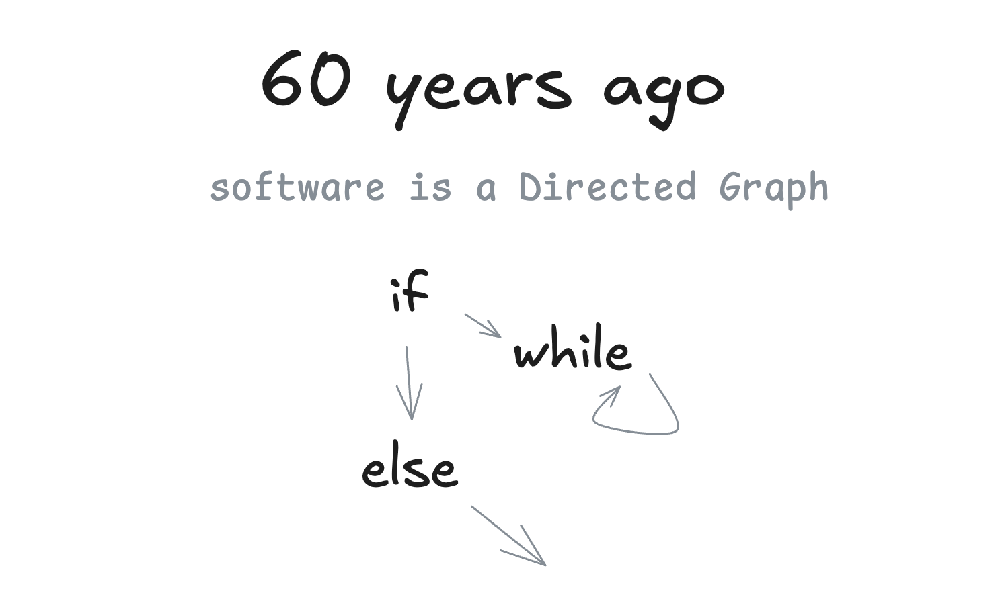

后来 DAG 编排器把这种结构显式化，并加入重试、可观测性、调度、管理和模块化能力。

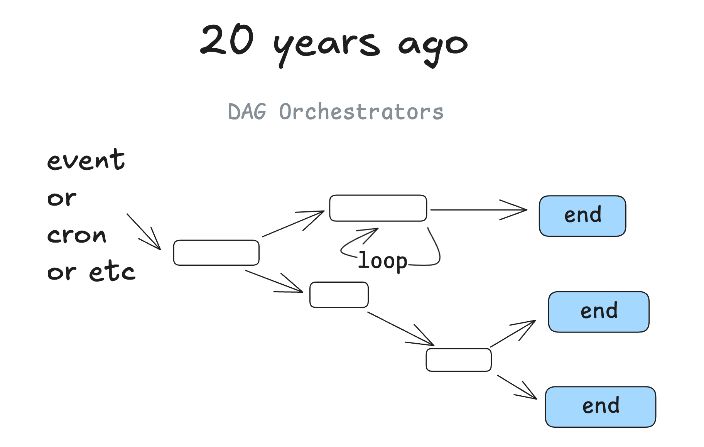

在机器学习进入软件系统后，模型通常只是 DAG 中的某个节点。例如分类、摘要、打标、抽取信息。这类系统本质上仍然由工程师定义流程。

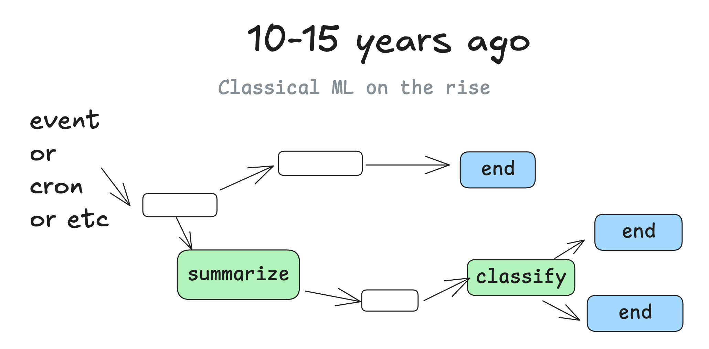

Agent 的吸引力在于：不再由工程师穷举所有路径，而是给模型目标、上下文和可用动作，让模型在运行时选择下一步。


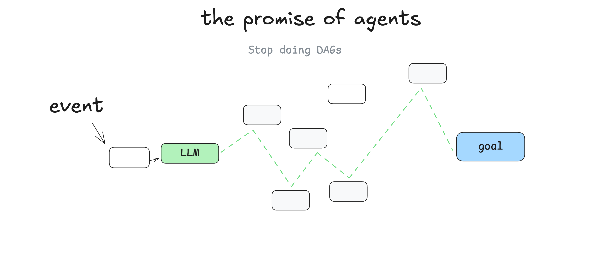

典型 agent 循环可以抽象为：

```python
context = [initial_event]

while True:
    next_step = await llm.determine_next_step(context)
    context.append(next_step)

    if next_step.intent == "done":
        return next_step.final_answer

    result = await execute_step(next_step)
    context.append(result)
```

该循环的关键是：LLM 负责决定下一步，确定性代码负责执行下一步，执行结果再回到上下文中。

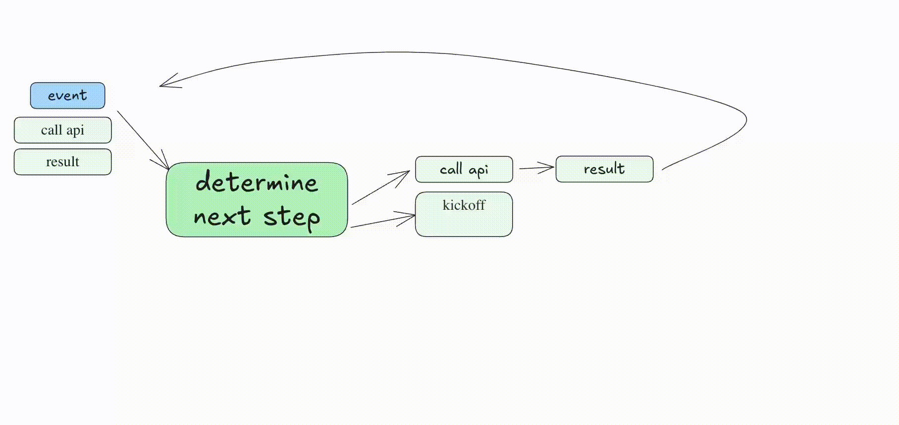

这个循环运行后，会生成一条实际发生过的路径，也可以被看作运行时 materialized 出来的 DAG。


## 2. 核心问题：长上下文和失控控制流

原文对常见 agent 方案的主要质疑集中在两点。

第一，长上下文会削弱模型表现。任务步骤越多，历史事件、工具结果、错误、用户反馈越多，模型越容易丢失重点，甚至反复尝试同一种失败路径。

第二，很多框架隐藏了 prompt、context、tool execution 和控制流。原型阶段这会提高速度，但生产阶段常常带来调试困难、审批困难、恢复困难和安全边界不清晰。

因此，原文推荐的基本形态是 micro agent：把 LLM 放入更大的确定性流程中，只负责一个小范围、高价值、适合自然语言理解和决策的局部任务。

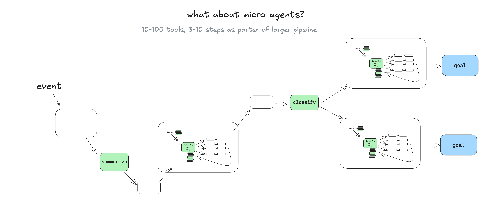

部署机器人示例体现了这种思路：确定性代码负责合并、部署 staging、运行测试、生产后验证；agent 只处理生产部署过程中的人类反馈、审批和下一步动作选择。

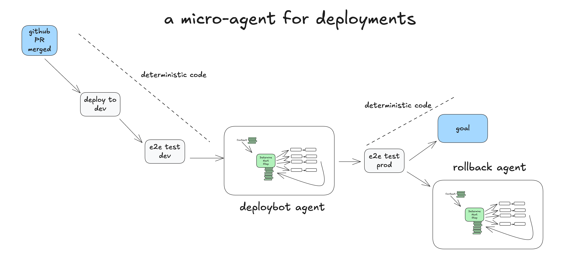


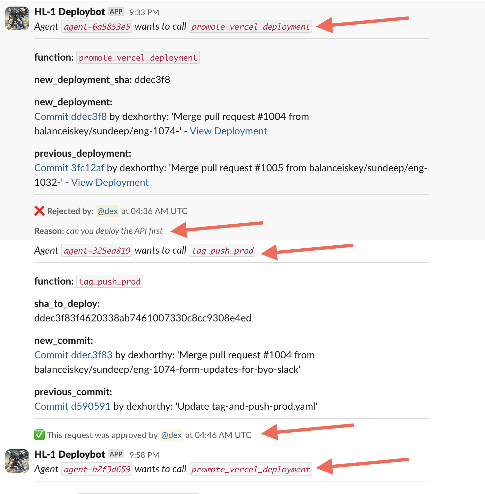

## 3. Agent 的四个基本组件

原文把 agent 拆成四个基本组件：

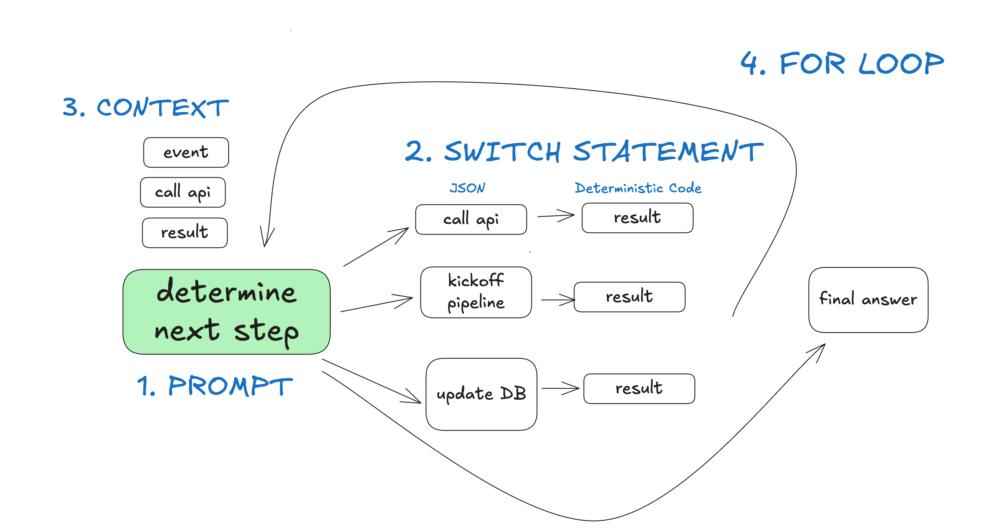

| 组件 | 作用 | 对应原则 |
|---|---|---|
| Prompt | 告诉模型角色、任务、约束、可选动作和输出格式。 | Factor 2 |
| Switch statement | 根据模型输出的结构化下一步，决定应用代码如何处理。 | Factor 1、4、8 |
| Accumulated context | 记录已经发生的事件、工具调用、结果、错误和人工反馈。 | Factor 3、5、9、12 |
| For loop | 控制是否继续、暂停、恢复、升级、结束。 | Factor 6、7、8、10、11 |

12 条原则不是彼此独立的清单，而是围绕这四个组件形成的工程约束。

## 4. 12 条原则概览

| 序号 | 原则 | 面向的问题 | 设计取向 |
|---:|---|---|---|
| 1 | Natural Language to Tool Calls | 自然语言不能直接驱动业务副作用。 | 先转换成结构化动作，再由代码执行。 |
| 2 | Own your prompts | 框架隐藏 prompt 后难以调优和评估。 | Prompt 作为一等工程资产管理。 |
| 3 | Own your context window | 标准 message 格式未必最适合任务。 | 应用主动构造高密度、低噪声上下文。 |
| 4 | Tools are just structured outputs | tool call 容易被误解为“立即执行函数”。 | tool call 是意图描述，执行由应用决定。 |
| 5 | Unify execution state and business state | 执行状态与业务状态分裂会制造复杂度。 | 用事件线程表达大部分状态。 |
| 6 | Launch/Pause/Resume with simple APIs | agent 需要可恢复生命周期。 | 提供简单启动、暂停、恢复接口。 |
| 7 | Contact humans with tool calls | 人工审批和反馈常被放在流程外。 | 把人类交互建模为结构化动作。 |
| 8 | Own your control flow | 框架内置循环无法覆盖生产控制需求。 | 应用掌握中断、审批、重试、升级。 |
| 9 | Compact Errors into Context Window | 工具失败后需要恢复，但不能无限自旋。 | 将错误摘要写回上下文，并设置边界。 |
| 10 | Small, Focused Agents | 大 agent 容易被长任务和长上下文拖垮。 | 每个 agent 只负责小范围任务。 |
| 11 | Trigger from anywhere | agent 不应绑定在单一聊天界面。 | 支持从工作流入口触发和响应。 |
| 12 | Stateless reducer | 运行状态不应隐含在进程内存里。 | 将 agent 视为事件线程上的无状态归约。 |

## Factor 1：Natural Language to Tool Calls

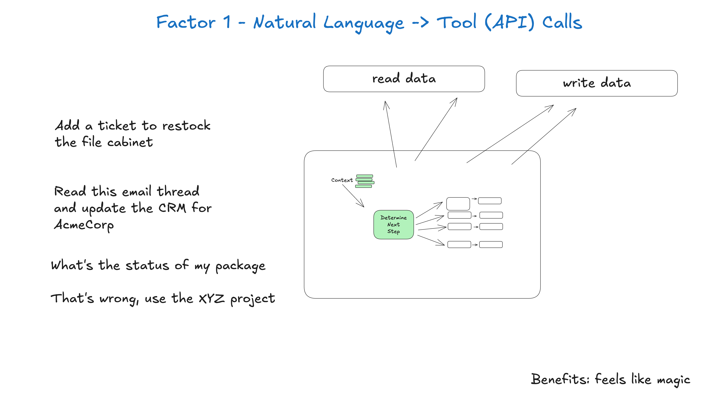

### 问题

用户输入通常是自然语言，但业务系统需要结构化、可校验、可审计的动作。自然语言不能直接等价于 API 调用。

### 原则

LLM 的职责是把自然语言转换成结构化 tool call。确定性代码再根据结构化结果决定是否执行，以及如何执行。

例如用户说“为某次活动创建 750 美元付款链接”，模型可以输出类似结构：

```json
{
  "function": {
    "name": "create_payment_link",
    "parameters": {
      "amount": 750,
      "customer": "cust_...",
      "product": "prod_...",
      "quantity": 1
    }
  }
}
```

### 工程含义

这条原则建立了 LLM 与业务系统之间的隔离层。模型给出结构化意图，应用代码负责：

- 校验参数完整性和类型。
- 补全或查询业务 ID。
- 执行权限检查。
- 决定是否需要人工审批。
- 调用真实 API。
- 记录执行结果。

### 常见误区

把 tool call 看成模型已经“完成了任务”。实际上模型只是提出下一步，真实副作用仍然必须由代码控制。

## Factor 2：Own your prompts

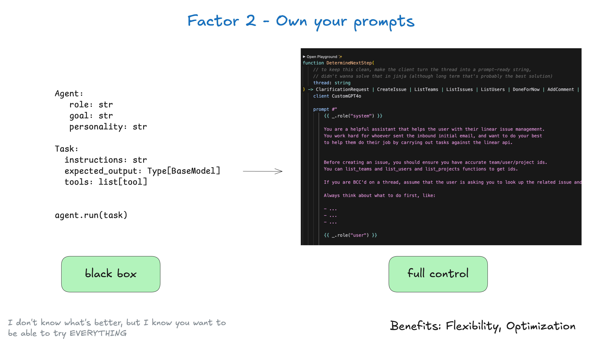

### 问题

很多 agent 框架提供 `role`、`goal`、`personality`、`task` 等高级抽象，原型阶段很方便，但生产阶段会遇到几个问题：

- 不清楚最终发给模型的完整 prompt 是什么。
- 难以解释某次失败由哪段指令引起。
- 难以做 prompt diff、review、回滚和实验。
- 难以针对业务场景精确调优。

### 原则

Prompt 是应用逻辑和 LLM 之间的主要接口，应像代码一样拥有、维护和测试。

### 工程含义

Prompt 至少应具备以下工程属性：

| 属性 | 说明 |
|---|---|
| 可见 | 能看到完整 prompt，包括系统指令、上下文、工具说明、输出格式。 |
| 可版本化 | prompt 改动进入代码 review，可以回滚。 |
| 可测试 | 对典型输入有 golden case、eval 或回归测试。 |
| 可实验 | 能快速替换格式、顺序、角色消息和示例。 |
| 可追踪 | 线上请求能关联 prompt 版本和模型输出。 |

### 判断标准

如果一次线上 agent 失败后，团队无法回答“模型当时看到了什么指令”，就说明 prompt 还没有被充分拥有。

## Factor 3：Own your context window

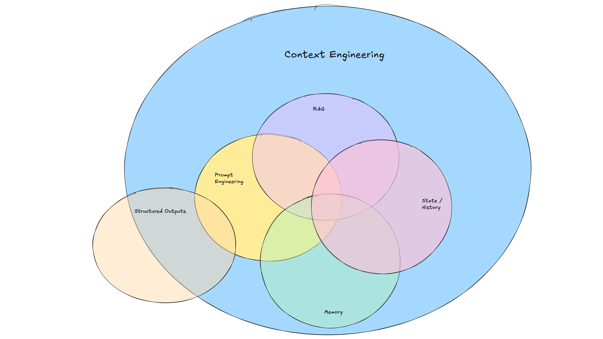

### 问题

LLM 是无状态函数。它不会天然知道业务历史，只能基于当前输入上下文生成输出。上下文组织不当，会直接造成错误决策。

### 原则

上下文窗口应由应用主动构造。标准 chat message 格式可以使用，但不应成为唯一选择。

### 上下文包含什么

| 类型 | 示例 |
|---|---|
| 指令 | 系统角色、任务目标、安全约束。 |
| 外部数据 | RAG 文档、Git tags、用户资料、订单信息。 |
| 事件历史 | 用户消息、tool call、tool result、审批记录。 |
| 错误信息 | 工具失败、API 错误、校验失败。 |
| 记忆 | 相关历史会话或长期偏好。 |
| 输出约束 | 可选 intent、JSON schema、字段说明。 |

### 为什么不总是使用标准 message 格式

标准格式通常是：

```json
[
  {"role": "system", "content": "..."},
  {"role": "user", "content": "..."},
  {"role": "assistant", "tool_calls": [...]},
  {"role": "tool", "content": "..."}
]
```

这种格式通用，但未必最节省 token，也未必最适合模型注意力。应用可以将事件线程转换为领域化格式，例如：

```xml
<slack_message>
  From: @alex
  Channel: #deployments
  Text: Can you deploy the latest backend to production?
</slack_message>

<list_git_tags_result>
  tags:
    - name: v1.2.3
      date: 2024-03-15
</list_git_tags_result>

<question>
  What should the next step be?
</question>
```

### 工程含义

上下文构造要同时处理五个目标：

| 目标 | 含义 |
|---|---|
| 信息密度 | 用更少 token 表达关键状态。 |
| 注意力管理 | 让模型更容易看到当前决策所需信息。 |
| 安全过滤 | 不把密钥、敏感字段、无关内部细节交给模型。 |
| 可恢复 | 保存足够历史，使线程可继续执行。 |
| 可实验 | 能替换上下文格式并比较效果。 |

### 与其他原则的关系

Factor 3 是 Factor 5、6、8、9、12 的基础。没有明确的上下文线程，就很难实现状态统一、暂停恢复、错误恢复和无状态 reducer。

## Factor 4：Tools are just structured outputs

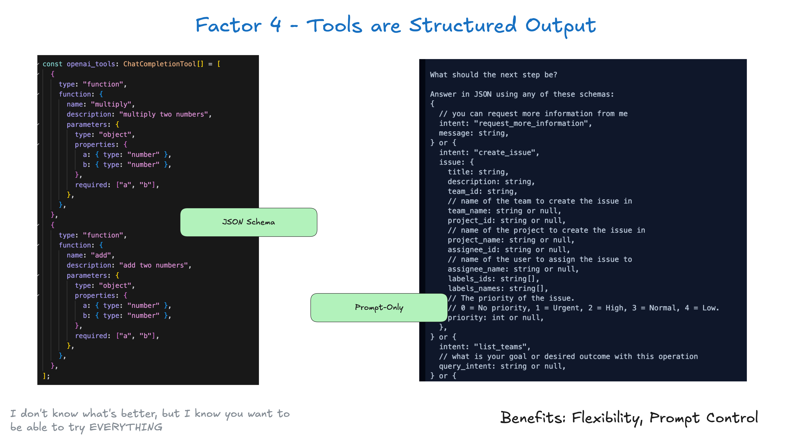

### 问题

很多人把 tool call 理解为“模型调用函数”。这种理解容易让执行路径过早绑定在框架内部。

### 原则

Tool call 本质上只是结构化输出。它描述模型认为下一步应该做什么，但不规定应用必须立刻、原样、同步执行。

### 示例

模型输出：

```json
{
  "intent": "create_issue",
  "issue": {
    "title": "Deployment failed",
    "team_id": "infra"
  }
}
```

应用可以选择：

- 立即创建 issue。
- 先查重，再决定是否创建。
- 请求人工确认。
- 放入队列异步执行。
- 拒绝执行并把原因写回上下文。
- 将其转换成另一个内部 workflow。

### 工程含义

这条原则把“模型决策”和“系统执行”拆开。LLM 输出结构化意图，switch statement 才是真正的执行入口。

```python
if next_step.intent == "create_issue":
    if is_high_risk(next_step):
        request_approval(next_step)
    else:
        create_issue(next_step.issue)
elif next_step.intent == "request_clarification":
    notify_human(next_step.question)
else:
    append_error("unknown intent")
```

### 判断标准

如果某个 tool call 无法在执行前插入权限、审批、排队、重试或审计逻辑，说明系统过度依赖框架默认 tool execution。

## Factor 5：Unify execution state and business state


### 问题

Agent 系统常把状态拆成两套：

| 状态类型 | 示例 |
|---|---|
| 执行状态 | 当前步骤、等待状态、重试次数、下一步、是否暂停。 |
| 业务状态 | 用户消息、工具调用、工具结果、审批记录、错误历史。 |

分裂后会出现同步问题：业务历史显示已经请求审批，但执行状态仍然显示 running；或者执行状态显示 waiting，但找不到等待什么。

### 原则

尽量用一条事件线程表达业务状态和执行状态。执行状态优先从事件历史推导，而不是维护一套平行状态机。

### 示例

```json
[
  {"type": "slack_message", "data": {"text": "deploy backend"}},
  {"type": "deploy_backend", "data": {"tag": "v1.2.3", "env": "prod"}},
  {"type": "approval_requested", "data": {"risk": "production deploy"}}
]
```

看到最后一个事件是 `approval_requested`，系统即可推导当前线程处于等待审批状态。

### 收益

| 收益 | 说明 |
|---|---|
| 简化 | 减少执行状态和业务状态双写。 |
| 序列化 | 线程可以直接保存到数据库。 |
| 调试 | 完整历史集中在一处。 |
| 恢复 | 加载线程即可恢复上下文。 |
| 分叉 | 可以从某个历史点派生新线程。 |
| 展示 | 同一线程可转成 Markdown、Web UI 或审计日志。 |

### 边界

不是所有状态都应进入上下文窗口。凭据、session、内部权限上下文等可以只保存引用或放在安全存储中。原则强调的是统一状态模型，而不是把所有信息都暴露给 LLM。

## Factor 6：Launch/Pause/Resume with simple APIs


### 问题

生产 agent 不能只在内存里跑一个循环。它需要被外部系统启动、查询、暂停和恢复。

### 原则

Agent 应提供简单生命周期 API：

| API | 作用 |
|---|---|
| `launch` | 创建线程，写入初始事件，开始执行。 |
| `pause` | 保存当前线程，停止继续推进。 |
| `resume` | 追加新事件，从保存状态继续执行。 |
| `get_status` | 查询线程当前状态和等待原因。 |
| `cancel` | 终止线程或标记为取消。 |

### 关键点

暂停恢复最有价值的位置，是模型选中工具之后、工具实际执行之前。

如果模型选择了 `deploy_backend_to_prod`，系统应能先暂停并请求审批，而不是立刻执行。审批通过后，再带着同一个 thread id 恢复。

### 工程含义

一个可恢复 agent 至少需要：

- 事件线程持久化。
- 每次工具执行前后都有明确事件。
- 外部回调能定位 thread id。
- 恢复时能重新构造 context window。
- 长任务不依赖进程内 `while sleep`。

## Factor 7：Contact humans with tool calls

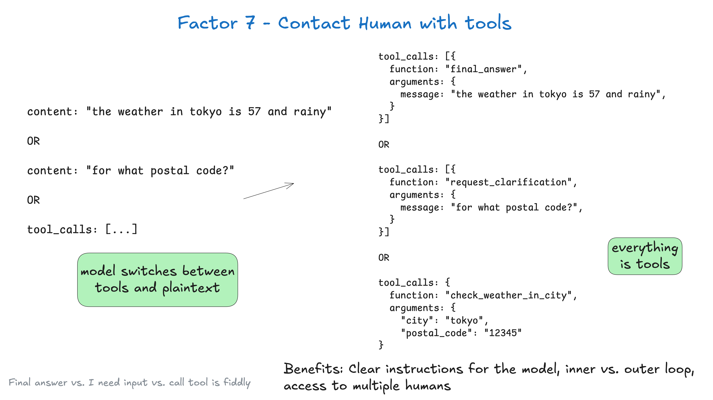

### 问题

很多 agent 设计默认“人类先发消息，agent 回答”。但生产工作流中，人类也可能只在关键节点出现，例如审批、补充信息、纠正路线。

### 原则

联系人类也应被建模为 tool call。模型可以输出 `request_human_input`、`request_approval`、`ask_for_choice` 等结构化意图。

### 事件模式

```json
{
  "intent": "request_human_input",
  "question": "是否允许部署 v1.2.3 到 production？",
  "context": "这是一次生产发布，会影响线上用户。",
  "options": {
    "urgency": "high",
    "format": "yes_no"
  }
}
```

系统处理后写入事件线程：

```json
[
  {"type": "request_human_input", "data": {...}},
  {"type": "human_response", "data": {"approved": true, "user": "alex"}}
]
```

### Outer-loop agents

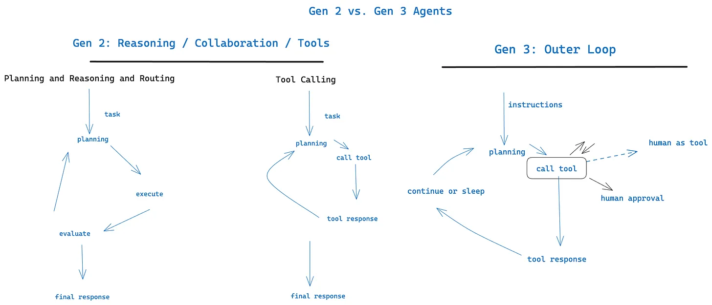

Outer-loop agent 指流程不一定从聊天窗口开始。它可以由告警、Webhook、cron、CI/CD 事件触发；运行到某个关键节点时，再联系人类。

这种模式适合：

- 生产部署审批。
- 外部邮件发送前确认。
- 数据修复前确认。
- 事故处理中请求上下文。
- 多人协作流程。

## Factor 8：Own your control flow

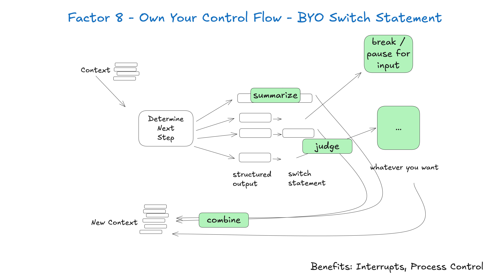

### 问题

框架默认 agent loop 通常适合演示，但生产系统需要更细粒度的控制：

- 哪些动作可以同步执行。
- 哪些动作需要人工审批。
- 哪些动作应进入异步队列。
- 哪些错误可以重试。
- 何时压缩上下文。
- 何时升级给人类。
- 何时终止线程。

### 原则

控制流应由应用拥有，而不是完全委托给 agent 框架。

### 三类典型动作

| 动作类型 | 处理方式 |
|---|---|
| 请求澄清 | 保存线程，通知人类，等待回调恢复。 |
| 低风险读操作 | 执行工具，追加结果，继续让模型判断下一步。 |
| 高风险写操作 | 暂停流程，请求审批，审批通过后再执行。 |

### 伪代码

```python
while True:
    next_step = determine_next_step(thread_to_prompt(thread))
    thread.append(next_step)

    if next_step.intent == "request_clarification":
        save(thread)
        notify_human(next_step)
        break

    if next_step.intent == "fetch_open_issues":
        result = fetch_open_issues()
        thread.append({"type": "fetch_open_issues_result", "data": result})
        continue

    if next_step.intent == "create_issue":
        save(thread)
        request_approval(next_step)
        break
```

### 工程含义

拥有控制流后，系统可以插入：

- 日志、追踪和指标。
- 客户端限流。
- tool result 缓存。
- LLM-as-judge 校验。
- 上下文压缩。
- 持久 sleep。
- 审批和权限。

## Factor 9：Compact Errors into Context Window


### 问题

工具调用失败是常态。LLM 有机会基于错误信息修正下一步，但如果直接塞入大量原始堆栈，也可能造成噪声、泄露或重复失败。

### 原则

把错误整理成可行动的上下文事件，让模型有恢复机会，同时设置重试边界。

### 示例

```json
{
  "type": "error",
  "data": {
    "tool": "deploy_backend",
    "summary": "Deployment service timeout",
    "retryable": true,
    "attempt": 1
  }
}
```

### 控制边界

| 机制 | 目的 |
|---|---|
| 错误摘要 | 降低 token 噪声，避免泄露敏感信息。 |
| 连续错误计数 | 防止模型无限重复同一失败动作。 |
| 按工具限流 | 避免某个外部系统被反复调用。 |
| 超阈值升级 | 三次失败后转人工或确定性接管。 |
| 上下文清理 | 已解决错误可摘要化或移出主上下文。 |

### 与 Factor 10 的关系

错误自恢复不能替代任务拆分。防止 agent 进入错误循环的最有效方式，仍然是保持 agent 小而聚焦。

## Factor 10：Small, Focused Agents

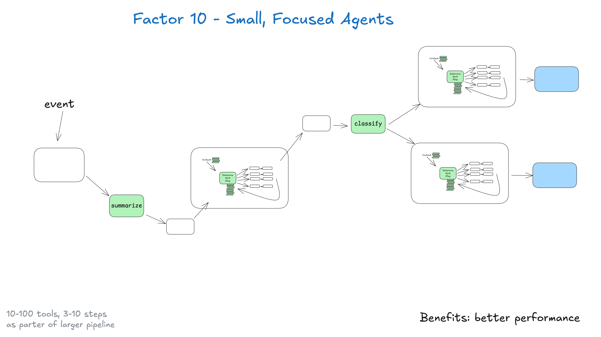

### 问题

大而全的 agent 会同时面临长上下文、长执行链、工具范围过大、测试困难和调试困难。即使每一步成功率很高，长链路的总体成功率也会下降。

### 原则

构建小型、聚焦的 agent。原文给出的经验范围是 3 到 10 步，最多大约 20 步。

### 设计判断

一个 agent 的范围应由以下问题约束：

| 问题 | 判断方向 |
|---|---|
| 是否有明确终止条件 | 没有终止条件时容易无限循环。 |
| 是否只服务一个业务目标 | 多目标会让 prompt 和工具膨胀。 |
| 是否能在少量步骤内完成 | 超过 20 步应考虑拆分。 |
| 是否能独立测试 | 不能测试说明边界不清。 |
| 是否需要大量长期记忆 | 需要时应由外部系统管理记忆。 |

### 模型能力提升后的影响

即使模型未来能处理更长上下文，小型 agent 仍然有价值。更好的模型可以让边界逐步扩大，但不改变工程原则：先在可验证的小范围内稳定，再扩大职责。


## Factor 11：Trigger from anywhere, meet users where they are

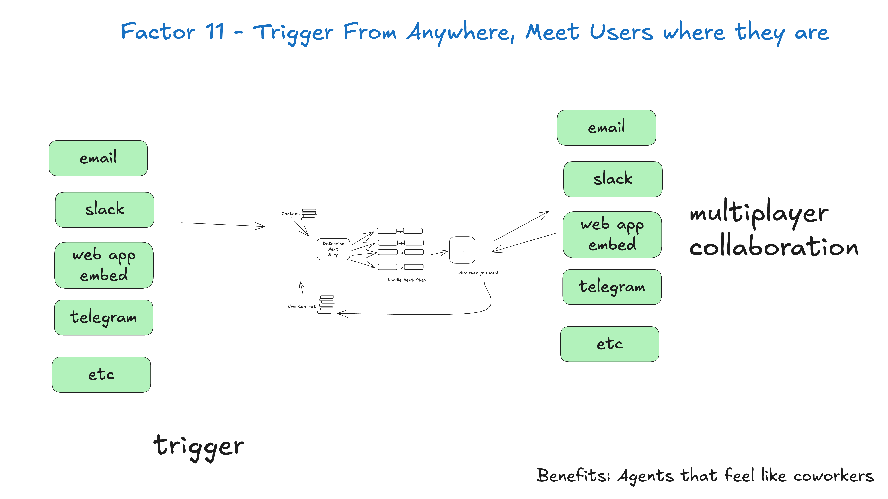

### 问题

如果 agent 只能在专用聊天界面中使用，就难以嵌入真实工作流。用户审批、反馈和触发任务的位置通常已经存在于 Slack、邮件、短信、Webhook、CI/CD、监控系统等渠道中。

### 原则

Agent 应支持从任意入口触发，并在用户所在渠道响应。

### 常见触发源

| 触发源 | 场景 |
|---|---|
| Slack | 部署审批、事故协作、内部运营。 |
| Email | 客户沟通、外部审批、异步反馈。 |
| SMS | 高优先级告警、紧急确认。 |
| Webhook | GitHub、支付系统、监控系统事件。 |
| Cron | 定时检查、定期汇总、巡检任务。 |
| CI/CD | 发布、回滚、测试结果处理。 |

### 工程含义

多入口触发要求系统具备统一 thread id、统一事件模型和统一恢复接口。不同渠道只是事件来源和通知出口不同，不应导致 agent 逻辑分裂。

## Factor 12：Make your agent a stateless reducer

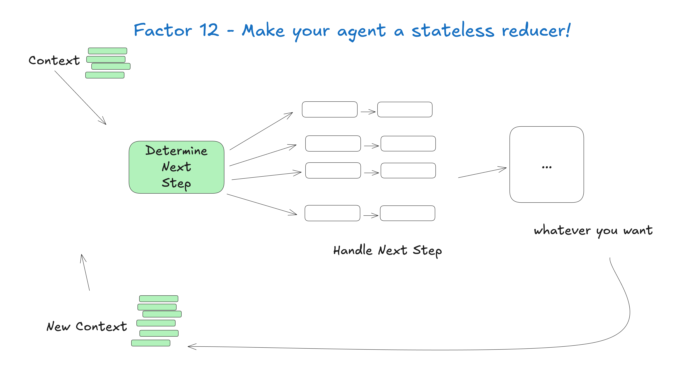

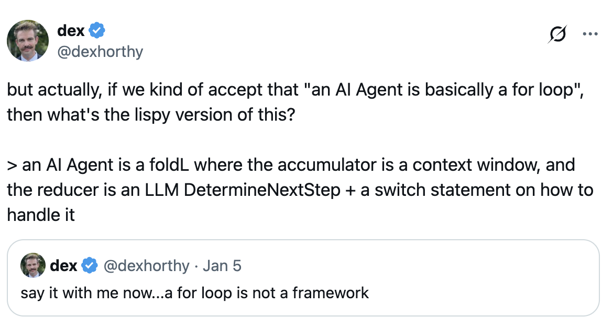

### 问题

如果 agent 的真实状态藏在进程内存、框架 runtime 或临时对象里，系统就难以恢复、重放、审计和测试。

### 原则

Agent 可以被理解为事件线程上的无状态 reducer：

```text
(thread, external_context) -> next_event
```

每次模型调用只根据当前线程和外部上下文生成下一步事件。系统将事件追加到线程后，由确定性代码处理。

### 工程含义

这种视角带来几个要求：

- 线程是状态源。
- 模型调用本身不保存隐式业务状态。
- 恢复执行依赖加载线程，而不是恢复进程内对象。
- 测试可以固定输入线程，检查输出事件。
- 审计可以回放事件序列。

## 补充：预取高概率上下文

`appendix-13-pre-fetch.md` 提供了一个实用建议：如果某些上下文很可能马上被模型请求，就不必让模型先发起一次工具调用再等待下一轮。

例如部署场景中，模型通常会需要 Git tags。与其让模型先输出 `list_git_tags`，系统可以在进入 agent 前直接获取 tags，并把结果放入上下文。

### 适用条件

| 条件 | 说明 |
|---|---|
| 高概率需要 | 大多数请求都会用到该上下文。 |
| 成本可控 | 拉取数据不会显著增加延迟或费用。 |
| 结果较小 | 不会挤占大量上下文窗口。 |
| 时效明确 | 数据不会在短时间内频繁失效。 |

### 风险

预取不是越多越好。过度预取会增加 token、引入噪声，并可能让模型关注不相关信息。

## 5. 原则之间的组合关系

12 条原则可以按工程层次重新分组。

| 层次 | 相关原则 | 作用 |
|---|---|---|
| 输入与决策 | 1、2、3、4 | 控制模型看到什么、输出什么。 |
| 状态与恢复 | 5、6、9、12 | 让线程可保存、可恢复、可重放。 |
| 控制与安全 | 7、8 | 在工具执行、人类审批、长任务之间插入确定性控制。 |
| 产品形态 | 10、11 | 限制 agent 范围，并嵌入真实工作流入口。 |

一个较完整的 agent 系统通常会形成如下流程：

```text
外部事件
  -> 创建/加载 thread
  -> 构造 context window
  -> LLM 输出 structured next_event
  -> switch statement 判断处理方式
      -> 同步执行低风险工具
      -> 暂停等待人类/长任务
      -> 拒绝或升级高风险动作
      -> 将错误摘要写回上下文
  -> 保存 thread
  -> 继续 / 暂停 / 完成
```

## 6. 生产落地检查表

| 维度 | 检查项 | 期望状态 |
|---|---|---|
| Prompt | 是否能看到线上完整 prompt。 | 可追踪、可 review、可回滚。 |
| Prompt | 是否有典型输入输出测试。 | 至少覆盖主路径和高风险路径。 |
| Context | 是否有明确上下文构造函数。 | 不散落在业务代码各处。 |
| Context | 是否过滤敏感信息。 | 密钥和内部敏感字段不进模型。 |
| Tool schema | intent 和字段是否可枚举。 | 未知 intent 有明确处理。 |
| Tool execution | 执行前是否可插入校验和审批。 | 高风险动作不会被模型直接触发。 |
| State | thread 是否是主要状态源。 | 可序列化、可恢复、可审计。 |
| Resume | 外部回调是否能恢复线程。 | Webhook/人工回复带 thread id。 |
| Error | 错误是否被摘要化。 | 可行动、低噪声、不泄露。 |
| Retry | 是否有限制连续错误。 | 超阈值升级或终止。 |
| Scope | 单个 agent 是否足够小。 | 优先 3 到 10 步内完成。 |
| Trigger | 是否支持真实工作流入口。 | 不强迫用户切换到专用界面。 |
| Observability | 是否记录每次模型输入输出。 | 可复盘失败原因。 |

## 7. 可参考的实现骨架

以下骨架用于说明原则之间的衔接，不限定具体语言或框架。

```python
class Thread:
    id: str
    events: list[Event]

class Event:
    type: str
    data: dict

async def run_agent(thread_id: str):
    thread = await load_thread(thread_id)

    while True:
        prompt = build_prompt(thread)
        next_event = await determine_next_step(prompt)
        thread.events.append(next_event)

        decision = classify_control_flow(next_event)

        if decision == "sync_tool":
            try:
                result = await execute_tool(next_event)
                thread.events.append(tool_result_event(next_event, result))
                await save_thread(thread)
                continue
            except Exception as error:
                thread.events.append(compact_error_event(error))
                if too_many_errors(thread):
                    await escalate_to_human(thread)
                    await save_thread(thread)
                    return
                await save_thread(thread)
                continue

        if decision == "needs_human":
            await save_thread(thread)
            await notify_human(thread.id, next_event)
            return

        if decision == "done":
            thread.events.append(done_event(next_event))
            await save_thread(thread)
            return

        thread.events.append(unknown_intent_error(next_event))
        await save_thread(thread)
```

这个骨架体现了几个关键点：

- `build_prompt` 对应 Factor 2 和 Factor 3。
- `determine_next_step` 对应 Factor 1 和 Factor 4。
- `thread.events` 对应 Factor 5 和 Factor 12。
- `classify_control_flow` 对应 Factor 8。
- `needs_human` 对应 Factor 7。
- `save_thread` 和外部恢复对应 Factor 6。
- `compact_error_event` 对应 Factor 9。

## 8. 与常规 agent 框架的取舍

12-Factor Agents 并不是反对框架，而是提醒生产系统不要把关键工程控制权无意识交出去。

| 方面 | 框架优先 | 12-Factor 取向 |
|---|---|---|
| 启动速度 | 快，抽象多。 | 慢一些，但边界清楚。 |
| Prompt 控制 | 可能隐藏。 | 应用显式拥有。 |
| Tool 执行 | 往往自动调用。 | 应用决定执行方式。 |
| 状态 | 可能在 runtime 内部。 | 事件线程外化保存。 |
| 恢复 | 依赖框架能力。 | 简单 API 和 thread id。 |
| 审批 | 可能难插入。 | 控制流中原生支持。 |
| 调试 | 需要理解框架内部。 | 复盘事件和 prompt 即可定位大部分问题。 |

适合使用框架的场景包括原型验证、内部工具、低风险自动化、短链路任务。面向客户、生产数据、外部副作用和高风险操作时，应优先保留 prompt、context、control flow 和 state 的所有权。

## 9. 关键结论

12-Factor Agents 的主线可以概括为：

1. LLM 不直接拥有业务副作用，只输出结构化下一步。
2. Prompt、context、tool schema 和控制流应由应用显式管理。
3. Agent 的运行历史应外化为事件线程，便于恢复、审计和重放。
4. 人类反馈和审批是流程中的一等事件，而不是流程外补丁。
5. 小而聚焦的 agent 比大而全的 agent 更适合进入生产系统。
6. 多入口触发和暂停恢复能力，决定 agent 能否嵌入真实工作流。

这些原则最终服务于同一个目标：在利用 LLM 自然语言理解和动态决策能力的同时，保留传统软件工程中的确定性、可测试性、可观测性和安全边界。
