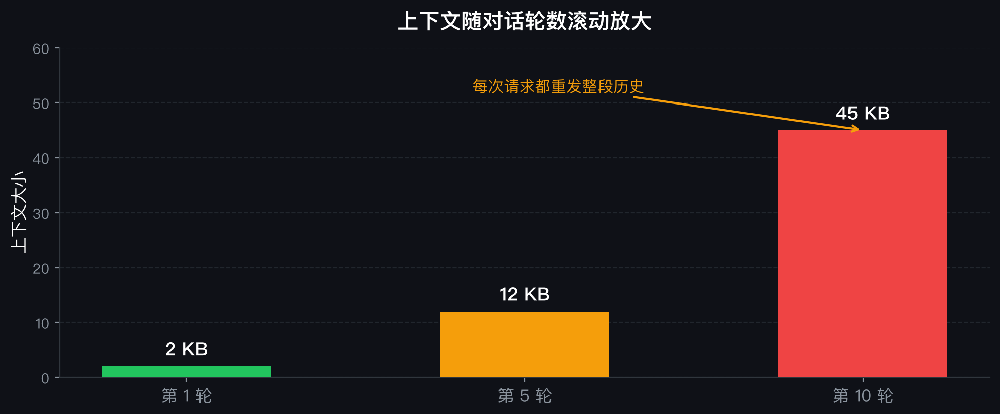
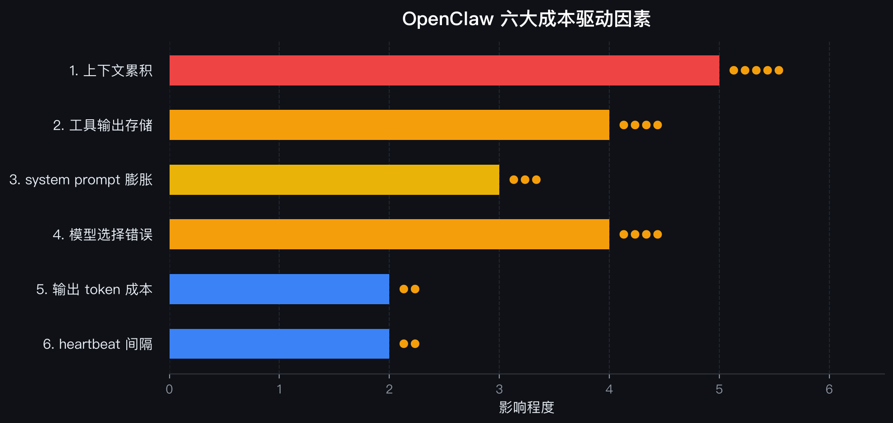
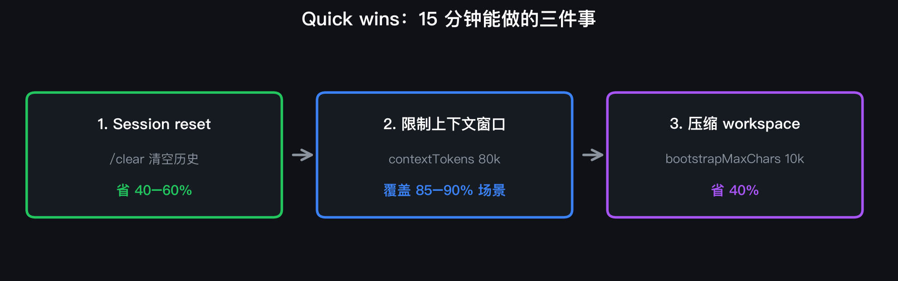
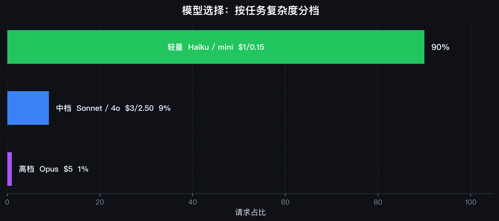
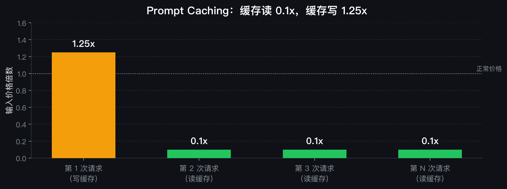
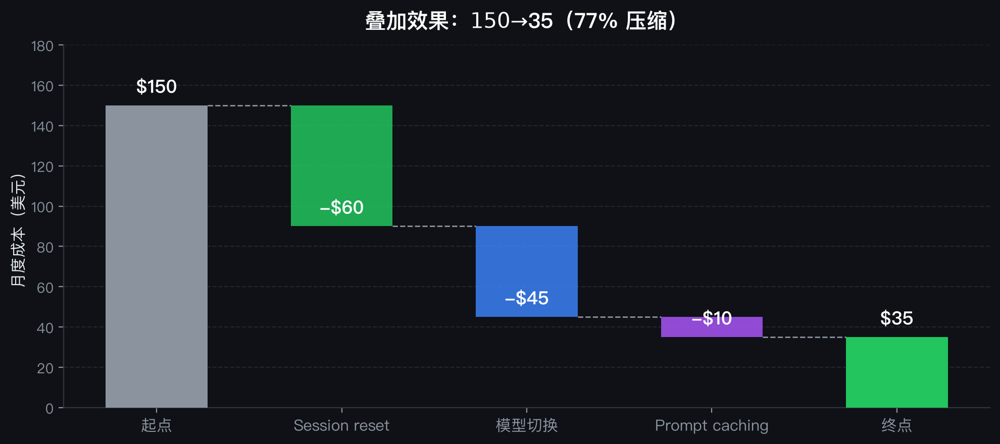

# OpenClaw Token 成本优化：从 $187/月 压到 $35/月 的六步

> 资料来源：[《How to Cut OpenClaw Token Costs by 77%: A Practical Optimization Guide》](https://clawhosters.com/blog/posts/openclaw-token-costs-optimization)，作者 ClawHosters / Daniel Samer,2026-02-18。

## 阅读目标

- 理解 OpenClaw / Claude Code 类 agent 的 token 成本为什么容易失控。
- 掌握从「会话管理、上下文窗口、workspace 注入、模型选择、prompt caching、输出控制、skill 管理、compaction、监控」九个维度压缩成本的具体做法。
- 把每个优化步骤和对应的数字效果对应起来，形成可复用的降本路径。

## 核心结论

- Agent 的 token 成本失控，大多不是因为「模型贵」，而是因为「上下文在每一次请求里被反复发送」。
- 作者把个人 OpenClaw 成本从 $187/月 压到 $35/月，核心是 session reset、模型选择、prompt caching 三件事叠加；加上输出控制、skill 管理、compaction，整体可达 77% 压缩。
- 优化的顺序有讲究：先做不碰配置的 quick win(session reset、上下文窗口、workspace 注入），再做模型选择和 prompt caching，监控从一开始就开着。

## 名词解释

| 名词 | 解释 | 简单例子 |
|---|---|---|
| Token | LLM 的计费单位，输入与输出分开计费，输出通常比输入贵 3–8 倍。 | 一次 1000 输入 + 500 输出的请求，按两种价格分别计。 |
| Context accumulation | 会话历史随每轮对话增长，每轮都把整段历史重新发给模型。 | 一个 debug session 留下 40,000 token 的历史。 |
| Tool output storage | 工具返回结果（文件内容、web scrape、代码执行）被写进历史，后续每轮都重发。 | 一次 web scraping 把 180,000 字符的 JSON 留在历史里。 |
| System prompt bloat | skills、workspace 文件、tool 定义随每轮请求一起发。 | 忘了清理的 workspace 文件带了 15,000 token。 |
| Prompt caching | 把稳定不变的前缀（如 system prompt）缓存起来，后续请求按 0.1x 价格读取。 | 第一次写缓存按 1.25x 计费，后续读按 0.1x。 |
| Compaction | 对历史对话做结构化摘要，保留关键信息、丢弃冗余。 | 用 `compactionStrategy: "structured"` 让框架自动压缩。 |
| Heartbeat | 周期性后台请求，保持上下文「热」，但即使空闲也烧钱。 | 把 heartbeat 间隔设成 55 分钟、cache TTL 设 60 分钟。 |

## 1. 背景：OpenClaw 为什么烧钱

作者先给了一个直观结论：agent 的 token 消耗不是线性增长，而是随会话长度呈「滚动放大」。原因在于每一次请求都要把整段上下文重新发给模型，历史越长，每轮越贵。

下面这张图把「滚动放大」画了出来：第 1 轮只有 system prompt 和 user message，到第 10 轮，历史已经膨胀到几十 KB，每次请求都要把整段历史重新发给模型。



这张图里，每一轮的请求都会把整段历史重新发给模型，Round 10 的上下文是 Round 1 的 22 倍。

作者列出了六个主要的成本驱动因素，按影响排序：



这张图里，上下文累积和工具输出存储是影响最大的两个因素，模型选择错误排第四。

作者的真实案例：

- 曾发现自己带着 52,000 token 的历史（其中 40,000 来自一个旧 debug session)，几小时后每次请求都重发 50,000+ token;
- 一个 web scraping job 曾把 180,000 字符的 JSON 留在历史里；
- 默认配置允许 workspace 文件最多 150,000 字符；作者曾连续几周带着 15,000 token 的 workspace 文件。

## 2. Quick wins:15 分钟能做的三件事

先做三件不碰配置、立刻见效的事。这三件事的共同点是不改模型、不改架构，只改使用习惯。



这张图里，从左到右是三个按顺序执行的 quick win：先清空 session，再限制上下文窗口，最后压缩 workspace 文件。

### 2.1 Session reset

每完成一个任务就 `/clear` 清空历史。

```bash
# 完成任务后立刻清空
/clear

# 开始新任务前确认历史已清空
/context detail
```

作者测得平均每次请求成本下降 47%;APIYI 社区案例显示这一步能省 40–60% 的 token 成本。

### 2.2 限制上下文窗口

把 `contextTokens` 从 400,000 降到 50,000–100,000。

```json
{
  "contextTokens": 80000
}
```

作者建议 80,000，能覆盖 85–90% 的使用场景；框架在触顶时自动压缩旧消息。

### 2.3 压缩 workspace 文件注入

把 `bootstrapMaxChars` 从 20,000 降到 10,000,`bootstrapTotalMaxChars` 从 150,000 降到 75,000。

```json
{
  "bootstrapMaxChars": 10000,
  "bootstrapTotalMaxChars": 75000
}
```

作者在三个生产实例上测试，两个没差别，第三个需要调到 12,000 / 90,000，仍比默认省 40%。

## 3. 模型选择：别把旗舰模型当瑞士军刀

作者按任务复杂度分配模型（每百万输入 token 的价格）:

| 档位 | 模型 | 单价 | 适用任务 | 占比 |
|---|---|---|---|---|
| 轻量 | Haiku / GPT-4o-mini | $1 / $0.15 | 文件搜索、格式化、简单问答、摘要、翻译 | 90% |
| 中档 | Sonnet / GPT-4o | $3 / $2.50 | 代码生成、技术分析、复杂推理 | 9% |
| 高档 | Opus | $5 | 架构决策、多步问题求解 | 1% |

下面这张图把「任务复杂度」和「模型档位」的对应关系画了出来：



作者的结论是：50–80% 的节省来自「别用最贵的模型做简单事」。

## 4. Prompt caching：缓存读 0.1x，缓存写 1.25x

Prompt caching 是把稳定前缀（如 system prompt）缓存起来，后续请求按 0.1x 价格读取。

下面这张图把 prompt caching 的计费逻辑画了出来：



这张图里，第一次请求把 system prompt 写进缓存（按 1.25x 计费），后续请求直接从缓存读（按 0.1x 计费）。

关键数字：

| 操作 | 计费倍数 | 说明 |
|---|---|---|
| 缓存写 | 1.25x | 第一次请求，把 system prompt 写进缓存 |
| 缓存读 | 0.1x | 后续请求，直接从缓存读，90% 节省 |

一位 Medium 开发者主要靠 prompt caching 把成本从 $720/月 降到 $72/月。

作者的关键经验：把 heartbeat 间隔设成 **55 分钟**、cache TTL 设成 **60 分钟**，既能保持缓存热，又最小化昂贵的缓存写。

```json
{
  "heartbeatInterval": 3300,
  "cacheTTL": 3600
}
```

他自己曾把 heartbeat 设成 5 分钟，缓存写成本直接翻了四倍。

其他细节：

- 对大且稳定的 system prompt(15,000–20,000 token）最有效，作者在 prompt 成本上看到 60–70% 的压缩；
- 低温（0.2–0.4）能提高缓存命中率。

## 5. 输出 token 控制：别让模型啰嗦

输出 token 通常比输入贵 3–8 倍，所以「让模型少说话」比「让模型少读」更省钱。

### 5.1 显式设 `max_tokens`

作者记录了一周响应，中位数 850 token，最大 2,400（代码生成除外），默认上限是 4,096。

```json
{
  "max_tokens": 2000
}
```

改成 `max_tokens: 2000` 后输出成本降了 20%，功能无损。

### 5.2 在 system prompt 里要求简洁

加一句「Respond precisely and concisely. Avoid repetition and unnecessary explanation」。

```text
You are a helpful assistant. Respond precisely and concisely.
Avoid repetition and unnecessary explanation.
```

平均响应长度从 920 降到 680 token(26% 更少）。

### 5.3 结构化输出

要求 JSON 格式的响应比自由文本短 40%。

```json
{
  "type": "json_object"
}
```

## 6. Skill 管理：每个活跃 skill 都在烧钱

每个活跃的 skill 都会撑大 system prompt，每次请求都要付钱。

作者审计了自己 18 个活跃 skill，发现 30 天内只用了 5 个，关掉 13 个后每次请求省 3,200 token。

## 7. Compaction：让框架自动压缩历史

启用对旧对话的结构化摘要：

```json
{
  "compactionStrategy": "structured"
}
```

Factory.ai 的研究显示，结构化摘要比简单截断保留更多有用信息。

作者测得每次请求 token 降 20–30%，质量无损。

复杂任务前可手动 `/compact`。

## 8. Token 监控：先量再省

作者强调「先量再省」，用三个内置命令：

```bash
# 当前 session token 使用
/status

# 估计成本
/usage

# 精确 token 分解（最重要）
/context detail
```

作者每周监控一次，曾发现：

- 15,000 token 的过期 workspace 文件；
- 180,000 字符的 JSON 工具输出；
- 一个忘了关的 debug session 留下 90,000 token 的日志。

## 9. 叠加效果：77% 是怎么来的

作者给了一个从 $150/月 开始的叠加计算：

| 步骤 | 技术 | 压缩 | 剩余 |
|---|---|---|---|
| 1 | Session reset | 40% | $90 |
| 2 | 模型切换（90% 到 Haiku) | 剩余的 50% | $45 |
| 3 | Prompt caching | system prompt 成本的 50% | $30–35 |

下面这张图把叠加效果画了出来：



这张图里，从 $150 开始，经过 session reset、模型切换、prompt caching 三步，最终压到 $35，整体 77% 压缩。

这与文档化的 77% 压缩一致。作者的推荐顺序：先做 session reset（影响最大、零配置），再做模型选择，最后做 prompt caching，监控从一开始就开着。

## 10. 落地检查表

| 维度 | 检查项 | 期望状态 |
|---|---|---|
| 会话管理 | 是否每个任务完成后 reset session | `/clear` 后成本立刻下降 |
| 上下文窗口 | `contextTokens` 是否限制在 50k–100k | 不再带 50k+ 的历史 |
| Workspace 注入 | `bootstrapMaxChars` / `bootstrapTotalMaxChars` 是否压缩 | 无过期 workspace 文件残留 |
| 模型选择 | 是否按任务复杂度分档 | 90% 请求走轻量模型 |
| Prompt caching | 是否启用并调优 heartbeat / TTL | 缓存读按 0.1x 计费 |
| 输出控制 | 是否显式设 `max_tokens` 并要求简洁 | 输出成本降 20–26% |
| Skill 管理 | 是否定期审计活跃 skill | 无长期未用 skill 占位 |
| Compaction | 是否启用结构化摘要 | 每次请求 token 降 20–30% |
| 监控 | 是否每周跑 `/context detail` | 能定位到具体膨胀来源 |

## 11. 关键结论

- OpenClaw / Claude Code 类 agent 的成本失控，主因是上下文在每次请求里被反复发送，而不是模型本身贵。
- 77% 的压缩是可复制的：session reset、模型分档、prompt caching 三件事叠加，加上输出控制、skill 管理、compaction，不需要换平台。
- 优化的顺序有讲究：先做不碰配置的 quick win，再做模型选择和 caching，监控从一开始就开着。
- 边界也清楚：这些数字来自 OpenClaw 生态，其他平台（如 Claude Code、Codex）需要重新验证参数。

---

> 原文链接：[How to Cut OpenClaw Token Costs by 77%](https://clawhosters.com/blog/posts/openclaw-token-costs-optimization)
