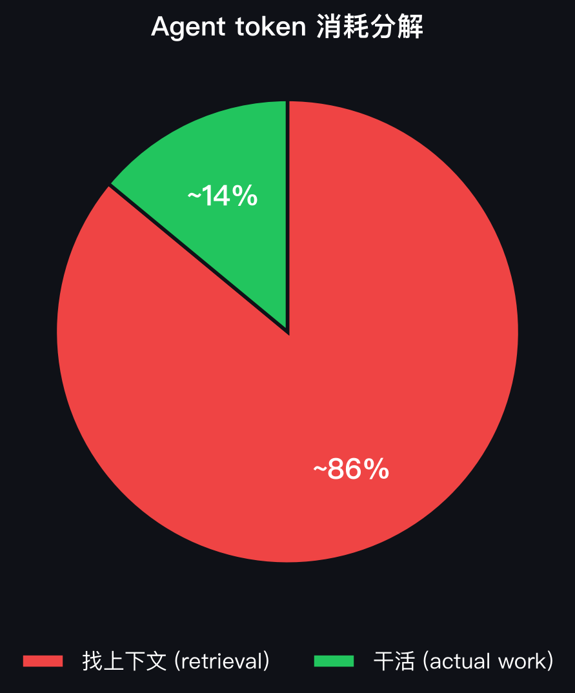
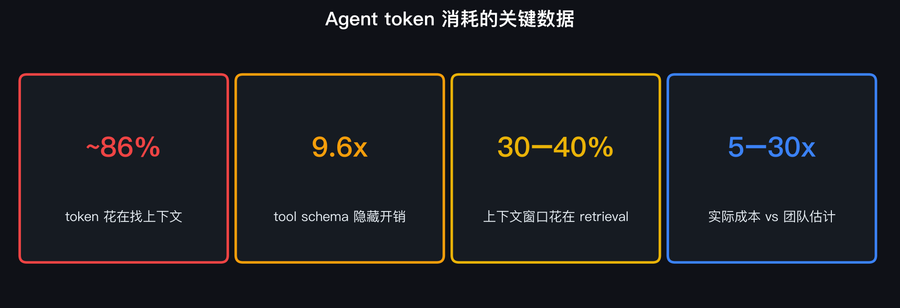
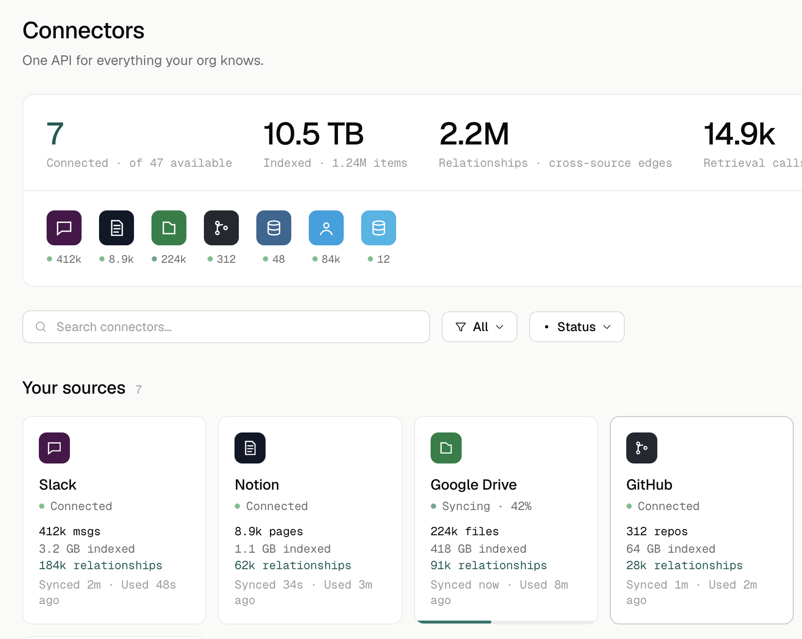
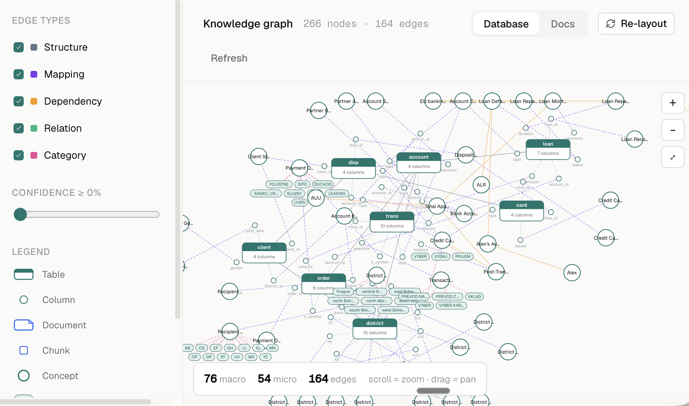
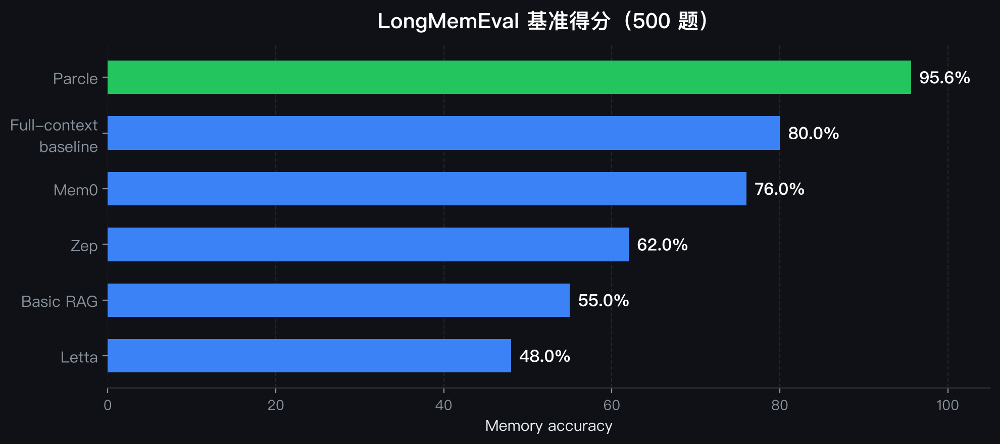
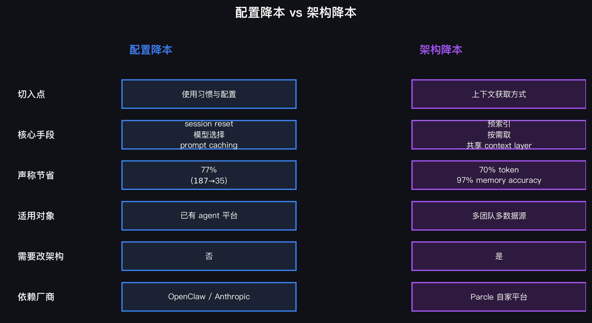

# Parcle：把「找上下文」的成本从 agent 循环里拿掉

> 资料来源：[Parcle: Context Layer for AI Agents](https://parcle.ai/),2026 年产品页与技术主张。

## 阅读目标

- 理解为什么 agent 的 token 大头花在「找上下文」而不是「干活」。
- 理解 Parcle 这类「预索引 context layer」方案的核心思路和工程含义。
- 掌握评估这类方案的关键指标（token 节省、memory accuracy、基准表现）。

## 核心结论

- Agent 烧 token 的大头不是「干活」，而是「找上下文」。Parcle 引用 Anthropic Claude Code session 的研究数据：~86% 的 agent token 花在找上下文，9.6x 的隐藏开销来自 tool schema 和 boilerplate,30–40% 的上下文窗口花在 retrieval。
- Parcle 的思路是把企业数据预索引成统一 context layer,agent 按需取相关片段，不再每轮重新检索。它声称 70% token 节省、97% memory accuracy、2x 更快的 agent。
- 在 LongMemEval（多 session memory 基准，500 题）上，Parcle 报出 95.6%，显著高于 full-context baseline(80.0%)、Mem0(76.0%)、Zep(62.0%)、Basic RAG(55.0%)、Letta(48.0%)。

## 名词解释

| 名词 | 解释 | 简单例子 |
|---|---|---|
| Context layer | 组织数据和 AI agent 之间的中间层，负责预索引和按需供给。 | Parcle 把 Slack / Notion / DB 预索引，agent 直接取相关片段。 |
| Context pre-indexing | 把企业数据预先索引进统一 context layer,agent 不再每次重新检索。 | 70+ 连接器把数据预先灌进 Parcle。 |
| Tool schema overhead | 工具定义和 boilerplate 在每轮请求里重复发送的开销。 | 9.6x 的隐藏开销来自 tool schema 和 boilerplate。 |
| LongMemEval | 多 session memory 基准，500 个问题，测 agent 的长期记忆能力。 | Parcle 报 95.6%,full-context baseline 80.0%。 |
| Memory accuracy | agent 从记忆中检索正确答案的准确率。 | Parcle 声称 97%，比最接近的竞品高 20%。 |

## 1. 背景：agent 的 token 大头花在「找上下文」

Parcle 的核心洞察是：大多数团队低估了 agent 的真实成本，因为他们只算「模型干了什么」，没算「模型为了干活找了多少上下文」。

下面这张图把「找上下文」和「干活」的 token 占比画了出来：

这张图里，~86% 的 token 花在「找上下文」，只有 ~14% 花在「干活」。

它给出的关键数据：

这张图里，四个关键数据点分别是：~86% 的 token 花在找上下文、9.6x 的 tool schema 隐藏开销、30–40% 的上下文窗口花在 retrieval、实际成本比团队估计高 5–30x。

换句话说：agent 的 token 成本失控，不是因为模型在「想」，而是因为模型在「找」。

## 2. Parcle 的方案：预索引 context layer

Parcle 是一个 context and graph engineering platform，定位是「组织数据和 AI agent 之间的中间层」。

下面这张图是 Parcle 的连接器仪表盘，展示了它如何把多个数据源（Slack、Notion、Google Drive、GitHub 等）预索引成统一 context layer:

从这张图里可以看到几个关键数字：

- **7** 个连接器已连接（共 47 个可用）;
- **10.5 TB** 数据已索引，1.24M items;
- **2.2M** 个跨源关系（cross-source edges);
- **14.9k** 次检索调用。

它的核心思路是三步：

1. **连接现有数据源**：数据库、Google Drive、Notion、PDF 等，通过 70+ 连接器接入。
2. **预索引成统一 context layer**：把数据预先索引，agent 不再每轮重新检索。
3. **按需供给相关片段**:agent 直接取相关片段，而不是每次重新搜索。

下面这张图是 Parcle 的知识图谱可视化，展示了它如何把分散的数据源连成一张图：

这张图里有 266 个节点、164 条边，展示了数据库表（如 `client`、`account`、`loan`、`card`、`order`、`district`）之间的结构关系、映射关系、依赖关系和类别关系。agent 不再需要在每次请求时重新检索这些关系，而是直接从这张图里取。

它声称这套方案能做到：

| 指标 | 数值 | 说明 |
|---|---|---|
| Token 节省 | **70%** | 相比每轮重新检索 |
| Memory accuracy | **97%** | 比最接近的竞品高 20% |
| 速度提升 | **2x** | agent 响应更快 |

## 3. 基准表现：LongMemEval 95.6%

在 LongMemEval（多 session memory 基准，500 个问题）上：

| 方案 | 得分 |
|---|---|
| Parcle | **95.6%** |
| Full-context baseline | 80.0% |
| Mem0 | 76.0% |
| Zep | 62.0% |
| Basic RAG | 55.0% |
| Letta | 48.0% |

下面这张图把各方案的得分画成了柱状图：

这张图里，Parcle 的 95.6% 显著高于 full-context baseline 的 80.0%，也高于 Mem0、Zep、Basic RAG、Letta 等方案。

Parcle 把自己的方案称为「New 2026 algorithm」，核心差异是把「每轮重新检索」换成「预索引 + 按需取」。

## 4. 工程含义：把上下文当成共享资源

Parcle 的思路本质上是「把上下文当成共享资源，而不是每个 agent 自己扛」:

- **70+ 连接器**:Slack、Notion、Linear、GitHub、Google Drive、Gmail、MySQL、PostgreSQL、Snowflake、MongoDB、Salesforce、Databricks 等。
- **多团队共享**:Marketing、Sales、Engineering、Operations 等多个团队共享一份索引，避免重复检索。
- **安全与合规**:SOC 2 Type II、GDPR、AES-256 加密、TLS 1.3、EU 数据驻留。

## 5. 与配置降本的对比

| 维度 | 配置降本（如 OpenClaw 优化） | Parcle（架构降本） |
|---|---|---|
| 切入点 | 使用习惯与配置 | 上下文获取方式 |
| 核心手段 | session reset、模型选择、prompt caching、compaction | 预索引、按需取、共享 context layer |
| 声称节省 | 77%($187 → $35) | 70% token、97% memory accuracy |
| 适用对象 | 已有 agent 平台（OpenClaw / Claude Code 类） | 企业级多团队、多数据源场景 |
| 是否需要改架构 | 否 | 是（引入 context layer) |
| 是否依赖特定厂商 | OpenClaw / Anthropic / OpenAI | Parcle 自家平台 |

两者并不冲突：配置降本解决的是「单个 agent session 的成本失控」,Parcle 解决的是「多 agent、多团队、多数据源下的重复检索成本」。工程上可以先做配置降本，再评估是否需要架构层方案。

这张图里，左边蓝色列是配置降本（使用习惯与配置），右边紫色列是架构降本（上下文获取方式）。两者在切入点、核心手段、适用对象、是否需要改架构、依赖厂商五个维度上都有明显差异。

## 6. 落地检查表

| 维度 | 检查项 | 期望状态 |
|---|---|---|
| 成本认知 | 是否知道 agent token 大头花在「找上下文」 | 能量化「找」和「干」的比例 |
| 架构评估 | 是否评估过预索引 context layer | 明确是否需要引入中间层 |
| 连接器覆盖 | 是否覆盖主要数据源（Slack / Notion / DB 等） | 70+ 连接器接入 |
| 多团队共享 | 是否多团队共享一份索引 | 避免重复检索成本 |
| 安全合规 | 是否满足 SOC 2 / GDPR / 加密要求 | 符合企业级合规标准 |
| 基准验证 | 是否在 LongMemEval 等基准上验证 | memory accuracy ≥ 95% |

## 7. 关键结论

- Agent 的 token 成本失控，主因不是「模型在想」，而是「模型在找」。Parcle 的数据：~86% 的 agent token 花在找上下文。
- Parcle 的方案是把「每轮重新检索」换成「预索引 + 按需取」，在 LongMemEval 上报出 95.6% 的 memory accuracy，显著高于各基线。
- 这类方案适合「多 agent、多团队、多数据源」的企业级场景；单 agent、单团队场景可以先做配置降本。
- 边界也清楚：Parcle 的 70% / 95.6% 来自自家产品页，需要在实际场景里重新验证。

---

> 原文链接：[Parcle: Context Layer for AI Agents](https://parcle.ai/)
