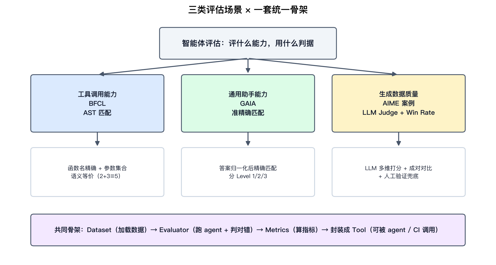
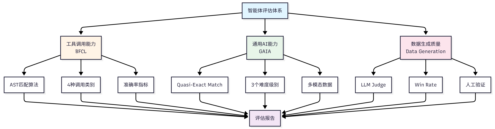
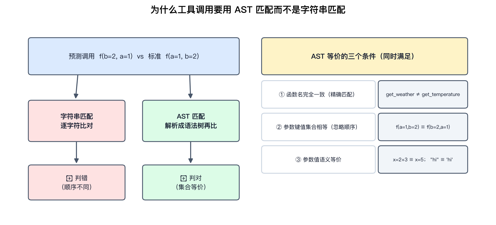
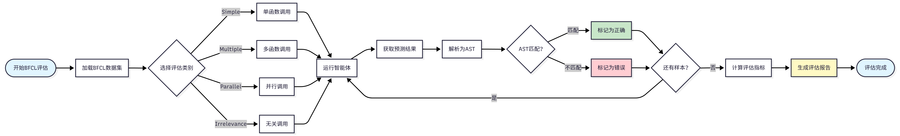
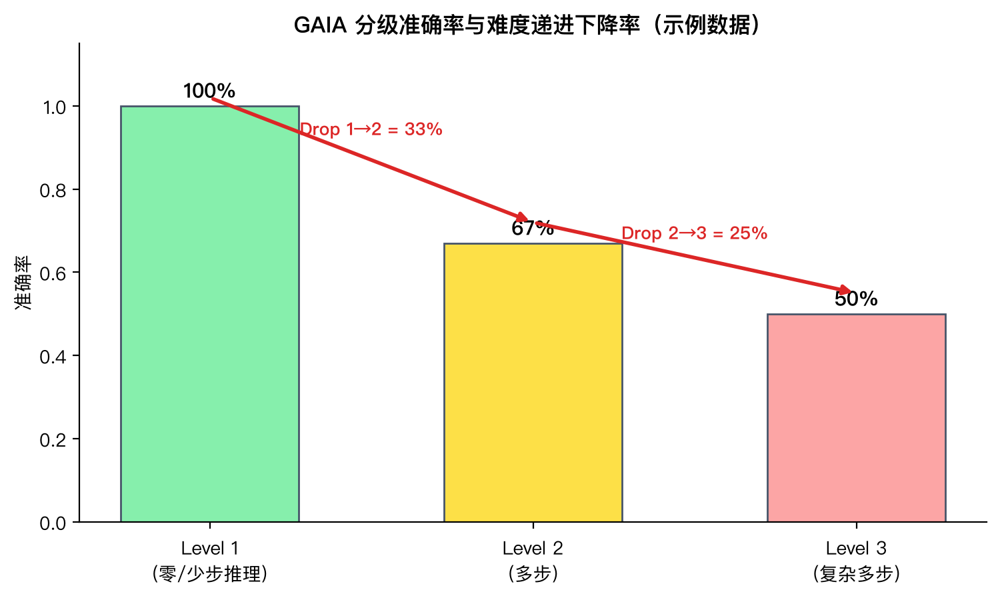
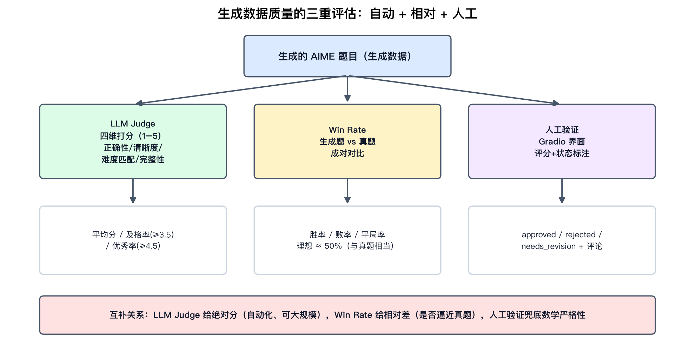
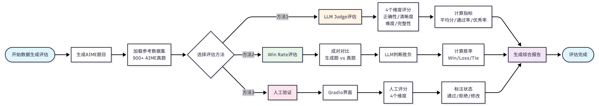

# 智能体性能评估：BFCL、GAIA 与生成数据质量的三套判据

资料来源：

- 原文章节：Datawhale《Hello-Agents》第十二章 智能体性能评估（[原文](https://github.com/datawhalechina/hello-agents/blob/main/docs/chapter12/%E7%AC%AC%E5%8D%81%E4%BA%8C%E7%AB%A0%20%E6%99%BA%E8%83%BD%E4%BD%93%E6%80%A7%E8%83%BD%E8%AF%84%E4%BC%B0.md)，配套代码在 `hello_agents/evaluation/benchmarks/` 下）
- 基准论文：BFCL（Gorilla, arXiv:2305.15334）、GAIA（arXiv:2311.12983）、ToolBench（arXiv:2307.16789）、API-Bank（arXiv:2304.08244）、AgentBench（arXiv:2308.03688）、WebArena（arXiv:2307.13854）
- 原书四张流程图已本地化到 `figures/`，本文另补四张自绘示意图

## 阅读目标

这是一篇教学型章节，价值不在新奇概念，而在**把「智能体评估」拆成三套可落地的判据，并给出统一实现骨架**。本文按工程视角重新组织，读完后你应该能回答：

1. 评一个 agent，到底在评什么？为什么说「用字符串匹配判工具调用对错」是错的？
2. BFCL 的 AST 匹配、GAIA 的准精确匹配，分别解决了什么判据问题？
3. 评估「生成数据的质量」为什么没有标准答案，要靠 LLM Judge + Win Rate + 人工三重兜底？
4. 这套「Dataset / Evaluator / Metrics / Tool」骨架怎么搬回自己的项目？

核心结论先给：**智能体评估的难点不在跑 benchmark，而在「判据（grader）」的设计——不同能力需要不同的判据，判据选错了，再高的分也不可信。** 这一章给出三类能力对应的三种判据，并用一套统一骨架把它们工程化。

## 名词解释

| 名词 | 解释 | 简单例子 |
|---|---|---|
| Benchmark（评估基准） | 带统一数据集、指标、评分方法的标准测试，让不同系统可在同一标准下对比。 | BFCL、GAIA。 |
| Grader（判据/评分器） | 判定一次输出对错的规则或模型，是评估可信度的核心。 | AST 匹配器、LLM Judge。 |
| AST 匹配 | 把函数调用解析成抽象语法树，比树的结构与节点值，而非比字符串。 | `f(a=1,b=2)` 与 `f(b=2,a=1)` 判等。 |
| 准精确匹配（Quasi Exact Match） | 先归一化再精确匹配：去单位/冠词/标点、统一大小写、列表排序。 | `"$1,234.56"` → `"1234.56"`。 |
| LLM Judge | 用 LLM 当评委，按多个维度给分并给理由。 | 从正确性/清晰度/难度/完整性四维打 1–5 分。 |
| Win Rate | 成对对比法：让 LLM 判断「生成 vs 参考」哪个更好，统计胜率。 | 生成题对真题胜率 ≈50% 说明质量相当。 |
| 难度递进下降率 | GAIA 特有：难度升一级，准确率掉了多少百分比。 | Level1→2 掉 33%。 |
| GAIA 系统提示词 | GAIA 官方规定的输出模板，约束答案可被归一化。 | 答案必须以 `FINAL ANSWER:` 结尾。 |
| Irrelevance（无关性） | BFCL 的一类：问题根本不需要调函数，考察「该不该调」。 | 问「你好」时不应触发任何工具。 |

## 1. 为什么智能体评估难

评估一个传统函数，输入确定、输出确定、对错分明。评估一个 agent 难在三点：

| 挑战 | 具体表现 | 对判据的要求 |
|---|---|---|
| 输出不确定性 | 同一问题有多个正确答案，且表达形式多样 | 判据要判「等价」而非「相同」 |
| 评估标准多样性 | 工具调用看签名、问答看语义、生成看质量 | 一种判据打不了所有分 |
| 评估成本高昂 | 每次全量评估都是大量 API 调用，可能数百元 | 需要分层、可小样本快速迭代 |

这解释了为什么这一章的主线是「三套判据」而不是「三个 benchmark」——**基准是数据集，判据才是评估的灵魂**。

## 2. 三类能力 × 一套统一骨架

原书把评估体系铺成三个场景，对应三种能力、三种判据：



| 场景 | 评什么能力 | 用什么判据 | 为什么这个判据合适 |
|---|---|---|---|
| BFCL | 工具调用：理解意图、选对工具、填对参数、处理并行/无关 | AST 匹配 | 函数调用是结构化的，比语法树能比出「等价」 |
| GAIA | 通用助手：多步推理、知识运用、多模态、网页浏览、文件操作 | 准精确匹配 | 答案是短文本/数字/列表，归一化后可精确判 |
| AIME 生成 | 生成数据质量：题目对不对、清不清晰、难度合不合适 | LLM Judge + Win Rate + 人工 | 没有标准答案，只能多维打分 + 相对对比 + 人工兜底 |

三个场景共享同一套实现骨架，这是本章最值得抄的部分：

```text
Dataset（加载/管理数据）
  → Evaluator（构造提示词 → 跑 agent → 提取结果 → 判对错）
    → Metrics（算准确率/分级/下降率等指标）
      → 封装成 Tool（可被 agent 直接调用、可进 CI）
```

原书给出的 `hello_agents/evaluation/benchmarks/` 目录就是按这个骨架组织的：`bfcl/`、`gaia/`、`data_generation/` 三个子包各自实现 `dataset.py / evaluator.py / metrics.py` 加一个判据（`ast_matcher.py` / `quasi_exact_match.py` / `llm_judge.py` + `win_rate.py`），再各自配一个 `*_evaluation_tool.py` 暴露给 agent。



原书图 12.1 展示的是同一思路：三个评估场景并列，底下是共用的数据加载、评估执行、指标计算三层。

## 3. BFCL：用 AST 匹配判工具调用

### 3.1 评什么

BFCL（Berkeley Function Calling Leaderboard，UC Berkeley）评的是 agent 的工具调用能力，拆解成四步：理解任务需求、选择合适工具、构造函数调用、处理复杂场景。数据集 1120+ 样本，分四类，难度递增：

| 类别 | 考察点 | 例子 |
|---|---|---|
| Simple | 单函数调用 | 「北京今天天气」→ `get_weather(location="Beijing")` |
| Multiple | 多函数调用（依次） | 先查天气再查汇率 |
| Parallel | 并行调用多个函数 | 同时查三个城市天气 |
| Irrelevance | 判断该不该调函数 | 「你好」→ 不触发任何工具 |

Irrelevance 这一类常被忽视但很关键：它考的不是「会不会调」，而是「该不该调」——一个见什么都想调工具的 agent 在生产上是负担。

### 3.2 判据：为什么必须是 AST 匹配

这是本章最有技术含量的点。判函数调用对错，直觉做法是字符串匹配，但它会把「对」误判成「错」：



AST 匹配的核心思想：**把函数调用解析成语法树，比较树的结构和节点值，而不是比字符。** 两个语法树等价要同时满足三个条件：

1. **函数名完全一致**（精确匹配，`get_weather ≠ get_temperature`）；
2. **参数键值集合相等**（忽略顺序，`f(a=1,b=2) ≡ f(b=2,a=1)`）；
3. **参数值语义等价**（`x=2+3 ≡ x=5`，`"hello" ≡ 'hello'`）。

多函数场景用集合匹配：调用数量相同、每个调用都能匹配、顺序不限。

**工程含义与边界**：AST 匹配适合「答案是结构化调用」的场景。但它有边界——原书习题自己也点了：语义等价的参数值（`city="北京"` vs `city="Beijing"`）AST 判不出来，会产生假阴性；而只看结构不看「该不该执行这个顺序」也会产生假阳性。所以 AST 匹配是工具调用评估的**好起点，不是终点**——需要执行语义时还得上沙箱真跑。



原书图 12.2 是 BFCL 的标准流程：加载数据集选类别 → 跑 agent 拿预测 → 把预测解析成 AST → 与 ground truth 做 AST 匹配 → 遍历所有样本算指标出报告。

### 3.3 指标

核心是准确率（AST 匹配成功的样本比例），在此基础上派生：

| 指标 | 定义 | 用途 |
|---|---|---|
| Accuracy | AST 匹配成功样本占比 | 总分 |
| 分类准确率 | 按 simple/multiple/parallel 各自算 | 看弱在哪一类 |
| 加权准确率 | 各类别按难度权重加权 | 单一口径横向比 |
| 错误率 | 1 − Accuracy | 失败面观察 |

## 4. GAIA：用准精确匹配判通用能力

### 4.1 评什么

GAIA（General AI Assistants，Meta AI + Hugging Face）评的是**真实世界任务的综合能力**：多步推理、知识运用、多模态理解、网页浏览、文件操作。466 个问题，按所需推理步骤分三级：Level 1（零/少步）、Level 2（多步）、Level 3（复杂多步）。每个样本带标注者元数据（推理步骤、所需工具、耗时），这让它不只是打分，还能做错误分析。

### 4.2 判据：准精确匹配 + 官方提示词配合

GAIA 的判据分两半，**一半在算法，一半在提示词**——这是很多人忽略的设计。

**算法侧：准精确匹配（Quasi Exact Match）**。核心思想是「先归一化，再精确匹配」，归一化函数按答案类型分别处理：

| 类型 | 归一化规则 | 例子 |
|---|---|---|
| 数字 | 去逗号分隔符、去单位符号 | `"$1,234.56"` → `"1234.56"` |
| 字符串 | 转小写、去冠词、去多余空格、去末尾标点 | `"The United States"` → `"united states"` |
| 列表 | 逗号分隔、逐元素归一化、按字母排序重连 | `"Paris, London, Berlin"` → `"berlin,london,paris"` |

**提示词侧：GAIA 官方系统提示词**。它硬性约束输出格式，让答案「可被归一化」：答案必须以 `FINAL ANSWER: [答案]` 结尾；数字不带逗号和单位；字符串不带冠词和缩写；列表逗号分隔。

**工程含义**：判据和被测对象是**共同设计**的。准精确匹配能成立，前提是官方提示词把答案的「合法形态」收窄了。这提醒我们：设计评估时，**约束输出格式本身就是判据的一部分**，能大幅降低判据的模糊度。其边界也明显——它处理不了语义等价（`"42"` vs `"四十二"` vs `"forty-two"`），所以适合短 factual 答案，不适合开放式回答。

### 4.3 指标：分级准确率与难度递进下降率

除精确匹配率外，GAIA 最有诊断价值的是「难度递进下降率」——难度升一级，准确率衰减多少：



以上图示例数据（10 个样本）为例：Level 1 准确率 100%、Level 2 67%、Level 3 50%，则 Drop Rate 1→2 = 33%、2→3 = 25%。**下降率比总分更能暴露能力边界**：一个 Level 1 满分但 Level 3 崩掉的 agent，和一个三级均衡的 agent，总分可能相近，但部署风险完全不同。此外「平均推理步骤数」（正确样本的平均步数）可用来观察 agent 是不是在「碰运气」——步数异常少的正确可能是蒙的。

## 5. 生成数据质量：没有标准答案时的三重判据

第三个场景最特殊：评估的对象是 agent **生成的数据**（以 AIME 风格数学题生成为例），它**没有标准答案**，前两种判据都失效。原书给的方案是三重互补：



| 判据 | 性质 | 给什么 | 局限 |
|---|---|---|---|
| LLM Judge | 自动化、绝对分 | 四维（正确性/清晰度/难度匹配/完整性）各打 1–5 分，算平均分/及格率（≥3.5)/优秀率（≥4.5) | 有偏见（偏好长度、偏好自家风格），严格逻辑不可靠 |
| Win Rate | 自动化、相对差 | 生成题 vs 真题成对对比，胜率/败率/平局率，理想 ≈50% | 受评委模型和提示词影响，只给相对不给绝对 |
| 人工验证 | 人工、兜底 | Gradio 界面逐题评分 + approved/rejected/needs_revision + 评论 | 成本高，无法大规模 |

三者的互补关系是关键设计：**LLM Judge 给绝对分**（能大规模跑，回答「这批题整体什么水平」），**Win Rate 给相对差**（回答「离真题还差多少」），**人工验证兜底数学严格性**（数学题的逻辑严密性 LLM 判不准，必须人看）。



原书图 12.5 是整个案例的流程：AIME 真题库采样参考 → 生成器批量出题（控制速率、保存进度）→ LLM Judge 四维打分 + Win Rate 对真题对比 → 人工验证界面复核 → 综合报告。

案例里两个工程细节值得单独记：

1. **生成提示词用英文**，理由有四：与 AIME 真题一致、评估时英对英更公平、便于国际化、避免中英翻译误差。这其实是「让判据和被测对象同分布」的又一例。
2. **LaTeX 公式会破坏 JSON 解析**：`\frac` 里的反斜杠在 JSON 中是非法转义，原书用正则把未转义反斜杠补成双反斜杠再 `json.loads`。这是「LLM 输出结构化数据」的经典坑。


原书图 12.6 细化了 Win Rate 的成对对比：每次比较产出 Win / Loss / Tie 三种结果，统计三者比例，且 Win + Loss + Tie = 100%。

## 6. 横向对比与选型

把三套判据放在一起看，选型逻辑就清晰了：

| 维度 | AST 匹配 | 准精确匹配 | LLM Judge / Win Rate |
|---|---|---|---|
| 适用答案形态 | 结构化函数调用 | 短 factual 答案（数字/字符串/列表） | 开放式、无标准答案 |
| 判据成本 | 零（纯算法） | 零（纯算法） | 高（每次评估都是 API 调用） |
| 可解释性 | 强（指出哪个参数不等价） | 中（只能说不匹配） | 中（给理由但理由不一定可靠） |
| 主要失效模式 | 语义等价值判不出；不看执行语义 | 语义等价判不出 | 评委偏见、不一致 |
| 能否进 CI | 能 | 能 | 谨慎（成本 + 非确定性） |

一条清晰的原则浮现出来：**能用确定性判据就不要用模型判据，能用模型判据就不要只靠人工。** 确定性判据（AST、归一化匹配）便宜、可复现、可进 CI；模型判据（LLM Judge、Win Rate）用来覆盖确定性判据够不着的开放式场景；人工只做抽样兜底和校准。

## 7. 工程启发与迁移检查表

把这套骨架搬回自己的 agent 项目：

| 维度 | 检查项 | 本章的参考答案 |
|---|---|---|
| 评什么 | 先分清评的是哪种能力？ | 工具调用 / 通用任务 / 生成质量，分别选判据 |
| 判据 | 判据判的是「相同」还是「等价」？ | 结构化用 AST、短答案用归一化匹配、开放式用 LLM Judge |
| 输出格式 | 能否用提示词收窄答案合法形态？ | GAIA 官方提示词约束 `FINAL ANSWER:`，判据设计的一环 |
| 骨架 | 评估代码是否分层？ | Dataset / Evaluator / Metrics / Tool 四层 |
| 成本 | 全量评估太贵怎么办？ | 小样本快速迭代 → 中规模 → 全量；确定性判据优先进 CI |
| 生成评估 | 没有标准答案怎么评？ | LLM Judge（绝对分）+ Win Rate（相对差）+ 人工（兜底） |
| 报告 | 结果给谁看？ | 开发者看错误分析，产品看分级/下降率，用户看可视化 |

## 8. 边界与误区

- **判据 ≠ 基准**。拿到一个 benchmark 不等于会评估，核心是想清楚「这个能力该用什么判据判」。选错判据，分数没有参考价值。
- **AST / 准精确匹配都判不了语义等价**。它们适合结构化或短 factual 答案，别拿去打开放式回答的分。
- **LLM Judge 不是银弹**。它有已知偏见（偏好更长回答、偏好与自己同源的输出），且对数学这类严格逻辑判不准。原书用「多评委评审团」「人工兜底」来缓解，但本质上是降本与可信度的权衡。
- **Win Rate ≈ 50% 是目标，不是越高越好**。显著高于 50% 反而要怀疑评估标准有偏差。
- **评估成本是硬约束**。原书习题里「分层评估策略」（快速/标准/全面）和「持续评估系统」（定期跑 + 性能下降告警）才是生产形态，全量评估不该每次都跑。

## 关键结论

1. **智能体评估的灵魂是判据（grader），不是基准（benchmark）。** 三类能力对应三种判据：工具调用用 AST 匹配、通用任务用准精确匹配、生成质量用 LLM Judge + Win Rate + 人工。
2. **确定性判据优先，模型判据补开放式场景，人工只做兜底。** 这条原则同时决定了成本、可复现性和能否进 CI。
3. **判据与被测对象是共同设计的**：GAIA 用官方提示词收窄答案形态，生成案例用英文保证「评估同分布」——约束输出本身就是判据的一部分。
4. **统一骨架让评估可复用**：Dataset / Evaluator / Metrics / Tool 四层，新基准只要换判据和指标，骨架不动。
5. **分级指标比总分更有诊断价值**：GAIA 的难度递进下降率、BFCL 的分类准确率，暴露的是能力边界而非平均分。

## 附：与本仓库其他文档的关系

- [Agent Evaluation Harness：从感觉评估到可复现评估](../agent-evaluation-harness/agent-evaluation-harness-guide.md) 讲的是评估的**基础设施与流程**（task/trial/transcript/grader/report/CI），本文讲的是具体**判据算法**，两篇互补：那篇回答「评估流程怎么工程化」，这篇回答「具体用什么规则判对错」。
- [Writing Effective Tools for Agents](../writing-tools-for-agents/writing-tools-for-agents.md) 里「工具要用 eval 迭代」的闭环，正好可以用 BFCL 这类工具调用评估落地。
