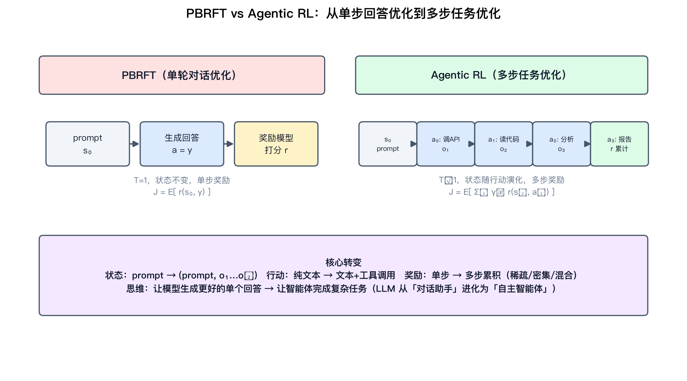
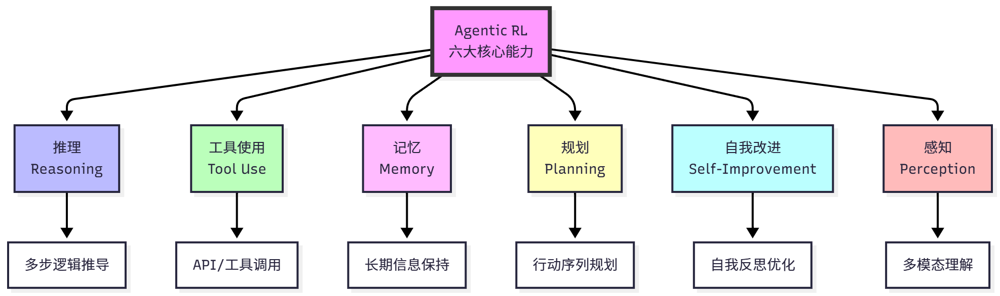
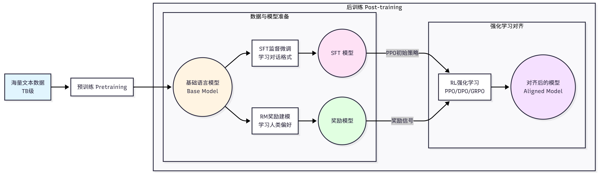
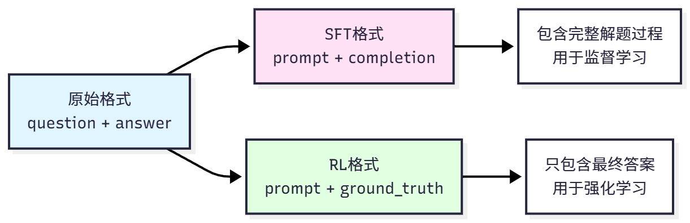
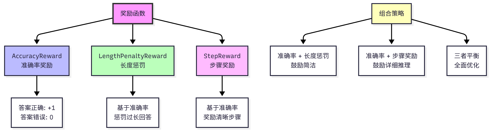
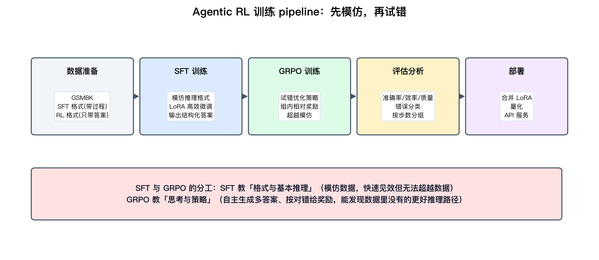
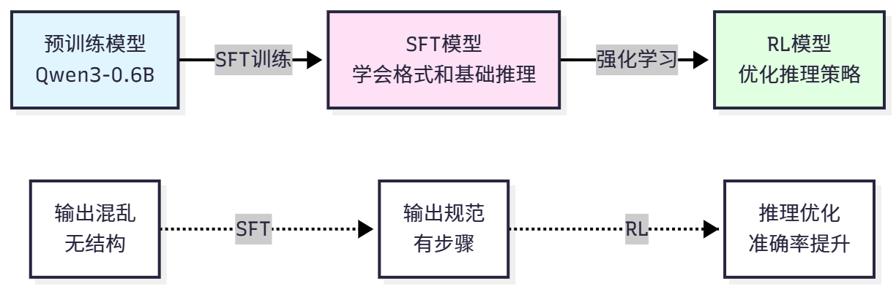
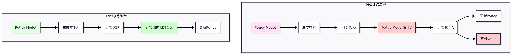
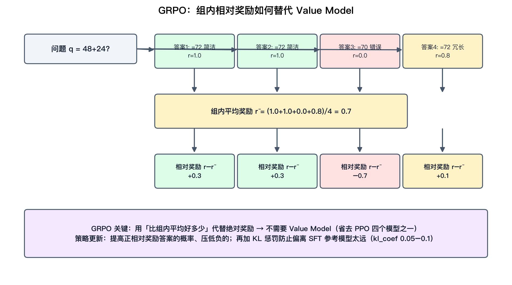

# Agentic RL：从单轮回答优化到多步任务优化

资料来源：

- 原文章节：Datawhale《Hello-Agents》第十一章 Agentic-RL（[原文](https://github.com/datawhalechina/hello-agents/blob/main/docs/chapter11/%E7%AC%AC%E5%8D%81%E4%B8%80%E7%AB%A0%20Agentic-RL.md)，配套代码在 `hello_agents/rl/` 与 `hello_agents/tools/` 下）
- 关键论文：PPO（arXiv:1707.06347）、GRPO（DeepSeekMath, arXiv:2402.03300）、RLHF（InstructGPT, arXiv:2203.02155）、RLAIF（arXiv:2309.00267）、GSM8K（arXiv:2110.14168）、TRL 框架、Qwen3
- 原书八张图已本地化到 `figures/`，本文另补三张自绘示意图

## 阅读目标

这一章是教学向的「上手 Agentic RL」，价值在于**把「智能体训练」从抽象的 RLHF 拉回到一条可跑的 pipeline：数据 → SFT → GRPO → 评估 → 部署**。本文按工程视角重组，读完后你应该能回答：

1. Agentic RL 和传统 RLHF（PBRFT）在 MDP 建模上到底差在哪？为什么说这是「思维方式的转变」？
2. 为什么数学推理是 Agentic RL 的理想切入点？奖励函数怎么设计才不会被「钻空子」？
3. GRPO 相比 PPO 省掉了什么？组内相对奖励为什么能替代 Value Model？
4. SFT 和 GRPO 在 pipeline 里各管什么？为什么顺序不能反？

核心结论先给：**Agentic RL 的本质是把 LLM 从「单步回答生成器」变成「多步策略」，奖励信号从「这个回答好不好」变成「这串行动有没有完成任务」。** 而工程上的突破口是 GRPO——用「组内相对奖励」省掉 Value Model，让小团队也能在普通 GPU 上跑通智能体训练。

## 名词解释

| 名词 | 解释 | 简单例子 |
|---|---|---|
| Agentic RL | 把 LLM 作为可学习策略，嵌入「感知-决策-执行」循环，用 RL 优化多步任务表现。 | 训练 agent 学会「先搜再算再答」。 |
| PBRFT | Preference-Based Reinforcement Fine-Tuning，传统单轮对话的偏好强化微调。 | 给一个回答打分，优化单轮质量。 |
| SFT | 监督微调：用 (prompt, completion) 对教模型模仿格式与基本能力。 | 教模型输出「Step 1… Final Answer: 72」。 |
| GRPO | 群组相对策略优化：对同一问题生成一组答案，用「比组内平均好多少」代替 Value Model。 | 一个问题生成 4 个答案，奖励减去组均值。 |
| Value Model | PPO 里估计状态价值的模型，用来算优势函数 A(s,a)。 | GRPO 把它省掉了。 |
| KL 散度惩罚 | 限制当前策略别偏离参考模型太远的正则项。 | kl_coef=0.05，防止「遗忘」SFT 学的格式。 |
| LoRA | 低秩适配：只训练一小撮低秩矩阵，不动原模型权重。 | 0.6B 模型在单卡上微调。 |
| GSM8K | 小学数学应用题数据集，7473 训练 + 1319 测试，2–8 步推理。 | Agentic RL 的「Hello World」。 |
| 奖励稀疏 / 密集 | 只在结束时给奖励 vs 每步都给部分奖励。 | 答对 +1 vs 每调对一次工具 +0.1。 |
| 轨迹（trajectory） | 一次任务的完整序列 (s₀,a₀,s₁,a₁,…,s_T)。 | agent 从读题到给出答案的全过程。 |

## 1. 为什么需要 Agentic RL

前几章的 agent 范式（ReAct、Plan-and-Execute 等）都是**靠提示词编排**出来的，处理复杂任务时天然受限。根本原因是监督学习有三个绕不开的局限：

| 局限 | 表现 | Agentic RL 的解法 |
|---|---|---|
| 数据质量决定上限 | 模型只能模仿训练数据，难以超越 | 试错学习，能发现数据里没有的更好路径 |
| 缺乏探索能力 | 只能被动学人类给的路径 | 自主生成多个候选，按奖励筛优 |
| 难优化长期目标 | 无法精确优化多步推理的中间过程 | 多步奖励，中间步骤也给反馈 |

数学推理是理想的切入任务，原因有三：有明确正确答案可**自动评估**（不需要人工标注或复杂奖励模型）、需要**多步推理**（典型序贯决策）、推理能力**可迁移**到其他领域。相比之下，开放式问答（「如何学习编程？」）的答案质量难以客观评估。

## 2. Agentic RL vs PBRFT：MDP 视角的本质差异

这是全章最有概念价值的部分。把两种范式都放进马尔可夫决策过程（MDP）框架 $(S, A, P, R, \gamma)$ 里对比，差异立刻清晰：

| MDP 要素 | PBRFT（单轮对话） | Agentic RL（多步任务） |
|---|---|---|
| 状态 $s$ | $s_0 = \text{prompt}$，不变化 | $s_t = (\text{prompt}, o_1, …, o_t)$，随行动演化 |
| 行动 $a$ | 只有文本生成 $a = y$ | 文本 + 工具调用 $a_t \in \{a^{\text{text}}, a^{\text{tool}}\}$ |
| 转移 $P$ | 无状态转移，$T=1$ | 状态随行动和环境动态变化，$T \gg 1$ |
| 奖励 $R$ | 单步奖励 $r_\phi(s_0, y)$，结束才给 | 多步累积 $\sum_t \gamma^t r(s_t, a_t)$，可稀疏/密集/混合 |
| 目标 $J$ | 最大化单步期望奖励 | 最大化累积折扣奖励（沿轨迹 $\tau$） |

用原书的例子直观感受：让 agent「分析这个 GitHub 仓库的代码质量」，它会经历一串带中间奖励的步骤——调 API 拿仓库结构（+0.1）→ 读主要代码文件（+0.1）→ 分析代码（+0.2）→ 生成报告（+0.6），总奖励 1.0。**每一步行动都改变了环境状态，每一步都能拿到反馈，优化的是整个任务的完成度而不是某一步的措辞。**

原书强调这是「思维方式的根本转变」：PBRFT 思维关注「如何让模型生成更好的单个回答」，Agentic RL 思维关注「如何让智能体完成复杂任务」。这使 LLM 从「对话助手」进化为「自主智能体」——主动找信息、知道何时用工具、愿意为最终目标执行看似「绕路」的中间步骤、从错误中学习。

原书图 11.2 列出 Agentic RL 想赋予 agent 的六大能力：推理（试错发现数据里没有的推理路径）、工具使用（学会何时用、用哪个、怎么组合）、记忆（学会记什么、何时更新/删除）、规划（权衡短期与长期收益）、自我改进（识别错误、调整策略）、感知（多模态理解与视觉工具）。

## 3. LLM 训练全景：预训练与后训练

理解 Agentic RL 前，先看清一个 LLM 的完整诞生路径——预训练 + 后训练。

原书图 11.1 展示了这条路径。预训练用海量文本做下一个词预测（自监督），学到语言规律和世界知识，但产出的只是「预测下一个词」的模型。后训练让它对齐人类偏好，经典三步是：

| 步骤 | 做什么 | 关键 |
|---|---|---|
| SFT | 用 (prompt, completion) 对教模型遵循指令和对话格式 | 数据量小、人工标注、快速见效 |
| 奖励建模 RM | 用偏好对比数据（chosen vs rejected）训练打分模型 | 让模型能给回答质量打分 |
| RL 微调（PPO） | 用 RM 当奖励，最大化奖励同时用 KL 散度防止偏离太远 | $J = E[r_\phi] - \beta D_{KL}$ |

传统 RLHF 需要大量人工标注偏好数据，成本高昂；RLAIF 用强 AI 模型（如 GPT-4）替代人类标注员，效果接近甚至超过 RLHF 而成本大降。**Agentic RL 可以看作后训练在「多步任务」方向的延伸**——它沿用了 SFT → RL 的骨架，但把奖励和状态从单轮换成了多步。

## 4. 数据与奖励：Agentic RL 的两大基石

数据集定义「学什么任务」，奖励函数定义「什么是好行为」。

### 4.1 数据格式的分治：SFT 带过程，RL 只带答案

GSM8K 需要转成不同格式适配不同训练方法，这个设计非常关键：

| 格式 | 字段 | 用途 | 设计意图 |
|---|---|---|---|
| 原始格式 | question + answer（含解题步骤） | 人类阅读 | 保留 `<<48/2=24>>` 中间步骤和 `#### 72` 最终答案标记 |
| SFT 格式 | prompt + completion | 监督微调 | completion 含完整推理过程，教模型「怎么分步想、怎么格式化输出」 |
| RL 格式 | prompt + ground_truth（只有最终答案） | 强化学习 | **不给过程**，逼模型自主生成推理，而不是记忆答案 |

一句话记住这个分治：**SFT 教你「像人一样写解题过程」，RL 只告诉你「答案对不对」，过程让你自己悟。** RL 格式刻意只给最终答案，就是为了迫使模型学会自主推理。

### 4.2 奖励函数设计：别给 agent 钻空子的机会

奖励函数是 RL 的核心，设计好坏直接决定训练成败。好的奖励函数要：清楚定义成功、提供梯度信号、方差不过大、容易调整组合。糟糕的奖励函数会：只在结束时给奖励（中间无反馈）、存在奖励欺骗（agent 找到「作弊」方式拿高分）、多目标矛盾、方差过大不收敛。

HelloAgents 提供三种可组合的内置奖励：

| 奖励 | 定义 | 优点 | 缺点/防作弊设计 |
|---|---|---|---|
| 准确率奖励 | 答对 1，答错 0 | 简单直接，适合有明确答案的任务 | 奖励稀疏，分不清「接近正确」和「完全错误」，训练初期缺反馈 |
| 长度惩罚 | 正确答案 − α·max(0, 超长部分) | 鼓励简洁 | **只在答对时才惩罚长度**——防止模型为减惩罚而生成错误的短答案 |
| 步骤奖励 | 按合理推理步骤给部分奖励 | 缓解稀疏，给中间反馈 | 步骤系数要调，否则可能奖励冗余步骤 |

长度惩罚那条「只在答对时才惩罚」是典型的防 reward hacking 设计——如果答错也惩罚长度，模型会学到「写个短的错答案」这种钻空子策略。这与本仓库 [Harness Engineering](../harness-engineering/harness-engineering.md) 里提到的 reward hacking（「为了让测试通过而删掉测试」）是同一类问题的不同表现。

## 5. SFT 与 GRPO 在 pipeline 里的分工

这是工程上最容易搞混的地方。一句话：**SFT 教格式与基本推理（模仿），GRPO 教思考与策略（试错），顺序不能反。**

**为什么 SFT 在前**：GRPO 需要一个「合理的初始策略」。直接在预训练模型上跑 GRPO，模型连「分步推理、按格式输出答案」都不会，生成的答案五花八门，奖励信号全是噪声。SFT 先教会模型结构化输出，GRPO 再在「已经会写解题过程」的基础上优化「哪条推理路径更好」。

**SFT 用 LoRA 做参数高效微调**：只训练一小撮低秩矩阵（lora_rank、lora_alpha），不动原模型权重，让 0.6B 的 Qwen3 能在普通 GPU 上训练。这与本仓库 [LoRA 文档](../lora/01-lora-low-rank-adaptation.md) 讲的低秩分解是同一技术。

原书图 11.6 展示了 SFT 在预训练模型和后续 RL 之间的桥梁位置。

## 6. GRPO：用组内相对奖励省掉 Value Model

### 6.1 从 PPO 到 GRPO

PPO 是经典算法，但在 LLM 训练里有三个痛点：需要训练 Value Model（增加复杂度和显存）、要同时维护四个模型（Policy、Reference、Value、Reward）、训练不稳容易奖励崩塌。GRPO 是专为 LLM 设计的简化变体：

核心区别在**优势函数怎么算**。PPO 用 $A(s,a) = Q(s,a) - V(s)$，需要 Value Model 估计 $V(s)$；GRPO 直接对同一问题生成一组答案，用**组内相对奖励** $r(s,a) - \bar{r}_{\text{group}}$ 代替优势函数，完全不需要 Value Model。

### 6.2 组内相对奖励：一个例子看懂

对问题「48+24=?」生成 4 个答案，按「准确率 + 长度惩罚」打分，再减去组内平均值：

| 答案 | 绝对奖励 | 相对奖励（−0.7 均值） | 策略更新方向 |
|---|---|---|---|
| =72 简洁 | 1.0 | +0.3 | 提高概率 |
| =72 简洁 | 1.0 | +0.3 | 提高概率 |
| =70 错误 | 0.0 | −0.7 | 压低概率 |
| =72 冗长 | 0.8 | +0.1 | 略提高 |

**关键洞察**：相对奖励机制鼓励模型生成「比平均水平更好」的答案，而不是单纯追求高奖励。这降低了奖励方差，让训练更稳定——同一个问题，全对时大家相对奖励都接近 0（没有学习信号），全错时也接近 0，只有「有对有错」时才产生梯度。这天然聚焦于「模型还没完全掌握」的样本。

### 6.3 KL 散度惩罚与训练监控

KL 散度惩罚 $-\beta \cdot D_{KL}(\pi_\theta \| \pi_{\text{ref}})$ 防止策略偏离 SFT 参考模型太远（避免「遗忘」SFT 学的格式）。`kl_coef` 的选择是平衡木：

| kl_coef | 后果 |
|---|---|
| 太小（0.01） | 策略偏离太远，输出格式混乱、质量下降 |
| 太大（0.5） | 策略更新受限，学得太慢，难以超越 SFT |
| 建议（0.05–0.1） | 平衡探索与稳定 |

训练时要盯三个指标：**平均奖励**（应渐升，不升可能是学习率太小/KL 太大/奖励设计不合理；先升后降可能是过拟合或奖励崩塌）、**KL 散度**（应保持在 0.01–0.1；>0.5 说明偏离太远，<0.001 说明几乎没更新）、**准确率**（最直观的能力指标）。其他关键超参：`num_generations`（每题生成几个答案，4–8，越多信号越多样但越贵）、`learning_rate`（GRPO 比 SFT 小，1e-6 到 1e-5，小模型上 5e-5 可能策略坍塌）、`temperature`（0.7–1.0 保持探索）。

## 7. 评估：不只看准确率

训练完不能只看一个准确率，要多维评估 + 错误分析：

| 类别 | 指标 | 回答的问题 |
|---|---|---|
| 准确性 | 准确率、Top-K 准确率（采样 K 次有一个对即算对）、数值误差 | 对不对？潜力多大？是「接近对」还是「完全错」？ |
| 效率 | 平均长度、推理步骤数、推理时间 | 成本高不高？步骤是否冗余（2–5 步合适）？ |
| 质量 | 格式正确率、推理连贯性 | 输出可用吗？逻辑通吗？ |

**错误分析**比总分更有价值：按错误类型分类（计算错、理解错、格式错、推理中断），按推理步骤数分组看准确率（往往步骤越多准确率越低，暴露长链推理的短板）。这与上一章 [智能体性能评估](../agent-performance-evaluation/agent-performance-evaluation.md) 的「分级指标比总分更有诊断价值」是同一思想。

## 8. 端到端流程与工程落地

原书图 11.9 给出完整 pipeline：

一条龙的六个阶段：数据准备 → SFT 训练 → SFT 评估 → GRPO 训练 → GRPO 评估 → 模型部署。工程落地还有几块值得注意：

- **超参数调优**：网格搜索 / 随机搜索 / Optuna。GRPO 重点调 learning_rate、kl_coef、num_generations。
- **分布式训练**：DDP（数据并行）、ZeRO-2/3（优化器状态/梯度/参数分片）。多 GPU 要保持总 batch 一致（单卡 batch=4×积累4=16 → 4卡 batch=4×积累1=16），学习率按 $\sqrt{N}$ 缩放。
- **生产部署**：训练得到的是 LoRA 权重，部署前要合并回基础模型（merge LoRA）、可选量化（8-bit）压显存、再用 FastAPI/uvicorn 暴露成服务。

## 9. 工程启发与迁移检查表

把这套 Agentic RL pipeline 搬回自己的场景：

| 维度 | 检查项 | 本章的参考答案 |
|---|---|---|
| 任务选型 | 任务能否自动判对错？ | 优先选有明确正确答案的（数学、代码、格式校验），避开开放式问答 |
| 数据 | SFT 和 RL 格式是否分开？ | SFT 带完整过程教模仿，RL 只给答案逼自主推理 |
| 奖励 | 奖励会不会被钻空子？ | 检查 reward hacking（如「只在答对时才惩罚长度」） |
| 算法 | 资源够不够养 Value Model？ | 不够就用 GRPO，组内相对奖励替代 |
| 顺序 | 是否先 SFT 再 RL？ | 必须先 SFT 教格式，GRPO 需要合理初始策略 |
| 稳定 | 训练是否在跑偏？ | 盯 KL 散度（0.01–0.1）、平均奖励趋势、准确率 |
| 评估 | 是否只看准确率？ | 加错误分类、按步数分组、Top-K 潜力 |
| 成本 | 小团队跑得动吗？ | 小模型（0.6B）+ LoRA + GRPO + 单卡可行 |

## 10. 边界与误区

- **GRPO 不是万能简化**。它省掉了 Value Model，但代价是要对每题生成多个答案（num_generations），计算量转移到了采样上。生成参数（temperature、max_new_tokens）调不好，要么探索不足要么浪费算力。
- **奖励稀疏是真实瓶颈**。纯准确率奖励在训练初期可能全是 0（模型还不会做），需要步骤奖励或课程学习（从简单题开始）来缓解，原书对这点着墨不多，但实践中很关键。
- **小模型天花板**。Qwen3-0.6B 适合教学和跑通流程，但复杂 Agentic 能力（多工具编排、长程规划）需要更大模型和更精心设计的环境，不能指望 0.6B 直接复现。
- **「超越训练数据」有前提**。GRPO 能发现数据里没有的推理路径，但前提是有可靠的奖励信号指路。奖励设计错了，「超越」会变成「跑偏」。
- **评估章节和训练同等重要**。原书 11.5 的错误分析、11.6 的超参调优和分布式，才是把 demo 变成可用系统的部分，不要只跑通 11.4 的 GRPO 训练就停。

## 关键结论

1. **Agentic RL 的本质是 MDP 建模的转变**：状态从静态 prompt 变成随行动演化的 (prompt, o₁…oₜ)，行动从纯文本变成文本+工具调用，奖励从单步变成多步累积——LLM 由此从「对话助手」变成「自主智能体」。
2. **数据与奖励是两大基石**：SFT 格式带过程教模仿、RL 格式只带答案逼推理；奖励函数要防 reward hacking（如「只在答对时才惩罚长度」）。
3. **GRPO 的突破是用组内相对奖励省掉 Value Model**：对同一问题生成一组答案，用「比组内平均好多少」当优势函数，只需 Policy + Reference 两个模型，让小团队也能在普通 GPU 上跑智能体训练。
4. **SFT 与 GRPO 分工明确、顺序不可反**：SFT 先教格式与基本推理（给 GRPO 一个合理初始策略），GRPO 再用试错优化推理策略、超越模仿。
5. **训练只是 pipeline 的一环**：多维评估、错误分析、超参调优、分布式、LoRA 合并部署，共同决定这是 demo 还是可用系统。

## 附：与本仓库其他文档的关系

- [智能体性能评估](../agent-performance-evaluation/agent-performance-evaluation.md)：本章 11.5 的多维评估与错误分析，和那篇的「判据设计」「分级指标」互补——训练完怎么评，判据怎么选。
- [LoRA：低秩适配微调](../lora/01-lora-low-rank-adaptation.md)：本章 SFT 用的 LoRA 正是那篇讲的低秩分解，可对照看 rank/alpha 的选取。
- [Harness Engineering](../harness-engineering/harness-engineering.md)：reward hacking、自我改进（Self-Improvement）在那篇的 harness 视角里有更系统的讨论。
