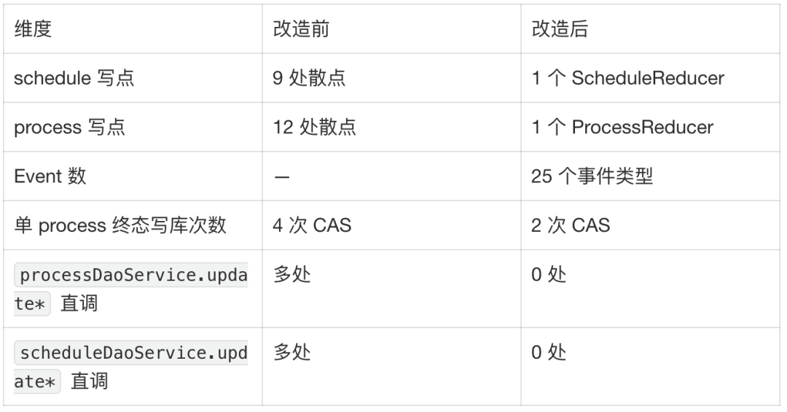
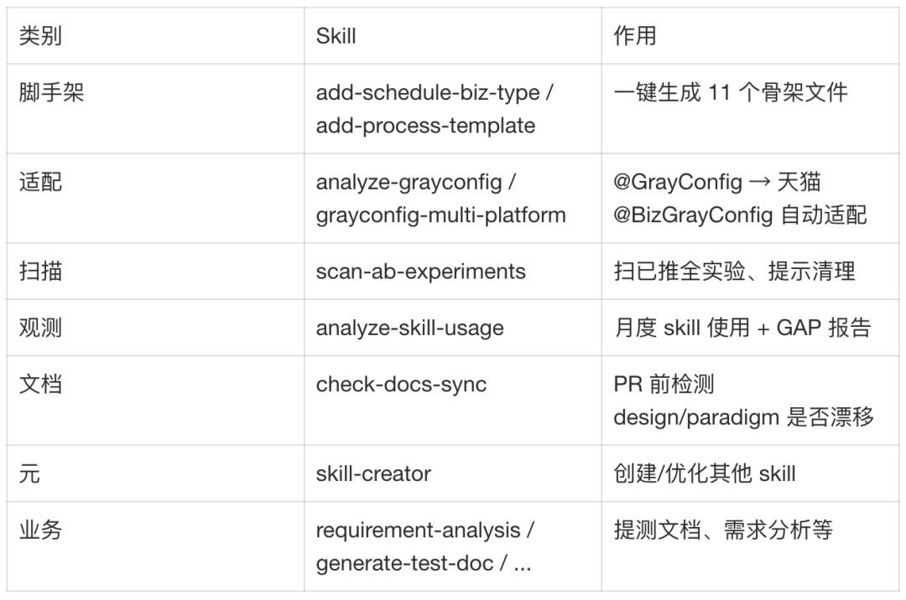
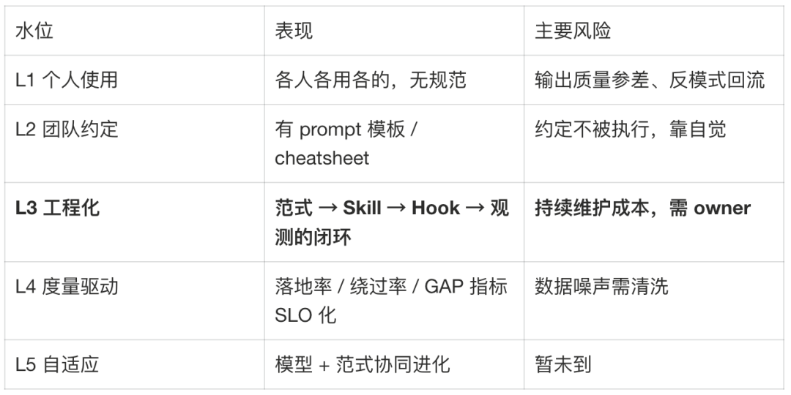
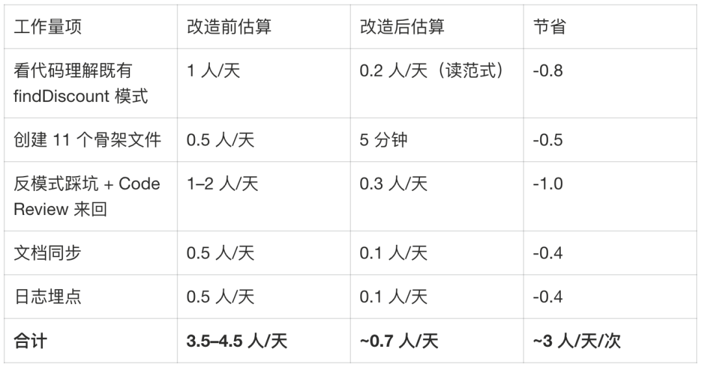
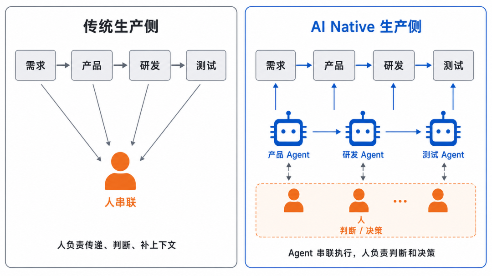
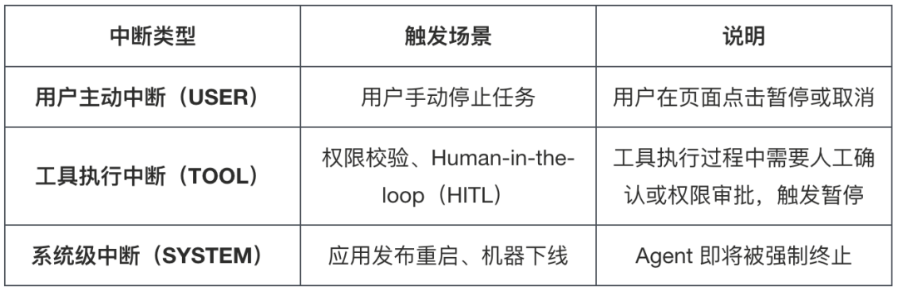
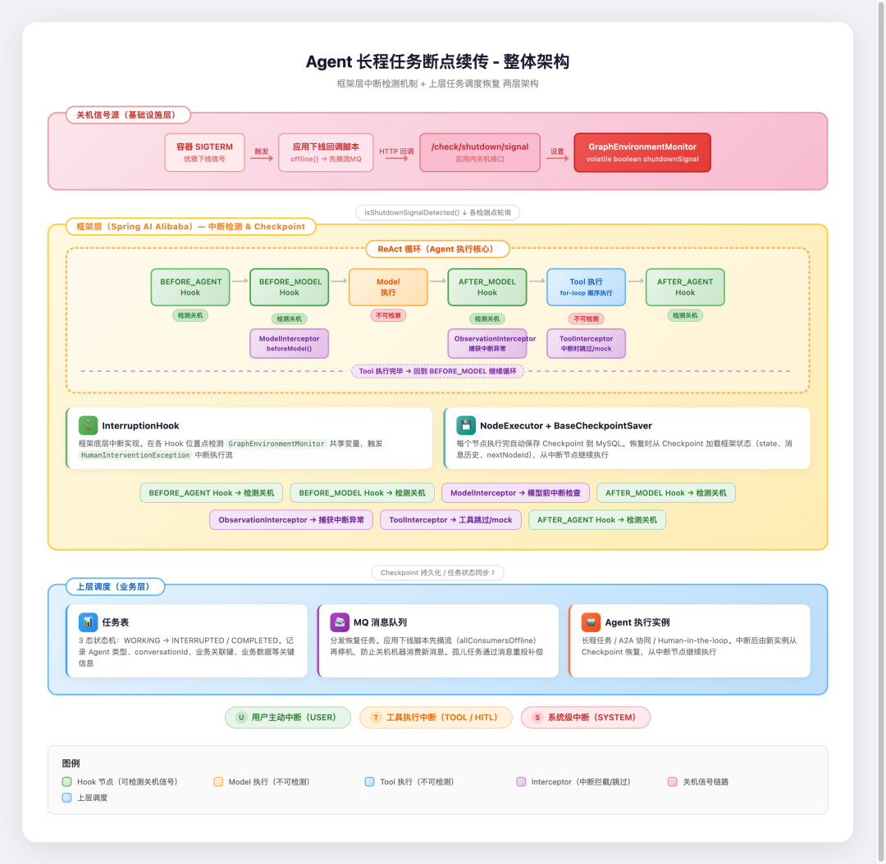
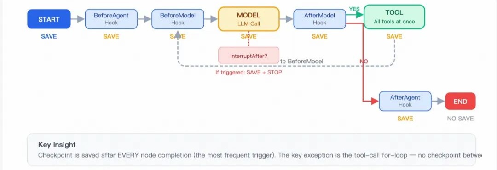
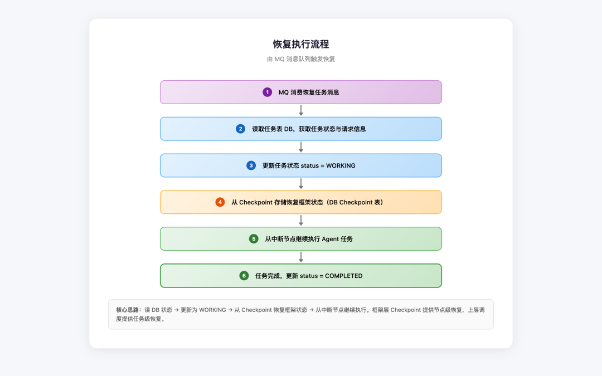

# AI 工程化实践三篇精读 — 学习笔记

> **来源：** 大淘宝技术（微信公众号）  
> **整理时间：** 2026年9月  
> **涵盖主题：** 框架重构 / AI Native协同 / Agent断点续传

---

## 目录

1. **文章一** — 天猫AI助手：调度框架重构与AI Coding工程化实践
2. **文章二** — 重构协同：关于AI Native团队的思考
3. **文章三** — Agent 长程任务断点续传：从框架 Checkpoint 到跨进程恢复的完整实践
4. **跨文章** — 核心方法论提炼与可迁移经验

---

## 一、调度框架重构与AI Coding工程化

`#系统重构` `#AI Coding` `#工程化`

### 1.1 核心问题：从单一场景到泛化框架

天猫AI助手团队面临的核心挑战：原有调度框架是为**单一讲价场景**硬编码的，当业务需要泛化（多种业务类型、多种流程模板）时，旧架构暴露出四大结构性约束：

| 痛点 | 表现 | 影响 |
|------|------|------|
| 状态写入散点化 | 21处散点query+CAS+retry | 并发覆盖、新业务复刻成本高 |
| 业务边界不清 | 改v1侵入老逻辑，fork导致分裂 | 缺乏物理隔离层 |
| 可观测性靠grep | 日志糊在一份log里 | 大促只能全开/全关降级 |
| 隐性知识门槛高 | 约定散在老员工脑子里 | 新人接入第一周靠"读老代码+问范式" |

### 1.2 解法：三层调度模型 + Reducer/Event写收敛


*▲ 图：三层调度模型 — Schedule / DAG / Process / Node 各司其职*

整个调度被划分成清晰的三层：

```
Schedule 层  ─ dispatch / cancel / 终态聚合
     │
     ├─ DAG 层  ─ 初始化、后继推进、失败级联、取消广播
     │
     └─ Process 层  ─ ReAct 循环、Node 调度、Syncer 钩子
            │
            └─ Node 层  ─ 原子动作，返回 NodeResult(CONTINUE/SUSPEND)
```

> **💡 核心设计思想：** 借鉴 Redux 的 Reducer + Event 模式，在 Java + 数据库语境下实现"写收敛"。业务侧只表达 *"我希望发生X"*，至于前置条件校验、字段变更、并发冲突处理——全部由 Reducer 统一处理。

**老代码风格（散点 CAS）：**
```java
// 每处都长这样 — 把 precondition / mutation / retry 糅在一起
ProcessBO bo = processDaoService.query(processId);
if (bo.getStatus() != EXPECTED_FROM) return;
bo.setStatus(NEW_STATUS);
bo.setSomeField(...);
boolean ok = processDaoService.updateByCas(bo, expectedFrom);
if (!ok) { /* retry...重新 query 一次再 CAS */ }
```

**新代码风格：**
```java
// 业务侧只表达"我希望发生X"
scheduleReducer.dispatch(scheduleId, new MaybeAdvanceToTerminalEvent(...));
```

**写收敛前后对比：**

| 维度 | 改造前 | 改造后 |
|------|--------|--------|
| 状态写入点 | 21处散点CAS | 2个Reducer + 25个Event |
| 单process终态写库 | 4次 | 2次（N倍放大效应） |
| 新业务接入成本 | 3.5-4.5人/天 | ~0.7人/天 |
| P0级状态问题 | 偶发 | 从此未再出现 |

> **🔑 关键洞察：** 写收敛的本质是把"如何写"和"为什么写"分离——Reducer管"如何写"（precondition/mutation/retry），Event描述"为什么写"。这层分离让收益不是线性而是**结构性**的。

### 1.3 25个Event会不会太多？

团队内部也讨论过。结论是：Event数不是越少越好，而是要**覆盖所有有意义的状态跃迁**。25个Event分四类：

- **生命周期类**（Initial / Terminal）：每种实体的初始化、终态推进
- **业务驱动类**（NodeFinish / ProcessSuspend / ProcessResume）：业务节点产生的状态变化
- **DAG协同类**（DagAdvance / DagCancelBroadcast / ContextReconcile）：DAG层依赖/取消/对账
- **聚合类**（MaybeAdvanceToTerminal / SummarizeAndAdvance）：跨实体的状态汇总

如果硬把语义不同的事件合并，业务侧用起来反而要在一个Event里塞各种if-else，反过来污染Reducer。

### 1.4 四个关键技术取舍

1. **DAG 调度内置，没用外部调度引擎。** 业务节点依赖 inline ReAct（节点内多轮调用AI模型），外部引擎粒度太粗且引入额外中间件。代价是自维护调度逻辑，收益是灵活、可控、链路短。

2. **取消是"同步闭环"而非"异步广播"。** cancel 复用 dispatch 锁做 CANCELLING→CANCELLED 闭环。用户体验秒回。代价是有锁竞争，但节点都是短任务，竞争窗口可控。

3. **日志三通道独立 logger，而不是 MDC 区分。** Async appender 下 MDC 跨线程不可靠，且无法做通道级降级。拆成 monitor / bizStat / error 三通道，配 8 个 SwitchCenter 开关覆盖四个维度。

4. **横切关注点用 Observer 而不是装饰器嵌套。** Spring 自动收集，新增观察者零侵入。代价是 Observer 抛异常需要单独隔离不污染主流程。

### 1.5 AI Coding 工程化飞轮

团队将 AI Coding 从"个人用AI"推升到"组织化工程能力"（L3水位），建立了一个有反馈回路的飞轮：


*▲ 图：设计文档 → 研发范式 → Skill矩阵 → Agent执行 → Hook监听 → 观测报告 → 反馈调优 的闭环飞轮*

```
设计文档 design/         ──┐
                           │ 抽出
研发范式 paradigm/         ──┐
                           │ 编码进
Skill 矩阵 .agent/skills/  ──┐
                           │ 触发
agent 执行                 ──┐
                           │ Hook 监听
.agent/hooks/* + logs/     ──┐
                           │ 跑分析
analyze-skill-usage        ──┐
                           │ 反馈
docs/local/skill-usage-report.md ──┐
                           │ 调优
    回到 design / paradigm / skill ──┘
```

**飞轮六层拆解：**

1. **设计文档 (design/)** — 每个核心模块的"长期决策"，不轻易改，是知识资产
2. **研发范式 (paradigm/)** — "做X这件事的标准流程" = 步骤清单 + 反模式列表 + 标准锚点路径。是 Skill 的素材，也是给人看的文档
3. **Skill 矩阵 (.agent/skills/)** — 范式被编码成 Agent Code Skill，在合适场景下被自动触发。共 13 个 Skill，涵盖业务接入、配置管理、文档同步等场景


*▲ 图：13个Skill的分类矩阵 — 涵盖业务接入、配置管理、文档同步等场景*

4. **Hook 数据采集 (.agent/hooks/)** — 8 个 Hook 落四类日志：skill-usage / prompts / commit-snapshot / edits。这是"数据基础设施"，没它就没有后面所有的度量
5. **观测分析 (analyze-skill-usage)** — 月度 6 类报告：
   - §0 数据来源（按 hostname 聚合）
   - §1 使用频率（哪些 skill 真在用）
   - §2 意图触发（哪些 prompt 没触发到 skill）
   - §3 落地率（skill 启动后 6h 内是否产生 commit）
   - §4 绕过率（commit 改了 skill 锚定路径但没启动 skill）
   - §5 GAP（模型输出的 Edit/Write 是否落到 commit）
6. **反馈回路** — 报告中暴露的问题反过来调 description / 范式 / hook，形成闭环

**AI Coding 团队成熟度五级水位：**

| 水位 | 描述 |
|------|------|
| L1 | 个人用 AI 写代码 |
| L2 | 个人有 Skill/Prompt 积累 |
| **L3** | **团队有范式+Skill+Hook+观测闭环** |
| L4 | 落地率/绕过率 SLO 化，自动调优 |
| L5 | 自动 Skill 生成 / 自动 PR 评审 |

### 1.6 落地数据：好的、不好的、灰色的

#### ✅ 好的部分
- `add-schedule-biz-type` 和 `add-process-template` 是高频+高落地率的"健康 skill"
- aiAddOn 接入实测，11 个骨架文件 5 分钟生成完毕（人工至少半天），12 个反模式 checklist 提前拦住 3 个潜在问题
- `check-docs-sync` 发现了设计文档的章节锚点路径已变更，避免了文档漂移

#### ❌ 不好的部分
- 绕过率有 8 条记录（改了文件但没启动相应 skill）
- 原因一：description 写得不够"主动"，agent 没意识到要触发
- 原因二：部分小改开发者觉得没必要走 skill
- 策略："宁可漏触发也不过度触发"，因为过度触发会降低主动使用率

#### ⚪ 灰色的部分
- GAP 指标：10 个文件 agent Edit 过但 0 落 commit；8 个文件 0 来自 agent
- 原因：开发者手工又改了一版 / agent 改了 90% 最后 10% 手写 / agent 完全错了
- 核心现实：**模型输出 ≠ 实际落地**，真正受益的代码量要从 commit 角度反推

#### ROI 估算（aiAddOn 接入案例）


*▲ 图：单次新业务接入 ROI 估算 — 年度可节省 40-80 人/天*

| 步骤 | 旧方式 | 新方式（Skill）|
|------|--------|----------------|
| 骨架文件生成 | 0.5-1天手工抄 | 5分钟自动生成 |
| 反模式检查 | Code Review 阶段 | 生成时内置 checklist |
| 年度节省 | — | 40-80 人/天 |
| 体系维护成本 | — | 月度 1-2 人/天 |

### 1.7 四个重要踩坑

> **坑 1："幽灵 CANCELLING"**  
> 第一版写收敛时留了 DagTerminationChecker 做兜底。结果 checker 和 reducer 在某些时序下互相覆盖 mutation——双兜底引入竞争。下线 checker 后问题消失。  
> **教训：收敛要彻底，不要"先收敛+再加兜底"。兜底的存在会让收敛失效。**

> **坑 2：Skill description 太宽 vs 太窄**  
> 写得偏窄触发不到，改宽后非目标场景也被触发。  
> **教训：写"什么场景该触发"+"什么场景不该触发"两段，明确边界比堆关键词有效。**

> **坑 3：Hook 数据隐私**  
> Hook 记录所有 prompt，最早直接写文件没脱敏，可能记录到 cookie/token。  
> **教训：采集即责任。任何动 telemetry 的项目，第一天就得想清楚数据治理。**

> **坑 4：范式过严降低使用率**  
> 第一版 16 个反模式全部强校验，开发者觉得"用 skill 比手写还累"。  
> **教训：反模式分级 P0（必须拦截）/ P1（提醒不强拦）/ P2（仅 review 建议）。"严"和"好用"是冲突的，需要持续微调。**

### 1.8 与上游能力的边界

| 上游（Anthropic / Agent Code） | 我们的能力 |
|------|------|
| 模型本身、tool use、prompt cache | 业务范式、Skill 内容 |
| Skill / Hook / Plan Mode 原语 | Hook 业务规则、观测分析 |
| IDE 集成 | 组织约定 |

> 类比：上游给的是"乐高零件"，我们组装的是"乐高城堡"。**模型能力会持续涨，但组织知识资产是真正的壁垒。**

---

## 二、重构协同：AI Native 团队的思考

`#组织变革` `#AI Native` `#知识底座`

### 2.1 核心论断：单点提效 ≠ 全局提效

> **灵魂拷问：** 公司真正的效率问题从来不是单点的产能，而是"协同"；而这一年的AI提效，恰恰大多没碰到协同。

两种典型的"拆碎"导致 AI 提效难以转化为全局效率：

| 拆碎类型 | 表现 | 后果 |
|----------|------|------|
| **横向拆碎** | 完整业务被拆成平台、横向产品、垂直业务等团队，各有各的KPI | A业务GMV增长可能只是吃掉B的份额，全局甚至是负的 |
| **纵向拆碎** | 需求→产品→研发→测试各管一段，中间靠人传递 | 只盯着AI Coding这最小一段，端到端整体提升有限 |

### 2.2 消费侧 vs 生产侧的命运分野


*▲ 图：消费侧永远以人为本，生产侧的串联者从人换成 Agent*

| 维度 | 消费侧 | 生产侧 |
|------|--------|--------|
| 终端 | 永远是人 | 无固定锚点 |
| 变化轴 | 交互方式升级（报纸→门户→手机→AR→脑机） | 技术每升级一轮就被重写 |
| AI时代走向 | 个人助理（贾维斯） | 串联者从人→Agent |
| 设计前提 | "以人为本"不动摇 | "人是串联者"前提被颠覆 |

**关键区分：AI辅助 vs AI Native**

- **AI辅助：** 流程骨架不动，串联者还是人，只在某个环节塞一个AI功能——本质是在旧流程上加挂能力
- **AI Native：** 把串联者整个换掉，由Agent承担传递、判断和衔接，围绕"Agent是串联者"这个新前提重建流程本身

> 会消亡的不是"软件"这个笼统的概念，而是那些把"人是串联者"当作设计前提的软件——表单、报表、审批流，以及大量内部系统里"等人来操作下一步"的环节。

### 2.3 AI Native 团队的三层闭环


*▲ 图：知识底座 + Agent群 + 人 三层闭环的AI Native团队形态*

以一个完整的业务单元为边界，理想形态有三层：

```
┌──────────────────────────────────────────┐
│               人（最上层）                 │
│     定方向 / 做判断 / 处理例外              │
│     沉淀新知识回底座                       │
├──────────────────────────────────────────┤
│          各司其职的 Agent 群                │
│  业务运营 / 产品研发 / 测试 / 运维 / 客服    │
│  从知识底座取知识 + 依赖工具和技能干活        │
├──────────────────────────────────────────┤
│          统一的知识底座（最底层）             │
│  业务规则 / 业务流程 / 领域知识 / 规范约束    │
│  = "这个业务究竟是怎么运转的"               │
└──────────────────────────────────────────┘
```

**为什么要拆成不同Agent而非一个大而全的？**
- 不同Agent的知识范围、服务范围、权限和安全要求不同
- 拆开后上下文隔离，评测和优化各自独立迭代
- 例：运维Agent需要代码知识+运维工具；客服Agent需要专业话术

**协同场景示例：**
- 业务需求：MRD/PRD 由业务和PD借助 Agent + 知识底座协同完成 → 研发Agent定位领域、拆解方案 → 编码测试发布由Agent串起来执行
- 线上报警：运维Agent自动排查定位 → 给出止血操作由人决策
- 用户答疑：答疑Agent基于知识底座自动回答 → 不确定时at项目成员确认

### 2.4 软件是被固化的知识

> 业务完全可以由Agent直接在知识底座上运转。软件之所以需要，是因为Agent的动态运转在某些地方还不够用——交互体验、确定性、性能、成本、安全、合规。于是我们把部分业务规则和流程"固化"成软件。

知识底座的本体论视角：

| 层面 | 内容 | 类比 |
|------|------|------|
| TBox（类型层定义） | 业务规则（陈述性知识）+ 业务流程（程序性知识） | 知识 |
| ABox（具体事实） | 运转中产生的订单、商家、用户 | 数据 |

**推论：**
- AI Coding 的本质 = 把知识固化为软件的动作
- 过去沉淀交付的是一套软件；往后交付的更多是"知识"（也包括Skill）
- 过去做集成交付端到端系统；往后更多是给Agent交付工具

### 2.5 两件核心事：知识底座是瓶颈，协同工具是基建

**协同工具：** 长期不太会是瓶颈，但非常重要。关键概念雏形：
- **业务空间**：划定业务闭环边界的核心容器
- **参与者**：人类成员和各类Agent
- **任务**：对应项目/需求/话题
- **频道**：人与Agent协同的入口（IM、Web、通用助手）
- **产物**：协同过程中沉淀下来的结果
- **知识底座**：每个业务空间管理的知识+数据

### 2.6 最难的一关：存量业务的知识底座

对新业务，从第一天就按新方式组织即可。**真正的硬骨头是存量业务。**

存量业务知识底座的三个核心难点：

| 难点 | 描述 |
|------|------|
| **构建过程和方法** | 抛开历史包袱，重新把"这个业务到底怎么运转"讲清楚一遍。这个构建过程本身最难也最有价值，结果理论上能反过来指导组织和架构 |
| **知识不在系统里** | 最关键的规则、来龙去脉散在老员工脑子里和对不齐的文档中。怎么把隐性知识沉淀、结构化、外化是最费劲的部分 |
| **底座必须"自己活下去"** | 靠人肉更新历史无数次证明会烂掉。必须具备自治能力——自动化+人工确认保鲜 |

> **⚠️ 终极选择题：** 如果一家大公司迈不过这道坎，迟早会有没有历史包袱的创业公司，用"知识底座+Agent"跑出数倍的效能。创业公司的优势不在更聪明，而在它是张白纸——存量之难它一样都不用还。

---

## 三、Agent 长程任务断点续传

`#Agent架构` `#断点续传` `#Spring AI Alibaba`

### 3.1 问题背景：Agent 的三类中断场景


*▲ 图：三类中断的分类与特征 — 用户主动 / 工具执行 / 系统级中断*

| 中断类型 | 触发方 | 可预见性 | 恢复策略 |
|----------|--------|----------|----------|
| 用户主动中断 | 用户（Human-in-the-loop） | 协作式 | 用户触发恢复 |
| 工具执行中断 | 工具异常/权限不足 | 协作式 | 框架Hook拦截 |
| 系统级中断 | 发布/重启/OOM | 非协作式 | 上层调度+MQ协调 |

**核心挑战：** 长程任务执行时间不可控、上下文状态庞大，中断后无法通过简单重试恢复，必须从断点续传。

### 3.2 两层架构设计


*▲ 图：断点续传整体架构 — 上层调度负责任务状态追踪与恢复协调，框架层负责Checkpoint保存与恢复*

```
┌─────────────────────────────────────────┐
│          上层调度（跨进程）                │
│  任务状态追踪 / MQ摘流 / 恢复协调         │
├─────────────────────────────────────────┤
│       框架层 Checkpoint（进程内）          │
│  状态保存 / 恢复 / Hook扩展              │
│  基于 Spring AI Alibaba 已有能力         │
└─────────────────────────────────────────┘
```

> **💡 核心约束：** 完全基于 Spring AI Alibaba 框架已有能力实现，**不修改任何框架源码**。框架是公共依赖，修改源码意味着维护私有fork，后续升级成本极高。

利用的框架能力：
- `InterruptableAction` — 中断触发接口
- `BaseCheckpointSaver` — Checkpoint 持久化
- `Hook 机制` — 在节点执行前后注入自定义逻辑
- `ToolInterceptor` — 工具执行拦截

### 3.3 框架层关键技术点

#### 关机信号检测：GraphEnvironmentMonitor

新增轻量级工具类，检测下线脚本触发的共享变量：

```
应用下线脚本 → HTTP调用关机信号接口 → 内存共享变量置为下线状态
→ GraphEnvironmentMonitor.isShutdownSignalDetected() 返回 true
→ Agent在当前节点完成后中断并保存Checkpoint
```

#### 恢复时消息顺序问题

断点续传恢复执行时，用户新发的消息可能被插入到消息列表**第一条**而不是最后一条——这是框架bug（已修复，issue #4662）。旧版本可通过 `ResumeMessageOrderHook` 在 `BEFORE_MODEL` 阶段拦截解决。

#### 多工具调用的 Checkpoint 限制

**问题：** 当模型返回多个工具调用（toolA、toolB、toolC）时，框架在 for 循环中顺序执行，中间不保存 Checkpoint。如果 toolA 执行完、toolB 执行中崩溃，恢复时三个工具全部重新执行。

**解法：Tool Mock 返回与 Checkpoint 配合**


*▲ 图：Tool Mock返回与Checkpoint配合 — 已执行的保留结果，未执行的返回mock响应，恢复时自动重试*

```
toolA 执行 ✅ → 保留真实结果
toolB 执行 ❌ → 中断检测
toolC 未执行   → 返回 mock 响应 (status="error")
                 ↓
          保存 Checkpoint（含mock响应）
                 ↓
          恢复时：toolA 不重跑，toolB/C 重试
```

**工具执行循环的中断跳过机制：**

- 某个工具需要中断 → `ToolInterceptor` 抛出 `HumanInterventionException`
- `ObservationInterceptor` 捕获 → 设置中断标记 + SSE 发送通知 + 返回 mock
- 后续工具的 `ToolRecordInterceptor` 检测到标记 → 自动跳过

`HumanInterventionException` 支持多种场景：权限不足（携带申请链接）、表单填写（携带表单协议）、对话框确认（携带弹窗协议）。

#### 子图会话 ID 后缀问题

**问题：** 多 Agent 嵌套编排时，子图 threadId 被框架自动拼接 `_subgraph_{agentName}` 后缀，导致中断恢复和状态查询时 ID 不一致。

**解法：** 在 `CheckpointAgentHook.beforeAgent()` 中将原始 threadId 记录到 metadata，后续通过统一工具方法 `ITool.getActualThreadId()` 获取。

```java
// 优先级链路
ACTUAL_THREAD_ID → 请求对象中的 conversationId
```

### 3.4 上层调度：跨进程恢复

#### MQ 摘流：防止关机机器消费新消息

```
应用下线信号 → offline() 函数
  → rm status.ok        # 摘除负载均衡流量
  → offline_rpc          # 摘流 RPC 服务
  → offline_mq           # 摘流消息队列（调用 allConsumersOffline）
  → 停止应用
```

**效果：** 即将关机的机器不再消费新消息，消息由健康机器消费。摘流后已消费但未执行的消息，新实例启动后通过 MQ 重新消费触发恢复。

#### 恢复执行流程


*▲ 图：恢复执行流程 — 读DB状态 → 从Checkpoint恢复框架状态 → 从中断节点继续执行*

```
外部MQ消息触发 → 读 DB 任务状态
  → 从 Checkpoint 恢复框架状态（通过 threadId 关联）
  → 从中断节点继续执行
```

框架通过 `RunnableConfig.threadId` 从 `BaseCheckpointSaver` 查询最新 Checkpoint，自动恢复完整执行上下文（state、消息历史、当前节点ID、下一节点ID）。

### 3.5 遇到的问题与后续规划

| 问题 | 状态 | 解法 |
|------|------|------|
| 恢复时消息顺序错乱 | 已修复（框架bug） | 升级框架版本 或 ResumeMessageOrderHook |
| 多工具调用中间无法保存Checkpoint | 待框架支持 | ToolRecordInterceptor + mock 缓解 |
| 子图会话ID后缀导致中断失效 | 已解决 | Hook记录原始threadId到metadata |

---

## 四、跨文章核心方法论提炼

### 4.1 三篇文章的内在联系

三篇文章看似独立，实则描绘了AI工程化的三个递进层次：

1. **文章一（框架重构+AI Coding）** → 怎样让**一个团队**的AI Coding从"个人用"升级为"组织能力"
2. **文章二（AI Native协同）** → 站在**企业全局**视角，思考AI应该重构什么——答案是"协同"本身
3. **文章三（断点续传）** → 在**工程落地**层面，解决Agent长程执行的可靠性基础设施

> **共同结论：AI工程化的核心不是模型能力，而是"把隐性知识显式化为可执行的组织工程能力"。**

### 4.2 十条可迁移的方法论

| # | 方法论 | 来源 | 适用场景 |
|---|--------|------|----------|
| 1 | **非破坏性演进 > 推倒重来**：新旧代并存，新业务走新代，老代码留作"考古证据" | 文章一 | 大规模系统重构 |
| 2 | **写收敛是高ROI重构方向**：Reducer+Event不需新中间件，落地成本低收益持续 | 文章一 | 状态机散点写的成熟系统 |
| 3 | **范式先于Skill**：先写给人看的标准流程，再编码成Skill | 文章一 | AI Coding团队化推广 |
| 4 | **观测报告要敢于摊开数据**：落地率低、绕过率高比"用了多少次"更有价值 | 文章一 | AI工具度量体系建设 |
| 5 | **区分AI辅助与AI Native**：流程骨架不动只是辅助，换掉串联者才是Native | 文章二 | 团队AI战略规划 |
| 6 | **知识底座是真正壁垒**：模型会涨，组织知识资产才是穿越代际更迭的核心 | 文章一+二 | 企业AI长期投入决策 |
| 7 | **不改框架源码**：利用Hook/扩展点实现，避免维护私有fork | 文章三 | 基于开源框架的二次开发 |
| 8 | **协作式vs非协作式中断分别处理**：框架层Hook+上层调度两层各管各的 | 文章三 | Agent系统稳定性设计 |
| 9 | **收敛要彻底，不要加兜底**：兜底的存在会让收敛失效 | 文章一 | 系统设计决策 |
| 10 | **采集即责任**：做telemetry第一天就得想清楚数据治理 | 文章一 | 任何数据采集项目 |

### 4.3 对个人成长的三个启示

1. **从"写代码快"到"让团队写代码快"**  
   个人用AI Coding不需要工程化，但让收益可度量、可复制、可传承，就必须做工程化。这种"组织视角"是高级工程师和架构师的核心能力。

2. **专业深度决定判断力**  
   当AI抛给你一套工程方案，你得有能力判断它靠不靠谱、坑在哪里。这种判断力未来会变得更加稀缺和重要——这不是"全栈"可以覆盖的。

3. **关注"协同"而非"单点"**  
   真正的提效不在某个环节再快一点，而在于减少环节间的传递损耗。理解业务全局的人，比只优化单点的人更有价值。

---

> **本学习笔记基于「大淘宝技术」公众号三篇文章整理**  
> 文章一：天猫AI助手 — 调度框架重构与AI Coding工程化实践（作者：依凡）  
> 文章二：重构协同 — 关于AI Native团队的思考（作者：书牧）  
> 文章三：Agent 长程任务断点续传（作者：绍清）
