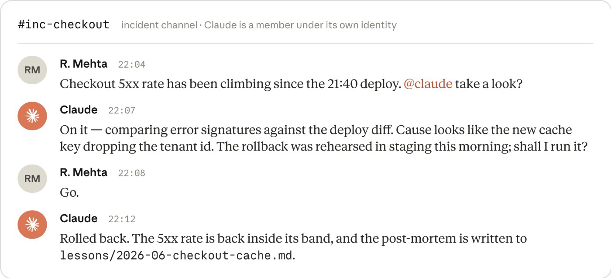

# AI-Native SDLC：当写代码不再是瓶颈，软件流程该怎么重构

> 资料来源：[《The AI-Native SDLC playbook》](https://claude.com/blog/the-ai-native-sdlc-playbook)，作者 Louis Claxton，2026-08-21，分类：Enterprise AI / Claude Code。

## 阅读目标

- 理解为什么 AI 让「写代码」变快之后，传统 SDLC 反而成了瓶颈。
- 理解 AI-native SDLC 的六个阶段以及它们如何靠「提交 artifact」串成闭环。
- 理解每个阶段的关键 play（`intent.md` / `spec.md` / `plan.md` / `CLAUDE.md` / skills / hooks / evals / PR review / 维护 loop）该怎么落地。
- 理解治理（governance）与度量（measurement）为什么在每个阶段都被单独拎出来讲。

## 核心结论

- 传统 SDLC 的流程重量，是为「写代码最贵」那个时代设计的。AI 把写代码变便宜之后，瓶颈移到了 Plan、Review/Test、Deploy，但流程还在原地。
- AI-native SDLC 不是把 AI 塞进旧流程，而是把线性流程改造成一个 loop：每个阶段结束都要把一个 artifact提交进版本库，下一个阶段从读这个 artifact 开始。这条 commit 链就是审计线索。
- `intent.md` → `spec.md` → `plan.md` → diff → PR review findings → incident record，是这个 loop 的核心产物链。治理不是事后补的流程，而是嵌在每次可读写的 artifact 上。
- 人的判断不被替换，而是被抬高：从「逐行看代码」抬到「审 artifact、定策略、批关键改动」。六阶段的治理都围绕一件事——确定性规则（hooks）挡住该挡的，人只处理真正需要判断的。

## 名词解释

| 名词 | 解释 | 简单例子 |
|---|---|---|
| SDLC | Software Development Life Cycle，软件从需求到维护的完整生命周期流程。 | Plan → Design → Build → Test → Deploy → Maintain。 |
| AI-native SDLC | 把 AI 嵌入每个阶段、靠 artifact 串成闭环的流程重构，不是旧流程加 AI。 | 每个阶段读写版本库里的 markdown artifact。 |
| artifact | 阶段之间传递的版本受控文件，是审计线索的载体。 | `intent.md`、`spec.md`、`plan.md`、diff、PR findings。 |
| `intent.md` | 用提出者自己的话记录「要什么、为什么、约束是什么」的原型 spec。 | 非工程师与 Claude 头脑风暴后提交的 markdown。 |
| `spec.md` | 把 intent 压缩成正式需求与设计 spec 的 artifact。 | Design 阶段由 Claude 依据 org skills 产出。 |
| `plan.md` | Build 阶段由 Claude plan mode 产出、经人批准的实施计划。 | 列出要改的文件、顺序、测试。 |
| `CLAUDE.md` | 给 agent 的「新人入职须知」：约定、命令、架构、常见坑。 | 放在仓库根、起 `/init` 再精简、版本受控。 |
| Skill | 把机构知识（品牌、安全、合规、UX）转成 agent 可执行 skills 的载体。 | `.claude/skills/<name>/SKILL.md`。 |
| Hook | 确定性规则层，比 skill 更硬：挡路径、跑 lint、管审批。 | `permissions.deny`、审批 gate、post-edit formatter。 |
| Subagent | 有独立上下文与工具权限的助手（verifier、simplifier、researcher）。 | plan 完成后让 verifier subagent 复核。 |
| Eval | CI 里持续跑的评测集，agent 配置变动时回归。 | 20–50 个真实任务 + 期望结果，改动 `CLAUDE.md` 就触发。 |
| Claude Tag | 让 Claude 成为 Slack 频道成员、处理 incident 的能力（public beta）。 | incident 频道里第一响应者＋写 post-mortem。 |

## 1. 背景：写代码不再是最贵的环节

传统 SDLC 流程重，是为了在「写代码最贵」的时代保证问责。但当 AI 把 Build 速度拉高一个数量级，旧流程的三个错位就暴露了：

1. **瓶颈搬家**：Plan、Review/Test、Deploy 还在用人的速度跑，Build 冲出去之后原地堵着。
2. **控制失配**：逐行 review 跟不上 agent 生成的 diff；为人工产出而设的安全团队，在 agent 多倍产出下要么排队、要么放行。
3. **治理变贵**：异常都走慢速委员会，例外处理成本反而升高。

换句话说：不是 AI 没用，而是旧流程把 AI 省下来的时间又在新瓶颈处还了回去。

下面两张图把这件事画得很清楚。第一张是「Build 不再是最贵」的对比：在 agent 出现之前，每个阶段都按人的速度走，Build 占绝对大头；agent 出现之后，Build 被压缩到几乎看不见，但 Plan / Design / Test / Deploy / Maintain 还在原地，于是省下来的 cycle time 就堵在两侧。

这张图支撑了原文的核心判断：瓶颈没有消失，只是从 Build 搬到了 Plan、Review/Test、Deploy。如果这些环节还按人的速度走，AI 带来的产出只会堆积成排队。

## 2. 什么是 AI-native SDLC

定义：把旧的控制目标和新的执行方式重新组合，把线性流程改成 loop，每个阶段都嵌 AI、自动把交接和下一步触发掉。

六阶段对比：

| 阶段 | 传统 SDLC | AI-native SDLC |
|---|---|---|
| Plan | 委员会收需求、workshop 蒸馏 | Claude 把痛点合成 `intent.md`（人可读、机器可执行） |
| Design | 分析师写 spec、设计师解析 | 与设计在一个工作会话里完成，skills 指导 |
| Build | 手写代码与测试，文档事后补 | AI 生成代码与测试，知识沉淀在版本化 `CLAUDE.md` 与 skills |
| Test | 阶段边界 QA 闸门 | Continuous evals 贯穿实现过程 |
| Deploy | 人看每一行、治理在 review 周期里 | 多层 agentic review + 人只看关键代码 + hooks 当审批闸门 |
| Maintain | 人盯生产找 bug | Agent 监控线上、把超线控制带写回成新的 `intent.md` |

**关键机制（committed artifact thread）**：每个阶段结束把一个 artifact 提交进版本库，下一个阶段从读它开始。这条 commit 链就是审计线索，也是治理落点。

下面这张图把「线性流程 → loop」画成了两个并列的视角。左边是传统的六段直线，Plan → Design → Build → Test → Deploy → Maintain 一路向下，回流只能靠「再来一轮 release」；右边是 AI-native 的 loop，六段围成一圈，Claude 在中间，每一段的输出直接喂给下一段，人只站在 loop 上方做发起、定向和治理。

这张图想强调两件事：第一，AI-native 不是把某一段换成 AI，而是把六段连成一个环；第二，人的位置从「逐段执行」被抬到「环上治理」——你不再亲手推每一格，而是保证这个环按规则转。

下面按六个阶段拆解原文的 plays，每个 play 给「问题 → 原则 → 工程含义 → 边界」。

这些 play 不是彼此独立的，原文给出了一张依赖关系图，标明「先落哪个、再落哪个」。图的顶层（橙色，START ANYWHERE）是可以独立起步的入口：Plan 阶段的 Capture intent、Build 阶段的 `CLAUDE.md`、Test 阶段的 Feedback loop、Deploy 阶段的 Hooks、Build 阶段的 Plan mode。往下是它们各自解锁的二层能力：Build 阶段的 Skills 和 Subagents 依赖 `CLAUDE.md`，Test 阶段的 Evals 依赖 Feedback loop；再往下是 Design 阶段的 Requirements & design 和 Deploy 阶段的 PR review；然后是 Deploy 阶段的 CI/CD；最底部是 Maintain 阶段的 Closing the loop，作为整个体系的收口。

这张图的作用是给出采纳顺序：你不需要一次性把六个阶段全部铺开，而是可以从顶层的任意一个入口（比如先把 `CLAUDE.md` 写起来、或者先给测试加一个 feedback loop）开始，再顺着箭头逐层往下接。

## 3. Stage 1 — Plan：把意图一次性落成 `intent.md`

**问题**：传统路径里，需求要经过「说服 PM 写下来」这一慢速环节，意图在多人间失真。

**原则**：用提出者自己的话，把「要什么、为什么、约束是什么」直接落成版本受控的 `intent.md`。

**工程含义**：

- 前置条件：给非工程师开 Claude 访问（claude.ai / Cowork）、定 `intent.md` 模板、共享的 `intent/` 目录。
- 步骤：提出者口述 → Claude 追问 scope / 用户 / 约束 / 成功指标 → Claude 按模板写出 `intent.md` → 提出者纠正 → 提交。
- 治理：证据就是带作者、时间戳、修订历史的提交文件；产品 owner 通过 merge 或 closing review 决定接受或拒绝。
- 度量：
  - Leading：首次对话到提交 `intent.md` 的时长（期望从周降到小时）。
  - Lagging：`intent.md` 进入 Stage 2 的存活率；第一份 `spec.md` 之后的改动次数。

**边界**：`intent.md` 不是正式需求，只是意图锚点；过早把它当 spec 会把 Design 阶段的压缩步骤跳过。

## 4. Stage 2 — Design：需求与设计压成一个会话

**问题**：传统 Design 把「分析师写 spec、设计师解析」拆成慢速两步，策略（品牌、安全、合规、UX）事后才补。

**原则**：`intent.md` 批准后，由 Claude 依据 org skills 在一次会话里产出 `spec.md`，产品 owner 审而不写。前端场景可直接用 Claude Design (beta) 从 `intent.md` 出 mock，迭代后导出到 Claude Code 去 build。

**工程含义**：

- 步骤：产品 owner 带 org skills 开会话并挂 `intent.md` → prompt 点名约束并要求把 concern 标出来 → owner 对照原始想法审 spec → 把标记的 concern 在进工程前 resolve → 提交 `spec.md` → owner 决定是否进入 Build（高风险咨询 tech lead）。
- 治理：策略在 spec 写作当下就被读和应用；spec、prompt、skill 版本一并入库。
- 度量：
  - Leading：`intent.md` 提交到 `spec.md` 提交的间隔。
  - Lagging：Build 开始后的需求返工（统计第一份 `plan.md` 之后的 `spec.md` 提交数）。

**边界**：skills 是咨询性控制，必须配合确定性 hook 或 review pass 才能保证「永远成立」的策略。

## 5. Stage 3 — Build：没有批准的 plan 不许动手

这个阶段包含五个 plays，分别解决「计划先行」「机构知识」「自动化程度」「并行」「确定性护栏」。

### 5.1 Plan mode 默认开启

**问题**：没有 plan 就直接生成代码，review 只能在事后补救。

**原则**：默认用 plan mode，把批准的 plan 提交成 `plan.md`，Claude 在 plan 被接受前不能改文件。

**工程含义**：

- 步骤：plan mode 开会话 → 喂 `intent.md` / `spec.md` → 让 Claude 列出文件、顺序、测试 → 追问风险与替代 → 迭代到「新工程师只看 plan 就能实施」 → 提交 `plan.md` → 接受 plan 后让 Claude 实现 → 实现偏离时在同一 commit 里更新 `plan.md`。
- 治理：设计 review 在代码生成之前完成；routine 改动工程师自己批，高风险找 tech lead。
- 度量：
  - Leading：一次实现即合并的比例；plan 批准到 PR 合并的时长。
  - Lagging：每个改动的返工轮数；合并 diff 与 `plan.md` 的一致度。

### 5.2 Auto mode 与并行

**原则**：护栏成熟后（调好的 `CLAUDE.md`、skills、hooks、测试套件），routine 工作默认 auto-accept，工程师从「盯编辑」变成「审 artifact」，并用 git worktree 并行多个 session。

### 5.3 Legacy 系统与 artifact 权威源

**问题**：企业里 Jira / ServiceNow 等 legacy 系统与 markdown artifact 并存，需要指定谁是权威源。

**原则**：给每类 artifact 指定一个 source of truth，至少做到双向可追。

- **Repo 为权威**：markdown artifact 权威，legacy 引用 commit。
- **Legacy 为权威**：Jira / ServiceNow 权威，markdown 是工作副本，通过 MCP connector 同步。
- **最低联动**：artifact 记 record ID，legacy 记录 commit SHA。

### 5.4 `CLAUDE.md` 作为新人须知

**原则**：给 agent 一份新入职者需要的上下文（约定、命令、架构、常见坑），版本受控、像代码一样评审。

- 步骤：`/init` → 精简到必要 → 提交到仓库根 → Claude 同一个错误犯两次就更新 → 保持在一页以内。

### 5.5 Skills 作为机构知识

**原则**：把「需要一致应用」的知识写成 `SKILL.md`，版本受控、集中维护、可广泛触发。

- 经验法则：属于约定或一次 prompt 的内容放 `CLAUDE.md`；必须一致执行的策略才写成 skill。
- 步骤：选一个执行不一致的知识 → 写成 `SKILL.md`（带 frontmatter）→ 放到 `.claude/skills/<name>/` → 测试触发 → 策略变更时更新。
- 治理：skill 是咨询性控制；必须永远成立的策略要用 hook 或 review pass 兜底。

### 5.6 Hooks 作为 build 期护栏

**原则**：用确定性规则兜底 skills 的「建议」。挡住受保护路径、编辑后跑 formatter / linter、把凭证挡在 diff 外。

**边界**：需要人审批的 hook 属于 Stage 5（Deploy），Build 期不该放审批型 hook。

### 5.7 Parallel sessions 与 subagents

- **Parallel sessions**：多个 Claude Code 实例各自跑在不同 git worktree 里，工程师负责 steer 与 review。
- **Subagents**：有独立上下文与工具权限的 scoped 助手（verifier、simplifier、researcher）。
- 治理：控制来自仓库配置（hooks、permissions），session 要可归因到具体工程师。

## 6. Stage 4 — Test：每个 session 在人看到之前先自验

### 6.1 给 Claude 一个 feedback loop

**问题**：没有反馈通道，实现错误会一路流到人类 review。

**原则**：给 session 一个能自验的渠道（测试、build、截图对比），session 在工程师看到之前就纠好自己的错。这与 verifier subagent 的「最终检查」不同——feedback loop 贯穿整个任务。

**步骤**：

1. 把检查包成单一目标（如 `make test`）。
2. 在 `CLAUDE.md` 里列出命令与健康输出示例。
3. 给一个可量化目标（如「所有测试通过」）。
4. 修 bug 时先写失败测试并提交，再让 Claude 去通过它（不许改测试）。
5. UI 工作用浏览器 / 截图工具闭环。
6. 把验证纳入「done」定义（报告完成前先跑测试）。
7. 用 hooks 保护这个 loop（修 bug 任务期间禁改测试文件）。

**治理与度量**：

- 治理：hooks 强制执行；证据是 `make test` 输出、build 日志、截图 diff，记录进 session transcript（OpenTelemetry）与 PR check。
- 度量：
  - Leading：agent 改动的一次 CI 成功率。
  - Lagging：每个 PR 的 review 时间；change failure rate。

### 6.2 CI 里的 continuous evals

**原则**：把 stage-gate QA 换成持续评测。任何 agent 配置改动（新模型、改 prompt、改 `CLAUDE.md` / skills / hooks）都触发回归。

**步骤**：

1. 收集 20–50 个真实任务与期望结果。
2. 写成 eval（prompt + checks）。
3. 非交互地在 CI 里跑，任何配置改动都触发。
4. 用评测结果 gate 配置改动。
5. 每次生产事故都补一个 eval。

**治理与度量**：

- 治理：pass-rate 阈值做成合并检查；日志留痕可长期对比。
- 度量：
  - Leading：eval pass rate 随时间变化；事故转化为永久 eval 的时长。
  - Lagging：CI 拦截 vs 生产逃逸的回归比例。

## 7. Stage 5 — Deploy：双向 review + 执行中治理

### 7.1 把 AI 放进 PR review loop

**原则**：Claude 对进来的 PR 按 policy review，也处理自己 PR 的 review comment；工程师把精力放到行为、意图、风险上。

**步骤**：

1. 用托管 Code Review 服务或 CI 里的 claude-code-action。
2. Tech lead 把 review policy 写成 `REVIEW.md`（覆盖 bug、安全、合规，定义 Important vs Nit）。
3. 设置人审阈值（branch protection 要求 code owner 批准）。
4. 对 review comment 标 `@claude`，让 Claude 修并推提交。
5. 把 review findings 回灌到 `CLAUDE.md`。
6. Tech lead 每月调优（评定 findings 质量、限制 Nit 数量）。

**治理与度量**：

- 治理：保持职责分离（写代码的 agent 不能批准它）；review policy 对所有 PR 一致；findings / fixes / ratings / approvals 进 PR 历史。
- 度量：
  - Leading：首次 review 的时长；人未碰分支即解决的 comment 比例。
  - Lagging：合并前拦截 vs 逃逸生产的缺陷比例。

### 7.2 Hooks 作为审批闸门

**原则**：把「必须等某人批准才能继续」的 release gate 表达成 hook（可 allow / ask / block）。

**步骤**：

1. 列出需要人审批的 gate（变更管理 sign-off、release authorization）。
2. 每个 gate 写成 hook 脚本。
3. 团队 hook 放 `.claude/settings.json`，不可协商的放 managed settings。
4. block 时要写清原因与批准路径。

**治理**：gate 每次都强制；allow / block 决策带时间戳入库。

### 7.3 Managed settings 的受管企业示例

原文给了一组面向受监管企业的关键控制项：

- `permissions.deny`（封 secrets、网络 egress）
- `permissions.allow`（放开安全内层循环）
- `disableBypassPermissionsMode`
- `sandbox`（OS 级隔离）
- `credentials`（禁读 `~/.ssh`、`~/.aws`）
- `allowManagedHooksOnly`
- `disableSideloadFlags`
- `strictKnownMarketplaces`
- `allowManagedMcpServersOnly`
- `requiredMinimumVersion`

### 7.4 CI/CD 集成与部署

**原则**：在 CI/CD 里非交互地跑 Claude Code，沙箱执行，通过 MCP 暴露部署能力，把回滚当最常演练的路径。

**步骤**：

1. 从只读判断步骤开始（trigae 失败 build、总结 flaky test）。
2. 在已有闸门后加写步骤（修 lint、更新文档），以 PR 形式到达。
3. 沙箱执行（容器、网络策略、短期 token、无生产凭证）。
4. 通过 MCP 暴露部署（deploy / status / rollback 作为按环境 scoped 的工具）。
5. 按环境分级自治（dev 放开，生产 agent 准备、人批准）。
6. 回滚是最常演练的路径。

**治理与度量**：

- 治理：agent 最多走到生产闸门前，不能越过；branch protection 把 agent 写入变成 PR；生产部署 hook 在指名 release manager 批准前一直 block。
- 度量：
  - Leading：pipeline 失败无需呼叫人的比例。
  - Lagging：DORA 指标。

## 8. Stage 6 — Maintain：把 loop 闭上

### 8.1 维护与闭环

**原则**：持续运行的 monitoring agent 从 bug 单或告警生成 `intent.md`，穿过 Plan / Design / Build / Test / Review 各阶段，headless 运行，阶段间用独立 confidence gate。

**闭环步骤**：

1. 选一个有稳定滚动基线的指标（CI 失败率、部署后 5xx 率）。
2. 写确定性检测脚本（滚动窗口的 mean / std dev、Western Electric 规则）。
3. 在版本受控的 `bands.yaml` 里定义响应分级：1σ=log，2σ=diagnose（read-only），3σ=act（开 PR 或触发 runbook）。
4. 触发层用定时 workflow、webhook 或 Cron Job，Claude 无状态地跑。
5. agent 把诊断写成 `intent.md`（Stage 1 格式）。
6. Service owner 分诊队列（立即修 / 排期 / 驳回）。
7. 修复上线后，为该事故补一个 eval。

**治理与度量**：

- 治理：分级边界从版本受控配置里强制；invocations、findings、triage 决策全部留痕；service owner 审 findings；改动走正常 PR review gate。
- 度量：
  - Leading：越带到 `intent.md` 进分诊队列的时长。
  - Lagging：findings 变成合并修复的比例；同类事故重复率。

### 8.2 周期性代码扫描

**原则**：定期跑安全扫描（例：Claude Security on Claude Mythos 5），无需人触发，findings 先验证再报告。

**步骤**：

1. 连接仓库并组织成 project。
2. 首次全量扫描做基线。
3. 按 project 设周期（默认每周）。
4. 用 confidence rating 分诊，驳回要填原因。
5. Bounded findings：在 Claude Code on the Web 里开建议补丁，review 后走 PR gate。
6. 更宽的 findings：写成 `intent.md` 从 Plan 阶段进入。
7. 修复发布后，为该类漏洞补 eval。
8. 把 findings 导出到既有 tracker / 审计系统。

**治理**：扫描在 org admin 控制下跑；每个 finding 有验证结果与 confidence；每个 dismissal 有原因；修复经 PR review gate 上生产。

### 8.3 Claude on call with Claude Tag

**原则**：把 Claude Tag（Slack public beta）拉进 incident 频道，作为独立身份的第一响应者；对话与知识留在频道里。

**能力**：确认指标回到基线；把 post-mortem 写进版本受控的 lessons 文件；分诊结果小修变成 PR，大修写成 `intent.md`。

下面这张图是 Claude Tag 在 incident 频道里的真实形态。`#inc-checkout` 频道里，R. Mehta 发现 checkout 的 5xx 率在 21:40 的部署后持续上升，于是 `@claude take a look?`；Claude 三分钟后回复，把错误签名和部署 diff 对比，定位到新 cache key 丢了 tenant id，并提醒「回滚今天早上在 staging 演练过，要不要现在跑？」；Mehta 回一个「Go.」；Claude 完成回滚，确认 5xx 率回到控制带内，并把 post-mortem 写进 `lessons/2026-06-checkout-cache.md`。

这张图想强调「频道即审计线索」：请求、诊断、人授权、修复动作、事后文档，全部留在 incident 被处理的同一个地方，不需要事后补一份独立的报告。

## 9. 落地检查表

把原文的 plays 收敛成一组可执行检查项：

| 阶段 | 检查项 | 期望状态 |
|---|---|---|
| Plan | 是否有 `intent.md` 模板与共享目录 | 首谈到提交从周降到小时 |
| Design | 是否有 org skills 注入 spec 写作 | `intent.md` → `spec.md` 间隔缩短 |
| Build | 是否默认 plan mode + `plan.md` 入库 | 一次实现即合并的比例上升 |
| Build | 是否有 `CLAUDE.md` 与 skills 的版本管理 | 同一错误不再犯两次 |
| Build | 是否有确定性 hooks | 受保护路径挡得住、格式自动跑 |
| Test | 是否有单一反馈命令（如 `make test`） | 一次 CI 成功率上升 |
| Test | 是否有 20–50 个真实任务的 eval 集 | 配置改动即回归 |
| Deploy | 是否有 `REVIEW.md` 与 `@claude` 回环 | review findings 回灌到 `CLAUDE.md` |
| Deploy | 是否把审批闸门写成 hook | 每次 gate 强制 + 时间戳入库 |
| Deploy | 沙箱、分级自治、MCP 部署 | 生产 gate 前 agent 不越过 |
| Maintain | 是否有控制带 + bands.yaml + confidence gate | 越带到 `intent.md` 的时长下降 |
| Maintain | 周期性安全扫描 + confidence 分诊 | 每个 finding 有验证与评级 |

## 10. 关键结论

- 这套 playbook 的核心不是「把 AI 塞进流程」，而是「把流程改成一个 loop，用 artifact 把阶段串起来，让人能插上判断」。
- 每一个环节都把「治理」与「度量」单独拎出来讲，是因为它默认企业场景里这两件事比「能不能跑」更难。
- 最值得借鉴的三点：`intent.md` / `spec.md` / `plan.md` 这类「阶段产物入库」的做法；hooks 作为确定性兜底，与 skills 的「咨询性控制」分层；以及把事故转成永久 eval 的闭环。
- 边界也清楚：它默认你已经有了 Claude Code / Claude Enterprise 这类基础设施，并且把「artifact 权威源」这类集成问题显式处理了。没有这些前提，照搬六阶段会架空。

---

> 原文链接：[The AI-Native SDLC playbook](https://claude.com/blog/the-ai-native-sdlc-playbook)。作者 Louis Claxton，致谢 Jim Blackhurst、Will Steuk、Jamal Arif。
