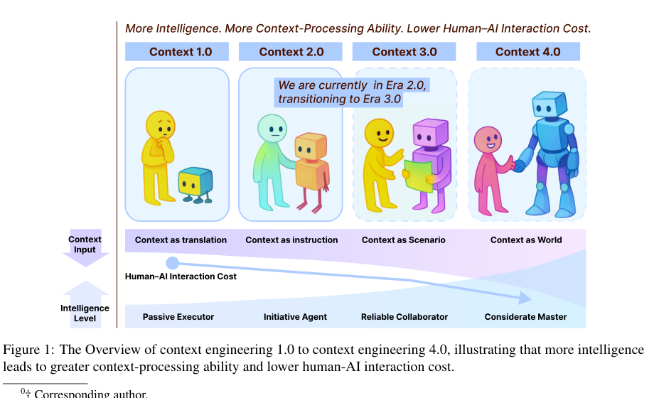
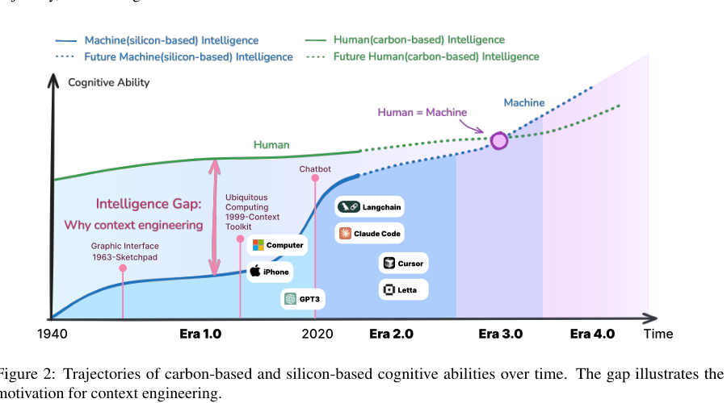
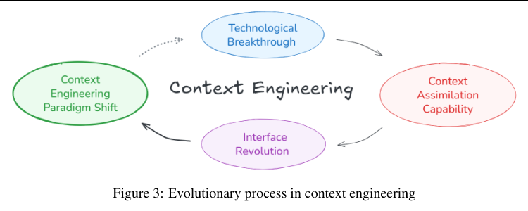
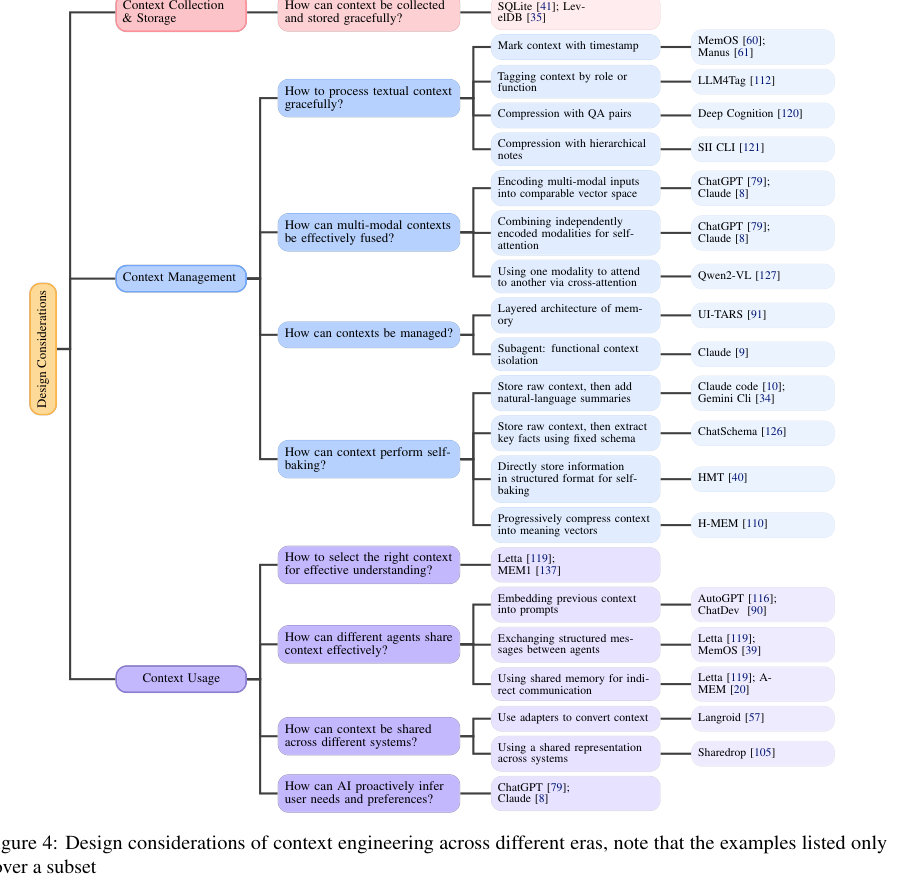
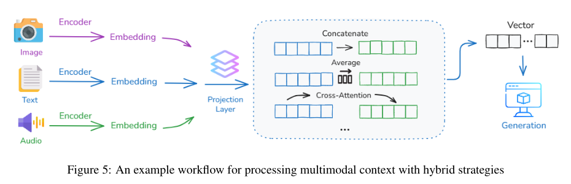
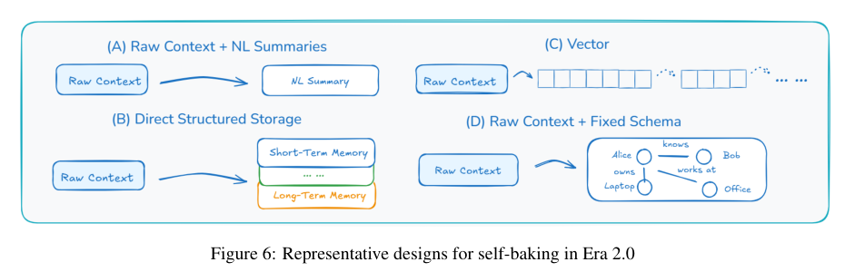
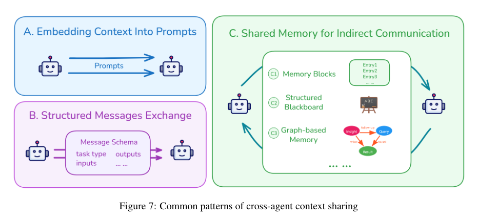

# Context Engineering 2.0

> 论文链接：https://arxiv.org/abs/2510.26493  

## 核心结论

《Context Engineering 2.0》试图把“上下文工程”从当下 LLM/Agent 圈的实践热词，重新放回更长的人机交互历史中理解。论文的核心主张是：上下文工程并不是 prompt engineering 的新包装，也不是 LLM 时代突然出现的新概念，而是人机通信中长期存在的基础问题。

从论文视角看，上下文工程的本质是缩小“人的真实意图”和“机器可理解输入”之间的差距。机器越不智能，人类越需要把目标翻译成结构化、低熵、可执行的格式；机器越智能，它越能直接吸收模糊、复杂、高熵的上下文，人类显式整理上下文的成本也就越低。

## 1. 关键名词解释

| 名词 | 解释 | 简单例子 |
| --- | --- | --- |
| Token | 模型处理信息的基本单位。文本会被切成词片段或字符片段，图像也可以被切成 patch 后编码成 token，音频可以被切成时间片段后编码成 token。 | “帮我总结这篇文章”会被拆成多个文本 token；一张截图也会被切成很多小图块 token。 |
| Context Window | 模型一次推理时能看到的上下文容量。它像工作台或短期记忆，能放系统提示、用户输入、历史消息、工具结果、检索文档等，但容量有限。 | 让 AI 读 20 个文件时，并不是所有文件都能无限放进去，需要挑当前任务最相关的内容。 |
| Self-attention | 同一组 token 之间互相计算相关性。每个 token 在更新自己的表示时，会决定应该参考同一序列里的哪些 token。文本场景里，“它”可以关注前文的“新手机”；多模态场景里，文本 token 也可以关注图像 token。 | 问“截图里的红色按钮在哪里”时，文字里的“红色按钮”可以和截图中红色区域互相关联。 |
| Cross-attention | 两组不同来源的 token 之间计算相关性。常见形式是：一组 token 作为查询，去另一组 token 中寻找相关信息。例如文本问题“红色按钮在哪里”去关注图片中的对应区域。 | 文本问题像拿着问题去图片里查找答案：问题 token 主动关注图片 token。 |
| Self-attention vs Cross-attention | Self-attention 强调“放在同一个序列里互相看”；cross-attention 强调“一个来源主动去另一个来源里取信息”。前者更像混在一个会议里一起讨论，后者更像一个团队带着问题去查另一个资料库。 | 把文字和图片 token 混在一起共同推理更像 self-attention；先理解问题，再去图片特征里找对应区域更像 cross-attention。 |
| Embedding | 把文本、图片、音频、代码等内容转换成向量表示。语义相近的内容在向量空间中通常更接近，因此 embedding 常用于检索、聚类和相似度计算。 | 搜“退款流程”时，系统也能找到“如何退货退钱”的文档，因为两者语义接近。 |
| RAG | Retrieval-Augmented Generation，检索增强生成。模型回答前先从外部知识库、文档或代码库中检索相关片段，再把检索结果放入上下文中辅助生成。 | 问公司内部报销规则，AI 先从制度文档里找相关条款，再基于条款回答。 |
| Agent | 能围绕目标进行多步骤行动的 AI 系统。它通常不只是回答一句话，还会规划、调用工具、读取文件、搜索信息、更新记忆并根据结果继续行动。 | 让代码 Agent 修 bug，它会先读报错，再查代码，改文件，跑测试，最后汇报结果。 |
| Tool Calling | 模型根据任务需要调用外部工具，例如搜索、读文件、运行代码、查数据库、发 API 请求。工具输出会成为新的上下文，影响后续推理。 | AI 不知道当前目录有哪些文件时，会调用读文件或搜索工具，然后根据结果继续分析。 |
| Long-term Memory | 模型上下文窗口之外的长期记忆。它可以保存用户偏好、项目规则、历史任务、关键决策等信息，在未来会话或任务中被重新取回。 | 用户长期要求“回复默认中文、代码注释用英文”，系统可以记住并在以后自动遵守。 |
| Context Isolation | 上下文隔离。把不同任务、不同角色或不同 agent 的上下文分开，避免无关信息污染主任务。例如让一个 subagent 单独做搜索，主 agent 只接收摘要结果。 | 主 Agent 负责写方案，搜索 Agent 单独查资料，最后只把关键结论交给主 Agent，避免搜索过程塞满主上下文。 |
| Self-baking | 论文中的关键概念，指 agent 把自己的原始上下文“消化”成更稳定的知识结构。它不是简单保存聊天记录，而是把历史压缩成摘要、schema、图结构或向量记忆，让系统从过去经验中积累知识。 | 一个代码 Agent 做完排查后，把“问题原因、改动文件、验证命令、风险点”沉淀成任务摘要，后续接着做时不用重读全部聊天记录。 |
| KV Cache | Transformer 推理时缓存过去 token 的 key/value attention 状态。缓存命中越高，后续生成越省计算、延迟越低。稳定的 prompt 前缀和 append-only 的上下文更新更有利于复用 KV cache。 | 如果系统提示和前半段上下文一直不变，模型后续生成时可以复用缓存；如果每次都改开头，就更难复用。 |
| Schema | 结构化信息模板。例如把一次任务记录成 `目标、输入、输出、依赖、状态、证据` 等字段。schema 能让上下文更容易检索、校验和跨 agent 传递。 | 代码 review 结果固定写成 `文件、行号、问题、影响、建议`，另一个 Agent 就更容易继续处理。 |
| Semantic Continuity | 语义连续性。上下文管理的目标不是保存所有原始数据，而是让任务意义、关键决策、用户意图和推理状态能够连续传递。 | 不必保存 3 小时完整会议录音，但要保留“决定了什么、为什么、谁负责、下步做什么”。 |
| Minimal Sufficiency | 最小充分原则。上下文不是越多越好，而是应保留足够完成任务的信息，同时减少噪声、成本和注意力干扰。 | 让 AI 修改一个按钮样式时，只需要相关组件和样式文件，不需要把整个项目所有文件都塞进去。 |

## 2. 上下文工程为什么重要

论文开篇提出的问题是：机器怎样才能更好理解人的处境、目标和意图？

过去几年，围绕 LLM 和 Agent 的上下文实践快速发展，包括 prompt、RAG、tool calling、long-term memory、multi-agent collaboration 等。但论文认为，当前对“context”的理解经常过窄：很多讨论只把上下文等同于对话历史、system prompt、检索文档或 agent 环境输入。

原文观点可以概括为：上下文应当被理解为“与一次人机交互相关的所有实体状态信息”。这里的实体不只是用户和模型，还包括应用、终端环境、工具、外部服务、记忆模块、文件系统、设备状态、历史任务和用户偏好。

这张图解释了论文的基本动机：人类认知和机器认知之间长期存在差距，而上下文工程正是为了弥合这个差距。早期机器只能处理结构化输入，所以人类必须承担大量“翻译”工作；随着机器智能提升，机器逐渐能够处理自然语言、多模态信号、历史记忆和不完整意图。

## 3. 论文如何定义 Context Engineering

论文给出了一组形式化定义：

- Entity：一次交互中相关的实体，例如用户、应用、对象、环境、工具、记忆模块、后端模型服务。
- Characterization：描述某个实体状态的信息，例如用户输入、当前目录、工具状态、模型能力、历史记忆。
- Interaction：用户和应用之间的显式或隐式互动，例如命令、点击、注意力、环境调整、工具调用状态。
- Context：所有相关实体 characterization 的集合。

在此基础上，上下文工程被定义为：系统性地设计和优化上下文的采集、存储、管理与使用，以提升机器理解能力和任务表现。

这个定义有两个重要含义：

1. 上下文工程不等于 prompt engineering。Prompt 只是上下文进入模型的一种形式。
2. 上下文工程不局限于 LLM。GUI、传感器、context-aware computing、RAG、Agent memory 都可以放进同一条演进线中理解。

## 4. 上下文工程的本质：熵减

论文把上下文工程理解为一种 entropy reduction process。人在交流时会自动补全大量隐含信息：背景、情绪、社会关系、历史经验、未说出口的目标和偏好。机器缺乏这种补全能力时，人类就必须把高熵信息加工成低熵输入。

这种熵减体现在多个工程环节：

- 把模糊需求转成明确任务。
- 把散乱历史转成可检索记忆。
- 把多模态信号转成统一表示。
- 把长任务过程压缩成阶段性状态。
- 把不同 agent 或系统的上下文转成可互相理解的格式。

论文进一步指出，机器智能提升会带来上下文吸收能力提升，而这又会推动人机界面变化，最终形成新的上下文工程范式。

## 5. 四个阶段：从 Context as Translation 到 Context as World

论文把上下文工程划分为四个阶段：

| 阶段 | 时间/状态 | 机器角色 | 上下文形态 | 典型特征 |
| --- | --- | --- | --- | --- |
| Context Engineering 1.0 | 1990s-2020 | Passive Executor | Context as translation | 人类把意图翻译成结构化输入 |
| Context Engineering 2.0 | 2020-现在 | Initiative Agent | Context as instruction | Agent 能理解自然语言、工具、记忆和不完整意图 |
| Context Engineering 3.0 | 未来，人类级智能 | Reliable Collaborator | Context as scenario | AI 能理解复杂场景、情绪、社会线索和长期目标 |
| Context Engineering 4.0 | 推测，超人类智能 | Considerate Master | Context as world | AI 主动构造上下文，发现人尚未显式表达的需求 |

1.0 时代的代表是早期 GUI、泛在计算和 context-aware systems。系统可以感知位置、时间、设备状态等信号，但处理逻辑通常是预定义规则，例如“如果用户在办公室，则静音手机”。机器知道“你在哪里”，但并不真正理解“你在做什么”。

2.0 时代由 LLM 和 Agent 推动。系统开始能够理解自然语言、处理模糊输入、调用工具、维护记忆、跨步骤协作。论文称这种变化是从 context-aware 走向 context-cooperative：系统不只是感知环境，而是进入工作流，与用户共同完成目标。

3.0 和 4.0 是更前瞻的设想。随着机器接近或超过人类级理解，AI 可能不仅理解上下文，还能主动构造上下文，帮助用户发现更深层的问题和目标。

## 6. 设计框架：采集、管理、使用

论文把上下文工程的实践问题分成三类：Context Collection & Storage、Context Management、Context Usage。

这张图是全文最有工程价值的结构图。它把上下文工程拆成一组具体问题：

- 如何优雅地采集和存储上下文？
- 如何处理文本上下文？
- 如何融合多模态上下文？
- 如何组织短期记忆和长期记忆？
- 如何做 context isolation，避免上下文污染？
- 如何让上下文 self-baking，从原始记录变成知识？
- 如何为当前步骤选择正确上下文？
- 不同 agent 和不同系统之间如何共享上下文？
- AI 如何主动推断用户偏好和潜在需求？

## 7. 上下文采集与存储：足够，而不是越多越好

论文提出两个原则：

- Minimal Sufficiency Principle：只采集和存储支持任务所必需的信息。
- Semantic Continuity Principle：上下文的目标是维持意义连续性，而不是保存所有原始数据。

这一点对 Agent 系统尤其关键。一个长期运行的代码 Agent 或研究 Agent 不能只依赖 context window，因为窗口是短期且容量有限的。它需要把目标、进展、关键决策、工具输出、文件状态等沉淀到外部记忆中，并在后续步骤恢复相关上下文。

可归纳出的存储分层是：

- 短期、频繁访问的信息放在缓存或快速存储。
- 中期任务状态和用户偏好可放在本地数据库或安全存储。
- 长期、跨设备、需同步的信息可放在云端或远程数据库。
- 敏感信息需要权限隔离、用户控制和安全边界。

## 8. 上下文管理：从原始记录到可推理知识

论文强调，上下文管理不是把更多 token 塞进模型，而是决定如何结构化、压缩、隔离和抽象上下文。

文本上下文常见处理方式包括：

- 时间戳：保留顺序，简单低成本，但缺少语义结构。
- 功能/语义标签：便于检索和解释，但可能限制灵活推理。
- QA 对压缩：适合搜索和 FAQ，但会破坏原始思路流。
- 层级笔记：结构清楚，但不一定表达因果、证据、结论和修订关系。

多模态上下文处理则面临更复杂的异构问题。文本是离散序列，图像是空间结构，音频是连续时间信号，代码和传感器数据也各有表示方式。论文总结了三类路径：

- 把不同模态映射到可比较的向量空间。
- 将不同模态 token 放进统一 self-attention 中联合建模。
- 通过 cross-attention 让一种模态有选择地关注另一种模态。

## 9. Self-baking：把记忆变成学习

论文中一个很关键的概念是 self-baking：Agent 选择性地消化自己的上下文，把原始记录转化为更紧凑、更持久、更可复用的知识结构。

这一点区分了 memory storage 和 learning。没有 self-baking，系统只是把过去内容存起来并在需要时召回；有了 self-baking，系统开始从历史中形成稳定知识。

典型 self-baking 方式包括：

- 原始上下文 + 自然语言摘要：灵活、容易实现，但结构弱。
- 原始上下文 + 固定 schema 抽取：便于推理，但抽取器和 schema 维护成本高。
- 直接结构化存储：可控性强，但对输入格式要求高。
- 逐步压缩成语义向量：紧凑、适合检索，但不可读、难编辑。

## 10. 上下文使用：先选择，再让模型注意

论文把上下文选择称为 attention before attention。也就是说，在模型内部注意力机制发挥作用之前，系统需要先决定哪些信息值得进入当前步骤。

上下文选择可以依据以下因素：

- Semantic Relevance：与当前 query 或目标的语义相似度。
- Logical Dependency：当前步骤是否依赖前序计划、工具输出或推理链。
- Recency and Frequency：信息是否近期使用、是否反复出现。
- Overlapping Information：是否存在重复、冲突或过时信息。
- User Preference and Feedback：用户长期偏好和反馈如何影响记忆权重。

这解释了为什么长上下文并不天然等于好效果。过多无关上下文会增加推理成本，也可能稀释注意力、引入噪声和冲突。关键不是“能放多少”，而是“当前真正该放什么”。

## 11. 多 Agent 与跨系统共享上下文

多 Agent 系统中的核心难点是：不同 agent 产生的中间结果，如何被其他 agent 准确理解和继续使用。

论文总结了三种跨 agent 上下文共享模式：

- 把前序上下文直接嵌入下一个 prompt。
- 使用固定 schema 交换结构化消息。
- 使用共享记忆、黑板或图结构进行间接通信。

跨系统共享更难，因为不同系统有自己的状态、格式和语义边界。论文给出两条路线：

- Adapter：保持各自内部格式，通过转换器互通。优点是自由，缺点是连接关系多时复杂度上升。
- Shared Representation：提前约定统一表示，例如 JSON schema、API、自然语言摘要或语义向量。优点是集成简单，缺点是需要标准协调。

## 12. 三类代表应用

### CLI / Coding Agent

论文以 Gemini CLI 为例说明项目级上下文如何组织：通过 `GEMINI.md` 记录项目背景、角色、工具、依赖和编码约定，并借助文件系统层级实现继承和隔离。

这类机制与当下代码 Agent 的实践非常接近。项目规则、目录规则、会话历史、工具输出、待办事项、文件 diff 和测试结果共同构成代码任务的上下文。

### Deep Research

Deep Research 场景中，上下文生命周期通常是：搜索、提取、生成子问题、继续搜索、压缩为 reasoning state，再基于压缩状态继续推理。

它的关键不是一次性读取所有材料，而是持续压缩、抽象和复用探索过程中的中间状态，从而支撑长程研究任务。

### Brain-Computer Interfaces

脑机接口代表更前瞻的上下文采集方式。它可能直接捕捉注意力、情绪、认知负载等内部状态，把上下文工程从外部行为和环境扩展到人的认知状态。

## 13. 工程启发

从论文观点可以提炼出一组面向 Agent 系统的设计原则：

| 问题 | 设计检查 |
| --- | --- |
| 采集 | 当前任务真正需要哪些实体、状态和历史？哪些只是噪声？ |
| 存储 | 哪些信息应留在短期窗口，哪些应进入长期记忆？ |
| 压缩 | 应使用摘要、schema、图结构，还是向量表示？ |
| 选择 | 当前步骤需要哪些上下文？依据语义、逻辑、时间还是用户偏好？ |
| 隔离 | 是否需要 subagent、sandbox 或权限边界，避免污染主上下文？ |
| 共享 | agent 之间通过 prompt、结构化消息，还是共享记忆协作？ |
| 更新 | 记忆如何合并、遗忘、纠错和追踪来源？ |
| 验证 | 系统能否解释某个回答使用了哪些上下文？ |

此外，论文还提到一些非常工程化的细节：

- KV cache 依赖稳定前缀、append-only 更新和确定性序列化。
- 工具列表不宜无限扩大，工具描述需要清晰且低重叠。
- Agent 的错误记录不应一概隐藏，合适地保留失败信息有助于后续纠错。
- 长任务需要显式刷新目标，`todo.md` 这类结构既是任务管理，也是把目标重新放回近期上下文。
- 多 Agent 系统需要 lead agent 负责拆解任务、分配边界、汇总中间结果。

## 14. 挑战与未来方向

论文指出，未来上下文工程仍面临多重挑战：

- 用户很多时候无法完整表达真实需求，上下文采集仍然低效。
- 长期上下文的存储、压缩、检索和安全控制仍缺少统一方案。
- 当前模型对复杂逻辑、多模态关系和长距离依赖的理解仍有限。
- Transformer 长上下文处理仍存在成本和性能瓶颈。
- 上下文选择机制还不够可靠，容易漏掉关键信息或引入噪声。
- 当上下文成为长期数字存在，个人记忆、身份和数字痕迹之间的关系会变得更复杂。

论文提出的一个重要方向是 semantic operating system for context。它不是简单扩大 context window，也不是只做更强 RAG，而是像操作系统管理内存一样，管理长期语义记忆：添加、修改、遗忘、解释、追踪和纠错。

## 结语

这篇论文的价值不在于提出一个新算法，而在于为“上下文工程”建立了更大的概念坐标系。Prompt、RAG、memory、tool calling、多 Agent、Deep Research、CLI 规则文件等实践，都可以被放进同一条主线中理解：如何让机器在任务过程中持续理解人的意图。

最终可以归纳为一句话：上下文工程的目标，不是把所有信息都交给模型，而是把“人知道但机器尚未知道的东西”，以合适的形态、在合适的时机、交给合适的智能体。
