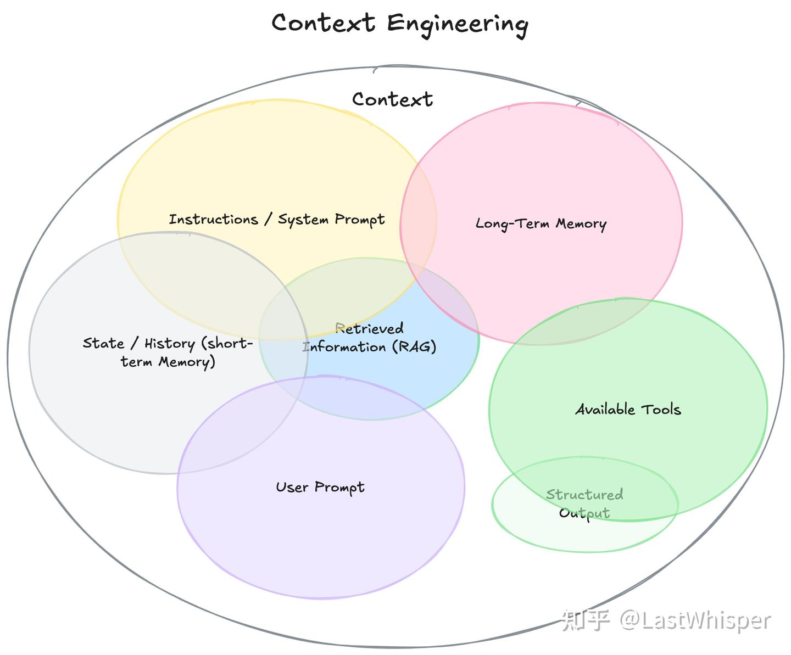
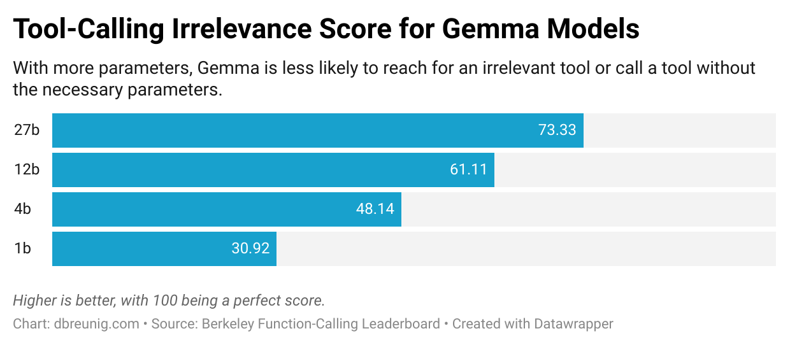
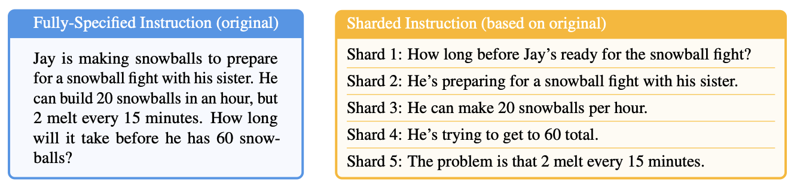
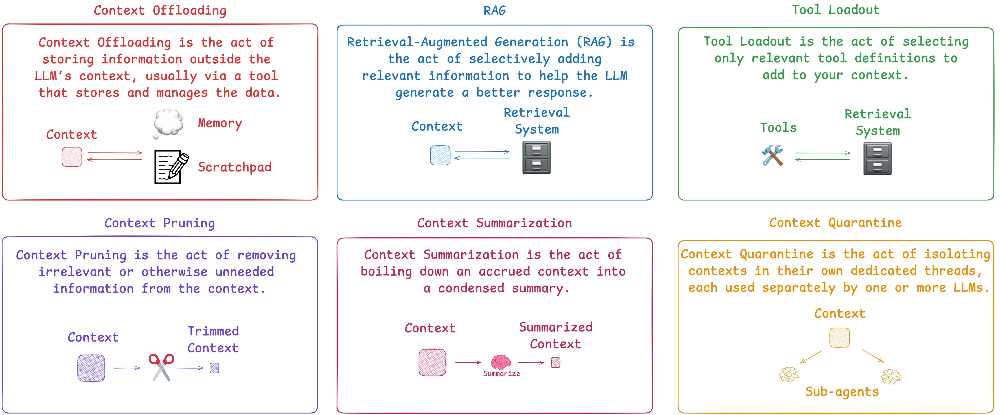

# 长文深度解析：大模型的"上下文陷阱"与6大修复技巧

> 资料来源：https://github.com/adongwanai/AgentGuide/blob/main/docs/02-tech-stack/14-context-engineering.md

## 引言

随着 GPT-4.5、Claude 4.5、Gemini 2.5 等大模型相继推出百万级上下文窗口，整个AI圈都沸腾了。很多人认为：只要上下文窗口够大，就可以把所有工具、文档、历史记录统统塞进去，让模型自己处理——这不就是我们梦寐以求的超级智能助手吗？

但现实远比想象残酷。

**更长的上下文不等于更好的响应。** 事实上，当上下文过载时，你的AI应用可能会以各种意想不到的方式崩溃：产生幻觉、重复过去的错误、调用无关的工具，甚至自相矛盾。

最近，LangChain 团队基于 Drew Breunig 的深度分析文章《How to Fix Your Context》，开源了一套完整的上下文工程（Context Engineering）实践方案。作为大模型算法工程师，我深入研究了这套方案，今天就来给大家详细拆解：

- **上下文为什么会失效？**
- **有哪6种修复技巧？**
- **如何在实际项目中应用？**

文章较长，建议收藏慢慢看。Let's dive in! 🚀

---

## 一、什么是上下文工程？

正如 Andrej Karpathy 所说，**上下文工程是一门精妙的艺术与科学——在上下文窗口中填充恰到好处的信息，以支持下一步的推理。**

听起来简单，但实际操作中，随着上下文的不断累积（工具调用、文档检索、多轮对话），上下文可能变得：
- **有毒**（poisoned）：错误信息反复被引用
- **分散注意力**（distracting）：模型过度关注历史而忽略训练知识
- **混乱**（confusing）：无关信息干扰决策
- **冲突**（clashing）：内部信息自相矛盾

下面这张图完美总结了上下文工程的核心技巧：



---

## 二、上下文的4种失效模式

在介绍解决方案之前，我们先要理解问题本质。Drew Breunig 总结了上下文失效的4种典型模式：

### 2.1 上下文中毒（Context Poisoning）

**定义**：当幻觉或错误进入上下文后，被模型反复引用和强化。

**案例**：DeepMind 团队在 Gemini 2.5 技术报告中提到，他们让 Gemini 玩宝可梦游戏时，模型偶尔会产生幻觉。一旦"目标"部分被污染（比如认为自己需要完成一个根本不存在的任务），智能体就会制定荒谬的策略，并不断重复无效行为。

**危害**：模型会执着于实现不可能的目标，陷入死循环。

### 2.2 上下文干扰（Context Distraction）

**定义**：上下文过长时，模型过度关注历史记录，忽略了训练时学到的知识。

**数据支持**：
- Gemini 2.5 Pro 虽然支持 100 万+ token 的上下文，但当上下文超过 10 万 token 时，就开始倾向于重复历史操作，而不是生成新策略
- Databricks 研究发现，Llama 3.1 405B 的正确率在 32k token 左右就开始下降，更小的模型下降得更早

**启示**：即使模型支持超长上下文，也不意味着应该全部填满。

### 2.3 上下文混淆（Context Confusion）

**定义**：上下文中的冗余内容被模型错误使用，导致低质量响应。

**典型场景**：MCP（Model Context Protocol）工具过载。

**实验证据**：
- Berkeley Function-Calling Leaderboard 显示，当提供多个工具时，**所有模型的表现都会下降**
- 一项研究发现，量化版 Llama 3.1 8B 在面对 46 个工具时失败，但只给 19 个工具时就成功了——即使上下文窗口还很充裕

**核心问题**：模型会试图使用上下文中的所有信息，即使它们与任务无关。



### 2.4 上下文冲突（Context Clash）

**定义**：上下文中累积的信息自相矛盾。

**重磅研究**：微软和 Salesforce 的联合团队做了一个实验：
- 把一个完整的提示词拆分成多轮对话
- 所有信息都相同，只是分阶段提供
- 结果：**平均性能下降 39%**
- 甚至 OpenAI 的 o3 模型得分从 98.1 暴跌到 64.1



**原因**：早期的错误回答会留在上下文中，影响后续推理。研究团队总结：
> "当 LLM 在对话中走错方向时，它们就会迷失并无法恢复。"

**对 Agent 的影响**：Agent 需要从文档、工具调用、子任务中收集上下文，这些来自不同来源的信息更容易产生冲突。

---

## 三、6大上下文修复技巧


了解了问题，现在来看解决方案。这6种技巧环环相扣，可以单独使用，也可以组合应用。

### 技巧1：RAG（检索增强生成）


**核心思想**：选择性地添加相关信息，而不是一股脑全塞进去。

**现状**：每当模型上下文窗口扩大，就有人喊"RAG 已死"。Llama 4 Scout 推出 1000 万 token 窗口时，这种声音尤其响亮。

**事实**：RAG 不仅没死，反而更重要了！

- 如果把上下文当作"杂物抽屉"，杂物会影响模型响应
- 即使有超大窗口，精准检索依然是提升质量的关键
- RAG 的本质是**信息管理**，而不是窗口大小问题

**实现要点**（基于 LangGraph）：
- 文档切块：使用 RecursiveCharacterTextSplitter
- 向量存储：OpenAI Embeddings
- 智能检索：先明确研究范围，再执行检索
- 性能：复杂查询约消耗 25k tokens（含工具调用）

**代码示例**：

```python
from langchain_community.document_loaders import WebBaseLoader
from langchain_text_splitters import RecursiveCharacterTextSplitter
from langchain_openai import OpenAIEmbeddings
from langchain_chroma import Chroma
from langchain.tools.retriever import create_retriever_tool

# 1. 加载并切分文档
loader = WebBaseLoader("https://lilianweng.github.io/posts/2023-06-23-agent/")
docs = loader.load()
text_splitter = RecursiveCharacterTextSplitter(chunk_size=1000, chunk_overlap=200)
documents = text_splitter.split_documents(docs)

# 2. 创建向量存储
embeddings = OpenAIEmbeddings()
vectorstore = Chroma.from_documents(documents, embeddings)
retriever = vectorstore.as_retriever(search_kwargs={"k": 5})

# 3. 封装为工具
retriever_tool = create_retriever_tool(
    retriever,
    "retrieve_blog_posts",
    "搜索并返回 Lilian Weng 关于 AI Agent 的博客文章片段"
)

# 4. 在 LangGraph 中使用
from langgraph.prebuilt import create_react_agent
from langchain_anthropic import ChatAnthropic

llm = ChatAnthropic(model="claude-sonnet-4-20250514")
agent = create_react_agent(llm, [retriever_tool])

# 执行查询
result = agent.invoke({
    "messages": [("user", "什么是 reward hacking？给我详细解释")]
})
```

**关键点**：模型会先调用检索工具获取相关文档片段，再基于这些片段生成答案，而不是把所有文档塞进上下文。

---

### 技巧2：工具装载（Tool Loadout）


**核心思想**：只加载与任务相关的工具定义。

**术语来源**："Loadout"是游戏术语，指开局前选择的技能、武器和装备组合——根据关卡、队友和自身能力量身定制。

**关键研究**：
- **RAG MCP 论文**：用向量数据库存储工具描述，根据提示词检索相关工具
- **测试发现**：对于 DeepSeek-v3，工具超过 30 个时，描述开始重叠造成混淆；超过 100 个几乎必然失败
- **效果**：动态选择少于 30 个工具，工具选择准确率提升 **3倍**

**"Less is More"研究**：
- 使用 LLM 驱动的工具推荐器，让模型先推理"需要哪些工具"
- 再通过语义搜索确定最终工具集
- Llama 3.1 8B 性能提升 **44%**
- 即使准确率不变，功耗降低 18%，速度提升 77%（边缘计算场景）

**实践建议**：
- 小型 Agent 手工精选少量工具即可
- 大型系统必须实现动态工具选择
- 边缘设备尤其要注意工具数量（功耗和速度）

**代码示例**：

```python
import math
from langchain_openai import OpenAIEmbeddings
from langchain_chroma import Chroma
from langchain.tools import tool

# 1. 定义工具池（以 math 库为例）
@tool
def add(a: float, b: float) -> float:
    """计算两个数的和"""
    return math.add(a, b)

@tool
def multiply(a: float, b: float) -> float:
    """计算两个数的乘积"""
    return math.multiply(a, b)

# ... 定义更多工具

all_tools = [add, multiply, ...]  # 假设有 50+ 个工具

# 2. 为每个工具创建描述和索引
tool_descriptions = [
    f"名称: {tool.name}\n描述: {tool.description}" 
    for tool in all_tools
]

embeddings = OpenAIEmbeddings()
vectorstore = Chroma.from_texts(tool_descriptions, embeddings)

# 3. 根据用户查询动态选择工具
def select_relevant_tools(query: str, top_k: int = 5):
    # 语义搜索最相关的工具
    docs = vectorstore.similarity_search(query, k=top_k)
    tool_indices = [int(doc.metadata['index']) for doc in docs]
    return [all_tools[i] for i in tool_indices]

# 4. 使用选定的工具
user_query = "我需要计算一些数学运算"
selected_tools = select_relevant_tools(user_query, top_k=5)

# 只绑定相关工具，避免上下文混淆
agent = create_react_agent(llm, selected_tools)
```

**关键点**：工具数量从 50+ 降到 5 个，上下文更清晰，工具选择准确率提升 3 倍，速度和功耗都大幅优化。

---

### 技巧3：上下文隔离（Context Quarantine）


**核心思想**：把任务拆分到独立的线程中，每个线程有自己的上下文。

**最佳案例**：Anthropic 的多智能体研究系统

Anthropic 团队在博客中详细介绍了他们的架构：
> "搜索的本质是压缩：从庞大语料库中提炼洞察。子智能体通过并行运行于各自的上下文窗口来促进压缩，同时探索问题的不同方面。"

**核心优势**：
- **关注点分离**：每个子智能体有专属工具、提示和探索路径
- **降低路径依赖**：独立调查，互不干扰
- **大幅提升性能**：Claude Opus 4（主智能体）+ Claude Sonnet 4（子智能体）的多智能体系统，比单智能体 Opus 4 性能提升 **90.2%**

**典型场景**：广度优先搜索

例如："找出标普 500 信息技术板块所有公司的董事会成员"
- 单智能体：缓慢的顺序搜索，容易失败
- 多智能体：拆解任务给子智能体，并行处理，成功率高

**实现要点**：
- 设计不同类型的智能体（研究型、计算型、分析型等）
- 每个智能体有专属工具集和提示词
- 主智能体负责任务分配和结果汇总
- 适合可并行化的问题

**局限**：不适合需要多智能体频繁共享上下文的场景。

**代码示例**：

```python
from langgraph.graph import StateGraph, MessagesState, START, END
from langgraph.prebuilt import create_react_agent
from langchain_anthropic import ChatAnthropic
from langchain.tools import tool

# 1. 定义专家智能体的工具
@tool
def multiply(a: float, b: float) -> float:
    """计算两个数的乘积"""
    return a * b

@tool
def add(a: float, b: float) -> float:
    """计算两个数的和"""
    return a + b

@tool
def web_search(query: str) -> str:
    """执行网页搜索"""
    # 实际实现会调用搜索 API
    return f"搜索结果: {query}"

# 2. 创建专家智能体（各自独立的上下文）
math_agent = create_react_agent(
    ChatAnthropic(model="claude-sonnet-4-20250514"),
    tools=[add, multiply],
    state_modifier="你是数学专家，专注于计算任务。"
)

research_agent = create_react_agent(
    ChatAnthropic(model="claude-sonnet-4-20250514"),
    tools=[web_search],
    state_modifier="你是研究专家，专注于信息搜索和分析。"
)

# 3. 创建 Supervisor 节点
def supervisor(state: MessagesState):
    """主智能体：路由任务到合适的专家"""
    llm = ChatAnthropic(model="claude-opus-4-20250514")
    
    system_prompt = """你是任务协调员。分析用户请求：
    - 如果涉及数学计算，调用 'math_expert'
    - 如果需要搜索信息，调用 'research_expert'
    - 如果任务完成，返回 'FINISH'
    """
    
    # 分析并路由
    response = llm.invoke([system_prompt] + state["messages"])
    return {"next": response.tool_calls[0]["name"] if response.tool_calls else "FINISH"}

# 4. 构建多智能体图
workflow = StateGraph(MessagesState)
workflow.add_node("supervisor", supervisor)
workflow.add_node("math_expert", math_agent)
workflow.add_node("research_expert", research_agent)

workflow.add_edge(START, "supervisor")
workflow.add_conditional_edges(
    "supervisor",
    lambda x: x["next"],
    {
        "math_expert": "math_expert",
        "research_expert": "research_expert",
        "FINISH": END
    }
)

app = workflow.compile()

# 5. 执行任务
result = app.invoke({
    "messages": [("user", "帮我搜索量子计算的最新进展，然后计算 123 * 456")]
})
```

**关键点**：每个专家智能体在独立的上下文中工作，互不干扰。Supervisor 负责任务分解和结果汇总，性能提升 90.2%。

---

### 技巧4：上下文修剪（Context Pruning）


**核心思想**：删除上下文中不相关或不必要的信息。

**应用场景**：Agent 在调用工具和收集文档时会不断积累上下文，定期修剪可以去除冗余。

**推荐工具**：Provence

Provence 是一个高效的问答系统上下文修剪器：
- **模型大小**：仅 1.75 GB
- **速度**：快速
- **准确性**：高
- **易用性**：几行代码搞定

**使用示例**：

```python
from transformers import AutoModel

provence = AutoModel.from_pretrained(
    "naver/provence-reranker-debertav3-v1", 
    trust_remote_code=True
)

# 读取维基百科条目
with open('alameda_wiki.md', 'r', encoding='utf-8') as f:
    alameda_wiki = f.read()

# 根据问题修剪文章
question = 'What are my options for leaving Alameda?'
provence_output = provence.process(question, alameda_wiki)
```

**效果**：可以删减 **95%** 的内容，只保留相关部分。

**架构建议**：
- 使用字典或结构化数据维护上下文
- 在每次 LLM 调用前组装成字符串
- 修剪时保护核心指令和目标
- 可选择性修剪文档或历史记录部分

**性能提升**：
- 某案例中，从 25k tokens（RAG）降至 **11k tokens**（RAG + 修剪）
- 答案质量不变

---

### 技巧5：上下文摘要（Context Summarization）


**核心思想**：将累积的上下文浓缩成简洁摘要。

**历史渊源**：最初是为了应对小上下文窗口而生——快到上限时，生成摘要并开启新对话。用户在 ChatGPT/Claude 中手动操作过。

**新发现**：即使窗口够大，摘要依然有价值！

回顾 Gemini 团队的发现：
> "当上下文超过 10 万 tokens 时，智能体倾向于重复历史操作，而非生成新策略。"

这就是**上下文干扰**的典型表现。

**实现难点**：
- **容易做，难做好**：关键在于判断哪些信息应该保留
- **需要细致调优**：针对特定 Agent 定制摘要策略
- **建议**：把摘要功能独立出来，作为专门的 LLM 驱动阶段，方便收集评估数据和优化

**模型选择**：
- 使用成本更低的模型（如 GPT-4o-mini）进行摘要
- 目标：压缩 50-70% 的长度，保留所有关键信息

**vs 修剪**：
- **修剪**：删除无关内容
- **摘要**：压缩所有信息（适合内容都相关但冗长的场景）

**代码示例**：

```python
from typing import TypedDict
from langgraph.graph import StateGraph, START, END
from langchain_openai import ChatOpenAI
from langchain_anthropic import ChatAnthropic

class AgentState(TypedDict):
    messages: list
    tool_results: str  # 工具调用的原始结果
    summary: str       # 摘要后的结果

def tool_call_node(state: AgentState):
    """模拟工具调用，返回长文本"""
    # 假设这是一个检索到的长文档
    long_document = """
    [此处是 5000 字的检索文档内容...]
    包含大量细节、案例、引用等信息...
    """
    return {"tool_results": long_document}

def summarize_node(state: AgentState):
    """摘要节点：压缩工具结果"""
    summarizer = ChatOpenAI(model="gpt-4o-mini")
    
    prompt = f"""请将以下内容压缩为简洁摘要，保留所有关键信息：

要求：
1. 压缩到原长度的 30-50%
2. 保留核心论点、关键数据和重要结论
3. 删除冗余描述和重复内容
4. 保持信息完整性

原文：
{state['tool_results']}

摘要："""
    
    response = summarizer.invoke(prompt)
    return {"summary": response.content}

def respond_node(state: AgentState):
    """基于摘要生成最终答案"""
    llm = ChatAnthropic(model="claude-sonnet-4-20250514")
    
    # 使用摘要而非原始长文档
    prompt = f"""基于以下摘要信息回答用户问题：

摘要：
{state['summary']}

用户问题：
{state['messages'][-1]['content']}
"""
    
    response = llm.invoke(prompt)
    return {"messages": state["messages"] + [{"role": "assistant", "content": response.content}]}

# 构建工作流
workflow = StateGraph(AgentState)
workflow.add_node("tool_call", tool_call_node)
workflow.add_node("summarize", summarize_node)
workflow.add_node("respond", respond_node)

workflow.add_edge(START, "tool_call")
workflow.add_edge("tool_call", "summarize")
workflow.add_edge("summarize", "respond")
workflow.add_edge("respond", END)

app = workflow.compile()

# 执行
result = app.invoke({
    "messages": [{"role": "user", "content": "解释一下强化学习中的 reward hacking"}]
})
```

**关键点**：通过摘要将 5000 字压缩到 1500-2500 字，上下文清晰，答案质量不变，成本降低 50-70%。

---

### 技巧6：上下文卸载（Context Offloading）


**核心思想**：把信息存储到 LLM 上下文之外，通常通过工具管理。

**个人最爱**：这是我最喜欢的技巧，因为它**简单到你不敢相信它有效**。

**Anthropic 的 "think" 工具**

Anthropic 发布了详细的技术博客，介绍他们的"think"工具（本质是一个草稿本）：

> "我们给 Claude 提供了一个额外的思考步骤——配有专属空间——作为得出最终答案的一部分……这在执行长工具调用链或多步骤对话时特别有用。"

**小吐槽**：这个工具应该叫 `scratchpad`（草稿本）更直观！一听就知道功能——让模型记笔记，不污染主上下文，且便于后续参考。"think"这个名字容易和"扩展思考"混淆，还不必要地拟人化了……

**效果**：
- 配合领域特定提示词，性能提升高达 **54%**

**三大适用场景**：

1. **工具输出分析**：需要仔细处理工具调用结果，可能需要回溯
2. **政策密集环境**：需要遵循详细指南并验证合规性
3. **顺序决策**：每个动作建立在前一个基础上，错误代价高（多步骤任务）

**两种存储模式**（LangGraph 实现）：

**模式1：会话草稿本**
- 临时存储，仅在单次对话中有效
- 工具：`WriteToScratchpad`、`ReadFromScratchpad`
- 适合：单次任务的中间结果

**模式2：持久化内存**
- 使用 `InMemoryStore` 跨线程存储
- 支持命名空间的键值对
- 适合：需要跨多次会话访问的研究成果、用户偏好等

**类比**：类似 ChatGPT 的"记忆"功能和 Anthropic 多智能体研究系统的知识积累机制。

这个 “上下文卸载” 核心超好懂 ——**不给 LLM 的 “临时内存”（上下文窗口）添负担，把中间信息、关键数据放到专门的 “草稿本 / 数据库” 里，需要时再调取**，本质是 “减负 + 精准存用信息”。

1. 先搞懂：为什么需要 “卸载”？

LLM 的上下文窗口就像你的 “短时记忆”—— 容量有限（比如只能记住几千 / 几万字），如果把所有中间步骤、工具输出、政策条款都堆进去，会出现两个问题：

- 信息拥挤：关键内容被淹没，LLM 记混、遗漏重要细节；
- 效率下降：模型要花大量精力筛选信息，多步骤任务容易出错。
    
    而 “卸载” 就是把这些非即时核心的信息，移到专门的 “外部存储”，让 LLM 只聚焦当前最该处理的事。

2. 两种存储模式：对应不同需求

- **会话草稿本**：相当于你做题时用的 “草稿纸”
    
    只在当前对话里生效，对话结束就清空。
    
    比如用工具查数据后，把原始结果写到草稿本，LLM 不用记住完整数据，后续需要分析时再读草稿本就行，不占主上下文空间。
- **持久化内存**：相当于你的 “笔记本”
    
    跨对话、跨线程都能访问，数据长期保存。
    
    比如用户说过 “我过敏芒果”，把这个偏好存到持久化内存，下次不管隔多久聊天，LLM 都能调取，不用用户重复说。
3. 什么时候用最香？（对应三大场景）

- 处理工具输出时：比如用代码查了一堆数据，不用把所有数据都贴进上下文，只存关键结果到草稿本，LLM 专注分析；
- 要守很多规则时：比如合规政策有几百条，不用全塞给 LLM，把核心条款存起来，需要验证时调取，避免遗漏；
- 多步骤任务时：比如 “查资料→分析→生成报告”，每一步的结果存到草稿本，后续步骤能回溯，错了也能针对性修正，不用从头再来。

 4. 核心价值：简单却高效

为什么说 “简单到不敢信有效”？因为它没搞复杂技术，只是 “分了个存储位置”，但解决了 LLM 的核心痛点 —— 上下文拥挤。配合领域提示词后性能提升 54%，就是因为 LLM 能更专注于 “思考”，而不是 “记东西”。

类比一下：就像你工作时，不会把所有文件、笔记都堆在桌面（对应上下文窗口），而是把暂时不用的放进 “草稿文件夹”（会话草稿本），常用的放进 “我的文档”（持久化内存），桌面只留当前要处理的文件 —— 效率自然翻倍。


**代码示例**：

```python
from typing import TypedDict
from langgraph.graph import StateGraph, START, END
from langgraph.store.memory import InMemoryStore
from langchain_anthropic import ChatAnthropic
from langchain.tools import tool

# 1. 定义带草稿本的状态
class AgentState(TypedDict):
    messages: list
    scratchpad: str  # 草稿本，存储中间思考

# 2. 定义草稿本工具
@tool
def write_to_scratchpad(content: str) -> str:
    """将内容写入草稿本"""
    return f"已记录: {content}"

@tool
def read_from_scratchpad() -> str:
    """从草稿本读取内容"""
    return "草稿本内容: [之前记录的信息]"

# 3. 创建智能体节点
def agent_node(state: AgentState):
    llm = ChatAnthropic(model="claude-sonnet-4-20250514")
    
    system_prompt = """你有一个草稿本工具可以使用：
    - write_to_scratchpad: 记录中间思考、计划、发现
    - read_from_scratchpad: 查看之前记录的内容
    
    对于复杂任务：
    1. 先将问题分解写入草稿本
    2. 执行步骤时记录进度
    3. 需要时读取之前的记录
    
    这样主上下文保持简洁，重要信息不会丢失。"""
    
    tools = [write_to_scratchpad, read_from_scratchpad]
    agent = create_react_agent(llm, tools, state_modifier=system_prompt)
    
    return agent.invoke(state)

# 4. 持久化内存存储（跨会话）
store = InMemoryStore()

def save_to_memory(user_id: str, key: str, value: str):
    """保存到持久化内存"""
    namespace = ("users", user_id)
    store.put(namespace, key, {"content": value})

def load_from_memory(user_id: str, key: str) -> str:
    """从持久化内存读取"""
    namespace = ("users", user_id)
    item = store.get(namespace, key)
    return item.value["content"] if item else None

# 5. 使用示例
workflow = StateGraph(AgentState)
workflow.add_node("agent", agent_node)
workflow.add_edge(START, "agent")
workflow.add_edge("agent", END)

app = workflow.compile()

# 会话1：研究任务
result1 = app.invoke({
    "messages": [("user", "帮我研究量子计算的最新进展，这是个多步骤任务")]
})

# 智能体会使用草稿本记录：
# - 研究计划
# - 已搜索的关键词
# - 重要发现
# - 待深入的方向

# 会话2：继续研究（跨会话记忆）
save_to_memory("user123", "quantum_research", "上次研究了量子纠缠和量子门")

previous_work = load_from_memory("user123", "quantum_research")
result2 = app.invoke({
    "messages": [("user", f"继续上次的研究。上次内容：{previous_work}")]
})
```

**关键点**：
- 草稿本让主上下文保持简洁，性能提升 54%
- 持久化内存支持跨会话知识积累
- 适合多步骤任务和长期研究项目

---

## 四、LangGraph 实战：完整实现

LangGraph 是一个低级编排框架，非常适合实现上述技巧。核心概念：

- **Nodes（节点）**：处理步骤，接收状态并返回更新
- **Edges（边）**：连接节点，创建执行流（线性、条件或循环）
- **State（状态）**：节点间共享的"草稿本"

官方仓库提供了6个 Jupyter Notebook，每个对应一种技巧：

### Notebook 1: RAG
- 使用 Lilian Weng 的博客构建检索工具
- Claude Sonnet 作为主模型
- 系统提示引导模型先明确研究范围
- 25k tokens（复杂查询）

### Notebook 2: Tool Loadout
- Python math 库的所有函数作为工具池
- 向量数据库索引工具描述
- 动态绑定前5个最相关工具
- 避免工具描述重叠导致的混淆

### Notebook 3: Context Quarantine
- Supervisor 多智能体架构
- 数学专家智能体（加法/乘法工具）
- 研究专家智能体（网页搜索工具）
- 基于任务类型的智能路由

### Notebook 4: Context Pruning
- 扩展 RAG Agent，增加修剪步骤
- GPT-4o-mini 作为修剪模型（降低成本）
- 基于用户原始请求修剪文档
- 从 25k tokens → **11k tokens**

### Notebook 5: Context Summarization
- 在 RAG Agent 基础上增加摘要步骤
- GPT-4o-mini 进行摘要（成本优化）
- 目标：压缩 50-70%，保留关键信息
- 适合所有内容都相关但冗长的场景

### Notebook 6: Context Offloading
- 两种模式：会话草稿本 + 持久化内存
- `InMemoryStore` 实现跨会话存储
- 命名空间管理不同类型的记忆
- 支持研究型工作流的知识积累

**仓库地址**：[langchain-ai/how_to_fix_your_context](https://github.com/langchain-ai/how_to_fix_your_context)

**Star数**：452（截至发文）

---

## 五、关键洞察与实践建议

### 核心认知：上下文不是免费的

这是所有技巧的底层逻辑：

> **上下文中的每个 token 都会影响模型行为，不管好坏。**

百万级上下文窗口确实强大，但绝不是"信息管理马虎"的借口。

### 编程 LLM = 上下文管理

Karpathy 的金句：
> "上下文工程是编程 LLM，让它'恰到好处地打包上下文窗口'。"

巧妙部署工具、信息和定期维护，才是 Agent 设计师的核心工作。

### 选择合适的技巧组合

| 问题 | 推荐技巧 |
|------|---------|
| 文档太多 | RAG + 修剪/摘要 |
| 工具过载 | 工具装载 |
| 任务可并行 | 上下文隔离 |
| 长期对话 | 摘要 + 卸载 |
| 多来源冲突 | 隔离 + 修剪 |
| 历史记录膨胀 | 卸载 |

### 评估检查清单

在构建或优化 Agent 时，问自己：

1. ✅ 上下文中的每条信息都"物有所值"吗？
2. ✅ 有没有无关的工具定义？
3. ✅ 历史记录是否过长？
4. ✅ 是否有内部矛盾的信息？
5. ✅ 能否拆分成独立子任务？
6. ✅ 是否需要跨会话记忆？

---

## 六、总结

百万级上下文窗口带来了无限可能，但也引入了新的失效模式。作为大模型工程师，我们需要：

**理解4种失效模式**：
- 🧪 上下文中毒：幻觉被反复引用
- 🎯 上下文干扰：过度依赖历史
- 🌀 上下文混淆：无关信息干扰
- ⚔️ 上下文冲突：信息自相矛盾

**掌握6大修复技巧**：
1. 📚 **RAG**：精准检索相关信息
2. 🎮 **工具装载**：动态选择必要工具
3. 🔒 **上下文隔离**：独立线程并行处理
4. ✂️ **上下文修剪**：删除无关内容
5. 📝 **上下文摘要**：压缩冗长信息
6. 💾 **上下文卸载**：外部存储管理

**建立核心理念**：
> 上下文不是免费的。上下文管理是 Agent 设计的核心工作。

现在，去检查你的 Agent 吧——上下文中的每个 token 都"配得上"它的位置吗？

如果没有，你已经知道该怎么做了。🎯

---

## 参考资料

1. Drew Breunig - [How to Fix Your Context](https://www.dbreunig.com/2025/06/26/how-to-fix-your-context.html)
2. Drew Breunig - [How Contexts Fail and How to Fix Them](https://www.dbreunig.com/2025/06/22/how-contexts-fail-and-how-to-fix-them.html)
3. LangChain - [how_to_fix_your_context GitHub](https://github.com/langchain-ai/how_to_fix_your_context)
4. Chroma - [Context Rot Report](https://research.trychroma.com/context-rot)
5. Google DeepMind - [Gemini 2.5 Technical Report](https://storage.googleapis.com/deepmind-media/gemini/gemini_v2_5_report.pdf)
6. Berkeley - [Function-Calling Leaderboard](https://gorilla.cs.berkeley.edu/leaderboard.html)
7. Anthropic - [Multi-Agent Research System](https://www.anthropic.com/engineering/built-multi-agent-research-system)
8. Anthropic - [Claude Think Tool](https://www.anthropic.com/engineering/claude-think-tool)

---