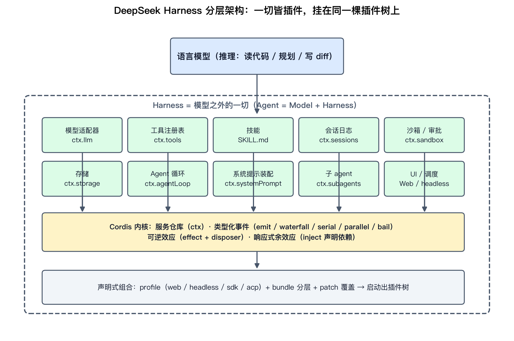
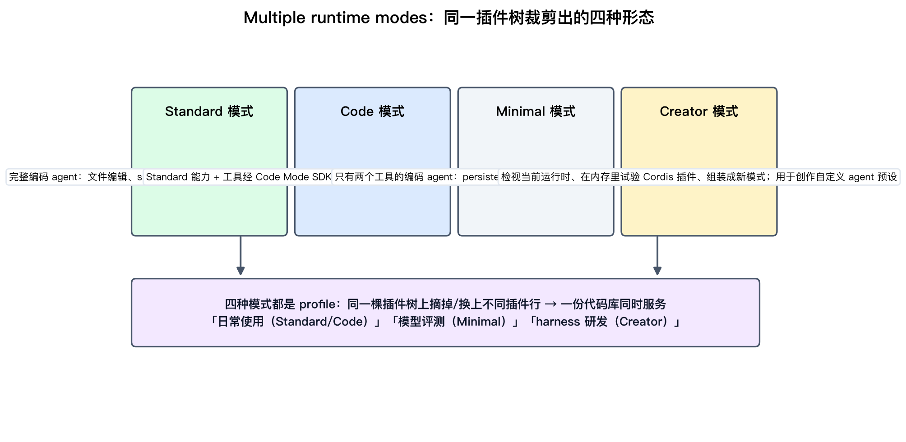
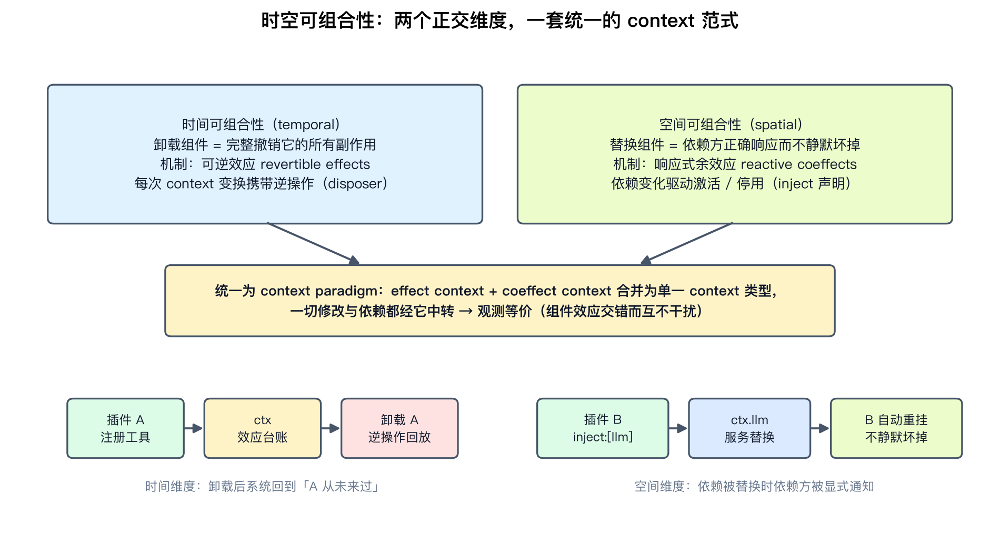
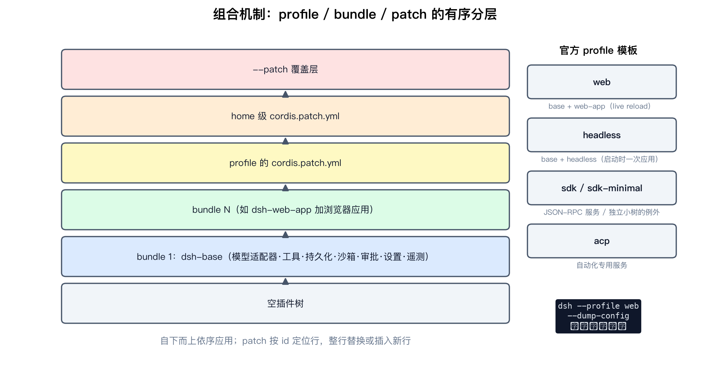
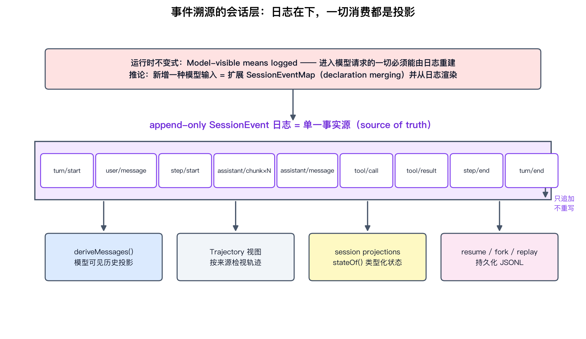
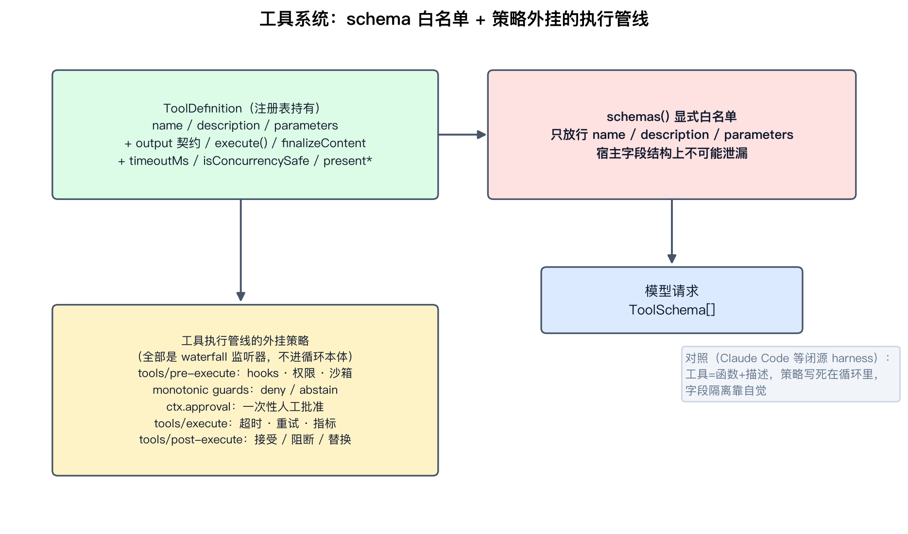
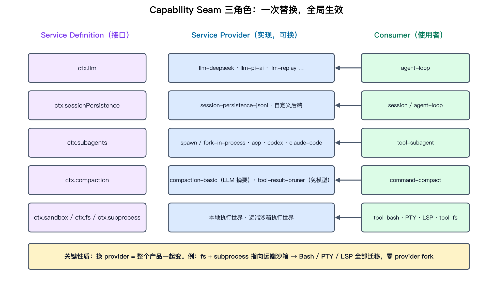

# DeepSeek Harness 原理：把「模型之外的一切」做成可证明、可热替换的插件系统

资料来源（按可信度排序）：

- 一手：GitHub 仓库 [deepseek-ai/deepseek-harness](https://github.com/deepseek-ai/deepseek-harness)（README、`docs/architecture.md`、`docs/cordis-primer.md`、session / core / tools / llm-streaming / system-prompt / subagent / persistence / compaction 等 subsystem 文档）、官方产品页 [deepseek.com/harness](https://deepseek.com/harness/en/)
- 论文：Shi / Zhang / Cui, [A Programming Paradigm for Spatiotemporal Composability](https://arxiv.org/abs/2608.25512)（arXiv:2608.25512，92 页，2026-08-26）
- 社区：[Hacker News 747 分发布帖](https://news.ycombinator.com/item?id=49285244) 及后续讨论、[Pi vs DeepSeek Harness 对照评测](https://github.com/promptdriven/pdd/blob/main/research/omlx-qwen38-pi-deepseek-harness-2026-08-23/README.md)（2026-08-23，16 次运行）、[deepseekharness.io](https://deepseekharness.io/zh/what-is-deepseek-harness)（非官方整理站，仅用于核对时间线）、VentureBeat / The Next Web 发布报道

## 阅读目标

2026 年 8 月 13 日，DeepSeek 以 MIT 协议开源了自己的 Agent harness——DeepSeek Harness（CLI 名 `dsh`），同一天发布 V4-Pro API，并随附一篇 92 页的编程语言论文。Hacker News 发布帖拿到 747 分、314 条评论，是当月最热的开发者工具新闻之一。

这篇文档不复述新闻，而是深入回答四个工程问题：

1. 「Everything is a Plugin」落到代码里到底是什么结构？为什么没有特权内核系统还不塌？
2. dsh 的会话日志、Agent 循环、工具管线是怎么组织的？和 Claude Code 那类闭源 harness 有什么**结构性**差异？
3. 附带的「时空可组合性」论文到底证明了什么？它和「自我演化 Agent harness」的关系是什么？
4. 这些设计里，哪些是自研 agent / 内部 harness 可以直接抄走的？

核心结论先给：**dsh = Cordis 组合机制 + 一切皆插件的 harness 本体 + 事件溯源的会话层。** Cordis 用「可逆效应 + 响应式余效应」保证插件可以安全地热加载、热卸载、热替换（论文级形式化背书）；harness 本体把模型、工具、会话、沙箱、Agent 循环、UI 全部做成经过同一套机制的插件；会话层用 append-only 事件日志做单一事实源，模型历史只是日志的投影。

## 名词解释

| 名词 | 解释 | 简单例子 |
|---|---|---|
| Harness | 包裹模型、把模型输出变成行动的全部代码与配置。「不是模型的，都是 harness」。 | 工具、会话、沙箱、权限、Agent 循环。 |
| Plugin | dsh 里一切能力的存在形态：实现 Service 接口、挂到共享 context 上的对象。 | 模型适配器、文件工具、Web UI 各自都是插件。 |
| Cordis | dsh 底层的元框架，源自聊天机器人框架 Koishi 的底层架构，Cordiverse 组织维护。 | 类似「插件系统的操作系统」。 |
| Context（`ctx`） | Cordis 的服务仓库：服务认领稳定的 `ctx.<key>`，插件按 key 找服务而不是 import 具体实现。 | `ctx.tools`、`ctx.llm`、`ctx.sessions`。 |
| inject | 插件声明依赖的方式；声明后框架等服务就绪再激活该插件。 | `inject: ['sessions']` → 启动顺序自动解析。 |
| 可逆效应（revertible effect） | 每次对共享环境的修改都携带一个逆操作（disposer），由运行时持有。 | 注册工具 → 卸载时自动反注册。 |
| 响应式余效应（reactive coeffect） | 组件声明对环境的需求；环境变化被分类为「激活/停用/无关」来驱动组件生命周期。 | `ctx.llm` 被替换 → 依赖它的插件自动重挂。 |
| 时空可组合性 | 时间维度=卸载无残留；空间维度=替换组件不静默弄坏依赖方。 | 热替换模型插件，会话插件无感知。 |
| Profile / Bundle | profile 是一份命名的插件组合；bundle 是「配置行 + 代码」的分发格式。 | `web`、`headless`、`sdk`、`acp` 是官方 profile。 |
| Turn / Step | step = 一次模型请求 + 它触发的工具调用；turn = 零或多个 step。 | 用户一条消息开一个 turn，里面可能跑 5 个 step。 |
| Seam（能力接缝） | 可替换能力的三角色设计：Service Definition、Service Provider、Consumer。 | 换执行世界 provider，Bash/PTY/LSP 一起迁到远端沙箱。 |
| SessionEvent | 追加式会话日志里的事件；模型可见历史从日志投影而来。 | `turn/start`、`assistant/chunk`、`tool/result`。 |
| Waterfall | Cordis 的 around-middleware 事件模式：监听器拿 `next()` 决定委托还是短路。 | 审批插件在 `tools/execute` 上短路危险命令。 |
| PTC / Code Mode | Programmatic Tool Calling：模型写一段 TypeScript 程序编排多轮工具调用。 | 模型一次写代码完成「读文件→改→跑测试」。 |

## 1. 背景：模型厂商为什么把 harness 做成独立产品

先钉住定位公式（与本仓库 [Harness Engineering](../harness-engineering/harness-engineering.md) 一篇的共识一致）：

> Agent = Model + Harness。模型只会回答，Agent 会行动，差的那部分就是 harness。

几个发布事实解释了 dsh 的设计取向：

- **2026-08-13 以 v0.1 开发者预览版发布**，MIT 协议。官方警告原话是「THERE WILL BE COMPATIBILITY-BREAKING CHANGES」，迭代确实凶猛：rc.7→rc.8 两天 536 个提交，0.1.1-rc.2→0.1.2-alpha.1 一次 1079 个。
- **与 DeepSeek V4-Pro 的 API 上线同日发布**。VentureBeat 把它定位为「Claude Code 的开源对手」；AlphaSignal 指出更关键的一点：**这是 DeepSeek 用来评测和训练自家模型的那套 Agent 框架**——HN 讨论里也有人注意到「DeepSeek V4 模型是在 DSH 上做过后训练（post-trained）的」。第一方 harness 配第一方模型，这不是巧合而是方法论：harness 是模型能力被放大的环境。
- **官方产品页的两句设计纲领**值得原文引用：

> Everything is a plugin. Every run is traceable.

  前半句对应 Cordis 组合机制，后半句对应事件溯源会话层——这两条正是本文第 3 章和第 6 章的主题。

**工程含义**：一个模型厂商把评测框架开源，等于把「模型能力如何被 harness 放大」摆到台面上。对使用方是双向的——你可以读它怎么评测模型，也可以把自己的模型接进同一套环境。

## 2. 总架构：没有特权内核的插件树

大多数 Agent 框架有一个特权内核，扩展点是后拧上去的。dsh 把这个模式倒过来：**没有需要打补丁的特权内核**。模型、工具、技能、会话、沙箱、存储、Agent 循环、调度、UI——每一项能力都是插件，可以在配置里选择、替换或扩展，不用改 dsh 源码。



上图是 dsh 的整体结构：模型在最上，harness 是包裹它的一圈插件，所有插件都挂在 Cordis 内核提供的服务仓库（`ctx`）上，最底下是声明式的 profile/bundle/patch 组合层。官方 monorepo 结构直接反映这一点：`apps/` 放 CLI 和 Web 应用，`packages/` 放 core、llm、mcp、sandbox、context、plan、goal 等几十个可组合部件，`vendor/` 放 vendored 的 Cordis，`python/` 放 Python SDK（其 runtime wheel 内部仍是打包的 `dsh` CLI）。

「无特权内核」的兑现方式是：**官方插件和你的第三方插件走同一套组合机制**。扩展 dsh 意味着把插件挂到其他插件旁边，而不是 fork 整个项目。HN 上有用户把它比喻成「主板 + 可换 CPU」——DeepSeek 模型是默认发货的那颗处理器，但插槽是通用的。

官方产品页还给出一个容易被忽略的维度：**同一份代码库通过裁剪插件树得到四种 runtime mode**。



| 模式 | 裁剪取向 | 典型用途 |
|---|---|---|
| Standard | 完整工具集：文件编辑、shell、搜索、技能、规划、目标、子 agent、工作流 | 日常编码 agent |
| Code | Standard 能力 + 工具经 Code Mode SDK 暴露，模型在一个 TypeScript 程序里组合多步操作（PTC） | 减少工具往返、复杂编排 |
| Minimal | 只有两个工具：persistent bash + str_replace_editor | 最小环境下的模型基准评测 |
| Creator | Standard + 运行时检视 + 内存里试验插件 + 预设创作指导 | 制作自定义 agent 预设 |

「Minimal 模式用于 benchmarking models in a minimal environment」这一句再次印证 dsh 的评测基因：它把自己设计成可以「给模型换 harness 变量」的实验台。

## 3. 地基：Cordis 的五个核心概念

dsh 的插件机制不是自研新轮子，而是建立在 Cordis 之上——一个早已存在的开源社区框架，最初是聊天机器人框架 Koishi 的底层架构，后来独立成项目（Cordiverse 组织，约 26 个仓库）。DeepSeek 采用并背书了一个现成框架，而不是自己造一个——对一家前沿实验室来说，这是个少见且相当谦逊的选择。

按官方 primer，Cordis 可以压缩成五个概念：

**① 插件就是实现 Service 的对象。** 可以是带 `inject` 和 `apply(ctx)` 字段的函数，也可以是 `Service` 子类，生命周期由 Cordis 挂载。

**② Context 是服务仓库。** 服务在 context 上认领稳定的 key（`ctx.tools`、`ctx.llm`、`ctx.sessions`），其他插件按 key 找服务，而不是 import 具体实现。

**③ 用 inject 声明依赖。** 声明了所需服务的插件会等服务就绪再激活，加载顺序通过服务依赖表达，而不是手工编排启动序列。

**④ Typed Events 做通信，派发模式是契约的一部分。** 五种模式各有明确语义：

| 模式 | 等待？ | 语义 | 典型用途 |
|---|---|---|---|
| `emit` | 否 | 监听器按注册顺序观察，无返回值 | 广播事实（如 `session/event`） |
| `waterfall` | 否 | around-middleware，监听器拿 `next()` 决定委托或短路 | 拦截与改写（`agent/pre-step`、`tools/execute`） |
| `parallel` | 是 | 全部监听器并行观察 | 并行扇出 |
| `serial` | 是 | 按注册顺序依次执行 | 有顺序要求的处理（`agent/turn-stopping`） |
| `bail` | 否 | 按顺序执行，直到有人 bail 出结果 | 首个可用结果获胜 |

**⑤ 注册是可逆效应（reversible effects）。** 提示词段落、工具 schema、适配器、监听器都通过 `ctx.effect()` 或 `ctx.on()` 安装，返回 disposer；reload 和 teardown 会可预期地反卷（unwind）这些注册。官方实践规则写得很直白：**每个注册都应该有 disposer**；拆解顺序重要时，把相关工作放在同一个 effect 里，让反卷按预期顺序发生。

waterfall 语义值得单独记住：监听器收到 `(...args, next)`，调 `next()` 把（可能被包装过的）结果委托给下一个服务；不调 `next()` 就是短路。协作型监听器通常改写共享的请求/决策对象再委托；**单决策事件里短路是设计意图**——策略监听器拥有决策权时直接返回，只观察的监听器必须委托。

## 4. 理论：时空可组合性论文证明了什么

「一切都是插件」立刻带来质疑：插件各自独立编写，运行时还能加载、卸载、替换，系统凭什么不塌成一锅意大利面？dsh 随附的论文（arXiv:2608.25512，92 页；作者 Yifan Shi（北大/DeepSeek-AI）、Wei Zhang（北大）、Tianyi Cui（DeepSeek-AI））就是对这个质疑的形式化回答。



论文把问题拆成两个**正交维度**，并各自给出机制：

| 维度 | 要解决的问题 | 形式化机制 | 静态情形下的对应物 |
|---|---|---|---|
| 时间可组合性（temporal） | 组件卸载时，它对共享环境做的每处修改必须被完整、安全地撤销 | 可逆效应：每次 context 变换携带显式逆操作，由运行时持有；跟踪与恢复都保持复合性 | 词法作用域 / RAII / bracket 模式 |
| 空间可组合性（spatial） | 组件依赖必须被声明、发现、可验证地解析；替换不能静默弄坏依赖方 | 响应式余效应：context 每次变化按组件的 coeffect 规格分类为「激活/停用/无关」，驱动生命周期 | 模块 import 解析 |

**动机部分用 VSCode 做了反面教材**，很有说服力：VSCode 的 extension host 无法在运行时卸载单个插件的代码（top 100 插件里 87 个含可执行代码，禁用它们必须重启整个宿主）；`deactivate` 钩子只是宿主退出前的优雅关闭回调，而且把「销毁」和「创建」分离在两个函数里，违反局部性，难以验证清理是否完整。空间维度上，`extensionDependencies` 在 top 100 里只有 7 个插件声明，`getExtension(...).exports` 返回的还是无类型的 `any`——插件系统普遍在这两个维度上都有缺陷，只是程度不同。

论文的关键动作是**把经典的 effect / coeffect 概念从编译期提升到运行时**：

1. **可逆效应（§3.1）**：建立局部的时间可组合性。
2. **响应式余效应（§3.2）**：建立局部的空间可组合性。
3. **Context paradigm（§3.3）**：把 effect context 和 coeffect context 统一成单一 context 类型，一切 effect / coeffect 都经它中转。中转引出**观测等价（observational equivalence）**——不同组件的效应可以交错发生而互不干扰。
4. **动态组合演算（§4）**：把两个机制组装成「组件」概念并给出操作语义；元定理把单组件的时空可组合性推广到整个交错组件系统。
5. **Cordis 实现（§5）**：核心库（effect 跟踪 + coeffect 解析）+ 声明式组件加载器（配置调和 + 热模块替换）。

两个定位判断：

1. **这是一篇 PL 论文，不是模型论文也不是评测论文。** 它形式化的是已在公开演进的社区框架（Cordis）的设计。HN 上有人调侃「spatiotemporal composability」听起来像广义相对论，实质接近「插件的自动垃圾回收」——作为时间维度的一句话总结倒也准确。但把它做成形式化证明而不是约定俗成，好处是：**保证是被证明的，不是被承诺的**——只要插件遵循这套模型，清理与替换在构造上就是安全的。
2. **它被视为自我演化 harness 的地基。** 论文 1.2.2 节明确把「self-evolving agent harnesses」列为核心动机：一个能在服务请求的同时生成并部署自身组件修改的 harness，每次修改都是一次动态组合。没有时间可组合性，每次自我修改都要全量重启、丢失进程内状态，「一次错误的自我修改甚至可能让负责恢复的那个进程本身瘫痪」。社区评论（cedric_chee）把 dsh 描述为「通往自我演化 Agent harness 的形式化基础——让 Agent 能够安全、动态地修改自己的运行时」。这与本仓库 [Harness Engineering](../harness-engineering/harness-engineering.md) 里 Self-Harness 的「提议—评估—接受」闭环互补：那篇解决「怎么安全地决定**改什么**」，这篇解决「**改本身**为什么可以安全」。

**边界提醒**：理论保证只对「遵循这套模型的插件」成立——在插件里直接改全局状态、绕过 `ctx.effect()` 的副作用不在保护范围内。使用 dsh 也完全不需要懂这套理论，它的价值在写插件和理解系统行为时才显现。

## 5. 组合机制：Profile、Bundle 与 Patch 分层

一个运行中的 `dsh` 是启动时从**有序分层**组合出来的插件树：



- **Profile**：存在 Harness home 里的命名组合。列出叠加的 bundle、安装的树外插件、以及用户自己的 `cordis.patch.yml`。官方随附 `web`、`headless`、`sdk`、`sdk-minimal`、`acp` 五个模板。
- **Bundle**：Cordis 配置行 + 所挂载代码的分发格式，保证它插入的任何东西仍能被上层 patch。每个 profile/bundle 在自己的 `package.json` 的 `dsh` 字段里声明（`dsh.profile` 列 bundle，`dsh.bundle` 指向 patch 文件）。
- **分层顺序**：空树 ← 各 bundle（按 profile 列出顺序）← profile 的 `cordis.patch.yml` ← home 级 patch ← `--patch` 覆盖层。patch 按 id 定位某一行，整行替换或插入新行。

现成的分层分工：`dsh-base` 是 `web`/`headless`/`sdk`/`acp` 共享的首层（模型适配器、工具、持久化、沙箱与审批策略、设置、凭据、遥测）；`dsh-web-app` 加浏览器应用；`dsh-headless` 加一次性 runner；`dsh-sdk-app` 加 SDK JSON-RPC 服务；`dsh-acp-app` 加自动化 ACP 服务；`dsh-sdk-minimal` 是刻意的例外——一个 bundle 拥有完整显式的 SDK 树，不应用 `dsh-base`。

**reload 语义的取舍**值得抄：自定义 profile 和 `web` profile 默认 live patch reload；而 `headless`/`sdk`/`sdk-minimal`/`acp` 在启动时一次性应用所有层——因为一次性或 stdio 应用「拥有工作之后再换依赖」会使其生命周期失效。这是「组合灵活性」与「生命周期完整性」之间的清醒取舍。

想看你机器实际启动出来的树：

```bash
dsh --profile web --dump-config
```

它打印的任意一行，都可以用你自己的 patch 替换。

## 6. 运行核心：事件溯源的会话日志

dsh 的会话层是标准的事件溯源（event sourcing）设计，这是整个 harness 最「工程硬核」的部分，也是官方设计纲领后半句「Every run is traceable」的实现。



**核心原则：append-only 的 `SessionEvent` 日志是单一事实源。** 模型消息历史是从日志**投影**（`deriveMessages()`）出来的，从不单独存储；重放就是从同样的事件重新推导。官方产品页的描述是：「Everything the model sees is recorded in an append-only session log: system prompts, reasoning, tool calls and results, subagent scheduling, and every context injection. In the Trajectory view, you can inspect these records by source. Resume, fork, search, and replay all operate on the same event stream.」

**关键不变式：Model-visible means logged。** 任何进入模型请求的内容，都必须能由日志重建，运行时有断言检查。推论很直接：**想给模型看一种新输入，就必须先定义一种新的会话事件**（扩展 `SessionEventMap` 并从日志渲染），不允许绕过日志直接往请求里塞东西。

**事件词汇是可扩展的。** `SessionEventMap` 通过 TypeScript declaration merging 开放扩展——例如 compaction seam 增加 `compaction/start | summary | end`，hook 协议增加 `hook/invoked | hook/result`。核心事件族：

| 事件 | 语义 |
|---|---|
| `turn/start` / `turn/end` | 开/关一个 turn；没有进入 step 的 turn 也会被记录（拒绝、空输入、取消都留痕） |
| `step/start` / `step/end` | 一次模型调用 + 它请求的工具执行 |
| `user/message` | 模型可见的用户角色消息（真人输入、`agent.inject()` 注入的上下文、goal 续轮，靠 `source` 区分） |
| `assistant/chunk` / `assistant/message` | 原始流式块（token 级保真重放）/ 组装后的助手消息（派生历史用它，携带 usage 与 `sourceEventSeqs`） |

日志之上还有**投影接缝**：`dsh-session-projection` 持有 `ctx.sessionProjections`，注册的投影单元对已提交事件做增量折叠，宿主消费者用 `stateOf()` 读一份类型化状态，用 `snapshot()` 批量出裁剪后的客户端视图。Agent 循环自己注册的 `turnBoundary` 共享状态就走这条路。

**持久化是另一条 seam**：`ctx.sessionPersistence` 暴露 `create/open/stat/list`，`create`/`open` 返回 per-session 的 `SessionHandle`（`read/append/flush/close`），携带所有日志访问与单写者所有权。官方实现是 JSONL 后端。`flush()` 是唯一的持久性屏障（durability barrier）——只有它承诺「崩溃后还在」；`append` 解决只是「已接受、有序、本后端实例可见」。写句柄的第二个 `open(id, 'write')` 会以 `SessionAlreadyOwnedError` 拒绝。

**工程含义**：这条设计和 [12-Factor Agents](../12-factor-agents/12-factor-agents-principles.md) 的「own your context window / unify execution state」完全同构——状态可重放、可审计、可 fork。「会话历史是一堆可读的事件，而不是一段不断变长的对话。」

## 7. Agent 循环：turn/step、inbox 与所有权

循环骨架（来自官方 architecture 文档的 turn flow，配合 §8 的工具管线图看）：

```text
turn/start
  claim 下一步输入 + 一条排队消息
  装配提示词段落 + 工具 schema
  -> agent/pre-step                   reject | enter(messages, startsRequestSeries?)
     拒绝、或首个 enter 被改写为空 -> 关闭 turn（不消耗 step，但留痕）
     step/start
     把 enter 的消息追加为 user/message
     从日志派生模型历史
     agent/request -> llm/stream -> assistant/chunk* -> assistant/message
     tool/call* -> tools/pre-execute -> tools/execute -> tools/post-execute -> tool/result*
     step/end
     工具还欠一次请求，或新输入到达 -> claim -> 下一个 step
  -> agent/turn-stopping
turn/end
```

几个设计点：

- **step 与 turn 的边界**：step = 一次模型请求 + 它触发的工具调用；turn = 零或多个 step，在首个输入被 claim 前开启，在「不再欠任何东西」时关闭。`agent/pre-step` 决定模型看到什么——监听器可以改写 claim 到的消息或干脆拒绝；被拒绝或改写为空的首次 claim 仍会关闭这个 turn（日志记录这次尝试，但不消耗 step）。`dsh-compaction-basic` 就是用 `agent/pre-step` 做请求前的上下文压力检测。
- **事件分三域**：`turn/*`、`step/*`、`user/message`、`assistant/*`、`tool/*` 是持久会话事件；`agent/pre-step`、`agent/request`、`llm/stream`、三个 `tools/*` 是 waterfall（监听器必须 `next()` 委托）；`agent/turn-stopping` 是 serial（无 `next()`）。选对事件域是大多数改动的第一个决策。
- **输入只走一个 inbox**，但有三种预设路由：

| 输入方式 | 语义 | 是否唤醒循环 |
|---|---|---|
| `followup(message)` | 排队一个普通的后续 turn | 唤醒 |
| `steer(message)` | 给最近一个 step 的「转向」；运行中的循环在下一个 step 边界消费 | 空闲时唤醒并开 turn |
| `inject(message)` | 排队模型可见上下文，在下一个 pre-step 被 claim | 不唤醒，等别的消息带起来 |

- **Agent handle 的所有权是能力（capability）**：`ctx.agents.create()/resume()` 返回的 `AgentHandle` 带 `dispose()`，只有持有者能拆除这个 agent；provider 卸载会停掉并排空它创建的所有活 handle。`cancel(cause)` 中止活动 turn，`whenIdle()` 等静默，`runMaintenance()` 在真空闲期跑非 turn 的维护任务。
- **扩展插件只依赖 `agent` 包，从不依赖 `agent-loop`**——所以循环本身可换。per-agent 的注册隔离由独立的 `scope/` 库提供，刻意做成无依赖包避免模块环（`scope/` 坐在 `session/` 和 `system-prompt/` 下方，让它们消费而不成环）。

## 8. 工具系统：schema 白名单 + 策略外挂管线

**系统提示是装配出来的，不是写死的一整段。** `ctx.systemPrompt` 收集各插件注册的 `PromptSection`（`name` + `order` + 静态文本或按装配上下文求值的 provider；`complete: true` 的段落可以成为唯一段落，多于一个则装配失败）。还有 `PromptContext` 作为缓存安全的动态对应物：动态上下文物化成一条 durable 的 user-role 快照，只在内容变化或 compaction 移除后才重新记录。作用域（scope）内注册的段落会遮蔽同名的全局段落。

**工具是「schema + 受管执行管线」。** 一个 `ToolDefinition` 在模型可见的 `ToolSchema`（name/description/parameters）之外，还强制携带一组**模型永远看不到**的宿主字段：



| 字段 | 作用 | 模型可见？ |
|---|---|---|
| `output` | 规范输出契约：原始 JSON Schema + `render(args, value)` 纯投影成 `ContentBlock[]` | 否（渲染结果给模型，契约本身不进请求） |
| `execute(args, exec)` | 返回 lossless JSON；参数被无损快照并冻结；取消经 `exec.signal` 传递 | 否 |
| `finalizeContent` | 对归一化结果做最后一公里变换，每次恰好调用一次 | 否 |
| `timeoutMs` | 协作式超时预算，由超时策略插件（`tools/execute` wrapper）执行 | **绝不发给模型** |
| `isConcurrencySafe(args)` | 纯同步分类器，只有 `true` 才允许加入并行组 | 否 |
| `presentCall/presentResult` | UI 展示投影（卡片渲染意图），纯函数 | 否 |

注册表的 `schemas()` 用**显式白名单**构建发给模型的 `ToolSchema[]`——`output`/`execute`/`finalizeContent`/`timeoutMs` 等宿主字段**结构上不可能泄漏进模型请求**。这条「白名单而非黑名单」的做法值得抄进任何自有工具注册表。

工具执行管线的每一环都是外挂的 waterfall 监听器，策略不进循环本体：

- `tools/pre-execute`：hooks、权限、沙箱；之后是注册的 monotonic guards（deny / abstain，身份受保护）；`ctx.approval` 提供一次性人工批准（缺席或无法回答 = 拒绝）。
- `tools/execute`：超时、重试、指标等 around-dispatch 关注点。
- 工具本体执行期间，文件系统写入走 `fs/write-intent` / `fs/edit-intent` 闸门；工具可以落自己的会话事件（`todo/write`、`fs/observed`、`hook/invoked` 等）。
- `tools/post-execute`：接受、阻断、替换结果或追加上下文；注册表对结果做无损快照，快照失败归一化为 `isError`。
- 定义自己的 `finalizeContent` 做最后的纯内容不变式；`tools/result` 发出冻结的权威结果通知。

PTC（Programmatic Tool Calling）模式下，`run_code` 传输和它的子调用也都走同一条管线：子调用携带父 token、落 `tool/code-dispatch` 事件、把拒绝作为绑定拒绝返回。

## 9. Capability Seam：三角色替换点

seam 是 dsh 里「可替换能力」的标准设计：**Service Definition（声明接口）+ Service Provider（实现）+ Consumer（使用者，常是模型面工具）**。一个包可以身兼多角色，但只有一个角色就不构成 seam；加能力 = 设计全部三个角色。



seam 的威力在「一次 provider 替换改变整个产品」：

- **执行世界（execution world）**：文件系统与子进程 provider 共享同一个执行世界，把它们指向远端沙箱，Bash、PTY、LSP 会一起迁走，不需要 fork 任何 provider。
- **Subagent provider**：`ctx.subagents` 是少有的「多 provider 按名共存」的 seam（bash 类 seam 只允许一个执行器）。provider 用静态能力描述符（`SubagentCapabilities`：`agentOptions`/`outputSchema`/`depthLimit`/`toolFilter`/`persona`）在**运行开始前**声明支持什么；请求需要的能力 provider 不具备时，以 `UNSUPPORTED_CAPABILITY` 大声拒绝，绝不「接受后静默忽略」。官方 provider 覆盖：spawn/fork-in-process（进程内子 agent）、ACP、Codex、Claude Code、dsh-sdk。
  - rc.8（2026-08-19）起，**Claude Code 和 Codex 可以作为子智能体 provider 直接装进 dsh**：默认关闭、休眠到工具被调用才起进程、每次运行拿到的是自包含文本任务 + 工作目录（不继承父会话的对话/人设/工具过滤/深度策略），权限模式按实例固定（`dontAsk`/`acceptEdits`/`auto`/`plan`/`bypassPermissions`），除 bypass 外需要批准的请求会被直接拒绝而非挂起。于是问题从「押哪个 harness」变成「哪个 harness 持有主循环，另一个当可委派的 worker」。
- **Compaction seam**：压缩是「一个可选能力」，不在循环主轴上。Definition 是 `ctx.compaction`，Provider 如 `dsh-compaction-basic`（LLM 摘要）与 `dsh-compaction-tool-result-pruner`（免模型的工具结果裁剪），Consumer 如 `/compact` 命令。它展示了事件溯源下的压缩该怎么做：三个 `compaction/*` 事件全是 log-only（不进模型可见面），**唯一的 surface 突变**是一条带 `surfaceOp: { op: 'replace', start, end }` 的 `user/message`；锁的设计也很讲究——`compaction/start` 先落盘、`compaction/end` 最后落盘，中途崩溃就变成**可检测的孤儿锁**，而不是一条谎称完成的 end。自动触发上，`dsh-compaction-basic` 用 `agent/pre-step` 做压力检测，用 `agent/request-error` 只对规范的上下文溢出（`CONTEXT_WINDOW_EXCEEDED`）反应。

此外还有实验性的 **Agent Teams**（`ctx.agentTeams`：持久名册 + 任务看板 + 持久邮箱，叠加在可续轮的子 agent 之上），属于私有 opt-in 接缝。

## 10. LLM seam：适配器契约的「硬规则」

`ctx.llm` 是消息与流式词汇加上适配器接缝。官方文档把「每个适配器必须遵守」的规则列成了一组硬契约，挑几条最能体现工程严谨度的：

| 规则 | 含义 | 防的是什么 |
|---|---|---|
| `usage` 在 `finish` 前，`finish` 后无内容 | 推迟到 provider 的流结束标记 | 尾部 usage-only chunk 破坏顺序 |
| 工具调用 `arguments` 全程保持原始 JSON 字符串 | 分片经 `argumentsDelta` 流式；provider 给了解析对象就在 `block-end` 重新字符串化 | 半个 JSON 被当成完整参数执行 |
| 两条受认可的错误路径，一个 `LlmFailure` 类型 | `stream()` 抛出（传输/协议错）或以 `finish {kind:'error'}` 结束（带内错误） | 错误形态发散，消费者无法路由 |
| 一次适配器调用 = 一次 provider 尝试 | 适配器禁用库内重试；agent 级恢复开一个新的持久编号 turn | 隐性重试破坏「一次尝试一条记录」的日志语义 |
| 上下文溢出只有一个规范错误码 | 两个 DeepSeek 适配器都归为 `CONTEXT_WINDOW_EXCEEDED`，消费者路由错误码而非 provider 文本 | 各厂商报错文案不同导致误判 |
| 空补全是可重试错误，不是静默成功 | 无内容块的 `stop` 映射为 `EMPTY_RESPONSE`，默认重试 | 「成功但啥也没说」被当成正常完成 |

循环侧配套：`BlockAssembler` 是把 `StreamChunk` 折叠回 `ContentBlock` 的唯一共享实现——循环一边把原始 chunk 落日志，一边喂给 assembler，结束时读 `blocks()`/`message()`/`usage`/`finish`。一个 keep/drop 决策同时覆盖内容与元数据：`max-tokens` 结束会丢弃所有工具调用（截断的调用执行不安全），并在每个被丢位置同步修剪 replay envelope 的 per-block 条目，保证 `blocks()` 和 `replayState` 永不矛盾。

## 11. 与 Claude Code 的对比，以及独立评测信号

两者都是面向真实工程工作的 Agent harness，差异在开放性和组合方式（事实截至 2026-08 下旬，dsh 侧来自官方 README 与代码树，Claude Code 侧以其公开产品形态为准）：

| 维度 | DeepSeek Harness（dsh） | Claude Code |
|---|---|---|
| 许可与源码 | MIT 开源，整个 monorepo 可 fork 可审计 | 闭源，harness 是专有软件 |
| 模型 | 模型是插件，可路由到 DeepSeek 或其他厂商 | 围绕 Anthropic Claude 家族构建 |
| 界面 | Web UI（默认 127.0.0.1:3080）+ headless 自动化模式 | 终端优先 + IDE 集成 |
| 扩展性 | 一切皆插件，连 Agent 循环可换；rc.8 起可把 Claude Code / Codex 挂成子 agent provider | 经既定接口扩展：skills、MCP、hooks、subagent；核心循环固定且封闭 |
| 可观测性 | 事件溯源日志 + Trajectory 视图，一切可重放 | transcript 可见，但日志语义非公开契约 |
| 成熟度 | v0.1 开发者预览版，官方明示「一定会有破坏性变更」 | 成熟且广泛部署的产品 |
| 成本 | harness 免费（MIT），只为模型 API 付费 | 订阅制或按量 API 计费 |

**独立评测信号（应冷静对待）**：2026-08-23 的 [Pi vs DSH 对照评测](https://github.com/promptdriven/pdd/blob/main/research/omlx-qwen38-pi-deepseek-harness-2026-08-23/README.md) 在同一个本地模型（Qwen3.8-27B）上跑了 16 次编码任务，Pi 以 6/8 通过领先 DSH 的 4/8，DSH 总墙钟时间多 14.0%、输出 token 多 14.8%。作者自己强调：4 个 fixture、2 个 trial、只有 2 个非平局对——**这支持「在被测样本上领先」，不支持通用 harness 排名**。HN 讨论里的使用反馈则偏正面：插件架构好扩展（有人几小时就写出「到 80% 用量自动停止派新任务」的插件）、skill 容易从其他 harness 移植、本地小模型也能跑出数百步的多小时自治任务。这些信号的共同点：**架构被认可，成熟度是主要扣分项**——和官方自我定位一致。

**选择取向**很朴素：想拥有 harness（可读、可 fork、可重组、模型自由）选 dsh，并接受预览版毛边；今天就要成熟产品选 Claude Code，并接受封闭的 harness。两者也不再互斥——一个可以持有主循环，另一个当被委派的 worker。

## 12. 工程启发与迁移检查表

把 dsh 的设计映射回自研 agent / 内部 harness，可以检查这些点：

| 维度 | 检查项 | dsh 的参考答案 |
|---|---|---|
| 状态 | 会话历史能否重放、fork、审计？ | append-only 事件日志是唯一事实源，模型历史是投影 |
| 上下文 | 新模型输入是否需要显式事件类型？ | 「Model-visible means logged」运行时不变式 |
| 工具 | 宿主字段（超时、执行函数）会不会误发给模型？ | `schemas()` 白名单构建模型可见 schema |
| 策略 | 审批/超时/拦截写在哪？ | waterfall 事件（`tools/execute` 等）外挂，不进循环本体 |
| 错误 | 不同 provider 的错误形态如何统一？ | 规范错误码（`CONTEXT_WINDOW_EXCEEDED`/`EMPTY_RESPONSE`），消费者路由码而非文案 |
| 可替换性 | 换一个 provider 要改几处？ | seam 三角色 + 共享 execution world，一次替换整体迁移 |
| 插件治理 | 插件卸载后有没有残骸？ | 每个注册都是带 disposer 的可逆 effect |
| 组合 | 不同形态（UI/headless/SDK/评测）如何共享底座？ | profile/bundle/patch 有序分层；Minimal 模式当评测台 |
| 压缩 | compaction 中途崩溃会怎样？ | start 先落盘、end 最后落盘，崩溃=可检测孤儿锁 |
| 多 agent | 主循环和外部 agent 产品的关系？ | subagent seam：自包含任务委派，主循环留在自己手里 |

## 13. 边界与风险

- **预览版成熟度**。官方明示「一定会有破坏兼容性的变更」，插件 API 与配置结构在预览版之间会变。适合钉版本评估与实验，不适合押上无人值守的生产管线。HN 上「README 太骨感、这也能上 #1」的吐槽也说明文档仍在追赶代码。
- **理论保证有条件**。时空可组合性的保证只对「遵循这套模型的插件」成立——绕过 `ctx.effect()` 的副作用（直接改全局状态）不在保护范围内。HN 上也有人质疑「用内存跟踪逆操作不可扩展」「经典的 DLL hell（两插件依赖同一插件的不同版本）似乎被忽略」，这些是开放问题。
- **第三方说法需核实**。例如有报道称 dsh 自带「9 个专门化子 agent」，整理站在官方 README 与 monorepo 结构中均未核实到，本文不采信。对 Pi vs DSH 这类单次小样本评测也应只取其「样本内」结论。
- **成本在模型侧**。harness 免费不代表 Agent 便宜；同日上线的 V4-Pro API 价格上调（The Next Web 报道称翻了四倍），选型时模型账单仍是大头。

## 关键结论

1. **dsh = Cordis（组合机制）+ harness 本体（一切皆插件的 Agent 循环）+ 事件溯源会话层。** 三者分别对应官方纲领「Everything is a plugin」和「Every run is traceable」。
2. **时空可组合性不是营销词**：时间维度=卸载无残留（可逆效应），空间维度=替换不伤依赖方（响应式余效应），论文用 92 页把这两条做成了被证明的元定理，并明确把「自我演化 agent harness」列为核心动机。
3. **会话层是事件溯源设计**：append-only 日志是唯一事实源，模型历史是投影，「model-visible means logged」是运行时不变式。fork、重放、审计、Trajectory 视图全部从这同一条流派生。
4. **策略与实现分离**：审批、超时、拦截、压缩、重试都是外挂的事件监听器或 seam provider，循环主轴保持薄而可换。工具 schema 用白名单防宿主字段泄漏，错误用规范码而非厂商文案路由。
5. **格局意义大于单个工具**：模型厂商把评测/训练自家模型的 harness 开源，把「Agent 之战上移到 harness 层」摆到了明面上；而「Claude Code / Codex 可被挂成子 agent provider」说明 harness 之间的关系正在从替代走向「谁持有主循环」的组合。

## 附：快速上手

```bash
# Node.js ^22.19 或 >=24
npx @deepseek-ai/dsh web        # 启动 Web UI，默认 http://127.0.0.1:3080
dsh --profile web --dump-config # 查看本机实际启动的插件树
```

源码构建：`git clone` 后 `pnpm install && pnpm run build && pnpm dsh web`。发布周期内版本迭代极快，评估时建议钉死版本并预期插件 API 会变。
