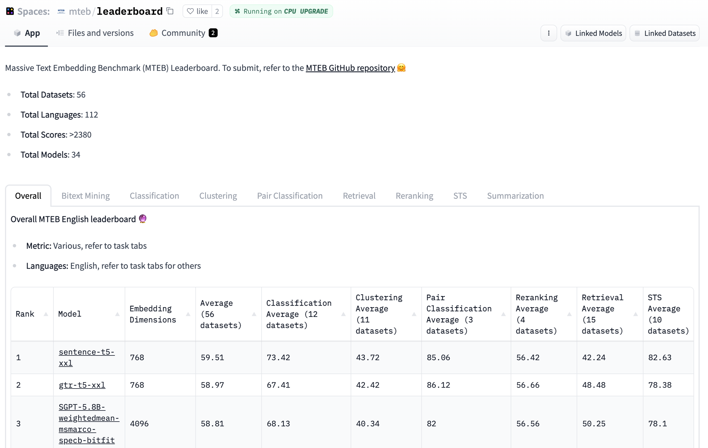
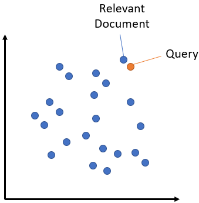
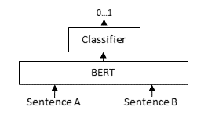
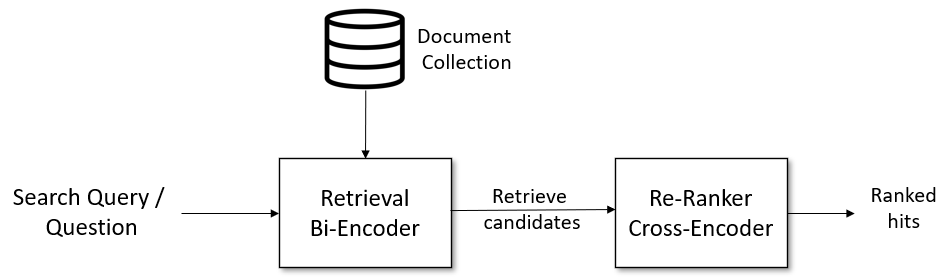
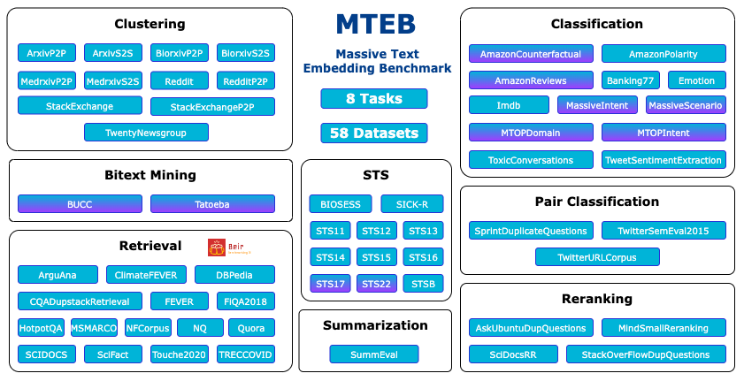

# Embedding 模型选型：从 MTEB 排名到工程落地

资料来源：

- [MTEB Leaderboard — Hugging Face Spaces](https://huggingface.co/spaces/mteb/leaderboard)
- [Sentence-Transformers — sbert.net](https://www.sbert.net/)
- [MTEB 代码仓库 — GitHub](https://github.com/embeddings-benchmark/mteb)
- [MTEB 博客介绍 — Hugging Face](https://huggingface.co/blog/mteb)
- [Sentence-BERT 论文 — arXiv 1908.10084](https://arxiv.org/abs/1908.10084)
- [Matryoshka Representation Learning — arXiv 2205.13147](https://arxiv.org/abs/2205.13147)

## 阅读目标

回答四个问题：

1. Embedding 模型的输入输出是什么，为什么在 RAG / 检索 / 聚类里它是不可替代的基础组件。
2. 选型时应该看哪些指标，而不是被单一 MTEB 总分带偏。
3. Bi-Encoder 与 Cross-Encoder、对称与非对称检索、稠密与稀疏、指令调优 Embedding 这些概念分别在解决什么问题。
4. 主流闭源和开源 Embedding 模型的分层、维度选择、量化压缩、中文场景和工程落地的具体做法。

核心结论：Embedding 模型选型主要看四件事——任务类型（中英 / 代码 / 多语 / 长文档）、延迟与吞吐量、向量维度、是否需要 instruction-tuned。MTEB 排行榜是有用的参考指标，但不是唯一标准。同一份 MTEB 排名靠前的模型，在自家业务数据集上的召回率差异可能非常大，必须做 end-to-end 评测。

## 名词解释

| 名词 | 解释 | 简单例子 |
|---|---|---|
| Embedding | 把一段离散文本（句、段、文档）映射成一个 d 维的连续向量，使语义相近的文本在向量空间里也接近。 | "如何选 Embedding 模型" 和 "Embedding 选型指南" 经过同一个模型编码后 cosine 相似度应较高。 |
| Dense Embedding | 每一维都是非零实数的稠密向量，通常用 Transformer 编码器产生。 | `BAAI/bge-m3` 输出 1024 维 dense 向量。 |
| Sparse Embedding | 大部分维度是 0 的稀疏向量，通常由词项权重（如 SPLADE）产生。 | `naver/splade-cocondenser-ensembled` 输出近 30000 维但只有几十维非零的向量。 |
| Bi-Encoder | query 和 document 分别独立编码成向量，再算相似度。适合大规模检索。 | Sentence-Transformers 默认模式，检索百万级语料只用一次相似度计算。 |
| Cross-Encoder | query 和 document 拼在一起送进同一个 Transformer 做交互打分。精度高但不可预计算。 | 把 query 和候选 doc 拼成 `[CLS] query [SEP] doc [SEP]` 一次前向打分。 |
| Symmetric Retrieval | query 和 document 是同义表达，向量空间里分布接近。 | 搜索 "什么是 RAG" 和文档 "RAG 是一种检索增强生成方法" 之间是对称检索。 |
| Asymmetric Retrieval | query 是短问题，document 是长段落，二者在原始分布上不同，需要不同编码策略。 | 搜索 query "RAG 怎么落地" 需要去匹配长文档的某一段。 |
| Reranker | 用 Cross-Encoder 对 Bi-Encoder 召回的 top-k 候选重排，提升精度。 | Bi-Encoder 召回 100 条，Reranker 重排到 top 10。 |
| Instruction-tuned Embedding | 在 query 前面加任务指令前缀，让同一个模型适配多种检索任务。 | `intfloat/e5-mistral-7b-instruct` 用 `query: ` 前缀区分任务。 |
| MTEB | Massive Text Embedding Benchmark，覆盖 56 个子任务、250+ 数据集的 Embedding 评测基准。 | 包括 Retrieval、Classification、Clustering、PairClassification、Reranking、STS、Summary、BitextMining 8 类。 |
| Cosine Similarity | 两个向量夹角的余弦值，等价于内积除以各自 L2 范数。 | `cos(A, B) = A·B / (||A|| · ||B||)`，取值范围 [-1, 1]。 |
| Matryoshka Representation (MRL) | 把同一向量设计成前 d 维、前 2d 维、前 4d 维都是可用表示，存储和检索时可以截断到任意长度。 | `nomic-ai/nomic-embed-text-v1.5` 支持 64/128/256/512/768 维截断。 |
| Binary Embedding | 把 float 向量二值化成 0/1 位串，可以用 Hamming 距离加速检索。 | 768 维 float 向量二值化后只占 96 字节。 |
| Vector Index | 用于在大量向量中做近似最近邻（ANN）检索的数据结构。 | FAISS、HNSW、Milvus、Qdrant、Pinecone。 |

## 1. 背景：为什么 Embedding 选型很关键

Embedding 模型是把"人类语言"翻译成"机器可比"的桥梁。在三个典型场景里它是地基：

- **RAG 检索增强生成**：用户 query 编码成向量后去向量库里查 top-k 文档，把片段塞进 prompt 让 LLM 回答。召回质量直接决定答案质量。
- **语义搜索**：用户搜 "性价比高的笔记本"，传统关键词匹配会漏掉 "便宜且性能强" 的描述，但 Embedding 能命中。
- **聚类、去重、分类、推荐**：把文档变成向量后，可以用 K-Means、HDBSCAN、向量相似度直接做下游任务。



这张图是 MTEB Leaderboard 的总览。可以看到同一张表里既有 OpenAI 的 `text-embedding-3-large` 这种闭源模型，也有 `BAAI/bge-m3`、`intfloat/e5-mistral-7b-instruct` 这种开源大模型，平均分差距不大但维度、速度、价格差异巨大。这说明 Embedding 选型不是"找一个最高分的"那么直接。

## 2. Embedding 模型的输入输出

Embedding 模型把一段离散文本（句 / 段 / 文档）映射成一个 d 维的连续向量。

```
embedding = model.encode("如何选 Embedding 模型")
# -> tensor([[0.021, -0.114, 0.087, ..., 0.045]])  # shape: (1, d)
```

工程上有几个关键参数：

| 参数 | 含义 | 典型取值 |
|---|---|---|
| max_seq_length | 单次能编码的最大 token 数 | 512（BGE-base）、8192（BGE-m3）、32768（Gemini Embedding） |
| embedding_dim | 输出向量维度 | 384 / 768 / 1024 / 1536 / 3072 / 4096 |
| pooling | 怎么把 token 级表示聚合成句向量 | mean / cls / last_token / weighted_mean |
| normalize | 是否 L2 归一化 | 多数 dense 模型默认输出归一化向量 |

直觉上可以这样理解：

- d 越大，表达能力越强，但存储和检索成本线性增长。
- max_seq_length 越长，能直接编码的文档越长，但单次推理成本和显存也随之增加。
- normalize 后 cosine 和点积等价，ANN 索引实现更简单。

## 3. Bi-Encoder vs Cross-Encoder：效率 vs 精度

### 3.1 Bi-Encoder



Bi-Encoder 把 query 和 document 分别独立编码成两个向量，再算 cosine 相似度。优势是 document 端可以离线预计算成向量索引，检索时只算 query 一次相似度。千万级语料下也能做到毫秒级响应。

工程含义：

- 适合"召回"阶段，要求高吞吐量、低延迟。
- 缺点是 query 和 document 之间没有 token 级交互，精度通常不如 Cross-Encoder。

### 3.2 Cross-Encoder



Cross-Encoder 把 query 和 document 拼起来送进同一个 Transformer，让 Self-Attention 在 query 和 document 之间做充分交互，再用一个分类头打分。精度通常比 Bi-Encoder 高 5-15 个点。

工程含义：

- 不能离线预计算，n 条候选就需要 n 次前向。
- 适合"重排"阶段，对 Bi-Encoder 召回的 top-k（比如 100-1000）做精排。

### 3.3 Retrieve & Re-Rank Pipeline



工业界主流做法是两阶段：

1. **召回（Bi-Encoder）**：用 dense 或 sparse embedding 把候选从百万级降到 top-k（k=100-1000）。
2. **重排（Cross-Encoder）**：用 Cross-Encoder 把 top-k 重新打分，按分数排序输出 top-n（n=5-20）。

这是"快召回 + 精重排"的经典模式，兼顾效率和精度。

## 4. 对称 vs 非对称检索

| 类型 | Query 形态 | Document 形态 | 典型任务 |
|---|---|---|---|
| Symmetric Retrieval | 短句或同义改写 | 短句 | FAQ 匹配、 paraphrase 检测、相似问题检索 |
| Asymmetric Retrieval | 短问题（关键词风格） | 长段落 | 搜索引擎、文档问答、RAG |

两种检索在向量空间里对应不同的训练目标：

- 对称检索：query 和 document 用同一个 prompt 模板编码，正样本在向量空间里要接近。
- 非对称检索：query 通常是问句，document 是答案段落，二者在原始分布上不同，模型需要学会"把问句映射到答案所在的子空间"。

工程上判断要点：

- 如果 query 和 document 形态差异大（比如一个关键词、一个长段），优先选支持 asymmetric 训练的模型（BGE、E5、GTE 系列都在 MTEB Retrieval 任务上专门训练过）。
- 如果形态接近（比如两个短句做 paraphrase），用通用的 sentence similarity 模型即可。
- 跨语言检索时，对称检索的难度更高，需要选多语模型（BGE-m3、E5-mistral、multilingual-e5）。

## 5. MTEB Benchmark 的任务分类



MTEB 包含 8 类共 56 个子任务、250+ 数据集：

| 任务类型 | 子任务数 | 典型数据集 | 衡量目标 |
|---|---:|---|---|
| Retrieval | 18 | MSMARCO、BEIR、NQ、TriviaQA | 检索 top-k 是否包含答案文档 |
| Classification | 12 | AmazonReviews、Emotion、Banking77 | 用向量 + 逻辑回归做文本分类 |
| Clustering | 11 | Biorxiv、S2S、Reddit | 用 K-Means 聚类的 V-measure |
| PairClassification | 8 | SPRINGER、TwitterURL | 句对是否同义 / 重复 |
| Reranking | 4 | AskUbuntu、StackOverflow | 对候选列表重排后的 MRR / nDCG |
| STS | 10 | SICK-R、STS12-16 | 句子对相似度的 Pearson / Spearman 相关 |
| Summary | 1 | SummEval | 摘要 vs 原文的相似度 |
| BitextMining | 1 | BUCC、Tatoeba | 双语句对的召回率 |

关键判断：

- 总分排名靠前的模型，在不同任务上表现差异巨大。一个 Retrieval 任务强、Classification 弱的模型，可能在 RAG 上效果好但在分类上不行。
- 中文场景要专门看 `MTEB(CN)` 和 `MTEB(Chinese)` 子榜，不要只看英文榜。
- 长文档场景要看 `LongEmbed` 基准，对 max_seq_length 是真实考验。

## 6. 主流模型分层

### 6.1 闭源 Embedding API

| 模型 | 提供方 | 维度 | 最大输入 | 备注 |
|---|---|---|---|---|
| `text-embedding-3-small` | OpenAI | 1536 | 8191 | 性价比高，支持 MRL 自定义维度。 |
| `text-embedding-3-large` | OpenAI | 3072 | 8191 | 英文 MTEB 平均 64+。 |
| `embed-english-v3.0` | Cohere | 1024 | 512 | 支持 input_type：search_query / search_document。 |
| `embed-multilingual-v3.0` | Cohere | 1024 | 512 | 100+ 语言，含中文。 |
| `gemini-embedding-001` | Google | 3072 | 32768 | 长上下文友好，MTEB Multilingual 第一梯队。 |
| `voyage-3` | Voyage AI | 1024 | 32000 | 检索质量强，支持 domain-specific 适配。 |

闭源模型通常在总分上领先，但有数据外送、成本不可控、不可私有部署三个限制。

### 6.2 开源 Embedding 模型

| 模型 | 维度 | 最大输入 | 多语 | 备注 |
|---|---:|---:|---|---|
| `BAAI/bge-m3` | 1024 | 8192 | 是 | 同时支持 dense / sparse / multi-vector，三种检索范式合一。 |
| `BAAI/bge-large-zh-v1.5` | 1024 | 512 | 中文 | 中文检索强基线，MTEB(CN) 第一梯队。 |
| `BAAI/bge-small-en-v1.5` | 384 | 512 | 英文 | 轻量，推理快。 |
| `intfloat/e5-mistral-7b-instruct` | 4096 | 32768 | 是 | 基于 Mistral-7B 指令微调，instruction-tuned 强。 |
| `intfloat/multilingual-e5-large` | 1024 | 514 | 是 | 多语通用基线。 |
| `Alibaba-NLP/gte-Qwen2-7B-instruct` | 3584 | 32768 | 是 | 基于 Qwen2-7B，MTEB 第一梯队。 |
| `nvidia/NV-Embed-v2` | 4096 | 32768 | 是 | MTEB 英文榜长期第一梯队。 |
| `Salesforce/SFR-Embedding-Mistral` | 4096 | 32768 | 是 | 检索 + 指令微调。 |
| `intfloat/e5-large-v2` | 1024 | 512 | 英文 | 经典基线，社区广泛使用。 |
| `sentence-transformers/all-MiniLM-L6-v2` | 384 | 256 | 英文 | 速度优先的最轻量基线。 |
| `Snowflake/snowflake-arctic-embed-l` | 1024 | 512 | 英文 | Snowflake 开源，检索任务强。 |

开源模型优势是可私有部署、可微调、可控成本；劣势是首次加载和推理需要 GPU 资源。

## 7. 维度选择：d 的权衡

| 维度 | 存储（百万向量） | 检索延迟 | 精度上限 | 适用场景 |
|---:|---|---|---|---|
| 384 | 1.5 GB | 极快 | 中 | 轻量聚类、移动端、近似去重 |
| 768 | 3 GB | 快 | 较高 | 通用语义搜索、中等规模 RAG |
| 1024 | 4 GB | 中 | 高 | 中文 RAG、文档检索 |
| 1536 | 6 GB | 中 | 很高 | 高质量 RAG、OpenAI 默认 |
| 3072 | 12 GB | 慢 | 极高 | 顶级 RAG、长文档检索 |
| 4096 | 16 GB | 慢 | 极高 | 顶级检索 + reranker 组合 |

经验法则：

- 维度不是越大越好，超过 1024 维后边际收益快速递减。
- 1024 维是当前工业界的事实标准，平衡精度和成本。
- 如果存储或延迟压力大，用 Matryoshka 模型截断到 256 / 512 维。
- 真正影响精度的不是维度，而是训练数据、对比学习目标和负样本采样。

## 8. 量化与压缩

### 8.1 Matryoshka Representation Learning (MRL)

MRL 的核心思想：训练时约束向量的前 d 维、前 2d 维、前 4d 维都是可用表示。推理时可以按需截断：

```python
vec_full = model.encode(text)         # shape: (1, 768)
vec_256 = vec_full[:, :256]            # 截断到 256 维，仍有可用精度
vec_64 = vec_full[:, :64]              # 极端压缩
```

优势：

- 一份模型支持多种维度，不用为不同场景存多份向量。
- 检索时可以先用低维做粗排，再用高维做精排（Coarse-to-Fine）。

代表模型：`nomic-ai/nomic-embed-text-v1.5`、`Alibaba-NLP/gte-Qwen2` 系列。

### 8.2 二进制 Embedding

把 float 向量二值化成 0/1 位串，用 Hamming 距离做检索：

- 768 维 float → 96 字节。
- 检索可以用 bitwise XOR + popcount，硬件极快。
- 精度通常下降 5-15 个点，但对亿级以上向量库是显著的成本节省。

代表模型：`Qwen3-Embedding` 等支持二进制输出。

### 8.3 量化推理

- fp32 → fp16：显存减半，精度基本无损。
- fp32 → int8：显存减到 1/4，部分硬件加速。
- Sentence-Transformers + ONNX Runtime / TensorRT 可以在 CPU 上跑 100+ QPS。

## 9. 指令调优 Embedding

部分模型支持在 query 前面加任务指令前缀，让同一个模型适配多种检索任务：

```python
# e5-mistral-7b-instruct
query_instruction = "Instruct: Given a web search query, retrieve relevant passages that answer the query\nQuery: "
query_vec = model.encode(query_instruction + "什么是 RAG")

# document 端通常不加指令
doc_vec = model.encode("RAG 是一种检索增强生成方法...")
```

代表模型：

- `intfloat/e5-mistral-7b-instruct`
- `Alibaba-NLP/gte-Qwen2-7B-instruct`
- `Salesforce/SFR-Embedding-Mistral`

工程含义：

- instruction-tuned 模型在不同任务上表现差异更小，泛化更强。
- 推理时一定要严格按官方模板写指令前缀，否则精度会显著下降。
- 7B 级别模型需要 GPU 推理（24GB 显存起步），不适合 CPU 在线服务。

## 10. 中文场景

中文 Embedding 选型有几种主流路线：

| 模型 | 维度 | 备注 |
|---|---:|---|
| `BAAI/bge-large-zh-v1.5` | 1024 | 中文 RAG 事实标准，MTEB(CN) 长期第一梯队。 |
| `BAAI/bge-m3` | 1024 | 多语 + 长上下文 + dense/sparse/multi-vector 三合一。 |
| `moka-ai/m3e-large` | 1024 | 早期中文开源代表。 |
| `TencentCloud/Conan-embedding-v1` | 1792 | 腾讯混元，中文检索强。 |
| `maidalun1020/BCEmbedding` | 1024 / 2048 | 中英双语，bilingual 系列。 |
| `ShengdingHu/Contriever-mc` | 768 | 中文对比学习代表。 |

工程经验：

- 中文场景尽量选在中文数据上预训练或微调的模型，而不是纯英文模型。
- 中英混合场景优先选 BGE-m3、multilingual-e5-large、Conan-embedding 这种双语模型。
- 中文长文档（>512 字符）要用 bge-m3 或 Qwen2-Embedding 这种支持 8K+ 的模型。
- 中文文本要先做适度预处理（繁简统一、全角半角统一）再编码，模型对规范文本更鲁棒。

## 11. 评测方法

MTEB 排名只是参考，自家业务数据才是金标准。

### 11.1 评测流程

```
1. 准备评测集
   - 从生产 query 里采样 200-1000 条
   - 人工标注 ground truth 文档（或者用现有日志 + 人工校验）

2. 候选模型
   - 选 3-5 个候选（如 bge-m3、bge-large-zh、text-embedding-3-large）

3. 编码与索引
   - 所有候选用同一份语料建索引
   - 用同一个 query 集做 top-k 检索

4. 计算指标
   - Recall@k（k=1, 5, 10, 20）
   - MRR / nDCG
   - 端到端 RAG 准确率（用检索结果喂给 LLM 答题）

5. 选最优模型
   - 综合精度 + 延迟 + 成本
```

### 11.2 评测指标

| 指标 | 含义 | 何时关心 |
|---|---|---|
| Recall@k | top-k 里包含 ground truth 的比例 | 召回阶段 |
| MRR | 第一个正确答案的倒数排名 | 排序质量 |
| nDCG@k | 考虑相关性等级和位置的排序指标 | 多相关性等级 |
| End-to-End 准确率 | 用检索结果喂给 LLM 答题，答对的比例 | 最终用户体验 |

### 11.3 评测误区

- 只看 MTEB 总分：忽略了 MTEB 数据集和自家数据的分布差异。
- 只看 Recall@10：实际 RAG 通常只用 top-5，Recall@5 更关键。
- 忽略延迟和成本：一个 7B Embedding 模型精度高 2 个点，但延迟是 384 维小模型的 50 倍，性价比不一定更好。
- 忽略长文档：很多文档超过 512 token，截断后检索质量会大幅下降。

## 12. 工程要点


这张图把 MTEB 上的模型按"速度 vs 精度 vs 维度"三维度展示。可以看到右下角（精度高 + 速度快 + 维度小）的位置是工程上最理想的选择——但这种点不存在。选型的本质是在三个维度间做权衡。

### 12.1 用 Sentence-Transformers 加载

```python
from sentence_transformers import SentenceTransformer

model = SentenceTransformer("BAAI/bge-m3", device="cuda")
# 也可以加载 OpenAI / Cohere 接口
# model = SentenceTransformer("OpenAI/Cohere", backend="openai")

vecs = model.encode(
    ["如何选 Embedding 模型", "Embedding 选型指南"],
    normalize_embeddings=True,
    batch_size=32,
    show_progress_bar=True,
)
# vecs.shape = (2, 1024)
```

### 12.2 批量编码

不要一条一条 encode。Sentence-Transformers 自动 batch，单卡 GPU 通常 batch=32-256 吞吐最高：

```python
vecs = model.encode(corpus, batch_size=128, convert_to_numpy=True)
```

### 12.3 ONNX 加速

```python
# 导出 ONNX
model.save("bge-m3-onnx")
# 用 optimum-onnx 推理，CPU 上提速 2-5 倍
```

### 12.4 推理精度

```python
model = SentenceTransformer("BAAI/bge-m3", device="cuda")
model.half()  # fp16，显存减半，精度基本无损
# model = model.to(torch.bfloat16)  # bf16，更稳
```

### 12.5 向量库集成

| 向量库 | 适用规模 | 特点 |
|---|---|---|
| FAISS | 百万到亿级 | Meta 开源，单机最强，支持 GPU。 |
| Milvus | 亿级 | 分布式，云原生，支持混合检索。 |
| Qdrant | 百万到亿级 | Rust 实现，单机性能好。 |
| Pinecone | 任意规模 | 全托管，按量付费。 |
| Weaviate | 百万到亿级 | 内置 hybrid search。 |
| pgvector | 万到百万级 | PostgreSQL 插件，简单。 |
| Chroma | 千到百万级 | 轻量，适合原型。 |

### 12.6 LangChain / LlamaIndex 集成

```python
# LangChain
from langchain.embeddings import HuggingFaceEmbeddings
embeddings = HuggingFaceEmbeddings(model_name="BAAI/bge-m3")

# LlamaIndex
from llama_index.embeddings import HuggingFaceEmbedding
embed_model = HuggingFaceEmbedding(model_name="BAAI/bge-m3")
```

## 13. 主流 Embedding 模型对比表

| 模型 | 维度 | 最大输入 | 多语 | 闭源/开源 | 适用场景 |
|---|---:|---:|---|---|---|
| OpenAI `text-embedding-3-small` | 1536 (可截断) | 8191 | 是 | 闭源 | 通用 RAG，性价比 |
| OpenAI `text-embedding-3-large` | 3072 (可截断) | 8191 | 是 | 闭源 | 高质量 RAG |
| Cohere `embed-multilingual-v3.0` | 1024 | 512 | 是 | 闭源 | 多语检索 |
| `BAAI/bge-m3` | 1024 | 8192 | 是 | 开源 | 多语 + 长文档 + dense/sparse |
| `BAAI/bge-large-zh-v1.5` | 1024 | 512 | 中文 | 开源 | 中文 RAG 首选 |
| `BAAI/bge-small-en-v1.5` | 384 | 512 | 英文 | 开源 | 轻量英文检索 |
| `intfloat/e5-mistral-7b-instruct` | 4096 | 32768 | 是 | 开源 | 指令微调 + 长上下文 |
| `intfloat/multilingual-e5-large` | 1024 | 514 | 是 | 开源 | 多语通用 |
| `Alibaba-NLP/gte-Qwen2-7B-instruct` | 3584 | 32768 | 是 | 开源 | 顶级多语检索 |
| `nvidia/NV-Embed-v2` | 4096 | 32768 | 是 | 开源 | 英文检索顶尖 |
| `sentence-transformers/all-MiniLM-L6-v2` | 384 | 256 | 英文 | 开源 | 轻量基线 |
| `Snowflake/snowflake-arctic-embed-l` | 1024 | 512 | 英文 | 开源 | 英文检索强 |
| `nomic-ai/nomic-embed-text-v1.5` | 768 (MRL) | 2048 | 是 | 开源 | MRL + 多语 |
| `TencentCloud/Conan-embedding-v1` | 1792 | 512 | 中英 | 开源 | 中英混合 |

## 14. 选型决策清单

按下面的顺序逐项检查，每一项都对应一个具体判断：

| 序号 | 检查项 | 期望状态 / 决策点 |
|---:|---|---|
| 1 | 业务语种 | 中文 → BGE-zh / BGE-m3 / Conan-embedding；英文 → BGE / E5 / OpenAI；多语 → BGE-m3 / multilingual-e5。 |
| 2 | 文档长度 | < 512 token → 通用模型即可；512-8192 → bge-m3；> 8192 → 长文档专用或先切片。 |
| 3 | 是否私有部署 | 是 → 开源；否 → 闭源 API 也可以。 |
| 4 | 延迟要求 | < 10 ms → MiniLM / BGE-small；< 100 ms → BGE-base / large；< 1 s → 7B 级别。 |
| 5 | 维度要求 | 384 / 768 → 轻量；1024 → 默认；3072 → 高质量。 |
| 6 | 是否需要稀疏 / 多向量 | 是 → BGE-m3 三合一；否 → 任意 dense 模型。 |
| 7 | 是否需要指令微调 | 多任务 → e5-mistral / gte-Qwen2；单任务 → 通用即可。 |
| 8 | 评测 | 至少在自家 200+ 条 query 上测 Recall@5 和 end-to-end RAG 准确率。 |

## 15. 关键结论

1. **Embedding 模型选型看 4 件事**：任务类型（语种 + 长度 + 任务）、延迟 / 吞吐量、向量维度、是否需要 instruction-tuned。MTEB 排名是参考，不是唯一标准。
2. **Bi-Encoder + Cross-Encoder 是工业界标配**：Bi-Encoder 做召回，Cross-Encoder 做精排。两阶段 pipeline 既保证效率又保证精度。
3. **MTEB 8 类任务各有侧重**：Retrieval、Classification、Clustering、PairClassification、Reranking、STS、Summary、BitextMining 的最优模型经常不一样，要按自家任务类型选，不要只看总分。
4. **1024 维是工业界默认**：低于 1024 维存储和检索更便宜，高于 1024 维精度提升边际递减。维度 > 训练数据 + 对比学习目标才是关键。
5. **长文档必须用支持 8K+ 的模型**：BGE-m3、Qwen2-Embedding、NV-Embed-v2 是首选。短于 max_seq_length 切片会显著降低召回率。
6. **中文 RAG 首选 BGE 系列**：`bge-large-zh-v1.5` 是中文检索的事实标准，`bge-m3` 处理中英混合和长文档。
7. **指令调优模型一定要按模板加前缀**：推理时不按官方模板写指令前缀，精度会显著下降。
8. **自家数据评测才是金标准**：MTEB 总分相差 1-2 个点的两个模型，在自家业务 query 上可能差异 10+ 个点。
9. **Matryoshka 和二进制是重要的压缩手段**：存储和延迟压力大时优先考虑，不要硬扛高维 float 向量。

## 16. 面试速答卡

Q1：Embedding 模型怎么选？
A：按 4 件事选——任务类型（语种 / 长度 / 任务）、延迟与吞吐量、向量维度、是否需要 instruction-tuned。MTEB 排行榜是参考，要做自家数据评测。中文 RAG 首选 BGE-zh，英文 RAG 看 BGE / E5 / OpenAI，长文档看 BGE-m3 / Qwen2-Embedding。

Q2：Bi-Encoder 和 Cross-Encoder 有什么区别？
A：Bi-Encoder 把 query 和 document 独立编码，document 可以离线预计算，适合大规模召回。Cross-Encoder 把 query 和 document 拼起来联合编码，token 级交互更充分，精度高但不能离线预计算。工业界用 Bi-Encoder 召回 + Cross-Encoder 重排的两阶段 pipeline。

Q3：什么是 MTEB？
A：Massive Text Embedding Benchmark，涵盖 56 个子任务、250+ 数据集、8 类任务（Retrieval、Classification、Clustering、PairClassification、Reranking、STS、Summary、BitextMining）。MTEB 总分靠前不代表在所有任务上都强，要按自家任务类型看子榜。

Q4：对称检索和非对称检索有什么区别？
A：对称检索 query 和 document 是同义表达（比如 paraphrase），向量空间里分布接近。非对称检索 query 是短问题、document 是长段落，二者原始分布不同，需要模型学会把问句映射到答案所在子空间。绝大多数 RAG 场景是非对称检索。

Q5：维度是不是越大越好？
A：不是。超过 1024 维后边际收益快速递减，存储和检索成本线性增长。1024 维是工业界默认。真正影响精度的是训练数据质量、对比学习目标和负样本采样，不是维度本身。存储压力大时优先用 Matryoshka 截断或二进制 embedding。