# GPT vs BERT：为什么 LLM 都用 Decoder-Only

资料来源：
[The Illustrated GPT-2 — Jay Alammar](https://jalammar.github.io/illustrated-gpt2/) 
[The Illustrated Transformer — Jay Alammar](https://jalammar.github.io/illustrated-transformer/) 
[BERT: Pre-training of Deep Bidirectional Transformers](https://arxiv.org/abs/1810.04805) 
[Improving Language Understanding by Generative Pre-Training (GPT-1)](https://cdn.openai.com/research-covers/language-unsupervised/language_understanding_paper.pdf)

## 阅读目标

关注三个问题：

1. GPT（Decoder-Only）和 BERT（Encoder-Only）在结构、训练目标和适用任务上有什么本质区别。
2. 为什么 GPT 这种带 mask 的自回归模型可以用于文本生成，而 BERT 这种双向模型只能用于理解类任务。
3. 当代 LLM（Llama、Qwen、Mistral、GPT-3/4）几乎都选择 Decoder-Only，背后有哪些工程和范式层面的原因。

核心结论是：GPT 与 BERT 的根本分歧不是“哪个更强”，而是“训练目标是否要求自回归”。BERT 通过 Masked Language Modeling 学到的是“双向、可填空、不可生成”的表示；GPT 通过 Next Token Prediction 学到的是“单向、因果、可继续生成”的表示。一旦任务从“理解”扩展到“生成”或者“通用”，Next Token Prediction 在数据、训练、推理和扩展性上都有结构性优势，所以 Decoder-Only 成为主流 LLM 的事实标准。

## 名词解释

| 名词 | 解释 | 简单例子 |
|---|---|---|
| Encoder-Only | 只用 Transformer 的 Encoder 堆叠，Self-Attention 双向、无 mask。 | BERT 系列的代表结构。 |
| Decoder-Only | 只用 Transformer 的 Decoder 去掉 cross-attention 后的部分，Self-Attention 单向、causal mask。 | GPT、LLaMA、Qwen、Mistral 的代表结构。 |
| Encoder-Decoder | 经典 Transformer，Encoder 双向读输入，Decoder 用 cross-attention 检索 Encoder 输出。 | 原始 Transformer 论文的机器翻译模型、T5、BART。 |
| Causal Mask | 上三角 mask，让位置 t 只能看到 ≤ t 的内容，保证自回归性质。 | 预测第 5 个 token 时，挡住 6、7、8 位置。 |
| Next Token Prediction | 把语言模型训练定义为“已知前 t 个 token 预测第 t+1 个 token”的分类任务。 | 给定 “今天天气”，预测下一个 token 是 “很” 还是别的。 |
| Masked Language Modeling (MLM) | BERT 风格的预训练任务：随机遮住输入中 15% 的 token，让模型根据左右上下文预测被遮住的 token。 | “我想吃[MASK]” 让模型预测 “苹果 / 火锅 / 晚饭”。 |
| Next Sentence Prediction (NSP) | BERT 预训练时加的句子级二分类任务：判断两段文本是否相邻。 | 帮助 BERT 学句子级关系，后来在 RoBERTa 等模型中被去掉。 |
| 自回归 (Autoregressive) | 每一步的输出会成为下一步的输入，序列由模型自己一段段生成。 | GPT-2 输出 “Robot” 后把它接到输入末尾，再生成下一个 token。 |
| 双向上下文 (Bidirectional Context) | 编码位置 t 时可以同时看到它左右两侧的 token，没有方向限制。 | BERT 中 “吃” 可以同时参考 “我” 和 “苹果”。 |
| 因果语言模型 (Causal LM) | Decoder-Only 的标准叫法，强调模型只依赖历史 token，不会“偷看未来”。 | GPT、LLaMA 都是 Causal LM。 |
| Prefix LM | 介于 Encoder-Decoder 和 Decoder-Only 之间的折中：输入侧用双向 attention、生成侧用 causal mask。 | UniLM、GLM 的部分模式。 |
| 涌现能力 (Emergent Abilities) | 模型规模超过某个阈值后突然出现的小模型不具备的能力，例如 in-context learning、CoT。 | GPT-2 没有明显 ICL 能力，GPT-3 才出现。 |

## 1. 背景：Transformer 家族的三种拓扑

把 Q1 沉淀的 Transformer 拆开看，attention 方向和 mask 决定了三种主流拓扑：

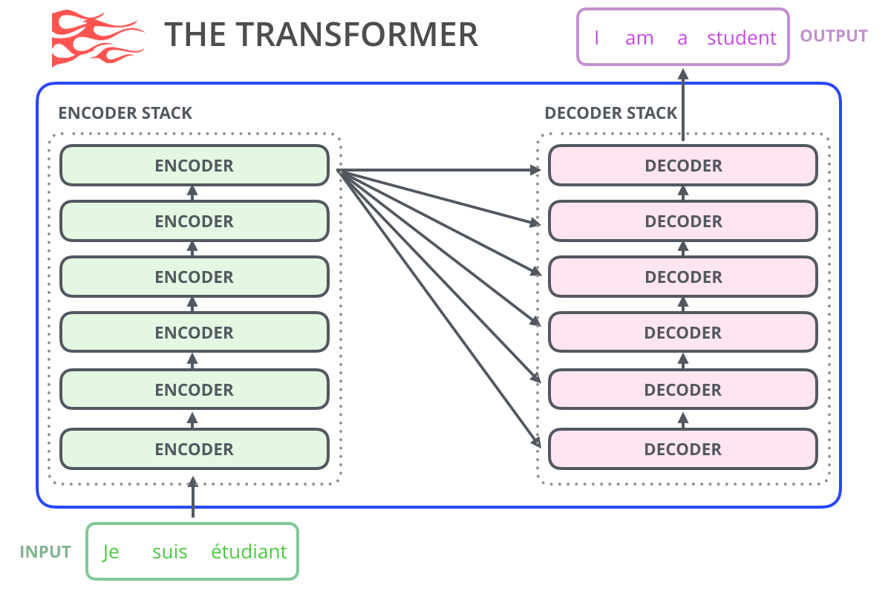

这是 [Attention Is All You Need](https://arxiv.org/abs/1706.03762) 论文里的原始结构。Encoder 双向读输入，Decoder 在自回归生成时还要通过 Encoder-Decoder Attention 检索 Encoder 的输出。这是为“有显式输入输出对齐关系”的任务设计的，比如机器翻译。

把 Encoder 拿掉，只保留 Decoder 的 causal 部分，就得到 Decoder-Only：

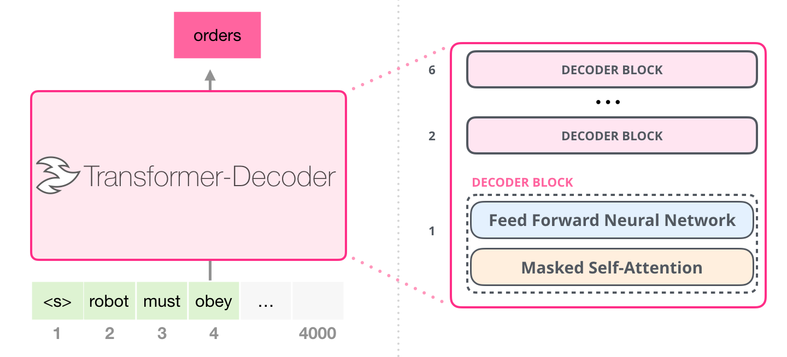

Decoder 内部本来有三个子层，去掉中间的 cross-attention 后，剩下 Masked Self-Attention + Feed-Forward，正好是 GPT 系列采用的结构。

如果 Encoder 拿掉 cross-attention 和所有 Decoder 部件，只留下双向 Self-Attention + FFN，就是 BERT 这种 Encoder-Only。

工程意义是：架构选择本质上是在决定“模型能看到哪些上下文、能生成什么输出”。Decoder-Only 因果单向，所以能续写；Encoder-Only 双向，所以能做填空、判别、检索打分；Encoder-Decoder 两者都能做，但参数和推理成本更高。

## 2. BERT vs GPT：训练目标决定一切

### 2.1 三种架构与代表模型

| 维度 | Encoder-Only | Decoder-Only | Encoder-Decoder |
|---|---|---|---|
| 代表模型 | BERT、RoBERTa、ALBERT | GPT-1/2/3/4、LLaMA、Qwen、Mistral | 原始 Transformer、T5、BART、mT5 |
| Attention 方向 | 双向、无 mask | 单向、causal mask | Encoder 双向、Decoder causal |
| 预训练目标 | MLM（Masked Language Modeling）+ NSP | Next Token Prediction | Span Corruption、Seq2Seq LM |
| 典型用途 | 分类、NER、检索、句子相似度 | 续写、对话、In-Context Learning、Agent | 翻译、摘要、Seq2Seq 任务 |
| 推理时是否生成 | 不直接生成 | 逐 token 自回归生成 | 显式 Seq2Seq 生成 |
| 上下文利用率 | 左右全部 | 只能看左侧 | Encoder 看全部、Decoder 看左侧 |
| 扩展性 (scaling) | 中等 | 强（涌现 ICL、CoT） | 弱于 Decoder-Only |
| 主流 LLM 选用情况 | 几乎没人用作基础 LLM | 几乎是事实标准 | 仅部分场景保留 |

### 2.2 BERT：双向填空

BERT 的训练目标是把句子里的部分 token 替换成 `[MASK]`，让模型根据左右两侧的上下文预测被遮住的 token：

```text
输入:  我 想 吃 [MASK] 的 [MASK]
标签:  我 想 吃 苹果 的 火锅
```

为了让模型学句子级关系，BERT 1.0 还加了 NSP（下一句预测）任务。RoBERTa 后来发现 NSP 没用，直接去掉。

这种训练目标的直接后果是：模型天然就擅长“看到完整上下文、给一个 token 打分”，但不能直接续写一段文本。BERT 时代的工作基本都把它当 Encoder 用，再在下游接一个分类头或者 span 头。

### 2.3 GPT：Next Token Prediction

GPT 的训练目标简单得多：给定前 t 个 token，预测第 t+1 个 token：

```text
输入:  今 天 天 气
标签:         很
输入:  今 天 天 气 很
标签:            适 合
```

输入和输出共享同一个词表和 embedding 矩阵，所以这个“预测”其实就是一个 n→n 的分类任务，每一列都是一个 softmax over vocabulary。

训练目标决定模型性质：

- 模型只被允许看历史 token，所以天然支持自回归生成。
- Next Token Prediction 不依赖人工标注、无监督数据几乎无穷。
- 一旦把“预测下一个 token”做到极致，模型隐式学会语法、事实、推理甚至工具使用。

## 3. Decoder-Only 的工程细节

### 3.1 Encoder Block vs Decoder Block

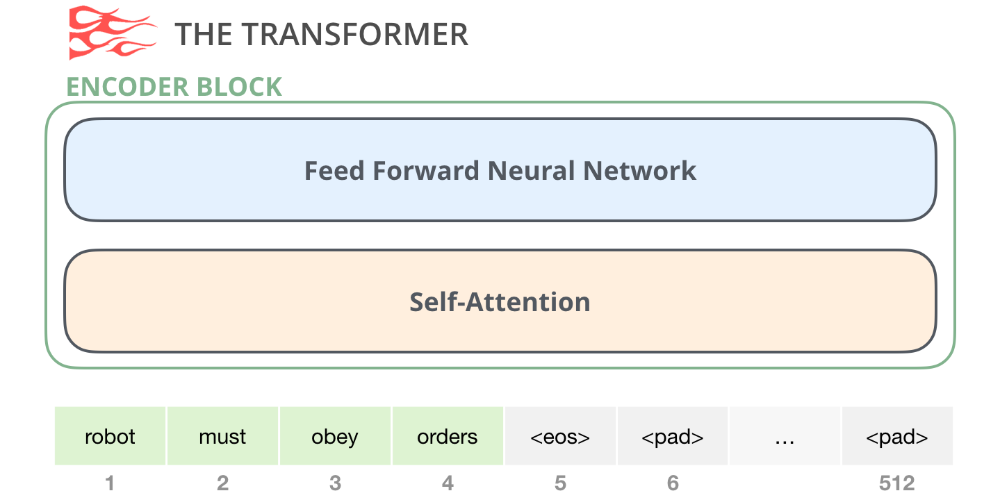

Encoder Block 的 Self-Attention 没有 mask。每个 token 编码时可以看到整个序列。

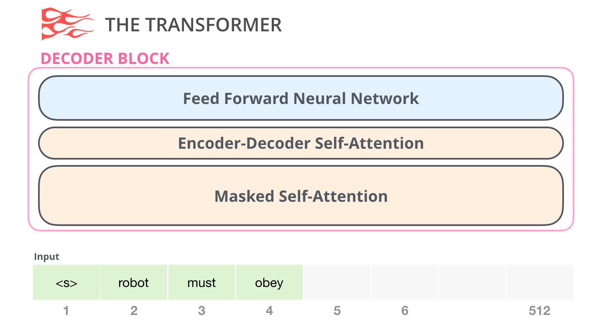

Decoder Block 多了两个东西：

1. **Masked Self-Attention**：causal mask，让当前位置只能看到历史。
2. **Encoder-Decoder Attention**：Q 来自 Decoder、K/V 来自 Encoder，用于跨序列检索。

Decoder-Only 模型直接把第二个 sub-layer 去掉，只保留 Masked Self-Attention + FFN。

### 3.2 Masked Self-Attention 的本质

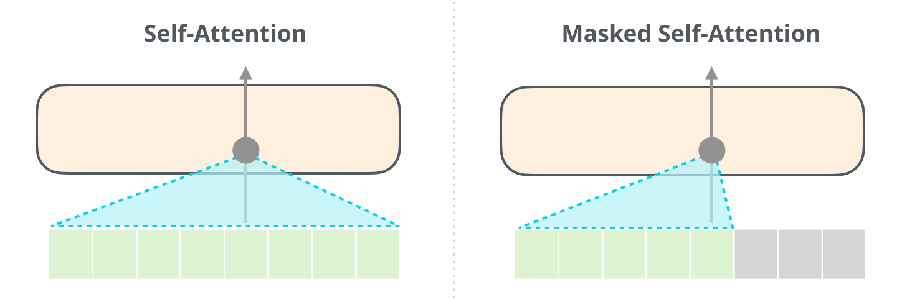

左半边是 BERT 风格的双向 Self-Attention：编码位置 5 时可以看到位置 1-8 的所有 token。右半边是 GPT 风格的 Masked Self-Attention：编码位置 5 时只能看到位置 1-5。

直觉上这等价于“让模型站在第 5 个时间点往前看，不能偷看未来”。这也是为什么 Decoder-Only 可以逐 token 生成而 Encoder-Only 不行。

### 3.3 Decoder Block 内部 attention 路径

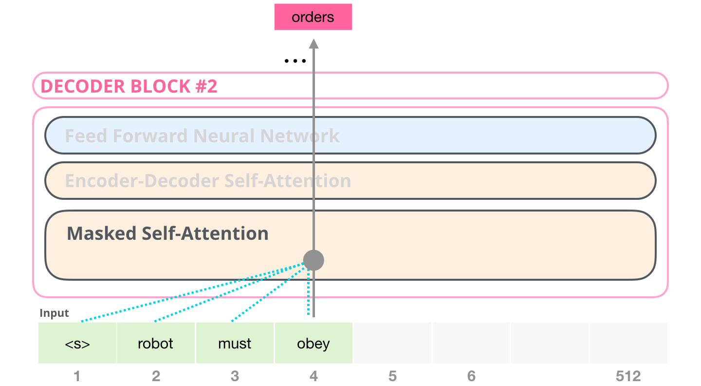

这个图把 Decoder Block 内部每条 attention 路径画得很清楚：

- 灰色连线表示“被 mask 掉、看不到”的位置。
- 黑色连线表示“实际参与 attention 计算”的位置。
- 注意 Decoder 内部每个 token 仍然要参考自己之前的 token（自回归），同时还要参考 Encoder 的输出（cross-attention）。

### 3.4 Mask 在矩阵上的样子

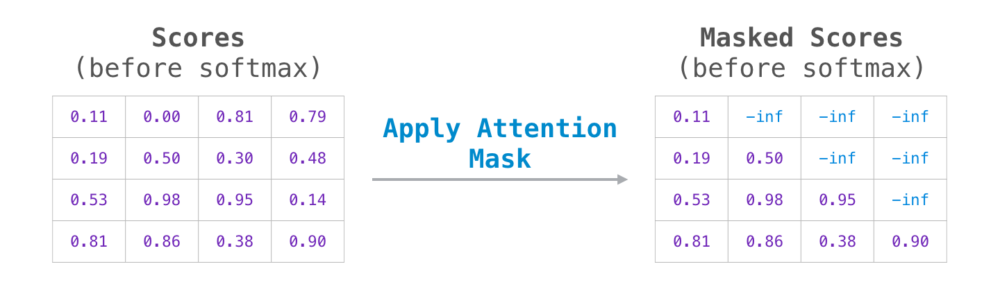

把 mask 直接画在 `QK^T` 矩阵上：上三角是 mask 区域，softmax 之后这部分权重为 0，下三角保留正常 attention 权重。

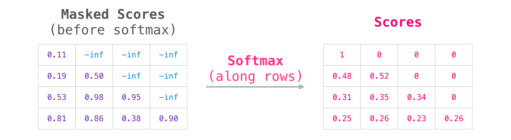

经过 mask + softmax 之后，每一行只有当前位置及之前的 token 才有非零权重。训练和推理时这一步完全一样，所以 Decoder-Only 在训练时是“全序列一次性前向”，在推理时是“逐 token 增量前向”，两种模式共享同一套参数。

## 4. 为什么 LLM 几乎都选了 Decoder-Only

Decoder-Only 成为主流不是因为它“更准”，而是因为它在数据、训练、推理和扩展性上同时占优。

### 4.1 训练数据：自监督、可无限扩展

- Next Token Prediction 几乎不需要人工标注：所有自然语言文本本身就是 (前缀, 下一个 token) 的样本。互联网级别的网页、代码、论文、对话都可以直接喂进去。
- MLM 需要构造 [MASK]、处理原始 token 没见过的特殊符号，语料构造更复杂。
- 在数据量爆炸的年代，“用得起一切文本”比“需要精修语料”重要得多。

### 4.2 训练效率：一次前向算所有位置

- Decoder-Only 的 causal mask 配 Teacher Forcing 可以一次前向算出 n 个位置的 loss，并行度极高。
- BERT 的 MLM 一次只能算 15% 被遮住 token 的 loss，其余位置只贡献 encoder 状态，训练 token 利用率较低。

### 4.3 推理能力：天然支持生成

- Decoder-Only 直接逐 token 生成，不需要额外解码器。
- BERT 只能给已有 token 打分，生成场景下要接复杂的搜索算法（如 MCTS、Beam Search + 长度归一化），工程成本高。

### 4.4 规模与涌现

- GPT 系列在规模上去之后出现了 in-context learning、chain-of-thought、tool use 等 BERT 类模型没有的能力。
- Decoder-Only 模型在同参数量下对“通用任务”的覆盖更广，迁移到下游任务时往往只需要 prompt 或 LoRA。
- Encoder-Decoder 模型（如 T5）在 NLP 任务上仍然很强，但需要为每个任务设计 prefix，复杂度更高。

### 4.5 工程生态

- vLLM、TGI、llama.cpp、TensorRT-LLM 等推理引擎首先为 Decoder-Only 优化。
- KV Cache、PagedAttention、Speculative Decoding 这些关键工程几乎都围绕 Decoder-Only 设计。
- 训练框架（Megatron、DeepSpeed、FSDP）对 causal LM 的张量并行流水线支持最成熟。

### 4.6 唯一性结论

| 任务类型 | 选什么架构 | 原因 |
|---|---|---|
| 文本生成、对话、Agent | Decoder-Only | 自回归天然契合。 |
| 文本理解、检索、分类 | Encoder-Only 仍可考虑 | 双向注意力对判别任务更优，参数效率高。 |
| 翻译、摘要、改写 | Encoder-Decoder 或 Decoder-Only | 长输入 + 短输出场景 Encoder-Decoder 仍有优势；现代工作多用 Decoder-Only + 指令微调替代。 |
| 多模态生成 | Decoder-Only + 适配器 | LLaVA、Qwen-VL 等都用 Decoder-Only 文本塔 + 视觉 adapter。 |

结论：Encoder-Only 在工业上并没有消失，但“想训一个能干的通用 LLM”这件事，Decoder-Only 是事实标准。

## 5. Decoder-Only 是怎么生成的

### 5.1 自回归过程

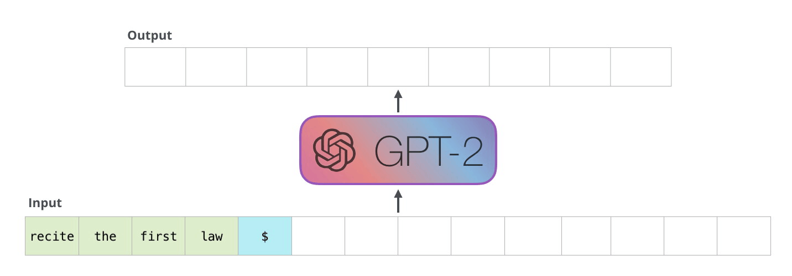

自回归的关键性质是“把输出接到输入末尾”：

1. 输入一个 token（比如 `<|endoftext|>` 或用户 prompt）。
2. 模型输出一个 token 概率分布，按 sampling 策略选一个 token。
3. 把选中的 token 拼到输入末尾，重新做一次前向。
4. 直到模型输出 `<|endoftext|>` 或者达到 max_length。

每一步都重复同一个模型、同一个 forward，所以工程上能复用 KV Cache。

### 5.2 GPT-2 的尺寸与超参数

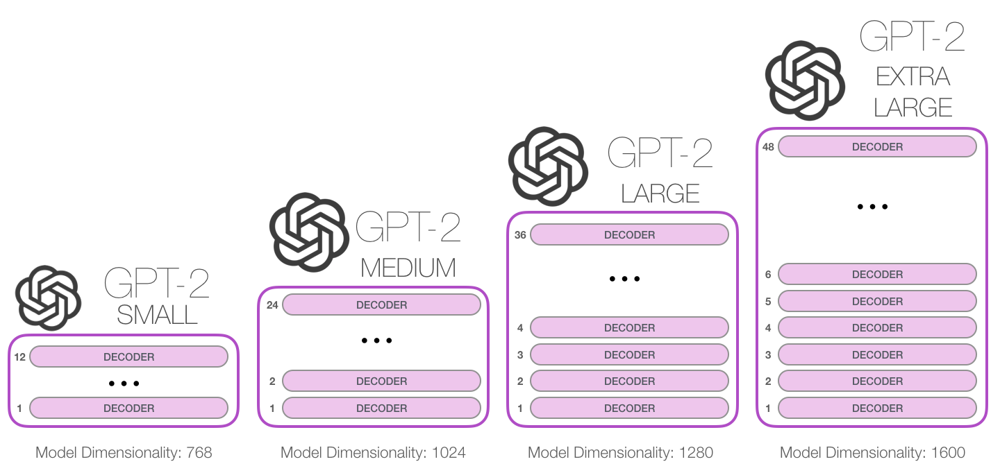

| 模型 | 参数量 | n_layers | d_model | n_heads |
|---|---|---|---|---|
| GPT-2 Small | 117M | 12 | 768 | 12 |
| GPT-2 Medium | 345M | 24 | 1024 | 16 |
| GPT-2 Large | 774M | 36 | 1280 | 20 |
| GPT-2 XL | 1558M | 48 | 1600 | 25 |

到 GPT-3（1750M → 175B）这条路继续走，参数规模每翻 10 倍都伴随着涌现能力。

### 5.3 Token Embedding + 位置编码

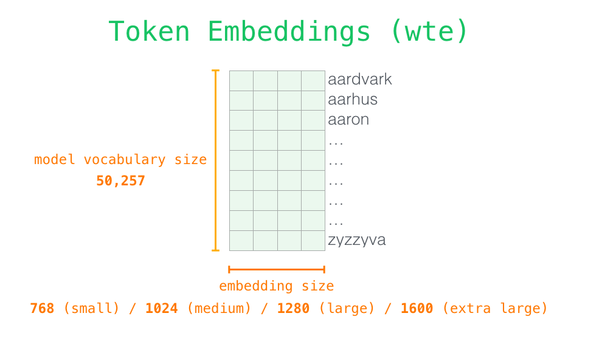

Decoder-Only 的输入由两部分相加得到：

- Token Embedding（vocab × d_model）：通过查表得到。
- Positional Encoding（n_ctx × d_model）：通过固定或学习的位置向量得到。

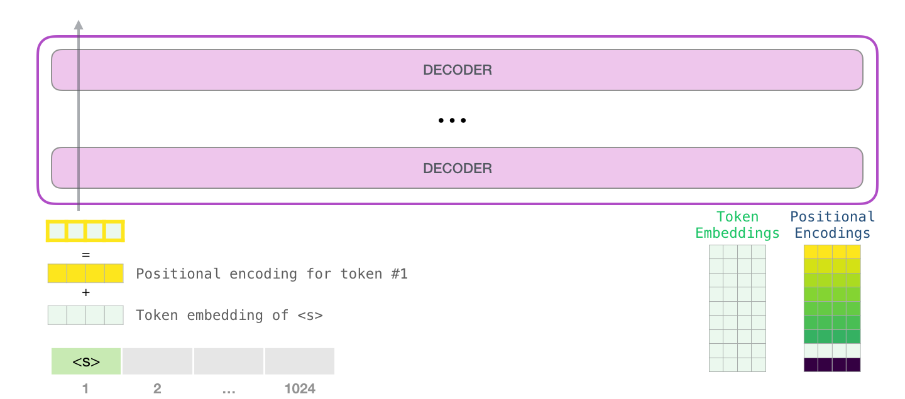

两者加和之后进入第一层 Transformer Block。和原始 Transformer 不同，GPT-2 之后的主流 LLM（LLaMA、Qwen）几乎都用 RoPE 而非绝对位置 embedding。

### 5.4 沿着 Decoder Stack 向上传

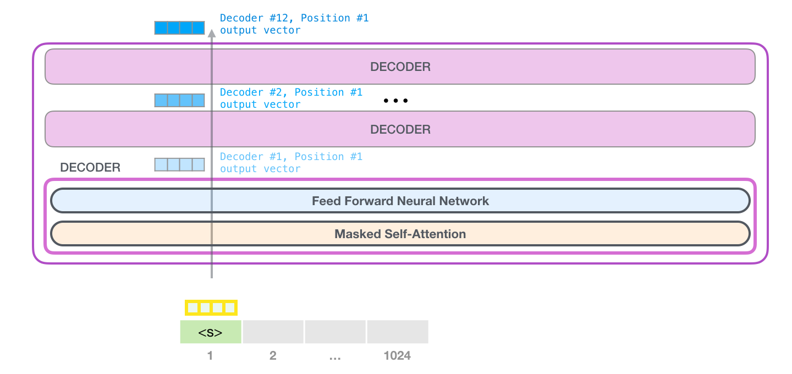

每一个 Decoder Block 都会更新所有 token 的表示，token 流到第 12 层（GPT-2 Small）时已经融合了 1024 长度内的全部上下文。最后一个 token 的隐藏状态被送进 LM Head：

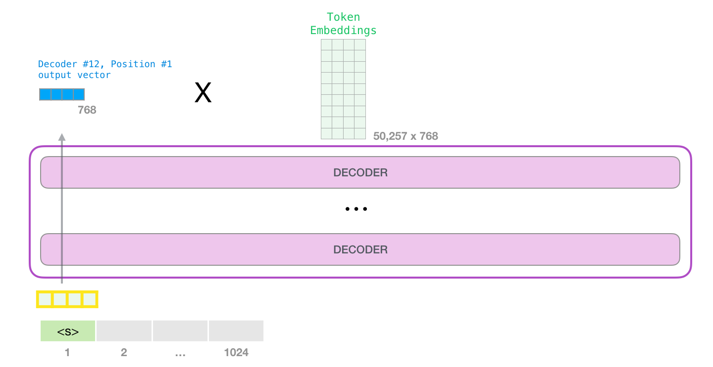

注意 LM Head 通常和 Input Embedding 共享权重（weight tying），这也是 Decoder-Only 模型参数量比同样深度的 Encoder-Decoder 更节省的一个原因。

## 6. 几个常见误解

| 误解 | 正确理解 |
|---|---|
| “Decoder-Only 看不到完整上下文，所以效果差。” | 训练时看左侧是约束，但推理时上下文被自回归逐步填满，模型可以等到读完整个 prompt 再开始生成。 |
| “BERT 双向，所以语义理解更强。” | 语义理解强 ≠ 通用能力强。BERT 在分类/检索上确实强，但缺少生成路径，无法直接支持 Agent / 工具调用。 |
| “GPT 系列就是 Decoder-Only 套娃，没有创新。” | Decoder-Only 是结构选择，GPT-3 之后的核心创新是规模、指令微调、RLHF、工具使用，而不是架构本身。 |
| “Encoder-Decoder 会被淘汰。” | 在显式 Seq2Seq、长输入翻译、ASR 等场景下，Encoder-Decoder 仍有优势。但通用 LLM 几乎全是 Decoder-Only。 |
| “把 BERT 改成 Decoder-Only 就能生成。” | 不行。BERT 没有用 causal mask 训练，把 mask 摘掉后权重也没有按自回归目标优化，需要重新预训练。 |

## 7. 工程实现检查

把 Decoder-Only 模型落到代码时，几个易错点：

| 检查项 | 期望状态 |
|---|---|
| Mask 类型 | causal mask 是下三角为 0、上三角为 `-inf`，与 QK^T 同形状可 broadcast。 |
| Position encoding | 不要和原始 Transformer 的 Sinusoidal 混用，主流 LLM 改用 RoPE 或 ALiBi。 |
| Weight tying | LM Head 权重和 Input Embedding 共享时要确认形状匹配，可显著省参数。 |
| KV Cache 形状 | 缓存 (K, V) 应是 `(B, H, N_max, D)`，新 token 只需拼接 N 那一维。 |
| 训练目标 | Next Token Prediction 的 loss 只对非 padding token 计算，否则长 prompt 会被 padding token 稀释梯度。 |
| 采样策略 | 训练时用 teacher forcing，推理时按 temperature / top-p / top-k 采样。 |
| Sliding window | 超长上下文时配合 sliding window attention 减少每层 attention map 的 n² 成本。 |

## 8. 关键结论

1. Encoder-Only / Decoder-Only / Encoder-Decoder 是 Transformer 的三种拓扑，分别对应“理解”、“生成”、“显式对齐的生成”。任务类型决定架构选择。
2. BERT 的 Masked LM 和 GPT 的 Next Token Prediction 不是“两种差不多的预训练”，而是决定了模型能学到什么、能用在什么场景。MLM 学会填空，NTP 学会续写。
3. Decoder-Only 在数据、训练效率、推理能力、规模涌现、工程生态上都更适配“通用 LLM”的目标，所以成为 LLaMA、Qwen、Mistral、GPT-3/4 等模型的事实标准。
4. Encoder-Only 和 Encoder-Decoder 并没有被淘汰，分类、检索、显式 Seq2Seq 仍然是它们的强项。架构选择要看任务，不要无脑 Decoder-Only。
5. 面试中如果只能记住一张表，就记上面的“架构 × 训练目标 × 适用任务”对比表，外加一句话：Decoder-Only 是“训练目标 = 自回归，能力 = 通用”的最优折中。

## 9. 面试速答卡

Q1：GPT 和 BERT 有什么本质区别？
A：BERT 是 Encoder-Only，训练目标是 Masked LM（双向填空），适合分类、检索等理解类任务；GPT 是 Decoder-Only，训练目标是 Next Token Prediction（自回归），适合生成、对话、In-Context Learning。本质区别是 attention 方向和训练目标。

Q2：为什么 LLM 都用 Decoder-Only？
A：Next Token Prediction 自监督数据无限、一次前向算 n 个位置、推理天然支持自回归、规模上去后涌现 ICL/CoT；加上 vLLM/PagedAttention/KV Cache 等工程生态首选 Decoder-Only，所以成为事实标准。

Q3：Decoder-Only 真的“看不到未来”吗？会不会损失信息？
A：训练时是看不到未来的（causal mask 是归纳偏置），但推理时上下文是被模型自己“逐步填满”的，prompt 越长模型获得的全局信息越多。双向 attention 对判别任务更友好，对生成任务反而会破坏因果性。

Q4：BERT 能不能改成 Decoder-Only 来生成文本？
A：不能直接改。BERT 没有用 causal mask 训练，权重也没有按 Next Token Prediction 优化，需要重新预训练。工程上 BERT 通常被当作 Encoder 抽取特征，再配一个独立的 Decoder。

Q5：Encoder-Decoder 还有用吗？
A：有。显式 Seq2Seq 任务（翻译、摘要、改写）、长输入压缩、ASR / TTS 等场景 Encoder-Decoder 仍有结构优势。但在通用 LLM 领域，Decoder-Only 几乎完全胜出。
