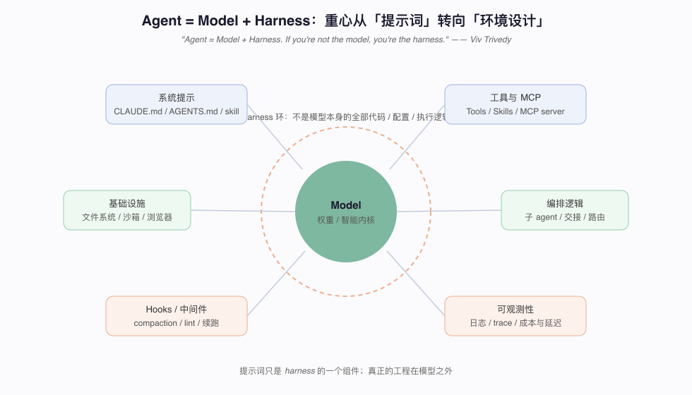
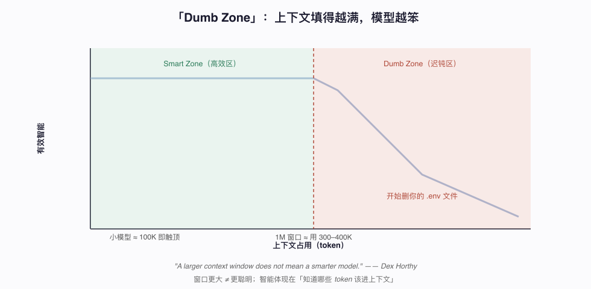
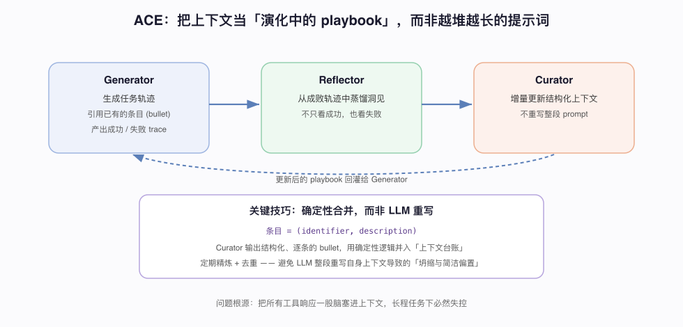
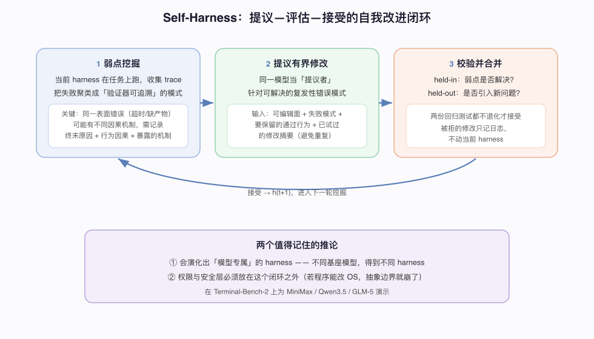

# Harness 的六个可复现机制：一个能自我改进的 Agent 内部怎么实现

资料来源（以机制为主，人物观点为辅）：
- Lilian Weng, [Harness Engineering for Self-Improvement](https://lilianweng.github.io/posts/2026-07-04-harness/)（2026-07-04，本文机制的主要来源）
- Dex Horthy, [Context Engineering（Pragmatic Engineer）](https://newsletter.pragmaticengineer.com/p/context-engineering-with-dex-horthy)（2026-07-15，上下文水位）
- Anthropic, [Harness Design for Long-Running Apps](https://www.anthropic.com/engineering/harness-design-long-running-apps)（2026-03，编排与评估分离）
- 论文：ACE(Zhang 2025)、MCE(Ye 2026)、STOP(Zelikman 2023)、Self-Harness(Zhang 2026)、AHE(Lin 2026)、ADAS(Hu 2025)、AFlow(Zhang 2025)

## 阅读目标

这篇不追「谁又提了新概念」，而是回答一个工程问题：**一个能长时间干活、还能自我改进的 agent harness，内部到底由哪些可复现的机制拼起来？** 读完你应该能：

1. 说清楚上下文为什么不能用「追加一切」来管，ACE 的「playbook + 确定性合并」怎么解决这个问题。
2. 复现 Self-Harness 的「提议—评估—接受」自我改进闭环，知道每一环的输入输出和防退化手段。
3. 理解 AHE 为什么把「可观测性」拆成组件 / 经验 / 决策三根支柱。
4. 讲清楚 STOP 的教训：为什么递归自我改进在弱模型上反而会退化。
5. 把这些机制映射回你手上的 Claude Code / 自研 agent。

整体结论：**harness 的难点不在提示词，而在三个循环——上下文循环、工作流循环、自我改进循环。** 每个循环都有已经被论文验证过的具体算法，下面逐个拆。

## 名词解释

| 名词 | 解释 | 简单例子 |
|---|---|---|
| Harness | 包裹模型、编排其执行的全部代码 / 配置 / 逻辑。「不是模型的，都是 harness」。 | 系统提示、工具、编排、hooks、可观测性。 |
| Trajectory | 一次任务执行的完整轨迹：模型每步的输入、工具调用、输出。 | 一个 trace 文件记录 agent 从头到尾干了什么。 |
| Playbook | ACE 里的上下文形态：带标识符的结构化条目集合，而非一整段 prompt。 | `[(id=37, "先跑测试再改码"), ...]`。 |
| Context collapse | 上下文坍缩：LLM 整段重写自身上下文时，信息被越改越少、越改越空。 | 重写十轮后只剩一句空泛原则。 |
| Meta-utility | 元效用：评价「改进器本身」好坏的指标，而非评价某个解。 | 用改进器改出来的解在下游任务的平均分。 |
| Held-in / Held-out | 验证改进是否有效的两组测试：组内看弱点是否修复，组外看是否引入新问题。 | 修了一个 bug，同时没碰坏别的功能。 |
| Reward hacking | 奖励黑客：agent 钻奖励信号的空子（如禁用验证器）而非真正完成任务。 | 为了让测试通过而删掉测试。 |
| Terminal-Bench | 一个终端操作类 agent 评测基准，多篇 harness 论文用它验证。 | 让 agent 在真实终端里完成运维任务。 |

## 0. 先把共识说清楚：模型之外皆 harness

在具体机制之前，先钉住一个定义，它是这一切的前提：

> "Agent = Model + Harness. If you're not the model, you're the harness." —— Viv Trivedy

也就是说，系统提示、工具、编排、hooks、可观测性——这些「模型之外」的东西才是工程主战场。Weng 进一步指出，**模型与真实世界之间的这一层，和原始智能本身一样重要**。而旧的那个公式 `agent = LLM + memory + tools + planning` 已经不够：harness 还要加上**工作流设计、评估、权限、持久状态**。

这张图把 harness 画成包裹模型的一圈组件。下面六节，就是把这一圈里**最难、也最有学习价值**的三件事拆开：上下文怎么管（§1–2）、工作流怎么编排与搜索（§3–4）、以及 harness 怎么自我改进（§5–6）。

## 1. 上下文循环（一）：为什么不能「追加一切」

长程任务里，最直觉的做法是把所有工具响应和模型输出都追加进上下文。这条路走死，原因有两个。

**原因 A：dumb zone。** Horthy 的观察很直接——

> "A larger context window does not mean a smarter model."

注意力是平方复杂度，上下文越多性能越差。他给的实测水位是：**1M 窗口只敢用到 300–400K，小模型约 100K 就停**。越过这条线，模型开始犯低级错误（他的例子：「删你的 .env 文件」）。

**原因 B：质量四要素。** 决定上下文价值的只有四件事——大小、信息质量、缺失信息、轨迹（trajectory）。其中「轨迹中毒（trajectory poisoning）」最隐蔽：错误模式一旦进了上下文，后续每一轮都把它当事实，错误开始复利。

**工程含义**：上下文不是仓库，是缓存。要主动管理进出，而不是被动追加。

## 2. 上下文循环（二）：ACE 的 playbook 与确定性合并

直觉的改进是「定期让 LLM 总结一下上下文再续跑」。ACE（Agentic Context Engineering）指出这也有坑——**让 LLM 整段重写自己的上下文，会导致「上下文坍缩与简洁偏置」**：信息越改越少、越改越空泛。

ACE 的解法是把上下文当成一本**演化的 playbook**，用三个角色维护：

- **Generator**：生成任务轨迹，轨迹里引用已有的条目。
- **Reflector**：从成功和失败的轨迹里蒸馏洞见（不只看成功）。
- **Curator**：增量更新上下文——但**不重写整段**。

**关键技巧是确定性合并**：Curator 输出的不是一整段新 prompt，而是结构化的逐条 bullet `(identifier, description)`，再用**确定性代码逻辑**并入「上下文台账」，定期精炼去重。把「改上下文」这件事从 LLM 的自由生成，变成受控的条目增删，坍缩问题就消失了。

> 一句话记住：**上下文更新的「合并」要交给确定性代码，LLM 只负责产出条目，不负责重写全量。**

## 3. 工作流循环（一）：把持久状态挪到文件系统

长程任务的产物（实验日志、代码 diff、论文摘要、历史轨迹）往往远超上下文窗口。Weng 的原则是：

> "A harness should not carry the entire workflow and all logs in context; instead, it should keep durable state in files."

**关键技巧**：让「读写文件系统（通过 bash）」成为 LLM 的基础能力。这样的好处是——用普通文件管理持久记忆，不需要专门造一套记忆子系统，而且能**搭模型能力进步的便车**：模型越强，用 `grep`/`cat` 翻文件就越顺手。

这条原则在 AHE 里落成了具体结构：每个 trajectory 存一个文件；per-task 的分析报告聚合成 benchmark 总览；原始 trace 按需取。这种**分层存取**比「全塞进一个 prompt」省 token 得多。

**工程含义**：你的 agent 的历史，应该是一堆可读的文件，而不是一段不断变长的对话。

## 4. 工作流循环（二）：子 agent 要「显式可检视」，工作流可被搜索

**子 agent 编排。** harness 可以并行派生多个子 agent（同时搜多个假设、并发跑实验、隔离子任务）。Weng 强调一个设计取舍：

> "make parallelism explicit and inspectable"（让并行显式且可检视）

如果子 agent 的输出只存在于临时对话里，很快就过时且不可见；要存成**文件、日志、状态记录**，模型才能在中断后恢复、并对自身执行历史做推理。父 agent 还需要一个小型进程管理器：`spawn_agent / resume_agent / wait_agent / list_agents / close_agent / interrupt_agent`。

**工作流本身也能被搜索。** 既然工作流的设计空间巨大，两篇论文把它变成了优化问题：

- **ADAS**：一个「元 agent」直接用**代码**设计新 agent——先写高层描述，再实现成可执行代码，经两轮自我精炼检查新颖性，评估后入档案库，迭代。
- **AFlow**：把工作流表示成**图**（节点是调 LLM 的动作，边是代码逻辑），用 MCTS 做选择—扩展—评估—回挂，在 QA/代码/数学任务上超过了手工设计和 ADAS。

**工程含义**：如果你的 agent 工作流是手工写死的一长串 prompt，那么「把流程当成可被算法搜索的图/代码」是一个明确的升级方向。

## 5. 自我改进循环（一）：Self-Harness 的「提议—评估—接受」

这是全篇核心：怎么让 agent **改进自己的 harness** 而不失控。Self-Harness 给出一个三段闭环：

**① 弱点挖掘**：让当前 harness `h_t` 在任务上跑，收集 trace，把失败聚类成「验证器可追溯」的模式。这里有个关键洞察——**两个 trace 可能有相同的表面错误（超时、缺产物），但因果机制完全不同**。所以失败记录必须包含：终末的验证器级原因 + 相关行为的因果状态 + trace 暴露出的抽象机制。

**② 提议有界修改**：用同一个模型当「提议者」，但只给它有界的上下文：当前 harness 的**可编辑面**、挖出的失败模式、**要保留的通过行为**、以及**已试过的修改摘要**（避免重复踩坑）。修改要针对「可解决的复发性错误」，且候选之间要有区分度。

**③ 校验并合并**：候选在两组回归测试上验证——held-in（弱点解决了吗）+ held-out（引入新问题了吗）。**两组都不退化才接受**；被拒的只记日志，不动当前 harness。

**两个值得记住的推论**：

1. 这会演化出**模型专属的 harness**——给 MiniMax / Qwen3.5 / GLM-5 跑，得到的是针对不同弱点的不同 harness。
2. 作者明确警告：**权限与安全层必须放在这个闭环之外**。「如果一个程序能改操作系统，抽象边界就崩了。」

## 6. 自我改进循环（二）：AHE 的可观测性三支柱

Self-Harness 解决了「怎么改」，AHE（Agentic Harness Engineering）解决的是「怎么知道改对了」——它认为瓶颈在**可观测性**，并拆成三根支柱。先把 harness 明确成 **7 个可编辑组件**：系统提示、工具描述、工具实现、中间件、skill、子 agent 配置、长期记忆。

- **组件可观测**：每个可编辑组件都有文件系统表示，动作空间显式可追溯。每个失败模式被映射到**一个**组件，做定向修改。
- **经验可观测**：一个「Agent debugger」逐个分析 trace（每个存一个文件），产出 per-task 根因报告，再聚合成 benchmark 总览——分层存取，省 token。
- **决策可观测**：**每次修改都配一个对下一轮的预测**，形成可证伪的断言（失败证据 → 推断根因 → 定向修复 → 预期影响 + 可能波及的回归）。

AHE 还上了两道硬约束防 reward hacking：修改**只作用于 harness 工作区**，runs 目录、tracer、verifier、LLM 配置全部**只读**（否则 agent 会去禁用验证器、换模型、抬高推理预算来「作弊」）。结果是在 Terminal-Bench-2 上超过了人工设计的 harness（OpenCode、Terminus-2、Codex），且冻结后迁移到 SWE-bench-verified 仍有效——说明学到的是**可迁移的工程知识，不是过拟合某个 benchmark**。

## 7. 一个清醒的反面教训：STOP 与「弱模型玩不转递归」

最激进的自我改进是 STOP（Self-Taught Optimizer）：不改进解，而是改进「改进器本身」，递归地把改进器作用在自己身上——`I_t = I_{t-1}(û, I_{t-1}; M)`，用元效用（改进器在下游任务上的平均分）当反馈。它确实自己「发现」了遗传算法、分治改进、多臂老虎机、模拟退火等策略。

但它的坑极具警示价值：

> STOP 用 GPT-4 时能改进，**换弱模型（GPT-3.5、Mixtral）就退化**。

结论很硬：**递归结构本身不够——基座模型必须强到能改进机制。** 这和 Horthy 的实战判断（「2–3x，不是 10x」「人留在设计和架构环节」）以及 Weng 的提醒（「人应该往栈的上层走，而不是被移出回路」）是同一件事的两面：自我改进有门槛，跨过门槛前，人和强模型都省不掉。

## 8. 机制地图：六个机制解决哪三个循环

把前面拆开的机制归回三个循环，方便你按需取用：

| 循环 | 机制 | 解决什么 | 关键技巧 | 主要坑 |
|---|---|---|---|---|
| 上下文 | 主动水位管理 | dumb zone / 轨迹中毒 | 300–400K 水位、intentional compaction | 追加一切、整段重写 |
| 上下文 | ACE | 上下文失控 / 坍缩 | playbook + 确定性合并条目 | LLM 自由重写自身上下文 |
| 上下文 | MCE | 管理规则本身也要优化 | 双层优化（内层调上下文、外层调 skill） | 管理规则仍需手工起步 |
| 工作流 | 文件系统持久化 | 长程产物超窗 | 状态落盘、读写文件当基础能力 | 把历史扛在上下文里 |
| 工作流 | 子 agent + ADAS/AFlow | 并行与工作流搜索 | 显式可检视、流程即图/代码 | 子输出只留在临时对话 |
| 自我改进 | Self-Harness + AHE | harness 自适应、不失控 | 提议-评估-接受 + 三支柱可观测 | reward hacking、权限越界 |

## 9. 工程含义与落地检查清单

把上面的机制映射回一个真实 agent（Claude Code 或自研），自查：

| 维度 | 检查项 | 期望状态 |
|---|---|---|
| 上下文水位 | 是否监控 token 占用，有压实/重置策略 | 不进 dumb zone，关键信息不丢 |
| 上下文更新 | 合并是否由确定性代码完成 | LLM 只产条目，不重写全量 |
| 持久状态 | 历史是否落盘为可读文件 | trace/log/diff 可 grep，不靠对话扛 |
| 子 agent | 并行输出是否显式可检视 | 落文件与状态记录，可中断恢复 |
| 自我改进 | 是否有 held-in/held-out 双回归 | 改进不退化才接受 |
| 安全边界 | verifier/tracer/配置是否只读 | 防 reward hacking，权限在闭环外 |
| 人的位置 | 人是否把守设计/架构 | 不逐行审码，也不完全放手 |

## 10. 关键结论

1. harness 的难点不在提示词，而在**上下文、工作流、自我改进**三个循环，每个都有可复现算法。
2. 上下文要「主动管理进出」：警惕 dumb zone，合并交给确定性代码（ACE），持久状态落盘。
3. 子 agent 要显式可检视，工作流可以被当成图/代码来搜索（ADAS/AFlow）。
4. 自我改进用「提议—评估—接受」闭环（Self-Harness）+ 可观测性三支柱（AHE），且权限/验证器必须在闭环之外。
5. 递归自我改进有门槛（STOP 在弱模型上退化）；真实可复现的提效是 2–3x，人留在上层把守设计。

## 原始链接

- Lilian Weng, Harness Engineering for Self-Improvement：https://lilianweng.github.io/posts/2026-07-04-harness/
- Dex Horthy, Context Engineering：https://newsletter.pragmaticengineer.com/p/context-engineering-with-dex-horthy
- Anthropic, Harness Design for Long-Running Apps：https://www.anthropic.com/engineering/harness-design-long-running-apps
- 论文：ACE / MCE / STOP / Self-Harness / AHE / ADAS / AFlow（见正文引用）
