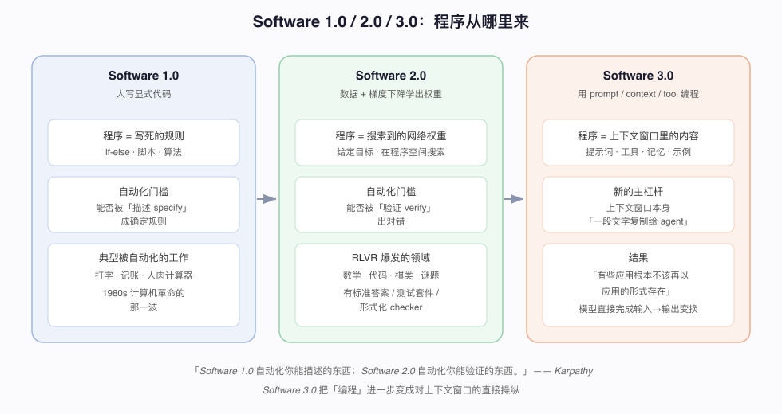
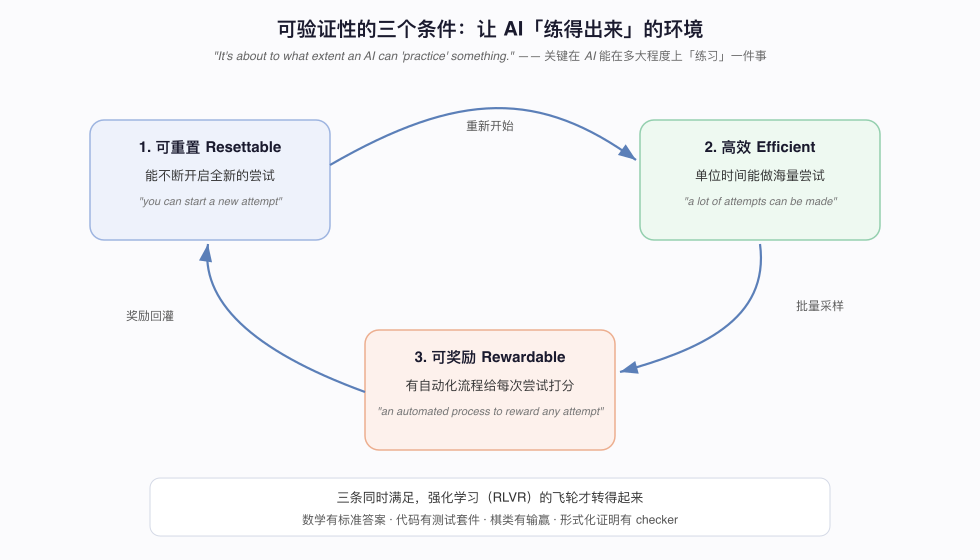
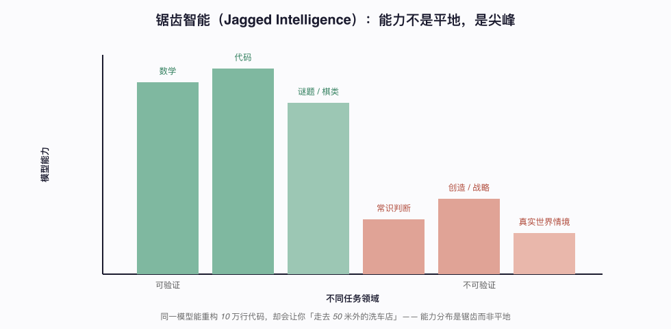
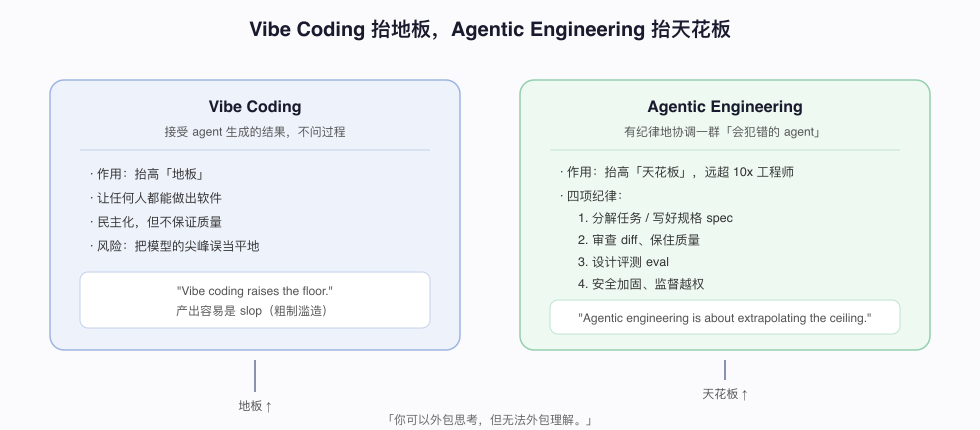

# Software 3.0 与可验证性：Karpathy 的自动化新法则

资料来源：
- Andrej Karpathy, [Verifiability](https://karpathy.bearblog.dev/verifiability/)（2025-11-17）
- Andrej Karpathy, [Sequoia Ascent 2026 summary](https://karpathy.bearblog.dev/sequoia-ascent-2026/)（2026-04-30）

## 阅读目标

关注四个问题：

1. 为什么判断「一个任务会不会被 AI 自动化」的标准，从「能否描述」换成了「能否验证」。
2. 可验证性的三个环境条件是什么，以及它如何解释 RLVR 的爆发。
3. 「锯齿智能」为什么是当前最重要的经验事实，它对工程选型意味着什么。
4. Vibe coding 与 Agentic engineering 的分野，以及如何把它转成可落地的工程纪律。

整体结论是：AI 不是均匀地在所有任务上变强，而是只在「能被自动验证对错」的领域爆发。理解这一点，就理解了为什么代码和数学突飞猛进、而常识判断仍然频频翻车——以及为什么「构造评测/奖励」正在变成新的工程护城河。

## 名词解释

| 名词 | 解释 | 简单例子 |
|---|---|---|
| Software 1.0 | 人手写显式规则代码的阶段。程序是把规则写死。 | if-else 的记账脚本、排版程序。 |
| Software 2.0 | 用数据 + 目标 + 梯度下降，把程序「学进」神经网络权重的阶段。 | 用标注数据训练一个分类器。 |
| Software 3.0 | 用 prompt / context / tool 对 LLM 编程的阶段，上下文窗口是主杠杆。 | 一段文字复制给 agent，替代 shell 脚本。 |
| 可验证性 verifiability | 一个任务的成果能否被自动化流程判定对错。 | 数学有标准答案，代码有测试套件。 |
| RLVR | 基于可验证奖励的强化学习，让模型在有明确对错的任务上自我练习。 | 让模型反复解同一道可判分的题。 |
| 锯齿智能 jagged intelligence | 模型能力在不同领域呈尖峰状分布，而非平滑直线。 | 能重构 10 万行代码，却叫你走去 50 米外的洗车店。 |
| Vibe coding | 接受 agent 生成的结果、不深究过程的开发方式。 | 反复让 agent「再试一下」直到能跑。 |
| Agentic engineering | 有纪律地协调一群会犯错的 agent 并守住质量的专业方法。 | 拆任务、写规格、审 diff、做 eval。 |
| Agent-native | 面向「agent 这个用户」而非人类用户设计的基础设施。 | Markdown 文档、CLI、MCP server、结构化日志。 |

## 1. 背景：从「可描述」到「可验证」

Karpathy 不喜欢把 AI 类比成电力或工业革命，他更主张 AI 是「一种新的计算范式（computing paradigm）」——因为二者本质都是「对数字信息处理的自动化」。在这个视角下，历史上判断「哪些工作会先被自动化」的标准换过一次。

1980 年代预测计算机对就业的影响，最准的特征是**可描述性（specifiability）**：一件事是否「按照一套写死的规则机械地变换信息」。打字、记账、人肉计算器，凡是能写成 if-else 的，都被 Software 1.0 吃掉了。

到了 AI 时代，程序不再由人手写规则，而是「给定目标，在程序空间里用梯度下降搜索权重」（他 2017 年的 Software 2.0）。判断标准随之改变：

> "Software 1.0 easily automates what you can specify. Software 2.0 easily automates what you can verify."
> （Software 1.0 自动化你能「描述」的东西；Software 2.0 自动化你能「验证」的东西。）

这里的关键转移是：新的最准预测特征，从**specifiability**换成了**verifiability**。而它衡量的其实是另一件事——

> "It's about to what extent an AI can 'practice' something."
> （它衡量的，是 AI 能在多大程度上「练习」一件事。）

上图把三个阶段并排：1.0 的程序是写死的规则，2.0 的程序是搜索到的神经网络权重，3.0 的程序只剩「上下文窗口里的内容」。自动化门槛从「可描述」移到「可验证」，是每个阶段分水岭的核心。

## 2. 核心：可验证性的三个环境条件

一个任务要让 AI「练得出来」，它的运行环境必须**同时**满足三条，缺一不行：

1. **可重置（resettable）**——"you can start a new attempt"，能不断开启全新的尝试。
2. **高效（efficient）**——"a lot of attempts can be made"，单位时间能做海量尝试（采样便宜）。
3. **可奖励（rewardable）**——"there is some automated process to reward any specific attempt"，存在一个自动化流程，给每次尝试打出对错分数。

这三条解释了为什么 RLVR（可验证奖励强化学习）恰好在这两年爆发：数学有标准答案、代码有测试套件、棋类有输赢、形式化证明有 checker，它们全都天然满足「可重置 + 高效 + 可奖励」。飞轮得以转动。

用工程的话说：可重置保证 replay 能力，高效保证采样吞吐，可奖励保证有监督信号。这三者合在一起，等于一个可以自洽闭环的训练环境。

## 3. 推论：锯齿智能——能力是尖峰，不是平地

可验证性推出的最重要经验事实是：**模型的能力边界不是一条平滑的线，而是一把锯齿。**

- 在**可验证**领域（数学、代码、有标准答案的谜题），能力狂飙，甚至可能「超过顶尖专家」。
- 在**不可验证**领域（需要真实世界知识、状态、上下文和常识的创造性、战略性工作），能力明显滞后，只能靠「神经网络泛化的运气」或更弱的模仿学习兜底。Karpathy 的原话是 "neural net magic of generalization fingers crossed"——靠泛化的运气，祈祷它奏效。

最直观的例子是他反复讲的洗车故事：同一个模型能重构 10 万行的代码库，却可能告诉你「走去 50 米外的洗车店」。能力在尖峰处闪闪发亮，在低谷处突然翻车。

> "we are slightly at the mercy of what the labs do and what they put into the mix"
> （我们多少受制于实验室到底把什么数据塞进了训练配比。）

这句话的潜台词是：某个尖峰（比如 GPT-4 的棋力）往往不是「通用智能」的提升，而是实验室针对性喂了某类数据。他把它概括成一个乘积式：

> capability spike ≈ verifiability × training attention × data coverage × economic value
> （能力尖峰 ≈ 可验证性 × 训练投入 × 数据覆盖 × 经济价值）

四个因子任何一个趋近于零，整体就趋近于零。这也给创业者指了路：去找「经济价值高、本身可验证、但前沿实验室还没重点投入训练」的交叉地带。

## 4. Software 3.0：把「提示词 + 上下文 + 工具」当成新的编程

在 Sequoia Ascent 2026 的演讲里，Karpathy 把这条线推进到 3.0：

- **Software 1.0**：人写显式代码。
- **Software 2.0**：人构造数据集、目标和神经网络，程序被「学进」权重。
- **Software 3.0**：人通过 prompts、context、tools、examples、memory、instructions 对 LLM 编程。

他的核心论断是：**上下文窗口成为新的主杠杆。**

> "Software 3.0 is about programming through prompting."
> "What's in the context window is your lever over the interpreter."
> （上下文窗口里的东西，就是你对这个解释器的杠杆。）

最典型的例子是安装 OpenClaw：过去要写一个带条件分支、适配各平台的复杂 shell 脚本；现在变成「一段文字，复制粘贴给你的 agent」。agent 会自己读环境、调试、适配——比精确而脆弱的代码更有弹性。

进一步，**「有些应用根本不该再以应用的形式存在」**。他的 MenuGen（拍菜单生成菜品图，含 Vercel 部署、登录、支付一整套）在 3.0 视角下被直接注销：

> "All of MenuGen is spurious in that framing. It is working in the old paradigm."
> （在那个框架下，MenuGen 整个都是多余的，它还活在旧范式里。）

因为神经网络可以直接完成「照片 → 菜品图」这次变换，整个 App 都省了。他因此得出一个判断：**「The user is not the human directly. The user is the human's agent.」**（用户不再是人本身，而是人的 agent。）——这也是第 6 节「agent-native 基础设施」的出发点。

## 5. Vibe Coding 抬地板，Agentic Engineering 抬天花板

这是与实践最相关的一对区分。两者不是非此即彼，而是作用在能力分布的两端：

- **Vibe coding（凭感觉编码）**：接受 agent 生成的结果。**它抬高的是「地板」**——让任何没有工程背景的人也能做出软件。
- **Agentic engineering（agent 化工程）**：一门专业纪律——在协调一群「会犯错的 agent」的同时守住质量。**它抬高的是「天花板」**，熟练者远超传统的「10x 工程师」。

> "Vibe coding raises the floor. Agentic engineering is about extrapolating the ceiling."
> （Vibe coding 抬地板；Agentic engineering 在意的是把天花板往上抬。）

Karpathy 把这门纪律拆成一组可学的技能：分解任务给 agent、写有用的规格（spec）、在快速推进中保住质量、审查生成的 diff、加固安全、以及「用 agent 当杠杆而不是产出 slop（粗制滥造）」。

> "You can outsource your thinking, but you can't outsource your understanding."
> （你可以外包「思考」，但无法外包「理解」。）

这句话是对 vibe coding 的纠偏：思考可以丢给 agent，但对系统的**理解**必须留在人这里——否则你只是把模型的尖峰误当成了平地，迟早翻车。

## 6. Agent-native：为「agent 这个用户」重建基础设施

既然「用户是人的 agent」，那么软件就该为 agent 而重建。Karpathy 列了一份 agent-native 基础设施清单：

- Markdown 文档、CLI、API、MCP server
- 机器可读的 schema、结构化日志
- 可一键复制的 agent 指令
- 安全的权限、可审计的动作、无界面（headless）的初始化流程

他用「传感器与执行器（sensors and actuators）」来类比：agent 靠这些工具去感知和改变世界。对企业团队的意思很直接——**你的产品是给人看，还是给 agent 用？如果只对人友好，agent 就难以接入。**

## 7. 工程含义与检查清单

把「可验证性」这个视角落到实处，可以自查下面几项：

| 维度 | 检查项 | 期望状态 |
|---|---|---|
| 评测 | 你的业务任务有可自动判分的评测/奖励吗 | 有明确 pass/fail 信号，可自动回归 |
| 任务设计 | 目标环境是否可重置、采样便宜 | 能批量回放、低成本试错 |
| 团队能力 | 成员是否掌握拆任务/写 spec/审 diff/eval | 不依赖 vibe，不产出 slop |
| 风险 | 是否在不可验证任务上盲目信任模型 | 高风险环节保留人工复核 |
| 基础设施 | 产品是否 agent-native（CLI/MCP/结构化日志） | agent 可接入、可审计 |
| 招聘 | 面试是否考察完整 agent 项目而非算法题 | 看真实工程产出不看刷题 |

- **评测即护城河**：既然「可验证」决定自动化上限，那么给业务构造自动化评分器（eval/reward）的能力，就等于给 AI 打开了这个业务的入口。这与本仓库 `docs/agent-evaluation-harness` 的主线一致。
- **警惕锯齿**：在不可验证任务上盲目信任，是当前最大的工程风险。
- **把「理解」留在人这里**：思考可外包，理解不行。

## 8. 关键结论

1. 判断 AI 会不会自动化一件事，新标准不是「能否描述」，而是「能否验证」。
2. 可验证性要求环境可重置、高效、可奖励，三者缺一，RL 飞轮不转。
3. 因此能力呈锯齿分布：可验证领域拔尖，不可验证领域翻车。把尖峰当平地是最大的误判。
4. Software 3.0 让「编程」变成对上下文窗口的操纵，有些应用整个可以被模型直接变换取代。
5. Vibe coding 抬地板、Agentic engineering 抬天花板；前者是民主化，后者才是专业壁垒。
6. 软件要为「agent 这个用户」重建 agent-native 接口（CLI、MCP、结构化日志）。

## 原始链接

- 《Verifiability》：https://karpathy.bearblog.dev/verifiability/
- 《Sequoia Ascent 2026 summary》：https://karpathy.bearblog.dev/sequoia-ascent-2026/
