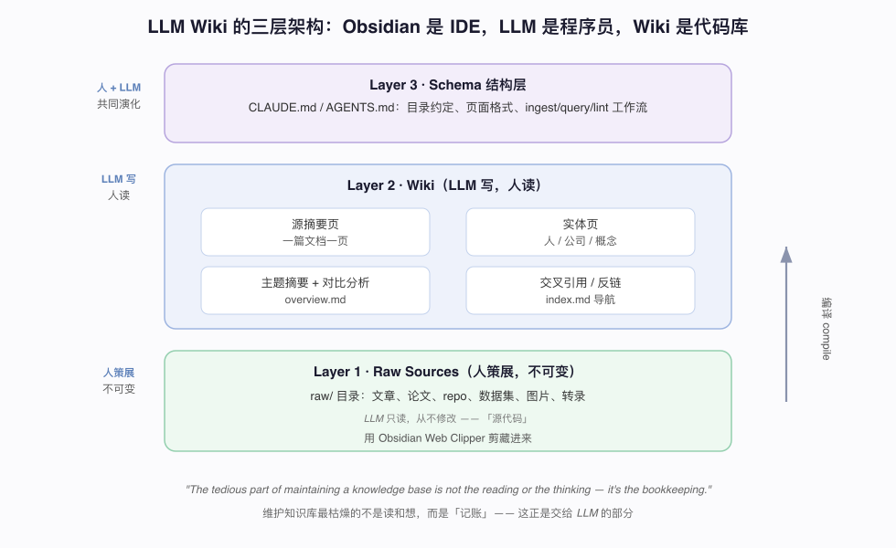
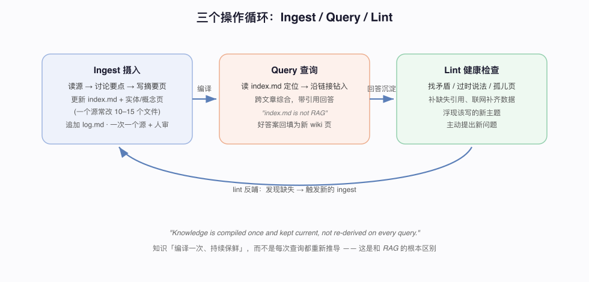

# 后 RAG 时代的 Agent 记忆：Karpathy 的 LLM Wiki 模式

资料来源：
- Andrej Karpathy，LLM Knowledge Bases / LLM Wiki gist（2026-04）
- 社区拆解：[Karpathy's LLM Knowledge Bases](https://agentpedia.codes/blog/karpathy-llm-knowledge-bases)、[Karpathy LLM Wiki Pattern](https://explainx.ai/blog/karpathy-llm-wiki-pattern-agent-memory-guide-2026)

## 阅读目标

关注四个问题：

1. Karpathy 为什么把 token 从「写代码」挪到「维护知识」，换掉检索式 RAG。
2. LLM Wiki 的三层架构各自存什么、谁来写、谁来读。
3. Ingest / Query / Lint 三个操作如何形成自我改进的闭环。
4. 它和 RAG 的本质区别在哪，以及如何落地到本仓库 / Claude Code。

整体结论是：LLM Wiki 让 LLM **增量地把原始资料「编译」成一个会持续增值的互链 Markdown 知识库**，知识「编译一次、持续保鲜」，而不是像 RAG 那样每次查询都重新检索。Karpathy 自己一个研究主题的 wiki 已长到约 100 篇文章、40 万字，几乎全由 LLM 撰写。

## 名词解释

| 名词 | 解释 | 简单例子 |
|---|---|---|
| RAG | 检索增强生成：查询时才取向量库捞几个片段塞进上下文。 | 提问前检索知识库文章再让模型回答。 |
| LLM Wiki | LLM 持续维护的互链 Markdown 知识库，替代检索式 RAG。 | 一个主题的 wiki 随每次摄入变厚变好。 |
| Raw sources | 原始材料层，人策展、不可变，LLM 只读。 | raw/ 目录下的文章、论文、图片。 |
| Schema 层 | 目录约定、页面格式、工作流配置（CLAUDE.md/AGENTS.md）。 | 规定「一篇文档一页摘要」的规则。 |
| Ingest | 把一篇原始材料增量编译进 wiki 的操作。 | 读完一篇论文，更新 10–15 个相关页面。 |
| Query | 沿 index.md 定位、钻入、跨文章综合来回答的操作。 | 从入口页沿反链把某概念的脉络串起来。 |
| Lint | 审计 wiki 健康度：找矛盾、补缺失、浮现新主题的操作。 | 发现两篇文章结论冲突，提示人工裁决。 |
| 复利资产 | 每次摄入都让整体增值的资产，区别于一次性产物。 | 加一篇源，相关文章被加强、重链、纠错。 |

## 1. 背景：为什么要换掉 RAG

Karpathy 在 gist 开篇点破了当下的主流做法：

> "Most LLM + document workflows are RAG: upload files, retrieve chunks, generate an answer."
> （大多数「LLM + 文档」的工作流都是 RAG：上传文件、检索片段、生成答案。）

他认为这条路有几个结构性缺陷：

- **片段是孤立的**，彼此没有链接，知识无法形成结构。
- **不积累**——每次查询都从头捞，知识不会随使用变好。
- **上下文被一次性塞满**，却没有长期记忆。

LLM  Wiki 的思路反过来：**不等你问，先把知识预编译成结构化、互链、可持续维护的资产。**

> "the LLM incrementally builds and maintains a persistent wiki"
> （LLM 增量地构建并维护一个持久的 wiki。）

> "Knowledge is compiled once and kept current, not re-derived on every query."
> （知识「编译一次、持续保鲜」，而不是每次查询都重新推导。）

这一转变的背后，是他自己 token 流向的变化——越来越少花在操纵代码，越来越多花在操纵知识。这本身是个信号：**LLM 的最高杠杆用法，可能不是替你写更多代码，而是替你沉淀一个不断增值的知识体。**

## 2. 三层架构：谁写、谁读、谁不可变

整个系统分三层，职责清晰：



- **Layer 1 · Raw Sources（人策展，不可变）**：原始材料是「源代码」。LLM 只读，从不修改。用 Obsidian Web Clipper 把文章剪进 `raw/`。
- **Layer 2 · Wiki（LLM 写，人读）**：编译产物，包括源摘要页（一篇文档一页）、实体页（人/公司/概念）、主题摘要与对比分析、`overview.md`、以及 `index.md` 导航和交叉反链。
- **Layer 3 · Schema 结构层**：`CLAUDE.md` / `AGENTS.md`，规定目录约定、页面格式和 ingest/query/lint 工作流，由人和 LLM 共同演化。

前端用 Obsidian 当「IDE」。整个系统有个精辟类比：

> "Obsidian is the IDE; the LLM is the programmer; the wiki is the codebase."
> （Obsidian 是 IDE，LLM 是程序员，wiki 是代码库。）

而之所以要把它交给 LLM，是因为：

> "The tedious part of maintaining a knowledge base is not the reading or the thinking — it's the bookkeeping."
> （维护知识库最枯燥的不是读和想，而是「记账」。）

读和思考人乐意做，但**记账**（建索引、补反链、更新实体页、维护一致性）恰恰是 LLM 擅长又不怕烦的部分。

## 3. 三个操作：Ingest / Query / Lint 的闭环

LLM Wiki 不是一次性建好，而是靠三个操作持续运转、自我改进：



**Ingest（摄入）**：读源 → 讨论要点 → 写摘要页 → 更新 `index.md` 和实体/概念页（一个源常常要改 10–15 个文件）→ 追加 `log.md`。Karpathy 偏好**一次一个源、人工过目**，而不是批量灌入。

**Query（查询）**：LLM 读 `index.md` 定位到相关页 → 沿链接钻入 → 综合出带引用的答案。答得好的内容会被**回填成新的 wiki 页**。这里有个关键细节：

> "index.md is not RAG"
> （index.md 不是 RAG。）

它不做向量匹配、不切片，只是让 agent「少打开几个完整的文件」，靠导航而非检索。

**Lint（健康检查）**：像 linter 一样审计 wiki——找**矛盾**、**过时说法**、**孤儿页**，补**缺失的引用**、联网**补齐数据**，并**浮现该写的新主题**、主动提出新问题。Lint 发现的缺口会反过来触发新的 Ingest，闭环由此转起来。

## 4. 它和 RAG、和「写代码」的根本区别

把 LLM Wiki 和两类常见做法摆在一起对比：

| 方面 | RAG | LLM Wiki |
|---|---|---|
| 知识形态 | 孤立片段 chunk | 互链的结构化节点 |
| 何时组织 | 查询时才临时检索 | 摄入时就预编译好 |
| 是否积累 | 每次查询重新捞，不增值 | 每次摄入都让整体变厚变好 |
| 适用规模 | 百万 token 以上大库 | 约 50K–100K token（150–200 页）内更优 |
| 导航方式 | 向量相似度匹配 | index.md 导航 + 沿链接钻入 |

规模上的取舍很实际：**中小规模（几十万 token）用 wiki 更准更好维护，百万级以上再退回 RAG，中间用混合。**

而它和「写代码」的根本区别在于**资产属性**：

- 代码是**一次性产物**：生成、运行、完事。
- 知识库是**复利资产**：每加一篇源，相关文章都可能被加强、重链、纠错，整体持续增值。

这就是为什么 Karpathy 说 token 流向从「操纵代码」转向「操纵知识」——代码会过时，结构化的知识会复利。

## 5. 落地到本仓库 / Claude Code

这个模式很好落地，因为本仓库本身就是一堆 Markdown 文档。可按下面的骨架起步：

```text
docs/wiki/
├── CLAUDE.md          # Layer 3：目录约定、页面格式、ingest/query/lint 工作流
├── raw/               # Layer 1：原始文章/论文，不可变，LLM 只读
├── index.md           # 导航：不是 RAG，是让 agent 少开几个文件的入口
├── log.md             # 摄入日志，可 grep "^## \[" log.md | tail -5
├── overview.md        # 主题级综述
├── sources/           # Layer 2：每篇源一个摘要页
├── entities/          # 实体页：人 / 公司 / 概念
└── topics/            # 主题摘要与对比分析
```

落地要点：

1. **先写 schema（CLAUDE.md）**：把目录约定和三个操作的步骤写成给 agent 的指令，这是整个系统的「源代码」。
2. **摄入走增量、一次一源**：每丢进一批源，让 agent 新增/更新对应摘要页、实体页和反链，追加 log。
3. **加 lint 步骤**：定期让 agent「通读 wiki，找矛盾、补缺失引用、列该补的主题」。
4. **查询走链接而非检索**：提问时让 agent 从 `index.md` 沿反链扩散，而不是对整库做向量检索。
5. **本仓库即是起点**：`docs/` 下已有的评测、记忆、上下文工程系列，正好可以重构成「源 → wiki → lint」的三层结构，与本仓库 `docs/agent-memory-survey` 的记忆主题互相印证。

## 6. 边界与误区

- **策展仍是人的活**：`raw/` 的质量决定上限，垃圾进垃圾出。
- **lint 的可靠性存疑**：让 LLM 自己查自己的矛盾，可能漏也可能幻觉出假「矛盾」，关键结论仍需人复核。
- **规模有上限**：约 100 个源、几十万 token 可行；到几百万 token 时，链接一致性和「沿链接导航」是否撑得住，仍需观察，必要时要退回 RAG 或混合方案。
- **别当成银弹**：wiki 适合「需要长期累积、反复查阅」的研究型知识；一次性的问答未必值得建库。

## 7. 工程含义与检查清单

| 维度 | 检查项 | 期望状态 |
|---|---|---|
| 结构 | 是否有清晰的三层（raw/wiki/schema） | 职责分离，raw 不可变 |
| 摄入 | 是否一次一源、人工过目 | 增量、可审计、有 log |
| 导航 | 查询是否走 index.md + 链接 | 不依赖向量检索 |
| 健康 | 是否有定期 lint | 矛盾/孤儿页/缺失被暴露 |
| 沉淀 | 好答案是否回填为新页 | 知识随使用增值 |
| 规模 | 是否匹配 wiki 适用区间 | 超阈值时切回 RAG/混合 |

## 8. 关键结论

1. Karpathy 把 token 从「写代码」挪向「维护知识」：LLM 的高杠杆用法是沉淀复利知识体，而非一次性代码。
2. LLM Wiki 用「预编译 + 持续保鲜」替代 RAG 的「每次查询重新检索」。
3. 三层架构职责清晰：raw 源（不可变）→ wiki（LLM 写、人读）→ schema（工作流约定）。
4. Ingest / Query / Lint 三操作形成自我改进闭环；lint 发现的缺口反哺 ingest。
5. 中小规模（几十万 token）用 wiki 更优，超大规模退回 RAG 或混合。

## 原始链接

- Karpathy 博客总览：https://karpathy.bearblog.dev/blog/
- Karpathy's LLM Knowledge Bases：https://agentpedia.codes/blog/karpathy-llm-knowledge-bases
- Karpathy LLM Wiki Pattern（构建指南）：https://explainx.ai/blog/karpathy-llm-wiki-pattern-agent-memory-guide-2026
