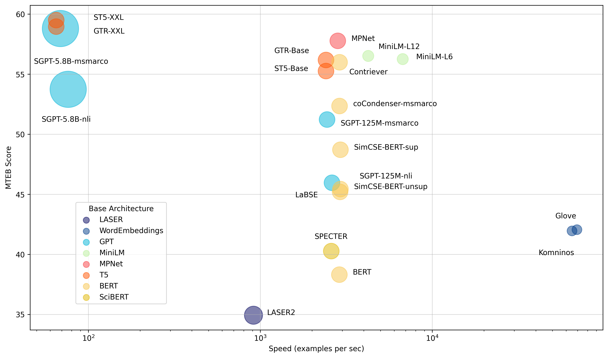
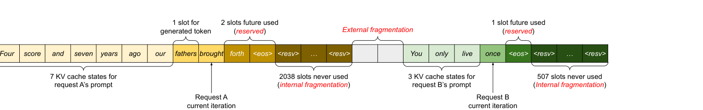
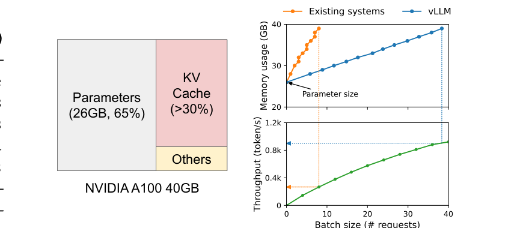
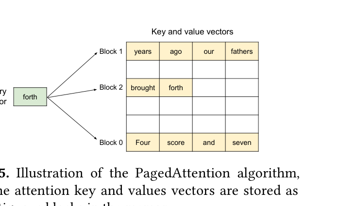
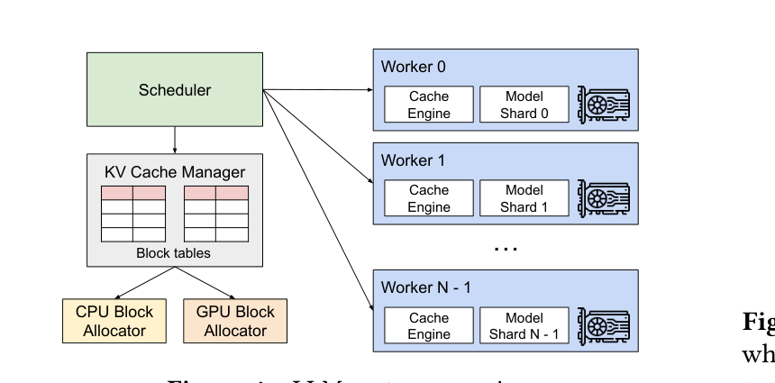

# KV Cache 是什么？为什么能加速推理？

资料来源：
[KV Caching Explained: Optimizing Transformer Inference Efficiency — not-lain](https://huggingface.co/blog/not-lain/kv-caching)
[Efficient Memory Management for LLM Serving with PagedAttention (Kwon et al., SOSP 2023)](https://arxiv.org/abs/2309.06180)
[vLLM Blog: vLLM v0.2.0 发布说明（含 PagedAttention 动画）](https://vllm.ai/blog/2023-06-20-vllm)
[HuggingFace Transformers KV Cache 文档](https://huggingface.co/docs/transformers/kv_cache)

## 阅读目标

关注三个问题：

1. 自回归推理为什么会出现 O(n²) 的冗余计算，KV Cache 如何把这一步降到 O(n)。
2. KV Cache 在显存里到底长什么样，prefill 与 decode 两个阶段分别承担什么角色。
3. KV Cache 在工程上为什么难管理，PagedAttention、continuous batching、quantized cache、shared-prefix caching 等方案在解决哪一类具体问题。

核心结论是：KV Cache 利用了自回归推理中“历史 token 的 K/V 在新一轮前向中不再改变”这一事实，把每一步的注意力计算从 O(n) 降到 O(1)（单 token 视角），让 n 步生成的总复杂度从 O(n²) 降到 O(n)。代价是每生成一个 token 都要为它预留 K/V 空间，显存占用与序列长度线性增长；多请求并发时这块显存的管理（碎片、共享、压缩）会成为系统吞吐的主要瓶颈。PagedAttention 把虚拟内存分页思想搬进 KV Cache，让显存占用逼近零浪费；continuous batching、prefix caching、quantized cache 进一步提升多请求吞吐。

## 名词解释

| 名词 | 解释 | 简单例子 |
|---|---|---|
| KV Cache | 自回归推理中缓存每一层、每一头、每一个历史 token 的 K 与 V 张量。新 token 只需算自己的 Q，再用全量 K/V 做一次 attention。 | 生成第 100 个 token 时，把 1..99 的 K/V 都从 cache 里取出来复用。 |
| Prefill | 推理第一阶段：把整段 prompt 一次性喂进模型，并行算出所有 prompt token 的 K/V 并写入 cache。 | 拿到 1024 长度的 prompt，一次前向算完 1024 个位置的 K/V。 |
| Decode | 推理第二阶段：每次只跑一个新 token，从 cache 读取历史 K/V 做 attention，得到下一个 token 后把它的 K/V 追加到 cache 末尾。 | 逐 token 生成答案，每步只算 1 行 Q 与 1 个新 K/V。 |
| 增量推理（Incremental Inference） | 只对“上一次没见过的部分”做前向，其余用 cache 复用。等价于 decode 阶段。 | decode 第 t 步时，模型输入只有第 t-1 个新 token 的 Q。 |
| Cache hit | cache 中已经有这一层、这一头、这个位置的 K/V，可以直接读取而不用重算。 | 在 decode 阶段，历史 token 的 K/V 全部命中。 |
| Memory bound | GPU 算力还没用满就被显存带宽或容量卡住。decode 单 token 时算量很小，但读 K/V 是大块访存，吞吐受带宽主导。 | H100 在 8k context decode 时算力利用率个位数。 |
| PagedAttention | vLLM 提出的 KV Cache 内存管理方案：把 cache 切成固定大小的 block（类比 OS 页），通过 block table 维护逻辑块到物理块的映射，避免碎片和复制。 | 一个请求的 K/V 散落在若干非连续 block 里，但 block table 让 attention kernel 仍能按虚拟地址访问。 |
| Block table | 一个请求拥有的 block id 列表，类似 OS 的页表。 | 请求 A 的 block table = [12, 7, 99]，表示逻辑 block 0/1/2 映射到物理 block 12/7/99。 |
| Block size | PagedAttention 中一个 block 包含的 token 数，常见 16 或 32。 | block size 16 表示每个 block 容纳 16 个 token 的 K/V。 |
| Continuous batching | vLLM/TGI 等推理引擎的调度策略：每个 decode step 后重新组织 batch，新完成的请求立刻退出，空位立刻被新请求填满。 | 不需要等最慢的请求结束才统一进入下一批。 |
| Prefix caching（Prompt caching） | 多个请求共享同一段 prompt 的 K/V，只算一次、复用 cache。 | system prompt “你是一个助手” 被 1000 个请求共用，省下 1000 次重复 prefill。 |
| Quantized cache | 把 K/V 用 int4/int8 量化存储，牺牲少量精度换显存。 | HF 的 `QuantizedCache` 支持 hqq/quanto 后端。 |
| Sliding window attention | 部分层只保留最近 W 个 token 的 K/V，控制 cache 长度。 | Mistral、Gemma2 在部分层用 4096 窗口。 |

## 1. 背景：自回归推理的算力账

Decoder-Only LLM 在生成时是自回归的：每一步生成 1 个 token，把它拼到序列末尾，再做一次前向。设第 t 步的序列长度为 t，Self-Attention 的复杂度是 O(t² · d)。把 1..n 步加总，总成本是 O(n² · d) —— 这是 O(n²) 平方级的。

[KV Caching Explained](https://huggingface.co/blog/not-lain/kv-caching) 这篇 HuggingFace 博客在开篇就强调：KV Cache 不是优化技巧，而是自回归生成的“必要条件”，否则 n 步推理会随序列长度爆炸。



这是 HF 博客 [KV Caching Explained](https://huggingface.co/blog/not-lain/kv-caching) 的封面。博客明确点出缓存的核心动机：自回归模型每生成一个新 token 都要重新计算整个序列的 K/V，这是冗余的；缓存让历史 token 的 K/V 不被重算。

## 2. 自回归推理逐步展开

设序列为 `x₁, x₂, …, x_t`，目标是预测 `x_{t+1}`。标准 decoder-only 的每个 attention 层对每一步都做一次完整前向：

- 步骤 1：用 `W_Q, W_K, W_V` 把 `x₁..x_t` 投影成 `Q_t, K_t, V_t`，形状 `(B, H, t, D)`。
- 步骤 2：算 `softmax(Q_t · K_t^T / √D) · V_t`，得到新表示。
- 步骤 3：FFN、LayerNorm、残差继续。
- 步骤 4：LM Head 投影到词表，采样出 `x_{t+1}`。

第 t+1 步重复相同动作，序列长度变成 t+1。前面的 t 个 token 的 embedding 完全没变，所以它们对应的 `K_t[1..t]` 和 `V_t[1..t]` 在第 t+1 步仍然有效。

这就是 KV Cache 的全部数学依据：**新一步只需要算 `x_{t+1}` 的 Q/K/V，而 K/V 中只有最后一行是新的，其余 t 行可以复用。**

## 3. 观察：历史 token 的 K/V 可复用

把每一步的 QK^T 写出来就看得最清楚。设第 t 步的 Q 矩阵（每行一个 token 的 query）是 `Q_t ∈ ℝ^{t × d}`，K 矩阵是 `K_t ∈ ℝ^{t × d}`：

```
A_t = softmax(Q_t · K_t^T / √d)
```

第 t+1 步：

```
Q_{t+1} = [q₁, q₂, ..., q_t, q_{t+1}]  (t+1 行)
K_{t+1} = [k₁, k₂, ..., k_t, k_{t+1}]
A_{t+1} = softmax(Q_{t+1} · K_{t+1}^T / √d)
```

`Q_{t+1} · K_{t+1}^T` 是一个 `(t+1) × (t+1)` 的矩阵。但前 t 行和前 t 列（即 `q₁..q_t` 与 `k₁..k_t` 的点积）在第 t 步已经算过了，第 t+1 步只需要：

- 新增一行：`q_{t+1} · K_{t+1}^T`，即当前 token 与全部历史的相似度。
- 新增一列：`Q_t · k_{t+1}^T`，但 attention 是 causal 的，这一列会被 mask 掉，不需要。
- 复用前 t×t 子矩阵。

所以“每一步多算的注意力”只有一行 Q 乘以 t 个 K，外加一个新 K 和新 V 的投影。算量从 `O(t · d · (t+1)) = O(t² · d)` 降到 `O(t · d)`。

整段 n 步生成的总算量从 `O(n² · d)` 降到 `O(n² · d)` 的前缀 + `O(n · d)` 的增量部分；首步 prefix 占主导，之后每步线性增长。换句话说：**有 cache 之后，每步只算 O(1) 行新注意力，单 token 平均成本 O(n)。**

## 4. 缓存形状与两阶段推理

### 4.1 cache 形状

主流实现把 KV Cache 维护成两个张量（每层一份）：

```text
K_cache: (B, H, N_max, D)
V_cache: (B, H, N_max, D)
```

- `B` = batch size（并发请求数）。
- `H` = 注意力头数（MHA），或 KV 头数（MQA/GQA 下 H_KV < H）。
- `N_max` = 当前 cache 已使用的最大长度，会随 decode 增长。
- `D` = 每头向量维度，典型 64 或 128。

HuggingFace Transformers 的 `DynamicCache` 把 K/V 张量以 `(num_layers, 2, B, H, N, D)` 的元组形式存到 `past_key_values`，新 token 的 K/V 在每一层被 `cat` 到 N 那一维：

```python
# 每层伪代码
k_new = x @ W_K      # (B, H, 1, D)
v_new = x @ W_V
k_cache = cat([k_cache, k_new], dim=2)   # N -> N+1
v_cache = cat([v_cache, v_new], dim=2)
attn = softmax(q @ k_cache.transpose(-1, -2) / sqrt(D)) @ v_cache
```

### 4.2 Prefill 与 Decode 两个阶段

| 阶段 | 输入 | 算的 K/V | 写出的 cache | 算力特征 |
|---|---|---|---|---|
| Prefill | 整段 prompt `x₁..x_n` | 全部 n 个 token 的 K/V | 写入初始 cache | 并行、算力 bound（GEMM） |
| Decode | 上一步刚生成的 1 个 token | 仅 1 个新 K/V | append 到 cache 末尾 | 串行、访存 bound（读全量 K/V） |

两个阶段的瓶颈完全不同：

- **Prefill** 是大矩阵乘，算力利用率高，单次延迟可控但耗算力。
- **Decode** 是 1 行 Q × N 行 K + softmax + V，每次只算一个新 token，但每一步都要读完整段历史 K/V。一块 H100 在 8k context 的 decode 时算力利用率可能只有 5-10%，瓶颈在 HBM 带宽。这就是为什么 decode 阶段常被叫做 “memory bound”。

工程上一般把 prompt 长度远超 1 的 prefill 与逐 token 的 decode 用同一个 cache 连接起来，统称 “incremental decoding”。

## 5. 显存占用分析

KV Cache 的显存占用公式：

```
cache_size = 2 · B · H_KV · N · D · precision_bytes · num_layers
```

其中 2 是 K 和 V 各一份。代入典型数字：

| 模型 | num_layers | H (KV 头) | D | 4k context, fp16, B=1 | 32k context, fp16, B=1 |
|---|---|---|---|---|---|
| Llama-2 7B | 32 | 32 | 128 | ≈ 1.0 GB | ≈ 8.0 GB |
| Llama-2 70B | 80 | 8 (GQA) | 128 | ≈ 1.0 GB | ≈ 8.0 GB |
| Llama-3 8B | 32 | 8 (GQA) | 128 | ≈ 0.25 GB | ≈ 2.0 GB |
| GPT-3 175B | 96 | 96 | 128 | ≈ 9.0 GB | ≈ 72 GB |

几个工程判断：

- LLaMA-2 70B 用 GQA 把 KV 头从 64 降到 8，cache 缩到原来的 1/8。
- 在 4k context 下，7B/8B 模型的 KV Cache 已经和权重同量级；长上下文场景（100k+）下 cache 远超权重。
- batch size B 直接乘数：8 卡 A100 上做 B=64、context 8k，cache 占用几十 GB 是常态。
- 量化：把 `precision_bytes` 从 2 (fp16) 降到 1 (int8) 或 0.5 (int4)，显存近似线性下降。

## 6. KV Cache 的工程挑战

[KV Caching Explained](https://huggingface.co/blog/not-lain/kv-caching) 列出了几个常见痛点：

| 挑战 | 现象 | 原因 |
|---|---|---|
| 显存碎片 | 大量短请求时 cache 利用率下降 | 给每个请求预分配连续大块，但实际只用了小部分 |
| 预分配浪费 | 长请求预留 2048 位但只生成了 200 | 不知道实际长度，只能按 max_len 预留 |
| Batch 间无法共享 | 同一段 system prompt 在 1000 个请求里算了 1000 次 | 每请求一份独立 cache，prefix K/V 重复存在 |
| 不支持 prefix 复用 | 想跳过重复 prompt 重新算 | 没有逻辑地址到物理地址的映射层 |
| Beam search / Parallel sampling 难 | 同一请求的多个分支各自占一份 cache | 拷贝代价高，公共前缀无法共享 |

[vLLM PagedAttention 论文](https://arxiv.org/abs/2309.06180) 在 §3 里把这些问题用图说话：



这张图来自 PagedAttention 论文 Figure 3：两个请求共享一块大连续 cache，请求 A 用了前 8 个槽（其中 1 个给新生成 token，2 个 reserved），后面是请求 B；大量 `<resv>` 槽是预留的未来空间，浅色空槽是 external fragmentation。论文给出的实测数据：现有系统的 cache 有效利用率只有 20.4%-38.2%。



这张图来自 PagedAttention 论文 Figure 1。左侧是 13B 模型在 A100 40GB 上的内存分布：参数占 26GB（65%），KV Cache 占 30% 以上。右侧两张子图：上面是 memory usage vs batch size，vLLM（蓝）线性增长而现有系统（橙）在 batch=8 之前就被卡死；下面是 throughput vs batch size，vLLM 的曲线持续爬升。论文核心结论：cache 管理直接决定最大并发和吞吐。

## 7. PagedAttention（vLLM）：分页 + block table + prefix sharing

PagedAttention 的思路是把 OS 的虚拟内存/分页思想搬进 KV Cache。论文 §4.1 给出的算法示意：



这张图来自 PagedAttention 论文 Figure 5：句子 “Four score and seven years ago our fathers brought forth” 的 K/V 被切成 3 个 block（Block 0/1/2），每个 block 容纳 4 个 token 的 K/V。计算 query “forth” 的 attention 时，kernel 分别 fetch 三个 block 做 QK^T 和 softmax，再合并。块在物理内存里不要求连续。

### 7.1 关键概念

- **Block（页）**：固定大小的 K/V 容器，block size = 16 token 是 vLLM 默认。block 是 PagedAttention 的最小分配单位。
- **Block table（页表）**：每个请求持有一个 block id 列表，把“逻辑 block 编号”映射到“物理 block 编号”。
- **Logical block → Physical block**：请求视角的 K/V 是连续的（按 token 顺序），底层可能分散在任意物理位置。

### 7.2 注意力计算的改造

PagedAttention 的 attention 计算（论文 Eq.4）按 block 拆开：

```
A_ij = softmax( q_i^T · K_j / √d ) / Σ_exp
o_i  = Σ_j V_j · A_ij^T
```

其中 `K_j`、`V_j` 是逻辑 block j 内的 K/V 张量。kernel 实现时按 `block_table[i][j]` 拿到物理地址，分块 fetch、独立计算、最后合并。

### 7.3 prefix sharing

beam search 和 parallel sampling 会让一个请求的多个分支共享同一段前缀。PagedAttention 下，每个分支只需要在自己的 block table 里维护“自己独有的 block”+“共享的 block id”，不需要复制 K/V。论文报告 beam search 在 6 路时能省下 55% cache 内存。

### 7.4 近乎零浪费

固定 block size + 任意顺序分配 + block 复用，三件事叠在一起让外部碎片几乎消失。论文 Figure 2 的对比：

| 系统 | Token states 占用 cache 比例 |
|---|---|
| Orca (max) | 20.4% |
| Orca (Pow2) | 26.8% |
| Orca (Oracle) | 38.2% |
| vLLM | 96.3% |

也就是说 vLLM 把 cache 有效利用率从 20-38% 拉到 96% 以上。

### 7.5 vLLM 系统架构



这张图来自 PagedAttention 论文 Figure 4。中央 Scheduler 协调 KV Cache Manager、CPU/GPU Block Allocator 和 Worker。每个 Worker 有自己的 Cache Engine 和 Model Shard，Scheduler 把 block table 推到 Worker 上做 PagedAttention kernel。

### 7.6 几个 vLLM 动画（来自 [vLLM v0.2.0 发布说明](https://vllm.ai/blog/2023-06-20-vllm)）

| 动画 | 演示内容 |
|---|---|
| `paged-attention-generation-flow.gif` | 自回归生成的 token 流向。 |
| `paged-attention-memory-mapping.gif` | 逻辑 block 到物理 block 的映射与调度。 |
| `paged-attention-prefix-sharing.gif` | 多请求共享同一段 prompt 的 prefix cache。 |
| `paged-attention-beam-search.gif` | beam search 下 beam 间共享前缀 block 的方式。 |

## 8. 进阶：减少 cache 体积的几个方向

### 8.1 Multi-Head / Multi-Query / Grouped-Query Attention

| 方案 | Q 头数 H | KV 头数 H_KV | KV Cache 缩到 | 适用模型 |
|---|---|---|---|---|
| MHA (Multi-Head Attention) | H | H | 1.0x | 原始 Transformer、LLaMA-1 7B/13B |
| MQA (Multi-Query Attention) | H | 1 | 1/H x | PaLM、Falcon |
| GQA (Grouped-Query Attention) | H | G（G 是 H 的因子）| G/H x | LLaMA-2/3、Mistral、Qwen |

直觉是：query 头可以独立，但 K/V 头之间存在大量冗余。GQA 用 4-8 个 KV 头共享给一组 query 头，质量接近 MHA、cache 接近 MQA，是当前主流 LLM 的折中。

### 8.2 Sliding Window Attention

Mistral、Gemma2、Jamba 等模型在部分层只用最近 W 个 token 的 K/V，把 cache 长度从上下文上限降到固定窗口（如 4096），同时配合跨层 “rolling buffer” 实现隐式长程注意力。

### 8.3 Quantized Cache（KV 量化）

| 方法 | 精度 | 显存节省 | 备注 |
|---|---|---|---|
| KIVI | K 用 per-channel int8，V 用 per-token int4 | ~3-4x | 训练后量化，对长上下文友好。 |
| KVQuant | int4 量化 + outlier 处理 | ~4x | 保留对 outlier 的高精度。 |
| HF `QuantizedCache` | hqq (int2/4/8) 或 quanto (int2/4) | 2-8x | 通过 `cache_implementation="quantized"` 直接用。 |

工程上量化 cache 是用精度换显存，长上下文场景几乎必开。

### 8.4 缓存卸载（Offloading）

HF `cache_implementation="offloaded"` / `"offloaded_static"` 把不活跃层的 K/V 暂存到 CPU memory，GPU 只保留当前层的 cache。代价是 prefetch 的 PCIe 带宽和延迟。适合单卡大模型、显存不够但不想量化精度的场景。

## 9. 对比表：MHA / MQA / GQA 与 cache

| 维度 | MHA | MQA | GQA |
|---|---|---|---|
| KV 头数 | H（如 32）| 1 | G（如 8） |
| KV cache 体积（B=1, N=4096, fp16）| 基准 | 1/H（如 1/32）| G/H（如 1/4） |
| 7B 模型、4k context、B=8 | ≈ 8 GB | ≈ 0.25 GB | ≈ 2 GB |
| 质量 | 最高 | 略低 | 接近 MHA |
| 速度 | 基准 | 略快（K/V 共享）| 接近 MQA |
| 代表模型 | LLaMA-1、LLaMA-2 70B 关闭 GQA 时 | PaLM、Falcon | LLaMA-2 70B、LLaMA-3、Mistral、Qwen |

工程选择上：GQA 是当前主流默认，因为它在“显存/带宽” 和 “质量” 之间给出了几乎最优的折中。

## 10. Flash Attention：从 IO 视角重新做 Attention

注意 Flash Attention 跟前面 3 个“减少 cache 体积”的方向是不同角度的事。MHA/MQA/GQA 是改 cache 的形状，KV 量化是改 cache 的精度，sliding window 是改 cache 的长度；Flash Attention 不动 cache，而是在**算 attention 的那一步**把 IO 拉满。

### 10.1 Attention 实际是 memory-bound，不是 compute-bound

一个朴素的 attention forward：

```text
S = Q · K^T          # 写 N×N 矩阵到 HBM
A = softmax(S)        # 再读 S、写 A 到 HBM
O = A · V             # 读 A、写 O 到 HBM
```

N=8192、d=128、fp16 时，`S` 和 `A` 分别是 `8192×8192` 的 fp16 矩阵，单头就要 128 MB。在 32 层、32 头上重复这个过程，HBM 读写量能到 GB 级。

A100 的 HBM 带宽约 1.5 TB/s，FP16 算力约 312 TFLOPS。算力 / 带宽比接近 200。attention 的算术强度（FLOPs / bytes）远低于这个门槛，所以**瓶颈在 HBM 读写，不在矩阵乘**。这是 Flash Attention 的出发点。

### 10.2 Flash Attention 的三件套

Tri Dao 等人在 [FlashAttention: Fast and Memory-Efficient Exact Attention with IO-Awareness](https://arxiv.org/abs/2205.14135)（NeurIPS 2022）里给出了同时**算对、算快、占内存小**的方案。三件套：

1. **Tiling（分块）**：把 Q、K、V 沿 N 维切成小块，每块能装进 SRAM。Q 分成 `Q_1, Q_2, ...`、K/V 分成 `K_1, K_2, ...`。一次只把一块 Q 和一块 K/V 装进 SRAM 算。
2. **Recomputation（重算）**：标准实现把 `S` 和 `A` 写回 HBM。Flash Attention 不写，反向时根据 SRAM 里的输入重算 `S` 和 `A`。代价是一些额外算力，换来 HBM 读写量级下降。
3. **Online Softmax**：朴素 softmax 必须看完全部行才能归一化。Flash Attention 用 [Milakov & Gimelshein 2018](https://arxiv.org/abs/1805.02867) 的 online softmax，在分块遍历时维护 `m_i`（行最大值）和 `ℓ_i`（归一化常数），每块新数据进来时用“max-merge + rescale”更新 `O_i`，最终结果与朴素 softmax 完全一致。

直觉上：朴素 attention 把整张 N×N 表在 HBM 上来回倒，Flash Attention 把数据放在 SRAM 上一边算一边合并中间结果，最后只把 `O` 写回 HBM。

### 10.3 Flash Attention 1 / 2 / 3 演化

| 版本 | 关键改进 | 实测收益 |
|---|---|---|
| Flash Attention 1 | 引入 tiling + online softmax | GPT-2 2-3x speedup，memory 从 O(N²) 降到 O(N) |
| Flash Attention 2 [paper](https://arxiv.org/abs/2307.08691) | 重排 work partitioning，减少非 matmul 算子，更充分利用 warp | 比 FA1 再 2x，A100 上达到理论 FLOPs 的 50-73% |
| Flash Attention 3 [paper](https://arxiv.org/abs/2407.08608) | 用 Hopper 架构的 WGMMA + async copy + FP8 | H100 上 FP16 接近 75% 理论 FLOPs，FP8 接近 peak |

版本数字背后的核心趋势：**让 attention kernel 越来越接近“纯矩阵乘”**，从而把 GPU 的 tensor core 拉满。FA3 的 WGMMA（Hopper 上的 warp-group matrix multiply）让 attention 第一次在 H100 上把 FP8 算力吃满。

### 10.4 Flash Attention 与 KV Cache、GQA 的关系

这三件东西在现代推理栈里通常**叠加使用**，互不冲突：

| 技术 | 解决了什么 | 影响的维度 |
|---|---|---|
| KV Cache | 避免每步重算历史 K/V | 时间复杂度从 O(n²) 降到 O(n) |
| GQA / MQA | 减少 cache 头数 | KV 显存降到 G/H x |
| Flash Attention | 在算 attention 时减少 HBM IO | 显存峰值从 O(N²) 降到 O(N)，速度 2-4x |

工程组合：

- LLaMA-2/3、Mistral、Qwen-2 同时启用 GQA + Flash Attention-2 + KV Cache。
- vLLM 的 prefill kernel 底层就是 FA2，decode kernel 用类似分块但不同并行策略的 FlashDecoding。
- HF Transformers `attn_implementation="flash_attention_2"` / `"flash_attention_3"` 一键切换。

### 10.5 FlashDecoding：长上下文 decode 阶段的延伸

FA2 在 prefill（Q 长度 = N）阶段跑得很好，但 decode 阶段（Q 长度 = 1，K/V 长度 = N）时，**单个 Q 向量跟超长 K/V 矩阵的乘法算术强度极低**，tensor core 利用率很差。

[FlashDecoding](https://crfm.stanford.edu/2023/10/12/flashdecoding.html)（Dao et al. 2023）的解法：

1. 把 K/V 沿 N 维分块，每块算一份局部 attention 输出和 log-sum-exp。
2. 最后用一遍 reduce 把局部结果按正确权重合并。
3. 配合 `split-k` 并行，长 context（>4k）下 decode 速度 8x。

vLLM 的 decode kernel、SGLang 的 RadixAttention decode path、TensorRT-LLM 的 in-flight decode 都用了类似思想。

### 10.6 跟稀疏 Attention 的区别

| 维度 | Flash Attention | 稀疏 Attention（Longformer/BigBird/Sparse Transformer） |
|---|---|---|
| 数学等价 | 与朴素 attention 完全相同（exact） | 通过稀疏 pattern 近似（approximate） |
| 主要收益 | IO 效率 | 复杂度 O(N²) → O(N log N) 或 O(N√N) |
| 长距离依赖 | 全局 attention，不丢信息 | 受 pattern 限制，可能错过跨 pattern 关系 |
| 适用模型 | 几乎所有现代 LLM | Longformer、BigBird 等特定架构 |

面试关键词：**Flash Attention 是 exact attention 的工程实现优化**，不是新算法；稀疏 attention 是数学近似。

### 10.7 工程影响数字

- 显存：attention 中间激活从 O(N²) 降到 O(N)，训练时 activation checkpointing 几乎可以省掉。
- 速度：H100 上 FP16 达到 600+ TFLOPS，约为理论 peak 的 70%。
- 长 context：32k / 128k / 1M 训练成为可能，FA2/FA3 是底层必备。
- 生态：Hugging Face、vLLM、SGLang、TensorRT-LLM、xFormers 都把 FA 作为默认 backend。

## 11. 工程要点：HF cache classes 与推理引擎选型

### 11.1 HuggingFace Transformers 的 cache 类

[HF KV Cache 文档](https://huggingface.co/docs/transformers/kv_cache) 把 cache 类分成几类，按场景选：

| Cache 类型 | 支持 sliding layers | 支持 offload | 支持 torch.compile | 预期显存 | 适用场景 |
|---|---|---|---|---|---|
| DynamicCache | 是 | 是 | 否 | 中 | 默认，按需增长。 |
| StaticCache | 是 | 是 | 是 | 高（预分配大块）| 长度固定、能吃 compile 收益的批量 decode。 |
| QuantizedCache | 否 | 否 | 否 | 低 | 显存吃紧，可接受轻微精度损失。 |
| EncoderDecoderCache | — | — | — | — | T5/BART 这类 Encoder-Decoder，独立管 self / cross attention cache。 |
| Offloaded (Dynamic/Static) | 是 | 是（部分层卸载到 CPU）| 是（Static 变体）| 中 | 单卡大模型、显存紧张。 |

生成时通过 `cache_implementation` 指定，例如：

```python
out = model.generate(
    **inputs,
    max_new_tokens=256,
    cache_implementation="quantized",
    cache_config={"backend": "quanto", "nbits": 4},
)
```

### 11.2 Prefix Caching（HF 用法）

`StaticCache` / `DynamicCache` 都可以 prefill 后多次复用：

```python
prompt_cache = StaticCache(config=model.config, max_cache_len=1024)
with torch.no_grad():
    prompt_cache = model(**inputs_initial, past_key_values=prompt_cache).past_key_values

# 同一 system prompt 后面挂不同问题：
for prompt in prompts:
    past = copy.deepcopy(prompt_cache)
    out = model.generate(**tokenizer(prompt), past_key_values=past, max_new_tokens=20)
```

### 11.3 推理引擎选型

| 引擎 | cache 管理 | 适用场景 |
|---|---|---|
| HuggingFace Transformers | 上述 Cache 类 | 研究、实验、通用任务。 |
| vLLM | PagedAttention + continuous batching + prefix cache | 主流在线 serving、高吞吐。 |
| TensorRT-LLM | block KV + in-flight batching | NVIDIA 生态、极致延迟。 |
| SGLang | RadixAttention（前缀树缓存）+ 协同调度 | Agent、多轮、共享前缀多的场景。 |
| llama.cpp / GGUF | 简单 cache + 量化模型 | 本地 CPU/Metal 推理。 |

选型判断维度：请求是否高频（→ continuous batching）、是否有共享前缀（→ prefix cache）、是否长上下文（→ 量化 / sliding window）、是否需要 torch.compile 优化（→ StaticCache）。

## 12. 关键结论

1. KV Cache 是自回归推理的“必备”而非“优化”：每步新生成 token 的 Q 与历史 K/V 完全够算 attention，历史 K/V 可以直接复用，没有 cache 等于每步重算 O(n²)。
2. 缓存形状是 `(B, H_KV, N, D)`，每层一份 K、一份 V；N 在 decode 阶段线性增长。prefill 阶段算全量 K/V 写入 cache，decode 阶段只算新 token 的 Q/K/V，append 到 cache。
3. KV Cache 的显存成本不可忽视：Llama-2 7B、4k context、fp16、B=1 时已经约 1 GB；B=64、context 8k 时轻松突破几十 GB。LLM serving 的瓶颈通常不是参数，而是 cache。
4. 传统连续分配策略浪费严重：实测 cache 有效利用率 20%-38%。vLLM PagedAttention 用 block + block table + prefix sharing 把利用率拉到 96% 以上，吞吐 2-4x。
5. 进一步压缩 cache 的方向：MQA/GQA 减少 K/V 头数、sliding window 限制 cache 长度、KV 量化降低精度、offloading 把不活跃层暂存到 CPU。GQA + 量化 + PagedAttention 是当前长上下文 serving 的事实组合。
6. Flash Attention 是 exact attention 的工程实现优化，跟 KV Cache / GQA 正交：三者叠加是当代 LLM serving 的标准配置（FA 算得快、GQA 减少 cache 头、KV Cache 复用历史 K/V、PagedAttention 分页管理）。

## 13. 面试速答卡

Q1：KV Cache 是什么，为什么能加速推理？
A：KV Cache 是每层维护的 `(B, H_KV, N, D)` 大小的 K/V 张量，把历史 token 的 K/V 缓存下来。自回归生成新 token 时，Q 是当前 token 的、而 K/V 直接从 cache 取，不需要重新算 `K_t` 和 `V_t`，每步 attention 只多算 1 行 Q × N 行 K，时间从 O(n²) 降到 O(n)。

Q2：Prefill 和 Decode 有什么区别？
A：Prefill 是把整段 prompt 一次性前向，算出所有 prompt token 的 K/V 写入 cache，算力 bound；Decode 是逐 token 生成，每步只算 1 个新 Q/K/V 并 append 到 cache，访存 bound。一个请求通常先 prefill、再多步 decode，模型和 cache 在两阶段之间共享。

Q3：KV Cache 的显存怎么估算？7B 模型 4k context 大约多少？
A：`2 · B · H_KV · N · D · precision_bytes · num_layers`。Llama-2 7B（32 层、32 KV 头、D=128、fp16）4k context、B=1 时约 1 GB；B=8 时约 8 GB。同长度下 LLaMA-3 8B 用 GQA（8 KV 头）只需要约 0.25 GB。

Q4：PagedAttention 解决了什么问题？
A：传统连续分配会让 KV Cache 产生大量外部碎片和预留浪费，实测利用率只有 20%-38%。PagedAttention 把 cache 切成固定大小 block，通过 block table 维护逻辑块到物理块的映射，让 K/V 散落在非连续物理内存中也能正确计算。block size 固定让外部碎片消失；prefix sharing 让多请求共享公共前缀 K/V。vLLM 实测利用率 96% 以上，吞吐 2-4x。

Q5：MQA、GQA、MHA 的区别是什么，工程上怎么选？
A：MHA 用 H 个 KV 头、cache 体积最大；MQA 所有 Q 头共享 1 个 KV 头、cache 缩到 1/H；GQA 把 Q 头分组共享 G 个 KV 头、cache 缩到 G/H。质量上 MHA ≈ GQA > MQA，cache 上 MQA ≈ GQA << MHA。当代主流 LLM（LLaMA-2/3、Mistral、Qwen）几乎都默认 GQA，是显存和质量的最优折中。

Q6：Flash Attention 是什么？它和 KV Cache、GQA 是什么关系？
A：Flash Attention 是**精确 attention**的 IO 优化实现：把 Q/K/V 分块放进 SRAM（tiling）、前向不写 N×N 中间矩阵、反向时用 online softmax + recomputation 重算，把 attention 显存从 O(N²) 降到 O(N)、速度 2-4x。它跟 KV Cache、GQA 完全正交：KV Cache 解决"算过的 K/V 不重算"、GQA 解决"K/V 头数太多"、Flash Attention 解决"算 attention 这一步 HBM 读写太频繁"。三者叠加是现代 LLM serving 的标准配置。