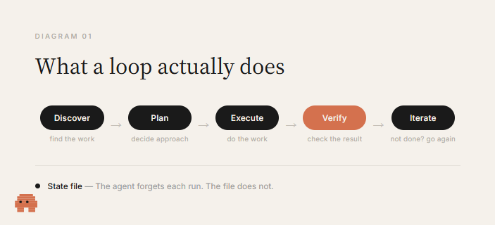
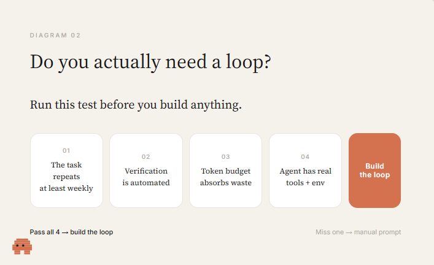
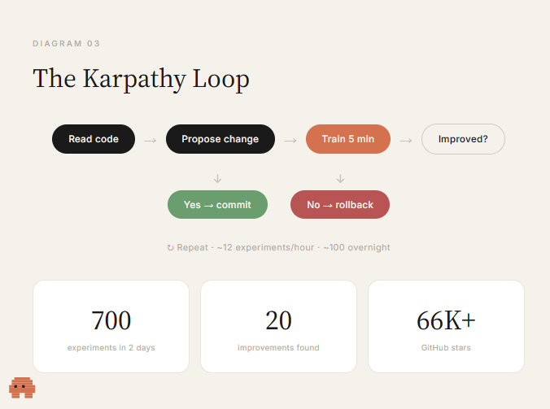
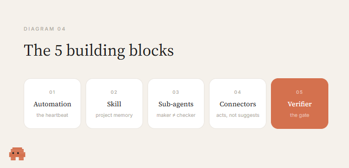
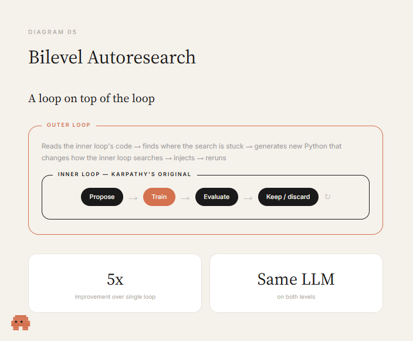

# Loop Engineering：Karpathy Loop 与让它快 5 倍的双层循环

> 资料来源：[《Loop Engineering: The Karpathy Method — and the workflow that just made it 5x better》](https://x.com/0xCodila/status/2072329149520232639)

## 阅读目标

- 理解什么是 loop、Karpathy 的 AutoResearch 把 loop 用在哪里
- 一个可用的 loop 由哪五个构件组成
- Bilevel Autoresearch 如何在外层再套一个 loop 把效果提升 5 倍。

## 核心结论

- Prompt 是一次指令，loop 是一个目标：AI 自己发现要做什么、规划、执行、验证，不达标就把结果喂回去再来一轮，人只定义目的一次。
- 没有真正的 verifier，loop 就退化为「agent 跟自己互相同意」；没有 state，每个周期都从零开始重复同样的错误；没有 stop condition，loop 会一直跑到成功、崩溃或把预算烧光。
- Karpathy 的 AutoResearch 只有三个文件、约 630 行代码，让 agent 在两天内跑了 700 次实验，找到 20 个手工调参漏掉的优化点，核心论点是「如果你有客观指标，就不该由你来跑实验」。
- 任何能用的 loop 都由五个构件拼成：automation、skill、sub-agents、connectors、verifier。Claude Code 和 Codex 现在都内置了这五件。
- Bilevel Autoresearch 在 Karpathy loop 外面再套一个 loop：外层观察内层卡在哪里，并改写内层的搜索代码。同一个 LLM、不靠更聪明的模型，效果是单层 loop 的 5 倍。

## 名词解释

| 名词 | 解释 | 简单例子 |
|---|---|---|
| Loop | AI 围绕一个目标持续工作的循环：发现任务、规划、执行、验证、不达标就反馈重试，直到目标达成或触发停止条件。 | AutoResearch 不断改 `train.py`、训练、看分数、决定保留还是回滚。 |
| Prompt | 一次性指令：你问一次，得到一次答案，下一步由你决定。 | 把一段需求贴给模型，拿到一版代码就结束。 |
| Verifier | 把「重复」变成「进步」的闸门：测试、类型检查、linter、build 等能在无人值守时判定工作是否合格的机制。 | 训练脚本跑完后的 val_bpb 分数。 |
| State | 让 loop 记住「已经试过什么」的旁路记录，通常是一个小文件，记录已完成、已失败、下一步。 | AutoResearch 的实验日志。 |
| Stop condition | loop 的退出条件：目标达成，或硬上限（N 次后停止并汇报）。 | 「每轮 5 分钟训练，最多跑两天」。 |
| Karpathy Loop | Fortune 对 Andrej Karpathy 的 AutoResearch 仓库做法的命名：agent 自动改训练代码、训练、评估、保留或回滚，循环往复。 | 三文件仓库 AutoResearch。 |
| Bilevel Autoresearch | 在 Karpathy loop 外再套一个 loop：外层观察并改写内层「如何搜索」的代码，再注入回去重跑。 | arxiv 论文《Bilevel Autoresearch: Meta-Autoresearching Itself》。 |
| Comprehension debt | loop 越快产出你没写过的代码，仓库与你的理解之间的差距就越大，像复利一样累积。 | 一年后没人读过这套系统却要去 debug。 |
| Cognitive surrender | 当 loop 自动跑起来，人倾向于不再形成判断、直接接受结果。 | 不审 PR，只看 CI 绿了就合。 |

## 1. 背景：为什么 Prompt 模式开始失效

大多数人用 AI 的方式和 2005 年用 Google 一样：输入一段话，读返回结果，再输入一段话。AI 在没人推它时什么都不做——人是引擎，AI 是每轮之间拿起来又放下的扳手。

这套用法在两年内够用，现在不够用了。当前从 AI 拿到 10 倍产出的人，并不是在写更好的 prompt，也没有用上秘密模型，而是在**搭 loop**。把这件事变得无法忽视的人是 Andrej Karpathy。

本文要做四件事：从零讲清 loop 是什么；展示 Karpathy 怎么用 loop；介绍一种把该方法效果提升 5 倍的做法；给出上手建议。



## 2. Part 1 · Loop 的基本组成

### 2.1 Loop 到底是什么

Prompt 是一次指令：你问、得到答案、自己决定下一步。

Loop 是一个 AI 持续逼近的目标——不需要你坐在椅子上每轮去推它。AI 自己发现需要做什么、规划怎么做、执行工作、检查结果；如果还没达标，就把结果喂回去再来一轮。你只定义一次目的，剩下交给 loop。

一个 loop 成立与否取决于三件事：

- **Verifier**：把重复变成进步的关键。没有对结果的真实检查，你拥有的不是 loop，而是 agent 在反复跟自己互相同意。检查可以是测试通过或失败、指标上升或下降、build 编译或崩溃。没有闸门，等于让 agent 给自己改作业。
- **State**：让 loop 能学习的东西。每一轮，AI 都得知道它已经试过什么，否则每个周期都重复同一个错误。旁边放一个小文件，记录已完成、已失败、下一步，明天的运行是「续跑」而不是「从零开始」。
- **Stop condition**：让 loop 保持理智。没有出口的 loop 会一直跑到成功、崩溃或掏空账户。每个能用的 loop 都有两种停止方式：目标达成，或硬上限说「N 次之后停下来汇报」。

### 2.2 你真的需要 loop 吗：先跑这个检查

大多数文章在告诉你 loop 何时是错误之前，就先卖给你 loop。只有下面四条**同时**成立，loop 才赚得回成本；少一条，它的成本就高于回报。



| 检查项 | 期望状态 | 不满足时的后果 |
|---|---|---|
| 任务重复频率 | 至少每周一次。低于这个频率，搭建成本永远收不回来。 | 一次性任务用一个好 prompt 更划算。 |
| 验证是否自动化 | 有测试套件、类型检查、linter 或 build，能在你不在场时让工作失败。 | 你又回到逐个 diff 审阅，正是 loop 本该替你省掉的工作。 |
| token 预算能吸收浪费 | loop 会重读上下文、重试、探索，无论这次是否产出都烧 token。 | 在 $20 套餐上，重 loop 会在生产力收益到达前先撞到速率限制或钱包。 |
| agent 有真实工具 | 有日志、可复现环境、能跑它写的代码并看到哪里坏了。 | loop 在盲飞。 |

诚实的判断是：loop engineering 是真实的，但大多数人现在还不需要重型版本。如果你在 token 受限的消费套餐上，重 loop 会在生产力收益到达前先撞到你的速率限制或钱包。

## 3. Part 2 · The Karpathy Loop

2026 年 3 月，Andrej Karpathy 发布了 GitHub 仓库 AutoResearch。三个文件、约 630 行代码。一个月内拿到 6.6 万+ star，Fortune 给它起了名字：The Karpathy Loop。



仓库结构简单到近乎荒谬：

- `train.py`：训练脚本，**唯一**允许 agent 改动的文件。
- `prepare.py`：给模型打分的评估器，agent 不能碰。如果能碰，它会把测试改简单，而不是把模型改好。
- `program.md`：告诉 agent 探索什么、遵守哪些约束的指令。

agent 在 loop 里运行：读代码 → 提一个改动 → 训练 5 分钟 → 检查结果是否变好 → 变好就 commit，没变好就回滚 → 重复。你去睡觉，醒来看到一份实验日志，大概率还有一个更好的模型。人从不碰 `train.py`，你写 `program.md`，agent 负责执行。

### 3.1 结果

Karpathy 把它指向一个自己用二十年经验手工精调过的模型，让它跑了两天：

- agent 跑了 700 次实验；
- 找到 20 个他漏掉的优化点；
- 例如 attention 机制里漏了一个标量乘子，导致注意力在多个 head 之间过于弥散——这不是 fuzzer 能抓到的 bug，而是一个细心的人本可以发现、却没有发现的微妙优化。

原因是人在第 12 次实验后会累，agent 完全不会累。

Shopify CEO Tobi Lütke 在一个内部模型上跑了一夜：

- 醒来看到 19% 的质量提升；
- 优化后的模型只有原模型一半大小。

更小的模型打赢更大的模型，是因为 agent 在为硬件做优化，而不是默认「越大越好」。

### 3.2 核心论点

如果你有客观指标，就不该由你来跑实验——你是瓶颈。把自己从 loop 里移出去，让它跑。

### 3.3 三文件的真实职责（代码级）

把仓库拉下来逐文件读，会发现「三文件」不是修辞，而是一组刻意设计的约束。每个文件对应 loop 的一个角色，职责边界由「谁能改」硬性切分：

| 文件 | 行数 | 谁能改 | 真实职责 | 对应 loop 构件 |
|---|---|---|---|---|
| `prepare.py` | 389 | 无人能改（read-only） | 固定常量、一次性数据准备、tokenizer、dataloader、评估器 `evaluate_bpb` | Verifier 的「不可篡改」保证 |
| `train.py` | 630 | agent | GPT 模型、MuonAdamW 优化器、训练循环、所有超参 | loop 的「工作产物」 |
| `program.md` | 114 | 人 | agent 指令、实验协议、输出格式、记录规范 | Skill |

文章说「`prepare.py` 是评估器，agent 不能碰，否则它会把测试改简单」。代码层面的约束其实更强：`prepare.py` 不只是评估器，它锁住了**所有会影响可比性的常量**——`MAX_SEQ_LEN = 2048`、`TIME_BUDGET = 300`、`EVAL_TOKENS = 40 * 524288`、`VOCAB_SIZE = 8192`，以及钉死的验证集分片 `VAL_SHARD = MAX_SHARD`（`shard_06542.parquet`）。agent 改不了上下文长度、评估 token 数、词表大小，也换不了验证集。这样无论 agent 怎么改架构，每次实验都在同一把尺子下量。

`train.py` 的超参全部是模块级常量，没有 CLI flag、没有配置文件：`DEPTH = 8`、`ASPECT_RATIO = 64`、`HEAD_DIM = 128`、`WINDOW_PATTERN = "SSSL"`、`TOTAL_BATCH_SIZE = 2**19`、`EMBEDDING_LR = 0.6`、`MATRIX_LR = 0.04`。README 把这叫「single file to modify」——目的是让 diff 可审、改动范围可控。agent 改超参就是改这几行字面量。

### 3.4 Verifier：为什么是 val_bpb 而不是 loss

`prepare.py` 里的 `evaluate_bpb` 是整个 loop 的闸门，它的设计直接回答了「agent 怎么给自己改作业」这个风险。

```python
@torch.no_grad()
def evaluate_bpb(model, tokenizer, batch_size):
    # BPB = 总交叉熵(nats) / (ln2 * 总字节数)
    # 用 token_bytes 查表把每个 target token 换算成 UTF-8 字节数
    # special token 字节数为 0，从分子分母同时排除
    return total_nats / (math.log(2) * total_bytes)
```

关键在于**分母是字节、不是 token**。如果用 per-token loss，agent 只要扩大词表（让一个 token 覆盖更多字节）就能让 loss 数值下降，这是「把测试改简单」的间接版本。BPB 用 `token_bytes` 查表把每个 token 还原成真实 UTF-8 字节数，无论词表怎么变，分母都是稳定的字节数。这是 verifier 能跨架构比较的前提，也是文章里「vocab-size-independent so architectural changes are fairly compared」那句话的工程落点。

闸门的「不可篡改」由两层保证：`evaluate_bpb` 在 agent 不能改的 `prepare.py` 里；它用的 `MAX_SEQ_LEN`、`EVAL_TOKENS`、验证分片也都在 `prepare.py` 里。agent 能改的只有 `train.py` 里的模型与训练过程，碰不到尺子本身。

### 3.5 State 与 stop condition：git 分支 + results.tsv + 5 分钟硬上限

`program.md` 里的 `LOOP FOREVER:` 把 loop 的九个步骤写成了确定性协议，state 和 stop condition 都落在这里：

```text
LOOP FOREVER:
1. 看 git 当前分支/commit
2. 改 train.py，提一个实验想法
3. git commit
4. uv run train.py > run.log 2>&1
5. grep "^val_bpb:\|^peak_vram_mb:" run.log
6. grep 为空 → 崩溃，tail -n 50 读栈，修不了就放弃
7. 把结果写进 results.tsv（不要 commit 这个文件）
8. val_bpb 变好 → 保留 commit，分支前进
9. val_bpb 持平或变差 → git reset 回起点
```

State 分成两个独立存储，职责不重叠：

| 存储 | 内容 | 是否进 git | 作用 |
|---|---|---|---|
| git 分支 `autoresearch/<tag>` | 模型代码的演化历史 | 是 | 「哪段代码产出了哪个结果」 |
| `results.tsv` | 每次实验的 commit / val_bpb / 显存 / status / 描述 | 否（untracked） | 实验台账，跨周期续跑 |

`results.tsv` 故意不进 git，是因为 git 已经记录了代码状态；tsv 只记分数，两者解耦。每次运行在新分支 `autoresearch/<tag>` 上，「前进」=保留好 commit、「回退」=`git reset`，git 在这里被当成 loop 的状态机。这正是文章里「旁边放一个小文件，记录已完成、已失败、下一步，明天的运行是续跑」的具体实现。

Stop condition 有三道：

- **目标达成**：这里没有显式目标值，loop 不会因「足够好」而停——它靠人中断。
- **硬上限**：`TIME_BUDGET = 300` 秒。`train.py` 的训练循环 `while True` 在 `step > 10 and total_training_time >= TIME_BUDGET` 时 break，前 10 步不算时间以排除编译开销。`program.md` 还规定单次实验超 10 分钟就 kill 并视为失败。
- **崩溃**：`train.py` 有 fast-fail——loss 为 NaN 或 `> 100` 直接 `exit(1)`；`program.md` 让 agent 读栈、修不了的标 `crash` 跳过。

`program.md` 里那句 `NEVER STOP` 把 autonomy 写死：loop 开始后不向人请示，人在睡觉，agent 必须一直跑到被手动打断。这是文章「你去睡觉，醒来看到一份实验日志」的指令来源。

### 3.6 train.py 基线里已经有什么

文章说「Karpathy 把它指向一个自己用二十年经验手工精调过的模型」。读 `train.py` 会发现，agent 不是从零开始搭模型，而是继承自 nanochat 的一个相当现代的基线，loop 是在它之上找增量优化。基线里已经有的技术：

| 技术 | 代码位置 | 作用 |
|---|---|---|
| RMSNorm | `norm()` 用 `F.rms_norm` | 替代 LayerNorm，无均值中心化 |
| RoPE 旋转位置编码 | `_precompute_rotary_embeddings` + `apply_rotary_emb` | 相对位置注意力 |
| QK-norm | `q, k = norm(q), norm(k)` | 稳定注意力分数尺度 |
| Flash Attention 3 | `fa3.flash_attn_func` | Hopper 上的高效注意力核 |
| 滑动窗口注意力 | `WINDOW_PATTERN = "SSSL"`，`_compute_window_sizes` | 3 层半窗 + 1 层全窗交替，最后一层强制全窗 |
| Value residual（ResFormer） | `value_embeds` + `ve_gate`，隔层挂载 | 把第一层的 value embedding 经输入相关门控混入各层 v |
| 逐层残差标量 | `resid_lambdas`、`x0_lambdas` | 学习每层残差权重，并保留到初始 embedding x0 的跳连 |
| Logit softcap | `softcap = 15; tanh(logits/softcap)` | 抑制 logit 漂移 |
| Squared ReLU MLP | `F.relu(x).square()` | 稀疏非线性 |
| MuonAdamW 优化器 | `MuonAdamW` | 矩阵参数走 Muon（polar express 正交化 + NorMuon 方差归约 + cautious weight decay），embedding/scalar 走 AdamW |

文章提到 agent 找到「attention 机制里漏了一个标量乘子，导致注意力在多个 head 之间过于弥散」。`train.py` 里的 `ve_gate` 正是 per-head 的注意力混合门控，初始化为 0 使 `2*sigmoid(0)=1.0`（中性）；agent 调这个门控或 `resid_lambdas` 这类逐层标量，正是基线留给它的可优化旋钮。基线越强，loop 找到的 20 个改进越说明「人不累、agent 不累」的差距。

这套基线也解释了为什么 verifier 必须用 BPB：agent 可以改 `DEPTH`、`ASPECT_RATIO`、词表、窗口模式，模型大小和结构每次都在变，只有 byte 级归一化的指标才能让 700 次实验可比。

### 3.7 program.md 就是 skill

README 明确写：「`program.md` is essentially a super lightweight skill」。这直接印证了文章把 skill 列为 loop 五构件之一。

它存的是项目级、跨周期复用的知识，而不是单次任务：

- **能做什么 / 不能做什么**：只能改 `train.py`，不能改 `prepare.py`、不能装新包、不能改评估器。
- **目标与约束**：最低 val_bpb；5 分钟固定预算；VRAM 是软约束；**简洁性准则**——同等效果下更简单的代码更好，删代码得到相同结果算「简化胜利」，0.001 的提升若要加 20 行 hack 就不值。
- **输出与记录格式**：结果打印成 `val_bpb:` 前缀方便 `grep`；`results.tsv` 五列、用 tab 不用逗号。
- **协议与失败处理**：九步 loop、10 分钟超时 kill、崩溃读栈、`NEVER STOP`。

「简洁性准则」值得单独注意：它把一个**价值观**（简单优于复杂）写进 skill，而不是让 agent 自己推断。loop 不会自己长出审美，人通过 `program.md` 把审美注入每一次运行。这正是文章说的「有 skill，意图才会复利」——人迭代 `program.md`（研究组织的「代码」），agent 迭代 `train.py`，两件事分开。

## 4. Part 3 · Loop 的五个构件

每个能用的 loop——无论你用 Claude Code、Codex 还是 bash 脚本搭——都由五个构件拼成。Claude Code 和 Codex 现在都内置了全部五件。



| 构件 | 作用 | 缺失时的后果 |
|---|---|---|
| Automation（心跳） | 按调度、事件或触发器点燃 loop。Claude Code 里是 `/loop` 控节奏、`/goal` 跑到条件成立；Codex 里是 Automations 标签页。 | 没有心跳，你只是跑了一次脚本然后忘了它——那不是 loop。 |
| Skill | 把项目知识存下来，让 agent 不必每次会话都从零猜。你的约定、构建步骤、三个月前那次事故后定下的「不能做」的事。写进一个 markdown 文件，每次运行都读。 | loop 每个周期都从零重新推导整个项目上下文。有 skill，意图才会复利。 |
| Sub-agents | 把「制造者」和「检查者」拆开。写代码的模型给自己改作业太宽容；第二个 agent 用不同指令，能抓到第一个 agent 把自己说服的那些问题。 | 制造者既当运动员又当裁判，质量下滑。 |
| Connectors | 让 loop 能在你真实环境里动手：读 issue tracker、开 PR、ping Slack、更新 Linear 工单。 | agent 只会说「这是修复」，而不是「把修复发出去并在早上告诉你」。 |
| Verifier（闸门） | 自动拒绝坏工作的测试、类型检查或 build。其余都是管道。 | 你在花钱让 agent 整晚跟自己互相同意。 |

制造者可以又快又便宜，审查者可以又慢又严。这种分离贡献了大部分质量。

## 5. Part 4 · Bilevel：在 loop 之上再套一个 loop

2026 年 3 月，两位研究者在 arxiv 发表论文《Bilevel Autoresearch: Meta-Autoresearching Itself》。他们拿 Karpathy 的 loop 问了一个简单问题：如果 autoresearch 本身也是一种 research，那能不能 autoresearch autoresearch？

他们在第一个 loop 之上又搭了第二个 loop：

- **内层 loop**：做 Karpathy 原版做的事——提改动、训练、评估、保留或丢弃。
- **外层 loop**：观察内层工作，读它的代码和 trace，识别搜索过程本身卡在哪里，然后生成新的 Python 代码，改变内层的搜索方式，注入回去再让内层重跑。



### 5.1 结果

在 Karpathy 的 GPT 预训练基准上：

- 相对标准单层 loop，**5 倍**提升（val_bpb 从 -0.009 到 -0.045）；
- 不是 5%，是 5 倍；
- 两个 loop 用的是**同一个 LLM**——元层级不需要更聪明的模型；
- 提升来自架构，而非原始智能。

### 5.2 外层 loop 到底找到了什么

内层 loop 不断掉进同一种搜索模式：LLM 对「该试哪些优化」有先验，即使这些先验已经失效，它还是会反复回到它们。外层 loop 通过强制探索模型本能回避的方向，打破了这些模式。

论文结尾有一句值得停下来想的话：「如果 autoresearch 能 meta-autoresearch 自己，它在原则上就能 meta-autoresearch 任何有可测目标的东西。」

## 6. Part 5 · 现在就跑一个 loop

你不需要 Claude Code 或 Codex 也能感受这是怎么工作的。把下面这段贴进任何 LLM，看会发生什么：

```text
You will work in a loop until the task meets the bar.

TASK:
[describe exactly what you want produced]

SUCCESS CRITERIA (be strict):
- [criterion 1]
- [criterion 2]
- [criterion 3]

LOOP PROTOCOL, repeat every turn:
1. PLAN - state the single next step.
2. DO - produce or improve the work.
3. VERIFY - score the result 1-10 on each criterion.
   Be brutally honest. List exactly what is still weak.
4. DECIDE - if every criterion is 8+, print FINAL and stop.
   Otherwise print ITERATING and go again, fixing
   the weakest point first.

RULES:
- Never call it done until every criterion is 8 or higher.
- Each pass must fix the weakest score from the last VERIFY.
- Do not ask me questions. Make a sensible assumption
  and keep going.

Begin.
```

模型会起草、按你的标准给自己打分、找到薄弱点、重写、重复，直到全部达标。这就是一个 loop——你用一段话就搭了一个。

它有局限：你仍是触发器，没有调度、没有持久 state，关掉标签页就没了。但它展示了核心机制。从这个最小版本到完整自治 loop 的跨越，就是加上 automation、state 文件和 verifier 闸门。

## 7. Part 6 · Loop 解决不了的事

Loop 改变了工作，但没有把你从工作里删掉。而且随着 loop 变强，两个问题会变得更尖锐，而不是更轻松。

### 7.1 理解债（Comprehension debt）

loop 越快地交付你没写过的代码，仓库里存在的东西和你真正理解的东西之间的差距就越大。一个跑得顺的 loop 在这个差距上收复利。等到某天你必须去 debug 一套团队里没人读过的系统，那次的成本会超过它省下的所有 token。

### 7.2 认知投降（Cognitive surrender）

当 loop 自己跑起来，人会倾向于不再形成判断、直接接受返回结果。带着判断去设计 loop 是解药，为了逃避思考去设计 loop 是加速剂。同一个动作，相反的结果。

两个人可以搭出完全相同的 loop，得到完全相反的结果。一个人用它在自己深刻理解的工作上跑得更快；另一个人用它来逃避理解工作。loop 分不清差别，你能。

Karpathy 停止了写代码，Cherny 停止了 prompting，但他们都没有停止思考。如果只记一件事，记这一件。

## 8. 工程含义与落地检查

把这篇文章映射回 Agent 工程实践，可以得到几条可操作判断：

| 维度 | 检查项 | 期望状态 |
|---|---|---|
| 适用性 | 任务是否每周重复、验证是否自动化、预算能否吸收浪费、agent 是否有真实工具。 | 四条同时成立才上重 loop，否则用单次 prompt。 |
| Verifier | 是否存在无人值守就能判定成败的闸门。 | 测试 / 类型检查 / linter / build / 指标，至少一个。 |
| State | 是否有旁路文件记录已试过的方案与结果。 | 每轮续跑而非从零开始。 |
| Stop condition | 是否同时有「目标达成」和「硬上限」两个出口。 | 不会跑到烧光预算或崩溃。 |
| 角色分离 | 制造者与检查者是否由不同 agent / 不同指令承担。 | 写代码的模型不给自己改作业。 |
| 知识沉淀 | 项目约定是否写进 skill 文件供每次运行读取。 | 意图能跨周期复利。 |
| 环境连接 | loop 是否能读 issue、开 PR、通知人。 | 产出能落地，而不只是停在「这是修复」。 |
| 人的判断 | 你是在用它跑自己理解的工作，还是用它逃避理解。 | 设计 loop 带判断，而非用 loop 替代思考。 |

一个最小可用 loop 的伪代码骨架：

```python
state = load_state()          # 续跑而非从零
for attempt in range(max_attempts):
    plan = agent.plan(task, state)
    change = agent.propose(plan)
    result = verifier.run(change)   # 闸门，无人值守
    if result.better_than(state.best):
        commit(change)
        state.best = result
    else:
        rollback(change)
    state.record(attempt, change, result)
    save_state(state)
    if state.goal_met():
        break
report(state)                 # 退出时汇报，而非静默
```

骨架里五件事都在：automation 是循环本身、verifier 是 `verifier.run`、state 是 `load/save_state`、stop condition 是 `goal_met` 与 `max_attempts`、sub-agents 隐含在 `agent.plan` 与 `agent.propose` 可由不同模型承担。

## 9. 关键结论

- Loop 的本质是把「目标」交给 AI 持续逼近，而不是把「指令」一条条喂给它；verifier、state、stop condition 三者缺一就会退化。
- Karpathy Loop 的工程价值不在 630 行代码，而在「客观指标 + 不可改的评估器 + 可改的训练代码」这套约束——把人从实验循环里移出去。
- 五个构件（automation / skill / sub-agents / connectors / verifier）是任何可用 loop 的最小拼装，缺哪一个就退化成哪一种半成品。
- Bilevel 的 5 倍提升来自架构而非更聪明的模型：外层 loop 改写内层「如何搜索」，打破 LLM 反复回到失效先验的倾向。
- loop 越强，理解债与认知投降越尖锐；loop 分不清你在加速理解还是在逃避理解，只有你能。loop 改变工作，但不删除你——这是这篇文章最该记住的边界。
