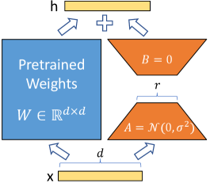
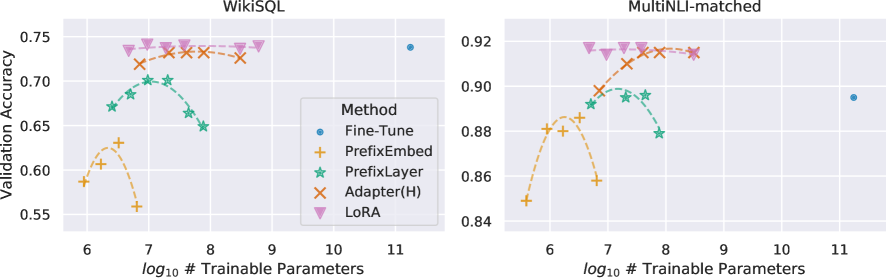
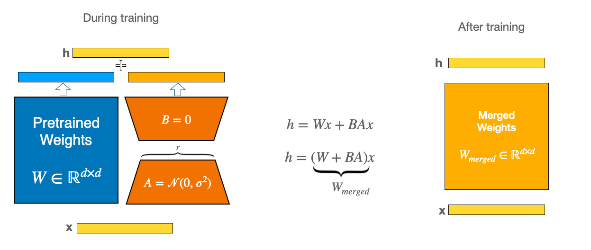

# LoRA：低秩适配如何用 1% 参数量接近全量微调

资料来源：

- [LoRA: Low-Rank Adaptation of Large Language Models (Hu et al., 2021)](https://arxiv.org/abs/2106.09685)
- [Hugging Face PEFT — LoRA 概念指南](https://huggingface.co/docs/peft)
- [microsoft/LoRA（参考实现 loralib）](https://github.com/microsoft/LoRA)
- [QLoRA (Dettmers et al., 2023)](https://arxiv.org/abs/2305.14314)
- [AdaLoRA (Zhang et al., 2023)](https://arxiv.org/abs/2303.10512)

## 阅读目标

回答三个问题：

1. LoRA 到底是什么，它和全量微调（Full Fine-Tuning）在参数层面到底差在哪。
2. 为什么在 7B / 13B / 70B 量级上 LoRA 能把显存和可训练参数压到 1% 以内，效果还能接近全量微调。
3. 工程上如何正确使用 LoRA：rank、alpha、target_modules、merge、变体选型。

核心结论是：LoRA 把全量微调里需要学习的权重变化 ΔW，替换成一个低秩分解 ΔW = B·A，其中 B ∈ R^{d×r}、A ∈ R^{r×k}、r ≪ min(d, k)；训练期冻结原权重 W，只更新 A 和 B，可训练参数从 d·k 降到 r·(d+k)。原始论文在 GPT-3 175B 上用 r=4 就能复现或超过全量微调，并且把 checkpoint 从 TB 级降到 MB 级。推理时 B·A 可以合并回 W，不引入额外延迟。

## 名词解释

| 名词 | 解释 | 简单例子 |
|---|---|---|
| Full Fine-Tuning（FFT） | 把预训练模型的所有权重 W 都作为可训练参数，用下游任务的数据继续训练。 | 在 7B 基座上做中文指令微调，需要更新约 7B × 2（fp16 + 优化器状态 ≈ 几十 GB）的参数。 |
| Adapter | 在 Transformer block 里插入小型瓶颈网络（down-project → non-linearity → up-project），冻结原权重。 | Houlsby 等人的 Adapter 把 d_model 先压到一个小维度再升回来。 |
| Prefix Tuning | 在每个 attention 的 K、V 前拼接一段可学习的“前缀”向量，冻结原权重。 | 训练时只更新前缀参数，原 Transformer 不变。 |
| Prompt Tuning | 只学习输入 embedding 前面的 soft prompt，不动模型任何权重。 | 把 prompt 当作可学习的 embedding 序列。 |
| LoRA（Low-Rank Adaptation） | 把权重变化 ΔW 用低秩分解 B·A 表示，训练时冻结 W，只更新 A 和 B。 | 在每个 attention 的 W_Q / W_V 上并联一个 r=8 的旁路。 |
| 秩 r（rank） | 低秩分解的中间维度，决定 ΔW 的“表达带宽”。 | r=4、r=8、r=16、r=64 是常见取值。 |
| Alpha Scaling | 训练时把 BA 的输出乘以 α / r，用来调节 LoRA 的整体幅度。 | 原论文默认 α = 2r，相当于把 BA 在数值上“放大一倍再除以 r”。 |
| 内在维度（Intrinsic Dimension） | 假设模型权重其实处在一个低维流形上，沿少量随机方向扰动就能完成大部分学习。 | Aghajanyan 等人用 d=200 的随机子空间在 GPT-2 上完成 LoRA 风格适配。 |
| target_modules | 选择把 LoRA 旁路挂到哪些线性层上，通常是 attention 的 Q / V 投影。 | `["q_proj", "v_proj"]` 是原论文默认；Llama 系常加 `["q_proj", "k_proj", "v_proj", "o_proj"]`。 |
| merge_weights | 训练完成后把 B·A 加回 W，得到一个结构与原模型完全一致的权重文件。 | 合并后推理时无额外算子，可直接部署到 vLLM、TGI 等推理框架。 |
| QLoRA | 把基座量化到 NF4，只在反量化后的权重上挂 LoRA，并用分页优化器处理梯度尖峰。 | 65B 模型单卡 48GB 即可微调。 |
| AdaLoRA | 不固定 rank，而是用 SVD 形式把 ΔW = PΛQ 的奇异值作为预算动态剪枝。 | 自动给重要方向更多 rank、不重要的方向退化到 0。 |

## 1. 背景：全量微调的资源瓶颈

进入 LoRA 之前，先理解它要解决的问题。当模型规模从 BERT（110M）、GPT-2（1.5B）增长到 LLaMA（7B / 13B / 65B / 70B）级别之后，全量微调的成本不再是“显存放不下”这么简单，而是“任何单一团队都难以承担”：

- **显存占用 = 参数量 × (权重 + 梯度 + 优化器状态)**。Adam 优化器需要保存 m 和 v 两个 fp32 状态，再加上权重和梯度，bf16 训练时每个参数约占用 16 字节。70B 模型单卡就要约 70B × 16B ≈ 1120 GB，远超单卡容量。
- **多机多卡通信成本高**。参数服务器或 ZeRO-Sharded 训练需要跨卡同步所有梯度，互联带宽会成为瓶颈。
- **Checkpoint 体积大**。每个任务保留一份完整 fp16 权重就要几百 GB，跨任务管理和切换成本都很高。
- **灾难性遗忘风险**。在大量下游任务上对全量权重做更新，可能侵蚀基座模型的通用能力。

LoRA 的核心回答是：**参数有效（parameter-efficient）** 的微调。基座权重 W 永远冻结，只学习 ΔW 的一个低秩近似。

## 2. 低秩假设与内在维度

LoRA 的理论动机是“权重的变化量其实处在低维子空间里”。两个证据：

1. **内在维度实验**。Aghajanyan 等人 (2020) 发现，即使只允许权重沿少量随机方向扰动，预训练模型也能在下游任务上学习得很好，所需的扰动维度往往只有几百。
2. **预训练模型权重本身近似低秩**。Aghajanyan 等人也观察到，对 W 做随机投影后微调、再投回原空间，效果接近全量微调。这说明下游任务真正需要的更新方向是稀疏的、聚集的。

直观地说：模型在预训练阶段已经把大部分通用知识“压进”了 W；下游任务需要的只是一些针对性调整，这些调整可以由极少的自由度表达。这就为 ΔW = B·A、r 很小（如 4、8）但仍能逼近全量微调效果提供了直觉依据。

原论文还做了一组子空间相似度实验。图 3 比较 r=8 和 r=64 时学到的 ΔW_q、ΔW_v 的列向量方向：


可以看到 r=8 的主方向几乎都包含在 r=64 中，反过来 r=64 的很多方向能量很小——结论是“前几个奇异方向贡献了绝大部分”，再次支持低秩假设。

图 4 比较不同随机种子下 r=64 学到的 ΔW：


不同随机种子下学到的方向仍然高度相似，说明 LoRA 学到的不是噪声，而是任务驱动的稳定子空间。

## 3. LoRA 的数学形式

### 3.1 核心公式

对一个预训练权重矩阵 `W₀ ∈ R^{d×k}`，全量微调学习的是 `W = W₀ + ΔW`，ΔW 形状与 W 相同。LoRA 把它换成：

```
W' = W₀ + ΔW = W₀ + (α / r) · B · A
```

其中：

- `B ∈ R^{d×r}`
- `A ∈ R^{r×k}`
- `r ≪ min(d, k)`，典型取值 4、8、16、32、64
- α 是缩放系数，原论文默认 α = 2r

可训练参数从 d·k 降到 r·(d + k)。以 GPT-3 175B 为例，原始 attention 投影矩阵 d=k=12288，每层 4 个矩阵，全量微调需更新约 4 × 12288² ≈ 6.04 亿参数/层；r=4 时降到约 4 × 12288 × 4 × 2 ≈ 39 万参数/层，缩到原来的 0.6%。

### 3.2 初始化约定

为了让训练起点 W' = W₀（不引入任何随机扰动）：

- `A` 用高斯初始化（Kaiming / Gaussian），提供非零的方向。
- `B` 初始化为 0，保证 BA 在初始化时严格等于 0。

这样在第一个 step 之前，模型的输出与基座完全一致。

### 3.3 直觉



这张是原论文 Figure 1。它展示的就是“冻结 W₀，并联一个低秩旁路 BA”：

- 左半部分是冻结的预训练权重 W₀，参数不更新。
- 右半部分是 LoRA 旁路，输入先经过 A（高斯初始化）降到 r 维，再经过 B（全零初始化）升回 d 维。
- 两条路径相加后得到 W'·x = W₀·x + (α/r)·B·A·x。

为什么要先降维再升维？目的是让 BA 的秩被 r“卡住”，从而限制可学习参数数量和表达容量。

### 3.4 训练与推理

训练期：

```
h = W₀·x + (α / r) · B · A ·x       # 冻结 W₀，更新 A、B
loss = CrossEntropy(h, y)
```

推理期两种选择：

1. **不合并**：保持 W₀ 和 B、A 分离，推理时多一次 matmul + add。延迟随 r 上升而上升，但训练好的 adapter 可以在多任务间热切换。
2. **合并权重**：`W_merged = W₀ + (α/r)·B·A`，然后把 W_merged 写回 W₀。推理时结构与原模型完全一致，无额外延迟。

实际部署中通常选择合并权重，这样 checkpoint 仍然是单一标准格式，vLLM、TGI、Transformers 都能直接加载。

### 3.5 与 Adapter / Prefix Tuning / Prompt Tuning 的对比

| 方法 | 在哪里加可学习参数 | 是否改动推理图 | 典型参数量 |
|---|---|---|---|
| Full Fine-Tuning | 所有权重 W | 否（结构不变） | 100% |
| Adapter | attention / FFN 之后插入瓶颈模块 | 是（额外非线性层） | 1% – 5% |
| Prefix Tuning | 每层 K、V 前面拼前缀向量 | 是（KV 前多一段） | < 1% |
| Prompt Tuning | 只在输入 embedding 前加 soft prompt | 否 | ≪ 1% |
| LoRA | 并联到 attention 线性层的旁路 | 否（可 merge） | < 1% |

LoRA 的关键工程优势是“推理图不变”。合并权重之后，模型结构和原 Transformer 完全一致，所以所有为 Transformer 设计的推理优化（KV Cache、FlashAttention、PagedAttention）都直接生效，没有 Adapter 那种“在 attention 中插入串行瓶颈”带来的额外延迟。

原论文 Figure 5 给出了 Adapter 引入的推理延迟：


Adapter 的瓶颈结构对序列长度敏感，长序列下延迟开销会被放大；LoRA 合并权重后延迟与无 adapter 基线基本重合。

## 4. 实践要点

### 4.1 选择 target_modules

原论文在 GPT-3 上做了消融，发现：

- 只把 LoRA 加到 attention 的 W_Q：`MNLI` 准确率明显低于全量微调。
- 加到 W_Q 和 W_V：达到或超过全量微调。
- 加到 W_Q、W_K、W_V、W_O：效果相似但参数量翻倍，性价比下降。

常用经验：

| 模型族 | 推荐 target_modules |
|---|---|
| LLaMA / LLaMA-2 / Qwen / Mistral | `["q_proj", "k_proj", "v_proj", "o_proj"]` 或 `["q_proj", "v_proj"]` |
| 多模态 / 自定义架构 | 按模块名匹配 `nn.Linear`，通常覆盖 attention 全部 4 个投影 |
| 仅做轻量对齐 | 只挑 `["q_proj", "v_proj"]`，可训练参数最少 |

### 4.2 rank 与 alpha

经验值（不绝对，需要按任务调）：

- 简单任务 / 数据少：r=4 或 r=8，α=2r。
- 复杂任务 / 数据多：r=16、r=32、r=64。
- α 与 r 联动：α=2r 是原论文默认，对调 r 时保持 α/r 不变，相当于控制“等效学习率”。
- 训练步数偏少时，可以适度提高 α 以更快迁移；步数足够多时，低 α + 较慢收敛通常更稳。

### 4.3 学习率与优化器

- LoRA 的学习率通常比全量微调高一个数量级（1e-4 到 5e-4 常见），因为 BA 是新参数、没有预训练初始化。
- 优化器常用 AdamW 或 paged_adamw_8bit（QLoRA 场景下）。
- 训练时建议保留 warmup，但 warmup 比例可以缩短。

### 4.4 merge 与导出

训练完成后：

```python
# Hugging Face PEFT 示例（伪代码）
model = PeftModel.from_pretrained(base_model, "lora-ckpt")
merged = model.merge_and_unload()
merged.save_pretrained("merged-ckpt")
```

合并后可以再用 `torch.save(merged.state_dict())` 或 `safetensors` 写出，得到与原始基座同构的权重文件，可被任意推理框架加载。

### 4.5 多任务与 adapter 切换

由于每个任务的 LoRA 只有几 MB 到几十 MB，可以在同一个基座 W₀ 上叠加多份 BA：

- 训练 N 个 LoRA 各自保存。
- 推理时按任务选一个 LoRA，merge 后下发。
- 这种“基座 + 多个轻量 adapter”的模式是 LoRA 在多任务系统里的核心用法。

## 5. LoRA 的工业落地与生态

### 5.1 Hugging Face PEFT

最常用的工业实现是 `peft` 库：

- 提供 `LoraConfig`、`get_peft_model`、`PeftModel` 等 API。
- 支持合并、加载、量化基座（与 bitsandbytes 集成）。
- 提供 IA³、Prompt Tuning、Prefix Tuning 等其他 parameter-efficient 方法。

### 5.2 QLoRA

QLoRA（Dettmers et al., 2023）把基座量化到 NF4（4-bit NormalFloat）：

- 量化把基座权重显存压到 1/4 到 1/8。
- 前向时反量化到 bf16，再做 LoRA 的 BA 计算。
- 配合双重量化（量化常数再量化）和 paged optimizer，65B 模型可以在单卡 48GB 上微调。

QLoRA 是当前“在消费级硬件上微调百亿级模型”的事实标准。

### 5.3 AdaLoRA

AdaLoRA 把 ΔW 表示为 PΛQ，Λ 是对角阵。训练过程中按 budget 动态剪枝不重要的奇异值，让重要方向获得更高 rank。好处是自动化的 rank 分配，但实现复杂度更高。

### 5.4 LoRA+、DoRA

- **LoRA+**（Hayou et al., 2024）：给 A、B 设置不同的学习率（A 用更大学习率），进一步提升效果。
- **DoRA**（Liu et al., 2024）：把权重分解为方向（magnitude）和幅度（direction），LoRA 只更新方向。在某些任务上 DoRA 表现优于 LoRA。

### 5.5 训练框架

工业里常见的 LoRA 训练工具：

- Hugging Face `peft` + `transformers` + `accelerate` / `trl`。
- `bitsandbytes`（量化 + 8-bit 优化器）。
- `LLaMA-Factory`：一站式指令微调框架，集成 LoRA、QLoRA、全量微调。
- `ms-swift`（魔搭）：多模型 LoRA 微调。
- `Unsloth`：以速度优化为目标的 LoRA 训练实现。

## 6. 对比表：Full FT / LoRA / Adapter / Prefix / Prompt Tuning

| 维度 | Full FT | Adapter | Prefix Tuning | LoRA | Prompt Tuning |
|---|---|---|---|---|---|
| 可训练参数 | 100% | 1% – 5% | < 1% | < 1% | ≪ 1% |
| 是否冻结基座 | 否 | 是 | 是 | 是 | 是 |
| 是否改动推理图 | 否 | 是（插入瓶颈） | 是（KV 前缀） | 否（可 merge） | 否 |
| 推理延迟 | 基线 | 5% – 30% 上升 | 长度敏感 | 与基线一致 | 与基线一致 |
| 显存（基座部分） | fp16/bf16 × 全量 | fp16/bf16 × 全量 | fp16/bf16 × 全量 | fp16/bf16 × 全量（QLoRA 可压到 4-bit） | fp16/bf16 × 全量 |
| 显存（优化器状态） | 大 | 小 | 小 | 小 | 极小 |
| 任务切换 | 切换整个 checkpoint | 切换 adapter | 切换前缀 | 切换 BA | 切换 soft prompt |
| 与 KV Cache / FlashAttn 兼容 | 兼容 | 引入额外算子 | 影响 KV cache 形状 | 完全兼容 | 完全兼容 |
| 适用规模 | 小到中（≤ 7B） | 中 | 中到大 | 极大（百亿级主流） | 中 |

## 7. GPT-3 175B 上的实证

原论文最关键的实验是 GPT-3 175B 上的对照。图 2 是 WikiSQL 和 MNLI-matched 上几种参数高效方法的可训练参数–准确率曲线：



横轴是可训练参数数量（对数），纵轴是验证集准确率。结论是：LoRA 在同等可训练参数预算下效果最好，并且随着 rank 上升（参数更多）还能继续逼近甚至超过全量微调。



这张是 PEFT 文档里的 LoRA 示意图，与论文 Figure 1 语义一致：训练时 A、B 是独立的小矩阵，训练完成后可以合并回主权重。

## 8. 工程要点与边界

| 检查项 | 期望状态 |
|---|---|
| target_modules 与基座架构匹配 | 必须按当前模型的命名（`q_proj` / `query` / `Wqkv` 等）选取，否则 LoRA 不会真正挂上去。 |
| 训练起点与基座一致 | 验证第一个 batch 的 loss 与基座直接推理的 loss 一致，确认 BA 初始化正确。 |
| rank 与 alpha 比例 | 默认 α=2r；如果手动调 r，建议同步缩放 α 以保持 α/r 不变。 |
| merge 前确认无未训练 LoRA | merge 会把 LoRA 写回基座，未训练 / 加载失败的 LoRA 合并会破坏权重。 |
| QLoRA 下的训练精度 | 计算路径仍是 bf16/fp16，不要把全部链路降到 NF4，否则梯度会失真。 |
| 多任务 LoRA 切换 | 同一基座上叠加多个 LoRA 时，推理前必须显式 merge 或切换，不能让多个 BA 同时作用于前向。 |
| 长序列 + Adapter | 长序列下 Adapter 延迟更明显，优先选择 LoRA。 |
| 与 DeepSpeed / FSDP 协同 | LoRA 通常不需要 ZeRO-3；但当基座大到单卡装不下，仍需 FSDP / 量化加载。 |
| 推理服务化 | merge 后 checkpoint 可被 vLLM、TGI、TensorRT-LLM 原生支持，无需特殊 kernel。 |

## 9. 关键结论

1. LoRA 的本质是用一个低秩旁路 BA 近似全量微调需要学习的 ΔW，把可训练参数从 d·k 降到 r·(d+k)，r ≪ min(d,k) 时压缩比通常在 1% 以内。
2. 低秩假设有理论与实证双重支撑：内在维度实验和 r=8 与 r=64 子空间相似度都说明下游任务真正需要的更新方向非常少。
3. 初始化约定（A 高斯、B 零）保证了训练起点 W' = W₀，第一个 step 之前模型行为完全等价于基座。
4. 推理时可把 BA merge 回 W₀，模型结构与原 Transformer 完全一致，因此 KV Cache、FlashAttention、PagedAttention 等所有 Transformer 优化都直接生效。
5. 工程上 target_modules、rank、alpha 是三个最关键的超参数：Q/V 投影 + r ∈ {4,8,16,32} + α=2r 是经验起点，再根据数据量与任务难度调整。
6. QLoRA、AdaLoRA、DoRA、LoRA+ 等变体在不同维度上推进：QLoRA 降低基座显存，AdaLoRA 自动 rank 分配，DoRA 改进方向/幅度分解。生产里最常用的组合仍是「PEFT + LoRA（fp16/bf16 基座）」或「PEFT + QLoRA（4-bit 基座）」。

## 10. 面试速答卡

Q1：LoRA 是什么？和全量微调差在哪？
A：LoRA 把需要学习的权重变化 ΔW 替换成低秩分解 B·A（r ≪ min(d,k)），训练时冻结基座 W₀，只更新 A 和 B。可训练参数从 d·k 降到 r·(d+k)，通常 < 1%。初始化时 A 用高斯、B 用 0，保证训练起点与基座完全一致。

Q2：为什么 LoRA 能用这么少的参数还接近全量微调？
A：经验上预训练模型权重其实处于低维流形上，下游任务真正需要的更新方向很少。内在维度实验和子空间相似度实验都支持这一点。ΔW 的有效秩通常只有个位数到几十，所以 r=4 / r=8 就能承载大部分学习。

Q3：LoRA 在推理时会有额外延迟吗？
A：merge 之后没有。BA 可以合并回 W₀ 得到 W_merged = W₀ + (α/r)·B·A，推理时模型结构和原 Transformer 完全一致，KV Cache、FlashAttention 等都直接生效。不 merge 时会有一次额外的 matmul + add，所以部署时通常选 merge。

Q4：target_modules 应该选哪些？
A：原论文在 GPT-3 上验证 W_Q + W_V 已经足够。LLaMA / Qwen 系常加到 attention 的全部 4 个投影（q/k/v/o）。数据少、任务简单时建议先从 `["q_proj", "v_proj"]` 开始，控制参数量。

Q5：LoRA / QLoRA / Adapter / Prefix Tuning 怎么选？
A：常规首选 LoRA（参数最少 + 推理图不变）。显存紧张时上 QLoRA（基座量化到 4-bit）。Adapter 和 Prefix Tuning 在推理延迟敏感或长序列场景下劣势更明显，已逐渐被 LoRA 系列替代。Prompt Tuning 仅在极轻量场景下合适，表达力弱于 LoRA。