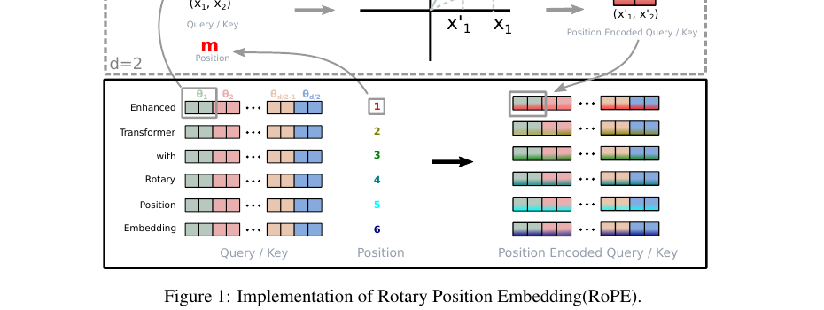
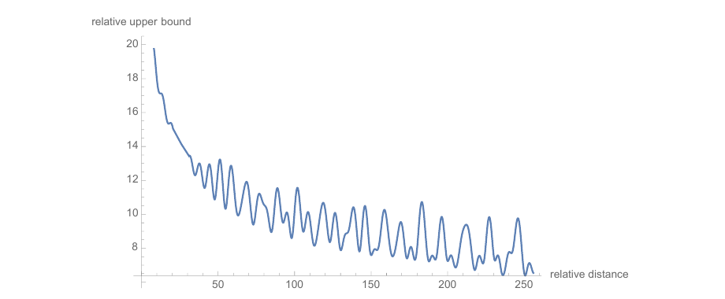
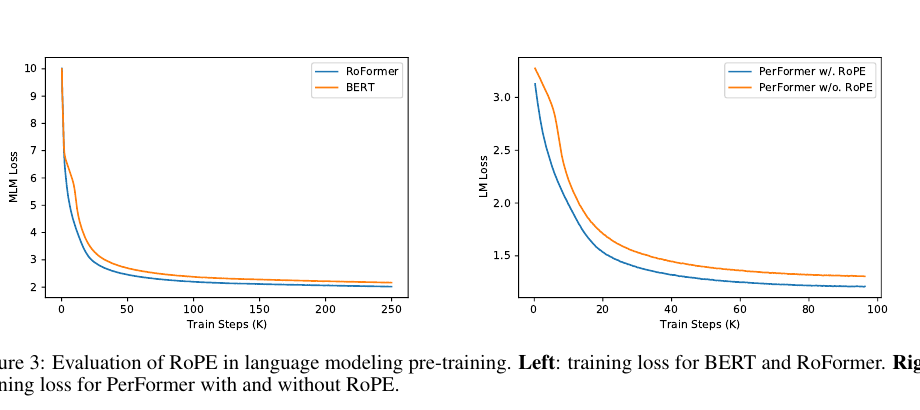

# RoPE：旋转位置编码与相对注意力

资料来源：
[RoFormer: Enhanced Transformer with Rotary Position Embedding (Su et al., 2021)](https://arxiv.org/abs/2104.09864)
[苏剑林：RoPE 旋转位置编码推导](https://kexue.fm/archives/8265)
[Attention Is All You Need (Vaswani et al., 2017)](https://arxiv.org/abs/1706.03762)
[roformer 官方实现](https://github.com/bzhangGo/roformer)

## 阅读目标

回答一个常被问到的问题：**主流大模型（Llama、Qwen、Mistral、ChatGLM、Baichuan 等）到底用什么位置编码**？答案是 RoPE（Rotary Position Embedding，旋转位置编码）。

核心结论是：RoPE 通过对 Q、K 各施加一个与位置相关的旋转矩阵，使得注意力分数 `Q^T K` 天然只依赖于两token 的相对位置 `m-n`，而不依赖于它们的绝对位置；这一性质带来三个直接收益——相对位置友好、远程衰减可证、与线性 attention 兼容——也是它在主流 LLM 中取代 Sinusoidal 和 Learned 位置编码的关键原因。

## 名词解释

| 名词 | 解释 | 简单例子 |
|---|---|---|
| 绝对位置编码 | 把位置 `pos` 直接编码成一个向量，加到 token embedding 上。原始 Transformer 用固定频率的正弦/余弦。 | 第 5 个 token 拿到 `PE(5)`，加到 embedding 上。 |
| 相对位置编码 | 编码的是位置之间的偏移 `m-n`，而不是单个位置。直觉上更接近 attention 的语义。 | “我想知道 token `m` 与 token `n` 距离是多少”。 |
| 旋转矩阵 (Rotation Matrix) | 平面或高维空间里按角度 `θ` 旋转的矩阵，形式为 `[[cosθ, -sinθ], [sinθ, cosθ]]`。 | 在 2D 平面里把 `(x, y)` 按角度 θ 旋转，模长不变。 |
| 复数表示 (Complex Number Form) | 把相邻两维 `q_{2i}, q_{2i+1}` 视为复数 `q_{2i} + i q_{2i+1}`，旋转等价于乘上 `e^{i m θ}`。 | `θ=π/4` 的旋转 = 乘 `e^{iπ/4}` = `(cos π/4 + i sin π/4)`。 |
| RoPE | RoFormer 提出的旋转位置编码：对 Q、K 应用与位置成正比的旋转矩阵，使内积仅依赖相对位置。 | Llama、Qwen、ChatGLM 的官方实现都用了 RoPE。 |
| ALiBi (Attention with Linear Biases) | 不加位置编码，直接在 attention score 上加一个与距离成正比的负偏置 `-k·(m-n)`。 | 距离越远偏置越负，从而衰减注意力。 |
| 外推 (Extrapolation) | 训练时只见过 `L_train` 长度的序列，推理时处理比 `L_train` 更长的序列的能力。 | 训练 2048、推理 8192。 |
| 位置插值 (Position Interpolation, PI) | 把超出训练长度的位置 `m` 映射到等效更短位置 `m·L_train / L_new`，是长度外推的常用工程补丁。 | 把位置因子 `1/L` 改写成 `1/(α·L)`，α 越大内插越平滑。 |
| NTK-aware Scaling | 不直接缩放位置因子，而是按频率逐维放大 base，使低频维度被“保留”足够多周期、高频维度被压平。 | 高维度 base 放大更多、低维度 base 保持。 |
| YaRN | 结合 NTK-aware 与 attention 缩放，在插值基础上对不同 attention 阶段应用不同温度。 | 长上下文 PPL 更稳定。 |

## 1. 背景：为什么需要“更好的”位置编码

Self-Attention 是 permutation-invariant 的：把输入 token 顺序打乱，每个位置看到的“集合”不变——这意味着必须显式注入位置信息。

历史上的位置编码大致走过四代：

1. **Sinusoidal（固定）**：原始 Transformer 用一组固定频率的正弦/余弦位置向量加到 embedding 上。优点是不需要学习、能算未见过的位置；缺点是它本质是“绝对位置”，对相对位置不友好。
2. **Learned（可学习）**：把每个位置当作一个可学习 lookup table。训练长度内效果好，但**完全不能外推**：超出 `max_len` 没编码，外推性能断崖式下降。
3. **Relative Position Encoding（RPE / T5 bias）**：把“位置差”塞进 attention bias。直观上更合理，但实现要么复杂、要么和外推难以兼得。
4. **RoPE / ALiBi**：以不同方式把相对位置“嵌入”attention 计算。RoPE 通过旋转，ALiBi 通过线性 bias。



这张图是论文 Figure 1 的核心示意：左侧是 Sinusoidal / Learned 的做法——把位置向量加到输入 embedding，再用同一组 Q、K 投影；右侧是 RoPE 的做法——位置“m”直接作用在 Q、K 上（旋转），而不是作用在输入端。关键差异是 RoPE 的位置信号进入了 attention 的乘法路径，而不是加法路径。

## 2. RoPE 的核心思想：旋转角度与位置成正比

### 2.1 一句话：相对位置进内积

RoPE 的目标是把位置信息编到 Q、K 里，但让 `Q_m^T K_n`（位置 m 处 Q 与位置 n 处 K 的内积）只依赖于相对差 `m-n`。形式化地：

```
f(Q, m)^T f(K, n) = g(Q, K, m - n)
```

其中 `f(·, m)` 是给位置 m 用的“编了位置的 Q/K”。RoPE 选择 `f` 的具体形式。

### 2.2 复数等价：把两维看作复数

论文 Section 3.2 把 Q、K 的相邻两维看成一个复数 `q_{2i} + i q_{2i+1}`，然后让位置 m 的旋转等价于乘上 `e^{i m θ_i}`，其中 θ_i 是第 i 个“频率对”对应的角度。

直观理解：

- 模型维度 d 通常是偶数，论文把 d/2 个频率对分别旋转。
- 第 i 个旋转角频率是 `θ_i = 10000^{-2i/d}`，跟原始 Transformer 的 sinusoid 频率完全一致——这是有意的，保持与 Sinusoidal 的“能量分布”兼容。
- 旋转之后的 Q_m 维度模长不变，只改变方向，相当于把每个 token 的“特征向量”按它的位置在每对二维平面上转了一个角度。

复数公式更简洁：

```
q̄_m = q · e^{i m θ},    k̄_n = k · e^{i n θ}
⟨q̄_m, k̄_n⟩ = Re[ q* k · e^{i (m - n) θ} ]   # 只与 m-n 有关
```

矩阵形式给出每两维的旋转块（按奇偶对组合而成的高效实现）：

```
f(Q, m)_{2i}   = Q_{2i}   cos(m θ_i) - Q_{2i+1} sin(m θ_i)
f(Q, m)_{2i+1} = Q_{2i}   sin(m θ_i) + Q_{2i+1} cos(m θ_i)
```

### 2.3 为什么是“旋转”而不是别的

直觉上，可以把每个 token 的 Q/K 看作二维平面上的一个点，位置 m 让这个点在它所在的二维平面上旋转一个角度 `m θ`。旋转带来的几个关键性质：

- **内积不变地依赖相对差**：两个旋转后的向量点积，等于把其中一个反向旋转 `n·θ` 再与另一个点积——本质只与 `m-n` 有关。
- **方向变了但模长不变**：旋转不改模长，因此 attention 分数的“尺度”不会被位置信息破坏，跟原来 Softmax 一起用没问题。
- **可被高效实现**：旋转等价于把 Q/K 拆成 `(Q_even, Q_odd)`，做一次乘加就可以，不需要修改 attention 计算本身。

## 3. RoPE 的三大性质

论文 Section 3.3 给出三个被证明了的性质，这三件事是 RoPE 在工业界比 Sinusoidal / Learned 受欢迎的关键。

### 3.1 远程衰减：距离越远内积期望越小

论文证明（Section 3.4.3），RoPE 的相对位置内积的“期望绝对值”随相对距离单调衰减。下面是论文 Figure 2 的实测：



这张图把“任意相对位置上界”画出来：相对距离从 1 增长到 256，纵轴上界从约 20 衰减到 8 左右。这正是 NLP 任务中想要的——远距离 token 之间的注意力天然被压低。

直观的工程含义：

- 语言里“局部搭配”最重要，RoPE 让靠近的 token 注意力天然强。
- 长程 attention 不会变成“一锅粥”，但也不强制截断——保留可能性，权重自然衰减。
- 远程衰减是 RoPE 在长文本上比 Learned/Sinusoidal 表现稳的原因之一。

### 3.2 与线性 attention 兼容

线性 attention 这一类方法（Performer、Linear Transformer）把 softmax(QK^T)V 写成 `φ(Q) (φ(K)^T V)`，从而把时间复杂度从 O(n²) 压到 O(n)。但它们对“位置信息”的注入方式很敏感。论文 Section 4.4 证明 RoPE 可以和 kernel-based 线性 attention 自然组合。

这也是为什么同样基于 Linear Attention 思路的 Performer 在引入 RoPE 后效果有提升：



左边是 BERT 与 RoFormer 的训练 loss，右边是带/不带 RoPE 的 Performer。两条曲线都显示，加上 RoPE 后 loss 下降更快且更低，说明 RoPE 对这两类 attention 都有正向作用。

### 3.3 长度外推性（理论上）

RoPE 论文论证了它“形式上能”外推到比训练更长的序列。但在实践中，直接外推通常会崩——下面是几个关键补丁，外推到 32k、128k 都是靠它们才稳定的：

#### 3.3.1 位置插值 PI（Position Interpolation）

把 sin/cos 的频率整体拉低：`θ_i → θ_i · (L_train / L_new)`。等价于把所有位置“压缩”到 `[0, L_train]` 内插值，实现简单，最早由 Meta 在 2023 年提出，常用于把 4k 外推到 32k。

#### 3.3.2 NTK-aware Scaling

PI 是“线性”压缩，对所有频率一视同仁；NTK-aware 的观察是：高频维度本来就应该精细旋转（对应短距离），低频维度对应长距离编码，如果整体压缩短距离信息会丢失。做法是放大 `base`：

```
base_new = base · (α)^{d/(d-2)},   α = L_new / L_train
```

直觉上：高频维度 base 大致不变（保持短距离精度），低频维度 base 被放大（让原本训练在训练长度内的旋转周期也能覆盖到推理长度）。LLaMA 官方外推方案之一就是 NTK-aware。

#### 3.3.3 YaRN

把 NTK-aware 与 attention 温度缩放结合：不同 attention 阶段（短、中、长距离）应用不同温度。经验上 YaRN 在 64k–128k 上比单纯 PI / NTK 都稳。Code Llama、Mistral 长上下文变体都用了类似思想。

#### 3.3.4 ReRoPE

一种更激进的方案：训练时强制远距离 token 的 attention 稀疏化，让外推时远距离不被无效长序列拖垮。

> 工程判断：现代开源 LLM（Llama-3、Qwen-2、DeepSeek、Yi 等）的 32k/128k 上下文，几乎都是 RoPE + 上述一种或多种外推补丁的组合。选哪种要看任务与已有训练 checkpoint。

## 4. 主流位置编码方案对比

| 方案 | 核心机制 | 相对位置友好 | 远程衰减 | 长度外推 | 工程复杂度 | 代表使用方 |
|---|---|---|---|---|---|---|
| Sinusoidal | 不同频率 sin/cos 加到 embedding | 弱（本质绝对） | 无显式保证 | 弱（高频周期容易断档） | 低 | 原始 Transformer |
| Learned PE | 把位置当 lookup table | 弱 | 不保证 | 无（超出 max_len 直接 OOV） | 低 | BERT、GPT-2 早期 |
| ALiBi | 在 attention score 上加 `-k·\|m-n\|` | 中 | 强（线性衰减） | 强 | 低 | BLOOM、MPT |
| RoPE | 对 Q/K 做按位置的旋转 | 强（构造上即相对） | 强（已证） | 中（需 PI / NTK / YaRN） | 中（需复数或旋转矩阵实现） | Llama、Qwen、Mistral、ChatGLM、Baichuan、DeepSeek |
| CoPE / 其他 | 把相对位置编码成“软”信号 | 强 | 可设计 | 可设计 | 高 | 实验性 |

几点补充：

- ALiBi 不需要修改 attention 算子，只改 score；但短距离任务上不一定优于 RoPE。
- RoPE 与 ALiBi 不互斥，有实验性混合方案。
- 当前 Llama 系列从 RoPE 切换到 RoPE+YaRN-like 变体，外推到 128k。

## 5. 工程实现要点

### 5.1 高效实现：不需要真的写旋转矩阵

实际实现几乎不用显式的 2x2 旋转块，而是把 Q、K 拆成 `(Q_even, Q_odd)`，用一次乘加做旋转。PyTorch 等价写法：

```python
import torch

def apply_rope(x, cos, sin):
    # x: (B, H, N, D), cos/sin: (B, N, D) 或 (1, N, D)
    # 把最后一维拆成两半并交错成对
    x_even = x[..., 0::2]    # 取偶数下标
    x_odd  = x[..., 1::2]    # 取奇数下标
    # 旋转公式
    x_rot_even = x_even * cos - x_odd * sin
    x_rot_odd  = x_even * sin + x_odd * cos
    # 交错回去
    out = torch.empty_like(x)
    out[..., 0::2] = x_rot_even
    out[..., 1::2] = x_rot_odd
    return out
```

要点：

- `cos, sin` 已经在第 `i` 个频率对上预计算好（按 base = 10000 的公式）。
- 输入维度 D 必须是偶数，常与 `num_heads` 配合选取（如 D=128/128）。
- 一些实现会存两份不同 phase 的 cos/sin（用于 NTK-aware 等变体），运行时只读取。

### 5.2 预计算与持久化

`cos` 与 `sin` 表是位置依赖、不可训练的常量：

- 推理时一次性生成 `[max_len, D/2]` 的表，每层 KV cache 都引用同一份，零额外计算。
- 训练时同样的预计算，随机位置由额外整数索引出对应切片，避免每个 step 重新算 sin/cos。

### 5.3 与 Flash Attention / KV Cache 兼容

RoPE 是在 attention 之前对 Q、K 的逐 token 旋转，attn 算子无需修改——这意味着：

- **Flash Attention** 直接吃旋转后的 Q、K，路径不变。
- **KV Cache** 里缓存的是已旋转后的 K（即每个位置的 K 已经带上了它的位置），新生成的 Q 不需要也不应该重新旋转——只要和它该旋转的位置对应。
- 增量推理：每一步新生成 token 时，只对它自己的 Q 做一次 `apply_rope(q_t, cos[t], sin[t])`，把它对应的 K 也旋转后塞进 cache。

### 5.4 外推与训练数据的耦合

位置编码不是“加上去就行”的模块：

- 修改 base 改了频率分布，**已训练模型直接外推可能掉点**，需要在目标长度数据上继续微调（Code Llama / Qwen2-Long 都是这条路）。
- 不能在训练和推理用不同的位置编码版本，会出现“位置错乱”bug。

## 6. 与 Sinusoidal 的关系：兼容但不等价

RoPE 的频率 `θ_i = 10000^{-2i/d}` 跟原始 Transformer 的 sinusoid 是同一套 base。这不是偶然：

- RoPE 论文证明，sinusoidal 其实是 RoPE 的特殊情形（去掉相对位置约束、只编码绝对位置）。
- 在工程上，这意味着 RoPE 和 sinusoid 可以“无痛替换”——把 `add_pos_embed()` 改成 `apply_rope(q), apply_rope(k)` 即可，不需要改 attention 算子。

这也是为什么早期模型从 Sinusoidal 平滑过渡到 RoPE 没有再训练之苦；而从 Learned PE 切到 RoPE 通常需要重新训练一个 base 模型。

## 7. 关键结论

1. RoPE 的核心是把 Q、K 按位置做“旋转”而不是“加位置向量”，数学上让 `Q_m^T K_n` 只依赖相对差 `m-n`——这是它对 attention 友好的根源。
2. RoPE 自带“远程衰减”性质，论文 Figure 2 给出了上界曲线，语言任务里“距离越远关注越弱”的先验天然成立。
3. RoPE 可以和 Linear Attention 一起工作（Performer 论文已经验证），不会因为换成 linear kernel 就丢位置信息。
4. 长度外推不能靠 RoPE 单独解决，必须配合 PI / NTK-aware / YaRN 等补丁，并配合长上下文微调。主流 LLM 的 32k/128k 上下文都是这条路。
5. RoPE 与 Sinusoidal 共享同一组频率 base，意味着它可以在已有 Sinusoidal 模型上几乎零成本切换，而 Learned PE 切到 RoPE 则需要重新预训练。

## 8. 面试速答卡

Q1：RoPE 是什么？它和 Sinusoidal / Learned 位置编码有什么本质区别？
A：RoPE 不把位置向量加到输入 embedding，而是对 Q、K 各施加一个与位置相关的旋转矩阵。区别是：Sinusoidal/Learned 加在加法路径上、本质是“绝对位置”；RoPE 加在乘法路径上（即 Q、K），构造上就让 attention 内积只依赖相对差 `m-n`。

Q2：RoPE 为什么能体现“相对位置”？
A：因为每个位置的 Q 旋转 `mθ`、K 旋转 `nθ`，内积展开后只剩 `cos((m-n)θ)` 等项，绝对位置抵消。这是论文 Section 3 推导的核心结论。

Q3：RoPE 是不是天然就能外推到任意长度？
A：理论上 RoPE 可以外推到未见过的位置，但实际不微调就外推会崩。工业界都用 RoPE + PI / NTK-aware / YaRN + 长上下文微调的组合来支持 32k/128k。

Q4：RoPE 和 ALiBi 有什么区别？哪个更好？
A：ALiBi 直接在 attention score 上加 `-k·|m-n|`，实现最简单、短距离强；RoPE 是对 Q/K 旋转，结构更可证、长短距离都可用。Llama / Qwen / Mistral 主流选 RoPE，BLOOM / MPT 选 ALiBi。两者不互斥。

Q5：RoPE 需要修改 attention 计算吗？
A：不需要。RoPE 只在 attention 之前对 Q、K 做了逐 token 的旋转，attention 算子完全保留——因此它天然和 Flash Attention、KV Cache、Linear Attention 兼容。这也是它在生产环境被广泛采用的关键工程原因。
