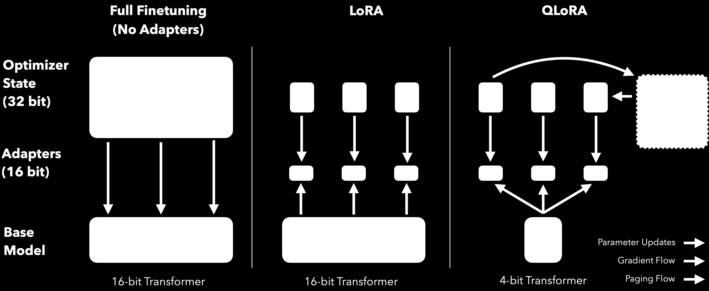
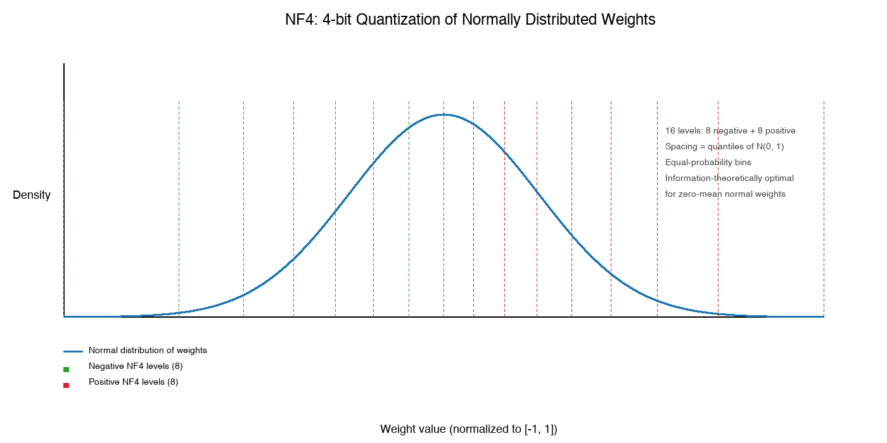
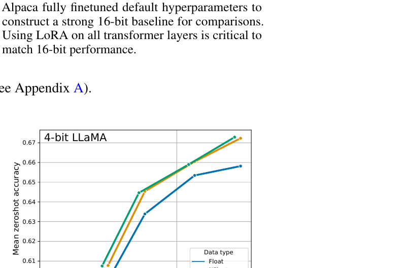
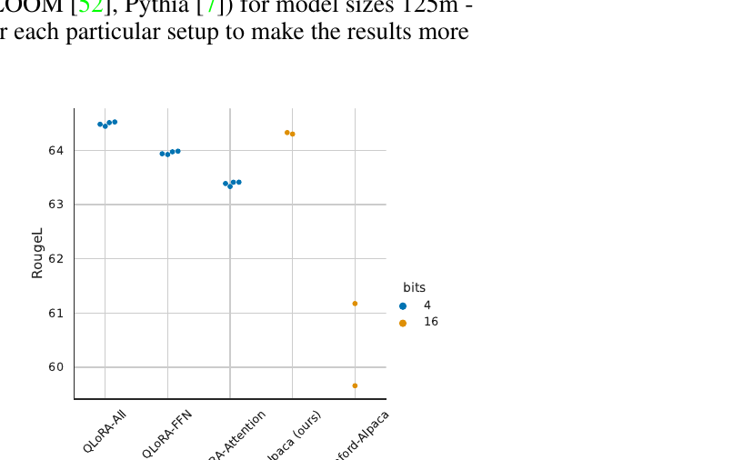
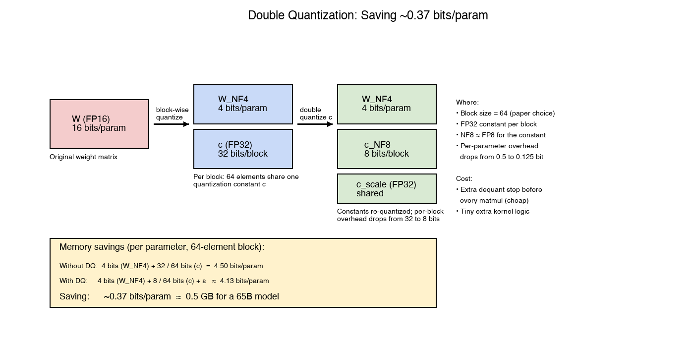
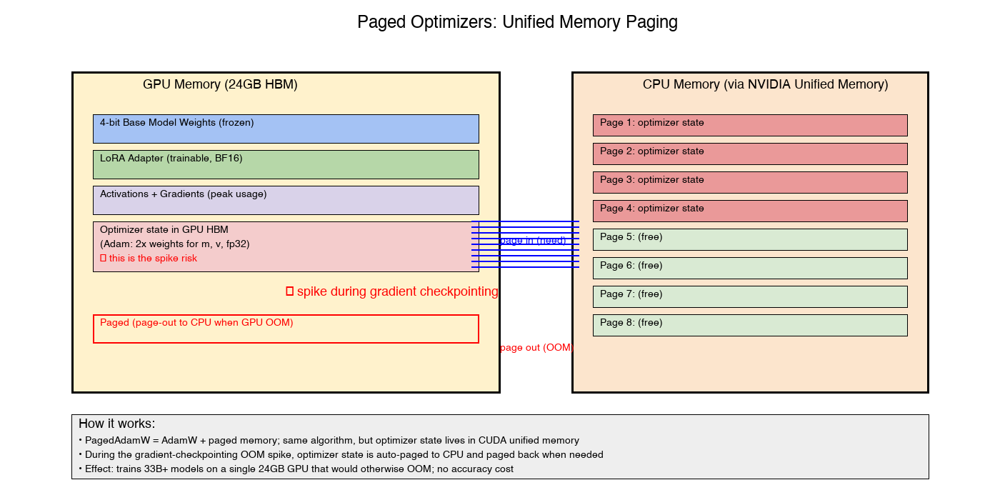
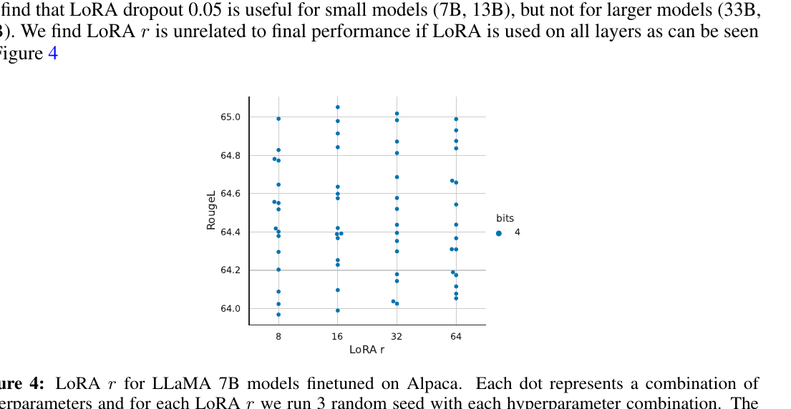
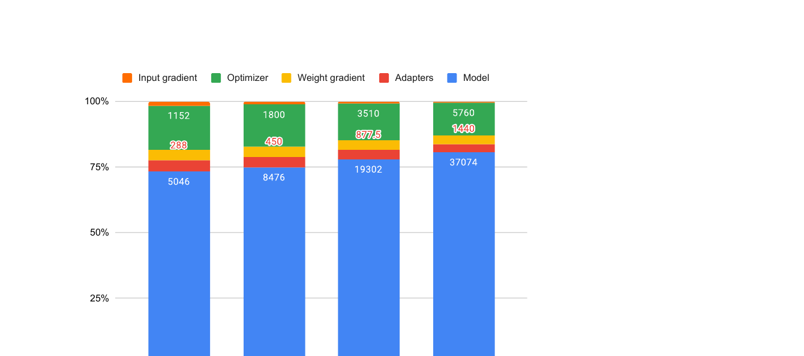

# QLoRA：把 65B 微调压进单张 24GB 显卡

资料来源：

- [QLoRA: Efficient Finetuning of Quantized LLMs — Dettmers et al., 2023](https://arxiv.org/abs/2305.14314)
- [bitsandbytes](https://github.com/TimDettmers/bitsandbytes)：提供 4-bit 量化与 Paged Optimizer 的 CUDA kernel。
- [PEFT 文档](https://huggingface.co/docs/peft)：把 QLoRA 集成进 Hugging Face Transformers 的标准入口。
- [LoRA 低秩适配专题](../lora/01-lora-low-rank-adaptation.md)：理解 QLoRA 必须先理解的 LoRA 背景（本仓库同系列文档，写作中；阅读本文时按需对照）。

## 阅读目标

回答三个问题：

1. QLoRA 相比 LoRA 多了什么机制，这些机制为什么能把 65B 模型塞进单张 24GB 显卡。
2. 4-bit 量化为什么不会把效果打垮，NF4、Double Quantization、Paged Optimizer 各自解决了什么具体问题。
3. 工业界如何落地 QLoRA，bitsandbytes 4-bit 加载和 PEFT 集成方式、超参选择和典型坑是什么。

核心结论：QLoRA = **4-bit NormalFloat 量化基座 + Double Quantization 省量化常数 + Paged Optimizer 解决 OOM 尖峰 + LoRA adapter 用 16-bit 训练**。它能把 65B 模型的微调显存压到 < 24GB，同时在 MMLU、HumanEval、聊天评测上与全量 16-bit 微调持平。代价是每步前向/反向需要做一次 NF4 → BF16 的 dequant，吞吐比 LoRA 略低 10-30%。

## 名词解释

| 名词 | 解释 | 简单例子 |
|---|---|---|
| QLoRA (Quantized LoRA) | 把基座模型量化到 4-bit 加载，LoRA adapter 仍用 16-bit 训练，从而把大模型微调塞进消费级 GPU 的整体方案。 | 65B LLaMA 基座 + LoRA r=16，单张 24GB 显卡可微调。 |
| LoRA (Low-Rank Adaptation) | 在冻结的基座权重 W 旁挂两个低秩矩阵 A、B，只训练 A 和 B，参见同系列 LoRA 专题。 | 对 4096×4096 的 W 加 r=8 的 LoRA，只新增 65K 参数。 |
| FP16 / BF16 | 16-bit 浮点。BF16 指数位更宽、训练更稳，是 QLoRA 推荐的 `compute_dtype`。 | 7B 模型 BF16 加载约 14GB 显存。 |
| INT8 / INT4 | 8-bit / 4-bit 整型。INT4 把值域均匀分成 16 个 bin。 | 16 个 bin 只能区分 16 个不同强度，精度损失明显。 |
| FP4 (4-bit Float) | 4-bit 浮点（E2M1 等），符号 + 指数 + 尾数共 4 bit。 | FP4 相对 INT4 多了动态范围，但 spacing 不适合正态分布权重。 |
| NF4 (4-bit NormalFloat) | Dettmers 等提出的 4-bit 数据类型，量化等级取自标准正态分布 N(0, 1) 的 16 个分位数。 | 权重近似正态分布时，NF4 比 INT4/FP4 的信息损失都小。 |
| Block-wise Quantization | 把权重矩阵按固定 block（如 64 元素）切分，每个 block 独立求一个量化常数 c。 | 64 个权重共用一个 absmax，避免单个离群值毁掉整个张量。 |
| Double Quantization (DQ) | 在 block-wise 量化的基础上，把量化常数 c 本身再做一次 FP8 量化，进一步省 ~0.37 bits/param。 | 65B 模型 4-bit + DQ 比 4-bit 单独再省约 0.5GB。 |
| Paged Optimizer | 用 NVIDIA Unified Memory 托管 optimizer state，GPU 显存不够时自动把分页换到 CPU。 | 33B 模型在 24GB 显卡上能跑起来，靠的就是 PagedAdamW 顶住 gradient checkpointing 的尖峰。 |
| Quantile Quantization | 量化 bin 边界按数据分布的分位数来取，使得每个 bin 内期望样本数相同。 | N(0, 1) 把它切成 16 段，中心窄、外侧宽，正好匹配权重密度。 |
| Symmetric / Asymmetric Quantization | 对称量化用 ±S 围住 0，bin 关于 0 对称；非对称用 [min, max]。 | INT4 symmetric = -8..7；NF4 是非对称，因为 0 附近 bin 更密。 |
| 4-bit Inference | 模型加载用 4-bit，前向时按 block 反量化到 BF16 再算矩阵乘。 | 用 bitsandbytes `AutoModelForCausalLM.from_pretrained(..., load_in_4bit=True)`。 |
| compute_dtype / quant_type | bitsandbytes 4-bit 加载的两个关键参数：推理/训练用什么 dtype（BF16）、存储用什么 4-bit 类型（NF4）。 | `bnb_4bit_compute_dtype=torch.bfloat16`, `bnb_4bit_quant_type="nf4"`。 |
| Gradient Checkpointing | 反向时按需重算前向激活，省掉大部分 activation 显存。 | 把 7B 训练的 activation 显存从几十 GB 压到几 GB，代价是 30% 算力开销。 |

## 1. 背景：4-bit 量化的难点

要把一个 7B 模型从 16-bit 加载降到 4-bit 加载，直觉上要丢 75% 的信息。要在不显著掉点的前提下完成这件事，需要先看清两个具体的工程难点。

**难点 1：信息损失**

- 16-bit 浮点一个张量能区分 65536 个不同值。
- 4-bit 量化只有 16 个 bin，bin 内所有权重被压成同一个值。
- 如果用最朴素的均匀量化（INT4 / FP4），权重分布的信息会被严重破坏，特别是精度要求高的最后一层和 attention 输出层。

**难点 2：离群值（outlier）**

- LLM 的权重近似零均值正态分布，但每张量里都有少量幅度远大于其它元素的离群值。
- 整张用同一个 scale 量化时，离群值会决定整个张量的范围，导致绝大多数权重被挤到很窄的几个 bin 上，量化误差爆炸。
- 工业上常见的应对是 per-channel 缩放或 block-wise 缩放，QLoRA 选的是 block-wise（block size = 64）。

QLoRA 的回答分三层：

1. **数据类型层**：用 NF4（专为正态分布设计的 4-bit 数据类型）替代 INT4 / FP4，匹配权重分布。
2. **缩放策略层**：用 block-wise 量化（64 元素共享一个常数），把离群值的影响限制在 block 内。
3. **存储优化层**：用 Double Quantization 再压一遍常数，用 Paged Optimizer 顶住 optimizer state 的显存尖峰。

加上不动基座、只训 LoRA adapter 的核心思路，就构成 QLoRA 的全部创新。

## 2. QLoRA 整体架构



这张图来自 QLoRA 论文 Figure 1，比较了三种微调方式的内存结构：

- **Full Finetuning (No Adapters)**：基座是 16-bit Transformer，optimizer state 是 32-bit，权重、梯度、optimizer 全在 GPU 上，65B 根本放不下。
- **LoRA**：基座仍是 16-bit，LoRA adapter 用 16-bit 训练。比全量微调省了 optimizer state 的存储，但基座仍然占大头。
- **QLoRA**：基座变成 **4-bit Transformer**，LoRA adapter 仍用 16-bit 训练。optimizer state 用了 paged memory（虚线箭头表示在 CPU/GPU 间换页）。所有三组梯度流都指向 LoRA adapter，基座完全冻结。

这张图的关键信息有三个：

- **基座从 16-bit 降到 4-bit**：65B 模型 16-bit 加载要 ~130GB，4-bit 加载只要 ~33GB。
- **LoRA adapter 保持 16-bit**：训练精度不能打折扣，否则反传时梯度精度不够。
- **Paged Optimizer**：虚线箭头表达的是「在需要时被换出到 CPU」，论文 Figure 1 的图例专门标了 "Paging Flow"。

### 2.1 三种内存流

- **Parameter Updates**：参数更新只发生在 LoRA adapter 上，基座权重保持冻结。
- **Gradient Flow**：梯度只对 LoRA adapter 反向传播，不进入基座。
- **Paging Flow**：optimizer state（m、v）在 CPU 和 GPU 之间按需换页。

## 3. 量化基础：INT8 / FP8 / INT4 / NF4 对比

| 数据类型 | 位宽 | bin 数 | 编码方式 | 适合的分布 | 精度 | 备注 |
|---|---|---|---|---|---|---|
| FP32 | 32 | ~2^32 | 符号 1 + 指数 8 + 尾数 23 | 任意 | 高 | 训练默认，但太贵。 |
| FP16 / BF16 | 16 | ~2^16 | 符号 + 指数 + 尾数 | 任意 | 高 | FP16 容易 overflow，BF16 训练更稳。 |
| FP8 (E4M3 / E5M2) | 8 | 256 | 1 符号 + 4 指数 + 3 尾数（E4M3） | 较广 | 中 | Hopper/Ada 架构支持，适合 activation / 大模型推理。 |
| INT8 | 8 | 256 | 整型均匀分箱 | 任意 | 中 | LLM.int8() 用 per-channel 缩放避免离群值。 |
| INT4 | 4 | 16 | 整型均匀分箱 | 任意 | 低 | 4-bit 朴素版，离群值问题严重。 |
| FP4 (E2M1) | 4 | 16 | 1 符号 + 2 指数 + 1 尾数 | 较广 | 中 | 动态范围大但 spacing 不匹配正态分布。 |
| **NF4** | 4 | 16 | 非对称分位数 | 零均值正态 | 最高 | QLoRA 论文核心，对正态分布信息论最优。 |

几个工程判断：

- **NF4 vs INT4**：NF4 论文数据显示 NF4 的 LLaMA 7B MMLU 准确率与 FP16 几乎一致，INT4 会掉 1-2 个百分点。
- **NF4 vs FP4**：NF4 把 16 个 bin 放在等概率区间上；FP4 把它们按 2 的幂次放在等距区间上。权重近似正态时，前者保真度高得多。
- **NF4 vs FP8**：FP8 精度更高（256 个 bin），但还是要 8 bit。NF4 用 4 bit 换取 4 倍存储压缩，对 LLM 这种几十 GB 的场景是质变。

## 4. NF4：信息论最优的 4-bit 数据类型

### 4.1 设计动机

预训练 LLM 的权重接近零均值正态分布 N(0, σ²)。如果直接用 INT4 或 FP4 量化，相当于把分箱按线性或指数间隔放在权重值域上，**而正态分布的密度在 0 附近最高、在尾部很低**，导致：

- 0 附近的权重（占比最多）被压到很少几个 bin，相邻权重的差异被抹平。
- 远离 0 的权重（占比很少）反而被分得很细，浪费了精度。

NF4 的设计是直接对正态分布做分位数采样，让每个 bin 内的期望样本数相同：

```
q_i = Quantile( (i + 0.5) / 2^k )    for i = 0 .. 2^k - 1
```

对 k=4，把 16 个 bin 的边界取自 N(0, 1) 的 2^-4、2*2^-4、3*2^-4... 分位数，得到 `[-1.0, -0.6962, -0.5251, -0.3949, -0.2844, -0.1848, -0.0911, 0.0, 0.0796, 0.1609, 0.2461, 0.3379, 0.4407, 0.5626, 0.7230, 1.0]`（具体数值见 bitsandbytes 实现）。

### 4.2 NF4 的 bin 划分



这张示意图把 16 个 NF4 量化等级画在标准正态分布上。可以看到：

- 0 附近的 bin 间距很窄（因为正态分布此处密度高，需要更细的 bin 才能区分相邻权重）。
- 两端的 bin 间距变宽（此处密度低，权重本来就少，bin 宽一些不损失信息）。
- 整体上每个 bin 内期望的样本数是相同的，这就是 Quantile Quantization 的核心。

### 4.3 论文中的实验对比

| 数据类型 | LLaMA 7B MMLU | LLaMA 7B 平均零样本准确率 | 备注 |
|---|---|---|---|
| FP16 | 35.0 | 0.665 | 16-bit 基线 |
| Float4 (E2M1) | 31.0 | 0.640 | 比 FP16 掉约 2.5 个点 |
| Float4 (E3M0) | 29.5 | 0.628 | 指数位再多 1 个也救不回来 |
| **NFloat4 + DQ** | **34.4** | **0.665** | 与 FP16 基本持平 |

数据来自 QLoRA 论文 Figure 3 / Table 4。NF4 + Double Quantization 在 4-bit LLaMA 上和 FP16 几乎等价。



这张图（论文 Figure 3）画的是 4-bit LLaMA 在不同总参数量下，Float4 / NFloat4 / NFloat4+DQ 三种数据类型的平均零样本准确率。NFloat4 + DQ 始终跑在最上面、贴着 FP16 的水平线；Float4 在所有规模上都比 NFloat4 低 1-2 个点。

更重要的对比是 QLoRA 本身 vs 16-bit 全量微调：



这张图（论文 Figure 2）画的是 LLaMA 7B 在 Alpaca 数据集上的 RougeL 分数。横轴是不同 LoRA 配置（QLoRA-All、QLoRA-FFN、QLoRA-Attention、Alpaca 16-bit、Stanford-Alpaca 16-bit），蓝色点是 4-bit、橙色点是 16-bit。**QLoRA-All（4-bit 蓝色点簇）落在 64.5 左右，Alpaca 16-bit（橙色点）也落在 64.5 附近**——这就是论文的核心结论：只要把 LoRA 应用到所有 linear 层，4-bit 量化对最终质量几乎无损。

## 5. Block-wise Quantization：每 64 元素共享一个常数

NF4 只解决了「分箱间距」问题，没解决「离群值」问题。一张权重矩阵里常有少数元素比其它元素大 10× 以上，如果全张量共享一个 scale，这些离群值会撑爆值域，导致绝大多数权重被挤到靠近 0 的少数几个 bin。

QLoRA 的做法是 **block-wise quantization**：

```
W = [W_1 | W_2 | ... | W_n]   # 按 64 元素切块
c_i = max(|W_i|) / max(NF4)   # 每个 block 独立求 scale
W_i_quant = round(W_i / c_i)  # 块内做 NF4 量化
```

每个 block 单独求一个 absmax 作为 scale，常数存为 FP32。block size 论文选 64，是精度和常数存储开销的折衷：

- block 越小，量化精度越高，但每参数额外的常数存储越大。
- block 越大，存储越省，但离群值的影响被放大。
- 64 是一个工程上稳定的默认值。

存储开销：

- 4-bit 权重：4 bits/param。
- 块常数：32 bits / 64 = 0.5 bits/param。
- 合计：4.5 bits/param。

## 6. Double Quantization：再把常数压一遍

Block-wise 量化后，每个 block 都有一个 FP32 的 scale 常数。QLoRA 进一步把 **这些常数本身也做一次量化**：

```
c_i          = max(|W_i|) / max(NF4)   # FP32，每 block 一个
c_i_quant    = quantize_to_FP8(c_i)      # NF8 或 FP8
c_i_scale    = max(|c_i|) / max(FP8)     # 一组常数共享一个 FP32 scale
```

存储开销变化：

- 不做 DQ：4.5 bits/param（4 bit 权重 + 0.5 bit 常数）。
- 做 DQ：4 + 0.125 + ε ≈ 4.13 bits/param（4 bit 权重 + 8/64 bit FP8 常数 + 极少 FP32 scale）。



这张图把单参数维度的存储开销画成三段：

- **左**：原始 16-bit 权重（16 bits/param）。
- **中**：NF4 block-wise 量化后，权重 4 bit、scale 32 bit / 块 = 4.5 bits/param。
- **右**：再做一次 FP8 量化，scale 压缩为 8 bit / 块，节省 0.37 bits/param。

DQ 的代价几乎为零：只是把 scale 反量化从 FP32 换成 FP8，误差可以忽略。论文报告 65B 模型因此再省约 0.5GB 显存。

## 7. Paged Optimizer：顶住 gradient checkpointing 的 OOM 尖峰

LoRA 已经把优化器状态从「所有权重」缩小到「只对 LoRA 训练参数」。但剩下这点状态仍然是 2 × params × 4 bytes（AdamW 的 m、v 都是 fp32），仍然可能撑爆 24GB 显卡。

更麻烦的是 **gradient checkpointing**：

- 训练时为了省 activation 显存，会丢弃中间激活、反向时按需重算。
- 重算时会出现一次性的 activation 显存尖峰。
- 这个尖峰很容易触发 OOM，即使 LoRA 阶段显存本来够用。

QLoRA 的解法是 **PagedAdamW = AdamW + NVIDIA Unified Memory**：

- optimizer state 不再钉死在 GPU HBM 里，而是放在 CUDA 的统一虚拟地址空间。
- GPU 显存够用时，optimizer state 就在 HBM 里。
- 出现 OOM 风险时，CUDA 自动把一部分分页换到 CPU RAM。
- 等到下次需要这页时再换回来，透明完成。



这张示意图表达的是：

- **GPU 侧**：4-bit 基座、LoRA adapter、activations 都是常驻的。optimizer state 在显存紧时会被换出。
- **CPU 侧**：通过 NVIDIA Unified Memory 管理的多个分页，承担被换出的 optimizer state。
- **Paging Flow**：和论文 Figure 1 的图例一致，论文专门把 "page out / page in" 作为一种独立的数据流。

工程效果：33B 模型在 24GB 显卡上可以稳定训练。没有 Paged Optimizer 时，这个尺寸在 24GB 上会随机 OOM。

## 8. QLoRA 完整流程

把上面所有组件拼起来，QLoRA 一次完整训练 step 的数据流是：

```
# 1. 4-bit 加载基座（仅加载阶段，权重从硬盘读到 GPU 时做 NF4 + DQ 量化）
base = AutoModelForCausalLM.from_pretrained(
    "meta-llama/Llama-2-7b-hf",
    quantization_config=BitsAndBytesConfig(
        load_in_4bit=True,
        bnb_4bit_quant_type="nf4",
        bnb_4bit_use_double_quant=True,
        bnb_4bit_compute_dtype=torch.bfloat16,
    ),
)

# 2. 在基座上挂 16-bit LoRA adapter（PEFT）
model = get_peft_model(base, LoraConfig(
    r=16, lora_alpha=32, target_modules="all-linear", lora_dropout=0.05,
    task_type="CAUSAL_LM", bias="none",
))

# 3. 用 PagedAdamW
optimizer = bnb.optim.PagedAdamW(32bit=True, lr=2e-4)
model.gradient_checkpointing_enable()

# 4. 训练 step
for batch in dataloader:
    # forward: 4-bit 权重在 matmul 前 dequant 成 BF16，再算
    loss = model(**batch).loss
    # backward: 梯度只对 LoRA adapter 流动，基座冻结
    loss.backward()
    # optimizer step: PagedAdamW 在显存紧时自动换页
    optimizer.step()
    optimizer.zero_grad()
```

几个关键点：

- **compute_dtype（BF16）vs quant_type（NF4）分开**：存储用 NF4，训练计算用 BF16。强行用 FP16 计算会 overflow 太多。
- **LoRA adapter 必须在 BF16**：反传梯度的精度对最终效果影响很大，4-bit adapter 不行。
- **gradient checkpointing + Paged Optimizer 一起开**：前者省 activation，后者顶住 OOM 尖峰。

## 9. QLoRA vs LoRA：关键差异

| 维度 | LoRA | QLoRA | 差异原因 |
|---|---|---|---|
| 基座精度 | 16-bit (BF16/FP16) | 4-bit (NF4) | QLoRA 用 NF4 + DQ 把基座压到 4-bit。 |
| 65B 模型加载显存 | ~130GB | ~33GB | 4 倍压缩。 |
| 65B + LoRA 训练显存（含 optimizer） | ~140GB | < 24GB | 配合 Paged Optimizer 进一步压。 |
| LoRA adapter 精度 | 16-bit | 16-bit | 训练精度要求不变。 |
| 前向时是否需要 dequant | 不需要 | 需要 | 4-bit 权重在 matmul 前 dequant 到 BF16。 |
| 单步吞吐（相对 LoRA） | 1.0x | 0.7-0.9x | dequant 开销 + 4-bit GEMM 算子尚未完全优化。 |
| 训练稳定性 | 较稳定 | 较稳定，paged 优化器可能带来小幅抖动 | optimizer state 在 CPU/GPU 间换页的延迟波动。 |
| 推理部署 | 加载 16-bit 即可 | 推理仍需 4-bit 加载或 dequant | QLoRA 不省推理时的存储（除非也用 4-bit 推理）。 |
| 超参敏感度 | LoRA r、alpha、dropout | 同样敏感，但 Paged Optimizer 对 LR 略不敏感 | 4-bit 量化对学习率不引入额外敏感度。 |
| 关键依赖 | PEFT | bitsandbytes + PEFT | 需要 GPU 上有 4-bit 算子。 |

最关键的两条：

1. **基座从 16-bit 到 4-bit**。这是 QLoRA 名字里那个 "Q" 的来源。
2. **LoRA adapter 仍是 16-bit**。所以 "QLoRA = Quantized 基座 + LoRA adapter" 是更准确的描述。

## 10. 工业实践

### 10.1 bitsandbytes + PEFT 标准路径

`bitsandbytes` 提供 4-bit 加载和 Paged Optimizer 的 CUDA kernel，`peft` 提供 LoRA 注入。两者是 QLoRA 的事实标准组合。

```python
from transformers import AutoModelForCausalLM, BitsAndBytesConfig, AutoTokenizer
from peft import LoraConfig, get_peft_model, prepare_model_for_kbit_training
import bitsandbytes as bnb
import torch

bnb_config = BitsAndBytesConfig(
    load_in_4bit=True,
    bnb_4bit_quant_type="nf4",
    bnb_4bit_use_double_quant=True,
    bnb_4bit_compute_dtype=torch.bfloat16,
)

model = AutoModelForCausalLM.from_pretrained(
    "meta-llama/Llama-2-7b-hf",
    quantization_config=bnb_config,
    device_map="auto",
)

model = prepare_model_for_kbit_training(
    model, use_gradient_checkpointing=True,
)

peft_config = LoraConfig(
    r=16, lora_alpha=32, lora_dropout=0.05,
    target_modules="all-linear",
    task_type="CAUSAL_LM",
    bias="none",
)
model = get_peft_model(model, peft_config)
model.print_trainable_parameters()

optimizer = bnb.optim.PagedAdamW(model.parameters(), lr=2e-4)
```

### 10.2 Unsloth：再快 2-5×

Unsloth 是社区推出的 QLoRA 加速库：

- 重写了 4-bit GEMM kernel，对 LLaMA / Mistral 系列有专门优化。
- 把 gradient checkpointing 的 activation 重算逻辑融合进手写 kernel，减少 HBM 读写。
- 单卡 4090 上微调 7B 模型比 bitsandbytes+PEFT 组合快 2-5×。
- 代价是依赖较新、与 transformers / peft 的版本绑定较紧。

### 10.3 Axolotl：开箱即用的训练框架

Axolotl 把 QLoRA 的配置变成 YAML 模板，覆盖了：

- 数据集切分、prompt 模板、chat 模板。
- 4-bit 加载、Paged Optimizer、gradient checkpointing 开关。
- 多种基础模型（LLaMA、Mistral、Qwen、Falcon）的 LoRA target_modules 预设。
- FlashAttention 2、SDPA、BF16 训练开关。

适合不想写训练脚本的研究者和中小团队。

### 10.4 典型超参

| 超参 | 论文推荐 | 备注 |
|---|---|---|
| LoRA r | 16 | 在「应用到所有 linear 层」的前提下，r 影响很小（论文 Figure 4）。 |
| LoRA alpha | 32 (= 2r) | 经验值，alpha/r 决定更新强度。 |
| LoRA dropout | 0.05 | 7B/13B 有用，33B/65B 几乎不需要。 |
| target_modules | "all-linear" | 7B 模型 64.3 → 64.5 RougeL，attention-only 是 63.4，差距明显。 |
| learning rate | 2e-4 | AdamW 起点。 |
| batch size | 16 | 受限于 4-bit 模型 + gradient checkpointing 的 24GB 显存。 |
| sequence length | 512-1024 | 越长 activation 显存越大。 |
| compute_dtype | BF16 | 比 FP16 训练更稳。 |
| quant_type | NF4 | FP4 会掉 1-2 个点。 |
| use_double_quant | True | 几乎无成本。 |
| Paged Optimizer | True | 33B+ 模型必备。 |

论文 Figure 4 显示，**只要把 LoRA 应用到所有 linear 层，r 本身对效果几乎没有影响**。这与 LoRA 原始论文「r=4 即可」的结论一致，工程上不必为 r 调参浪费时间。



这张散点图（论文 Figure 4）的横轴是 LoRA r（8/16/32/64），纵轴是 RougeL。可以看到在 r=8 到 64 的范围内，同一 r 下不同超参组合的 RougeL 分布几乎完全重合，说明在「全 linear 层」的设定下，r 不是有效调参维度。

## 11. 局限与边界

- **推理时仍占空间**：QLoRA 把训练侧的基座压到 4-bit，但推理时要么继续 4-bit 加载（再省 4 倍存储），要么反量化回 16-bit。PEFT 默认 16-bit 推理，所以推理占的显存比训练时大。
- **4-bit GEMM 算子不通用**：bitsandbytes 4-bit 算子主要支持 NVIDIA GPU 上的 Llama 架构 linear 层，对其它架构（MoE、卷积、embedding）的支持还在完善。QLoRA 默认只对 linear 层 4-bit，embedding/lm_head 自动保持 16-bit。
- **效果在窄分布任务上略掉点**：论文报告 NF4 + DQ 在多数 benchmark 与 16-bit 持平，但在窄分布、长尾的代码任务上有 0.1-0.5 个点的微差。如果对效果极端敏感，可以考虑 8-bit 量化（bitsandbytes LLM.int8()）或 16-bit LoRA。
- **checkpoint 体积未省**：保存 LoRA adapter 通常只有几十 MB（与训练参数有关），但如果把 base model 一起打包，体积和原始模型一样。
- **数值稳定性依赖 BF16**：QLoRA 推荐 `bnb_4bit_compute_dtype=torch.bfloat16`，老架构 GPU（V100 之前）没有 BF16 支持，回退 FP16 会引入更多 overflow 风险。

## 12. 对比表：FP16 全量 / LoRA / QLoRA 的显存与质量

下表是 65B LLaMA 模型在 batch size=1、seq len=512、gradient checkpointing 开启、单卡 24GB 场景下的典型值（数据为论文 Figure 6 / 估算值）：

| 微调方式 | 基座精度 | 65B 模型单卡可微调 | 训练峰值显存 | MMLU (5-shot) | 推理时显存 |
|---|---|---|---|---|---|
| Full FP16 | 16-bit | 不可行 | ~780GB | 63.4 | 130GB |
| LoRA r=16 | 16-bit | 不可行 | ~140GB | 63.4 | 130GB |
| **QLoRA r=16** | **4-bit (NF4+DQ)** | **可行** | **< 24GB** | **63.4** | **33GB (4-bit 推理) / 130GB (16-bit 推理)** |
| QLoRA + Paged | 4-bit | 可行 | < 22GB | 63.4 | 同上 |

论文 Figure 6 给出 7B 到 65B 的内存分解：



这张堆叠柱状图（论文 Figure 6）展示了 7B、13B、33B、65B 在 QLoRA 训练时的内存分布：

- **Model（蓝色）**：4-bit 加载的基座权重，是最大的一块。
- **Optimizer（绿色）**：Adam 状态，33B/65B 上需要 Paged Optimizer 顶住峰值。
- **Adapters（红色）**：LoRA adapter 很小，几乎不可见。
- **Weight / Input gradient（黄/橙）**：梯度，对 LoRA 来说也很小。

可以看到 33B 模型基座 + optimizer 接近 24GB，需要 Paged Optimizer 才能稳定运行；65B 必须用 Paged Optimizer，否则 optimizer state 一定会 OOM。

## 13. 关键结论

1. **QLoRA = 4-bit 基座 + 16-bit LoRA + 工程 trick 组合**。4-bit 用 NF4 + DQ 把基座压到 4.13 bits/param；LoRA 保证训练侧精度；Paged Optimizer 顶住 OOM 尖峰。三个组件缺一不可。
2. **NF4 是 4-bit 落地的关键**。同样 4-bit，NF4 在 MMLU 上几乎与 FP16 持平，INT4 会掉 2-3 个点，FP4 居中。
3. **QLoRA 不牺牲训练效果**。论文 MMLU、HumanEval、Vicuna、Elo 等多个 benchmark 上 4-bit QLoRA 与 16-bit LoRA 持平。
4. **Paged Optimizer 是大模型落地的实用工程**。它把 33B/65B 模型从「必须多卡」变成「单卡可训」，副作用是训练时偶尔有可感知的 step 抖动。
5. **LoRA r 不是有效调参维度**。只要把 LoRA 应用到所有 linear 层，r=8 和 r=64 效果几乎一样。把精力放在 target_modules 选择和 LR 上更划算。

## 14. 面试速答卡

**Q1：QLoRA 相比 LoRA 多了什么机制？**

A：QLoRA 在 LoRA 的基础上加了三个工程机制：(1) **NF4 4-bit 量化基座**（NormalFloat，专为正态分布权重设计的 4-bit 数据类型），(2) **Double Quantization**（把 block-wise 量化的常数再做一次 FP8 量化，再省约 0.37 bits/param），(3) **Paged Optimizer**（用 NVIDIA 统一内存托管 optimizer state，应对 gradient checkpointing 的 OOM 尖峰）。LoRA adapter 仍然用 16-bit 训练。

**Q2：NF4 是什么，为什么它比 INT4 / FP4 好？**

A：NF4 是 4-bit NormalFloat 的简称，量化等级取自标准正态分布 N(0, 1) 的 16 个等概率分位数，因此 0 附近 bin 密、远处 bin 疏，正好匹配 LLM 权重「近似正态分布、密度集中在 0 附近」的特点。INT4 均匀分箱，FP4（E2M1）按 2 的幂等距分箱，两者都没考虑权重分布，所以在正态分布权重上量化误差更大。论文报告 NF4 + DQ 的 LLaMA 7B MMLU 几乎与 FP16 持平，而 Float4 (E2M1) 会掉 2-3 个点。

**Q3：Double Quantization 解决了什么，省了多少？**

A：Block-wise 量化（64 元素共享一个 FP32 scale）虽然解决了离群值问题，但每个 block 都要存一个 32-bit 常数，相当于每参数多 0.5 bit。Double Quantization 把这些 FP32 scale 本身再做一次 8-bit 量化（NF8 / FP8），把常数存储从 0.5 bits/param 压到 0.125 bits/param，节省约 0.37 bits/param。对 65B 模型来说，这 0.37 bits/param 大约等于 0.5GB 显存。代价几乎为零，因为 scale 反量化只增加一步常数操作。

**Q4：为什么需要 Paged Optimizer？**

A：QLoRA 训练时，optimizer state（Adam 的 m、v）虽然只对应 LoRA adapter 那几百万参数（2 × params × 4 bytes），但在 33B/65B 模型上仍然可能撑爆 24GB 显卡。更关键的是 gradient checkpointing 会在反向时出现一次性的 activation 显存尖峰，容易触发 OOM。Paged Optimizer 把 optimizer state 放进 NVIDIA 统一内存，GPU 显存不够时自动换页到 CPU，腾出空间给 activation。效果是 33B/65B 模型可以在单张 24GB 显卡上稳定训练。

**Q5：QLoRA 的局限是什么？**

A：四点：(1) 推理时仍占空间，除非用 4-bit 推理，否则 130GB 显存跑 65B 推理和 LoRA 一样贵；(2) 4-bit GEMM 算子目前主要支持 NVIDIA 上的 linear 层，MoE、卷积、embedding 自动保持 16-bit；(3) 极端窄分布任务（某些代码/数学子集）会有 0.1-0.5 个点的微差；(4) checkpoint 体积没省，要真正省部署成本需要把 base model 也量化到 4-bit。
