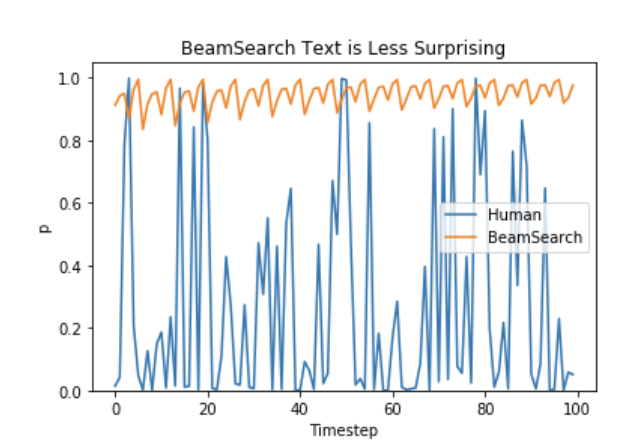
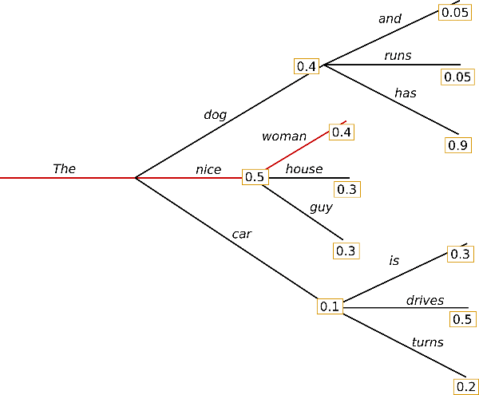
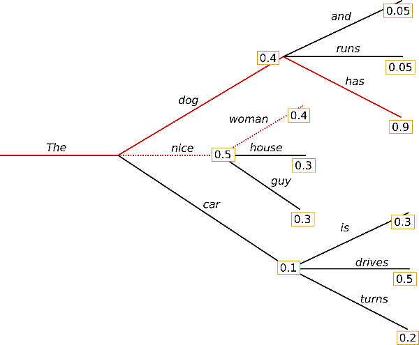
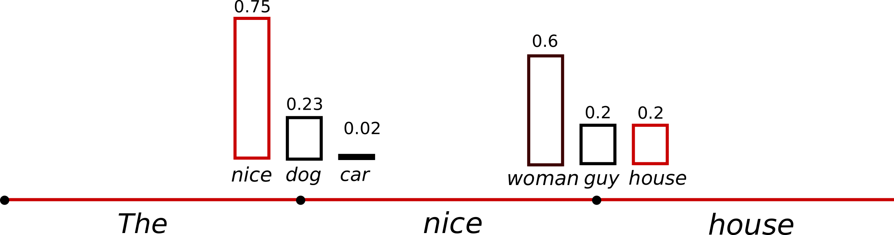
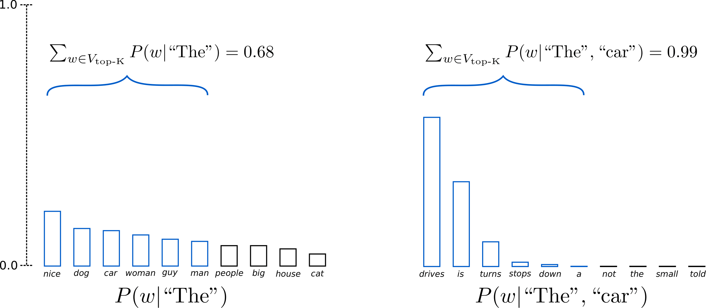
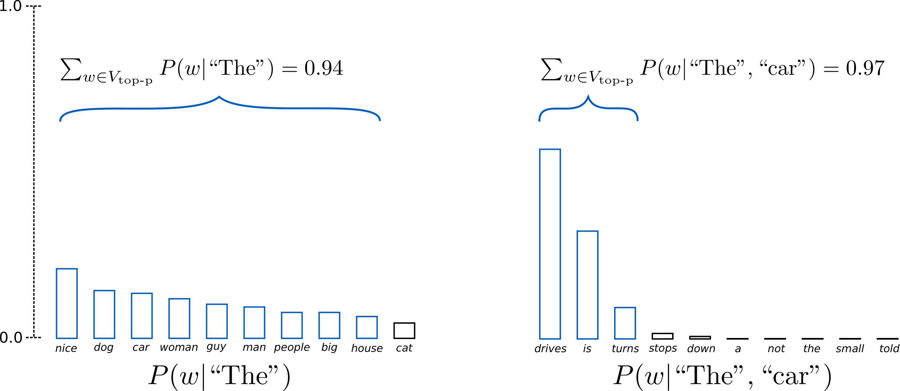

# 推理时采样参数：temperature / top_p / top_k

资料来源：
- [How to generate text: using different decoding methods for language generation with Transformers — Hugging Face Blog](https://huggingface.co/blog/how-to-generate)
- [Generation strategies — Transformers Documentation](https://huggingface.co/docs/transformers/generation_strategies)
- [Accelerating Large Language Model Decoding with Speculative Sampling (Leviathan et al., 2023)](https://arxiv.org/abs/2211.17192)

## 阅读目标

关注四个问题：

1. 推理时模型的 next-token 概率分布是怎么从 logits 变成实际采样结果的。
2. temperature、top_k、top_p 三个参数各自在做什么、分别改变了什么。
3. 为什么生产推荐 `temperature` 与 `top_p` 组合，而不推荐 `top_k` 与 `top_p` 同时开启。
4. 这些参数在主流推理框架（HF `generate`、vLLM logits processor）中如何落地。

核心结论是：temperature 在 softmax 之前对 logits 做缩放，控制分布的锐度（越小越确定，越大越随机）；top_k 把候选集合硬截断到概率最大的前 k 个；top_p 用累计概率阈值动态决定候选集合大小；min_p 和 typical_p 在 top_p 基础上再叠加一个“相对”或“信息论”条件；repetition penalty / frequency penalty / presence penalty 是后处理阶段的 logit bias，用来抑制重复。生产推荐 `temperature=0.7-1.0` + `top_p=0.9` 的组合；不要同时开 `top_k` 和 `top_p`，否则 top_p 的动态集合优势会被 top_k 的硬上限抹平。

## 名词解释

| 名词 | 解释 | 简单例子 |
|---|---|---|
| Logits | 模型最后一层在 vocabulary 维度上的原始分数，尚未归一化。 | Llama-2 在每一步输出一个 `vocab_size=32000` 维的向量。 |
| Softmax | 把 logits 指数化并归一化成概率分布的标准算子。 | logits = [2.0, 1.0, 0.5] → probs ≈ [0.59, 0.24, 0.17]。 |
| Temperature | 在 softmax 之前把 logits 除以一个标量 T，用来控制分布锐度。 | T=0.1 时分布几乎 one-hot，T=1 是模型原始分布，T=2 更平坦。 |
| Top-k sampling | 在每一步只保留概率最大的前 k 个 token，其余置零再重新归一化。 | vocab=50000，k=50，只在 50 个高概率 token 里采样。 |
| Top-p (Nucleus) sampling | 从大到小累加概率，截到累计概率 ≥ p 的最小集合，再重新归一化采样。 | p=0.92 时，如果 top 8 个 token 累计 0.93，就在这 8 个里采样。 |
| Min-p sampling | 在 top-p 之外再加一条“相对阈值”：只保留概率 ≥ `min_p × max_prob` 的 token。 | max_prob=0.6，min_p=0.1，则只保留 ≥ 0.06 的 token。 |
| Typical_p sampling | 不以概率阈值截断，而是按“信息量”截断：保留信息量接近期望值的 token。 | 用来避免“高概率但信息量极低”的退化循环。 |
| Eta sampling | 一种基于尾部概率的截断方法，保证每一步的尾部概率不超过阈值。 | 与 top-p 类似但保证有理论界。 |
| Contrastive search | 用一个退化惩罚项与模型的“自信度”共同挑选 token，强调全局一致性。 | 在 SimCTG 论文中提出，避免重复和语义塌缩。 |
| Repetition penalty | 对已经出现过的 token 在 logit 上乘以一个 `<1` 的因子，抑制再次出现。 | 1.0=不惩罚，1.1 轻微抑制，1.5 强烈抑制。 |
| Frequency penalty | 对一个 token 的 logit 减去 `freq × α`，出现越多扣越多。 | 出现 3 次、α=0.5 时减 1.5。 |
| Presence penalty | 只要出现过该 token 就减一个固定值，不随次数线性增长。 | 出现过 1 次和 5 次扣同样的分。 |
| Logits processor / Logits warper | 推理框架里的可插拔模块，对每一步的 logits 做修改（温度、截断、惩罚等）。 | HF 的 `LogitsProcessor`、vLLM 的 `LogitsProcessor` 都遵循同一抽象。 |
| Greedy decoding | 每一步取 argmax，不做随机采样。 | beam_size=1 退化为 greedy。 |
| Beam search | 每一步保留 top-B 条候选路径，最终选整体概率最高的序列。 | B=4 时追踪 4 条并行假设。 |
| Sampling (multinomial) | 从完整概率分布上做多项式采样。 | `do_sample=True, num_beams=1`。 |
| Speculative Decoding | 用一个小模型 draft、大模型 verify 的并行解码技术，常用于加速推理。 | 小模型生成 5 个候选 token，大模型一次打分确认。 |
| KV Cache | 推理时缓存历史 token 的 Key / Value，避免每步重算。 | 形状 `(B, H, N_max, D)`，新 token 只需拼接 N 维。 |

## 1. 背景：为什么需要采样参数

LLM 在每一步输出的是一个 `vocab_size` 维的概率分布。从这个分布到“下一个 token 是哪一个”，中间就是 decoding strategy（解码策略）。同一个模型、同一段 prompt，换不同的解码策略，输出风格会截然不同：

- 翻译、摘要这类“答案唯一”的任务，需要稳定、可复现。
- 创意写作、对话、Code completion 这类“答案空间大”的任务，需要多样性和随机性。



这张图来自 Holtzman et al. 2020（The Curious Case of Neural Text Degeneration）。横轴是“rank”，纵轴是概率。可以看到人写文本（蓝点）经常落在模型的低概率尾巴上；beam search（红线）则被困在模型认为“高概率”的窄带里，最后反而产出重复、乏味的句子。

这就是采样参数存在的根本原因：不是所有场景都想要 argmax；不同任务需要不同的“随机性预算”。temperature、top_k、top_p 等参数就是用来调节这个预算的旋钮。

## 2. Greedy 与 Beam Search：确定性基线

### 2.1 Greedy decoding

每一步取概率最大的 token：

```
next_token = argmax(softmax(logits))
```

特点：完全确定、复现性强。短答案任务（事实问答、代码补全）效果不错，长文本容易陷入重复循环。



图中展示 greedy 在每一步选最大概率词的过程：从 "The" → "nice" → "woman"。

### 2.2 Beam search

保留 top-B 条候选序列，每步扩展后裁剪到 B 条，最终选整体概率（通常是 log-prob 之和除以长度惩罚）最高的一条：

```
score = sum(log P(token_i | history)) / length^alpha
```



图中展示了 `num_beams=2` 的情形：左侧 "The dog has"（P=0.36）虽然第一步概率不是最高，但累计下来反而超过了 "The nice woman"（P=0.2）。

工程含义：

- 适合“答案空间小、需要稳定”的任务：翻译、摘要、ASR。
- `num_beams` 一般 4-8 收益就到顶，更大边际收益低且显存压力大。
- Beam search 输出的多样性差、不适合创意生成；配合 `diverse_beam_search` 或 `num_beam_groups` 可以缓解。

## 3. Temperature：分布锐度旋钮

### 3.1 公式

Temperature T 把 logits 在 softmax 前除以 T：

```
P(token_i) = softmax(logits / T)
```

T 的取值含义：

- T → 0：分布接近 one-hot，等价于 greedy。
- T = 1：模型原始分布（训练时学习到的）。
- T > 1：分布更平坦，长尾 token 概率升高，输出更随机。

### 3.2 直觉

把 logits 想象成“山峰高度”。T 把所有高度同时压扁或拉高，再做 softmax：

- T 越小，山峰差异被放大，胜出的 token 越确定。
- T 越大，山峰被压平，弱者也有机会。



这张图把同一段 prompt 在不同 temperature 下的下一个词分布画了出来：左侧 T=1 时有多个候选（car、drives、is、turns…），右侧降低 temperature 后明显集中到少量高概率词上。

### 3.3 工程经验

| 任务 | 推荐 T | 理由 |
|---|---|---|
| 事实问答 / 代码补全 | 0.0-0.2 | 稳定、可复现，等价 greedy 或接近 greedy。 |
| 通用 chat / RAG | 0.7 | 既保留多样性，又不至于太发散。 |
| 创意写作 / brainstorm | 1.0-1.3 | 鼓励长尾 token，让输出更“出人意料”。 |

## 4. Top-k sampling：硬截断

### 4.1 做法

每一步只保留概率最大的前 k 个 token，其余概率置 0，重新归一化后再采样：

```
top_k_indices = argsort(P)[-k:]
P_filtered[i] = P[i] if i in top_k_indices else 0
P_filtered = P_filtered / sum(P_filtered)
next_token ~ multinomial(P_filtered)
```



图中展示 k=6 的效果：从候选词 "not", "the", "small", "told", ... 这些尾部词被排除，只在 6 个高概率词里采样。

### 4.2 优点

- 实现简单、计算便宜。
- 有效切断“离谱尾部”，避免输出乱码。

### 4.3 缺点

- k 是固定常数，与分布形态无关。
- 当分布很尖锐（前 2 个 token 就 90%+）时，k 太大反而引入噪声。
- 当分布很平坦时，k 太小又损失多样性。
- 在不同 prompt、不同模型上，最优 k 不同，几乎无法“一刀切”。

这就是 top-p 要解决的核心问题：让候选集合大小跟随分布自适应。

## 5. Top-p (Nucleus) Sampling：动态集合

### 5.1 做法

按概率从大到小排序后累加，直到累计概率 ≥ p，取这时的子集作为候选：

```
sorted_probs = sort(P, descending=True)
cumulative = cumsum(sorted_probs)
cutoff = first index where cumulative >= p
candidates = tokens with cumulative <= cutoff
```



图中展示 p=0.92：左边是模型完整分布，右边是 nucleus 集合。可以看到对这段上下文，top 8 个 token 累计概率就到 0.92，所以候选集合只有 8 个，比固定 k=50 更紧凑。

### 5.2 直觉

当模型非常 confident（“今天”后面大概率是“天气”），nucleus 自动收紧到 1-2 个 token；当模型不确定时，nucleus 会自动放宽。这就是“自适应”：

| 场景 | 分布特征 | nucleus 行为 |
|---|---|---|
| 模型非常 confident | top-2 累计 > p | 候选集合 ≈ 2 |
| 模型中等不确定 | top-20 累计 ≈ p | 候选集合 ≈ 20 |
| 模型很分散 | top-500 才能到 p | 候选集合 ≈ 500 |

### 5.3 推荐取值

- p=0.9 是 OpenAI、Hugging Face 通用的默认值。
- p=0.95 略宽松，适合需要多样性的场景。
- p < 0.8 几乎等价 greedy，不推荐。

## 6. Top-p + Top-k 同时开启：常见误区

Hugging Face 的 GenerationConfig 默认是 `top_k=50, top_p=1.0` 或 `top_k=0, top_p=0.9`。但很多教程会让读者同时开两个，这是反模式：

```
# 反例：top_k 和 top_p 同时开
model.generate(..., do_sample=True, top_k=50, top_p=0.9, temperature=0.7)
```

问题在于：top_p 的核心价值是“自适应”，top_k 的固定上限会破坏这种自适应。当模型分布很尖锐时，top-p 只需要 2-3 个 token，但 top_k=50 强制保留 50 个，把“确定”的信号稀释了。

正确做法是二选一：

- `top_k=0, top_p=0.9, temperature=0.7`：现代 chat 通用。
- `top_k=50, top_p=1.0`：早期 GPT-2/GPT-3 时代的做法，top_p 不生效。
- `top_k=0, top_p=1.0, temperature=T`：纯 temperature sampling。

## 7. min_p、typical_p、eta、contrastive

### 7.1 min_p sampling

min_p 是 2024 年提出的“相对截断”，被 vLLM、Transformers 新版本原生支持：

```
threshold = min_p * max(P)
candidates = { i : P[i] >= threshold }
```

直觉：top-p 是绝对阈值（0.9 概率），min_p 是相对阈值（最大概率的 10%）。当模型很 confident 时（max_prob = 0.9），min_p=0.1 等价于绝对阈值 0.09，候选集合可能只有 1 个 token；当模型很分散时（max_prob = 0.1），min_p=0.1 等价于绝对阈值 0.01，候选集合会很宽。

优势：跨模型、跨 prompt 表现更稳定，工程上越来越多人推荐 `min_p=0.05-0.1` 替代 top_p。

### 7.2 typical_p sampling

按“信息量”截断：保留 `|log(P) - H|` 接近 0 的 token，其中 H 是期望信息量（熵）。

直觉：top-p 倾向于保留高概率 token，但这些 token 有时候恰恰是最“没信息量”的（高频停用词、模板化句式）。typical_p 优先保留“人话”应该有的、信息量适中的 token。

适用：长文本生成、故事续写。

### 7.3 eta sampling

eta 是另一种尾部截断方法，保证“尾部概率之和不超过 sqrt(p × (1-p))”。数学上更优雅，但工程上不如 top-p 和 min-p 普及。

### 7.4 contrastive search

SimCTG（Su et al., 2022）提出：在解码时同时考虑模型置信度（probability）和退化惩罚（similarity penalty）：

```
score = max(log P(token)) - lambda * max(cosine(hidden_state, history_hidden_states))
```

适用：需要避免重复 + 维持语义一致性的长文本任务。

## 8. Repetition penalty / Frequency / Presence

这三类都是后处理阶段的 logit bias，不是采样参数。它们对已经出现过的 token 做惩罚。

### 8.1 Repetition penalty

```
if P[i] < 0:  logits[i] *= penalty   # penalty > 1
else:         logits[i] /= penalty
```

直观：对低概率已出现 token 拉低概率，对高概率已出现 token 也拉低。`repetition_penalty=1.0` 不惩罚，1.05-1.2 通用，1.5+ 强烈抑制。

### 8.2 Frequency penalty

OpenAI API 引入。出现过的次数线性累加扣分：

```
logits[i] -= frequency_penalty * count(token_i in history)
```

`frequency_penalty=0.0` 不惩罚，0.5-1.0 通用。

### 8.3 Presence penalty

只要出现过就扣一个固定值，不随次数增长：

```
if token_i in history: logits[i] -= presence_penalty
```

### 8.4 作用位置

这三者都在 logits 上做修改，必须放在 temperature 缩放之后、采样之前：

```
logits = model(input_ids).logits  # 原始
logits = RepetitionPenalty(logits, history)  # 后处理
logits = logits / temperature  # temperature 缩放
probs = softmax(logits)
probs = top_p_filter(probs, p=0.9)  # 截断
next_token = multinomial(probs)  # 采样
```

如果顺序颠倒（例如先做 top_p 再做 repetition penalty），截断后的 logits 已被归一化，再做惩罚会破坏概率分布。

## 9. 在推理框架中的实现

### 9.1 Hugging Face `generate`

`generate()` 把每一步的 logits 修改抽象成 `LogitsProcessor` 列表，按顺序执行：

```python
from transformers import LogitsProcessor

class MyProcessor(LogitsProcessor):
    def __call__(self, input_ids, scores):
        # scores: (batch, vocab_size)
        # 修改后返回
        return scores
```

内置的常用 processor：

- `TemperatureLogitsWarper`
- `TopKLogitsWarper`
- `TopPLogitsWarper`
- `MinPLogitsWarper`
- `RepetitionPenaltyLogitsProcessor`
- `NoBadWordsLogitsProcessor` / `ForceWordLogitsProcessor`
- `ClassifierFreeGuidanceLogitsProcessor`

调用时通过参数传入：

```python
outputs = model.generate(
    **inputs,
    do_sample=True,
    temperature=0.7,
    top_p=0.9,
    repetition_penalty=1.05,
)
```

### 9.2 vLLM

vLLM 用 `SamplingParams` 把参数集中起来，server 端统一应用：

```python
from vllm import SamplingParams

params = SamplingParams(
    temperature=0.7,
    top_p=0.9,
    top_k=-1,           # -1 表示不限制
    min_p=0.05,
    repetition_penalty=1.05,
    max_tokens=512,
    stop=["</s>"],
)
```

vLLM 在每一步 forward 后把所有 logits warper fuse 成一次 GPU 调用，性能远高于逐个 apply。

### 9.3 Logit bias（约束解码）

把“先验知识”写进 logits：强制某些 token 概率设为 -inf 或 +inf：

```python
# vLLM: 强制以 "Yes" 或 "No" 开头
params = SamplingParams(
    logit_bias={"Yes": 10.0, "No": 10.0},
)
```

这是 constrained decoding / grammar-constrained decoding 的基础：把 JSON schema 或正则表达式转成 logit bias，就能在 token 层面保证结构合法。

## 10. 对比表

| 维度 | Greedy | Beam | Top-k | Top-p | Typical_p | Min_p |
|---|---|---|---|---|---|---|
| 随机性 | 无 | 无 | 中 | 中 | 中 | 中 |
| 候选集合 | 1 | B | 固定 k | 自适应 | 自适应 | 自适应 |
| 阈值含义 | argmax | log-prob 之和 | 前 k 个 | 累计概率 ≥ p | 信息量接近熵 | ≥ min_p × max_prob |
| 多样性 | 差 | 差 | 中 | 中-好 | 好 | 好 |
| 稳定性 | 高 | 高 | 取决于 k | 取决于 p | 较稳 | 跨模型最稳 |
| 重复风险 | 高 | 高 | 中 | 低 | 低 | 低 |
| 适合任务 | 短答案、代码 | 翻译、摘要 | 通用 | 通用 chat | 长文本 | 通用 chat |
| 何时不推荐 | 创意写作 | 创意写作 | 分布很尖锐时 | p < 0.8 | 短答案 | — |

## 11. 工程要点

### 11.1 Logit 数值稳定性

softmax 在 fp16/bf16 下做极大或极小 logits 时会溢出（exp(1000)=inf）。建议：

- logits 在 fp32 下做 temperature、top-p、softmax。
- 不要在 fp16/bf16 下直接做 softmax。
- vLLM 内部有专门的 logits normalization kernel。

### 11.2 Repetition penalty 的作用位置

必须放在 temperature 缩放之前：

```
logits = model().logits
logits = repetition_penalty(logits)   # 先惩罚
logits = logits / temperature          # 后 scale
probs = softmax(logits)
```

如果反过来，penalty 对归一化后的 probs 无效（softmax 已经是单调变换但乘 scaling 会改变相对差距）。

### 11.3 Batch 采样

batch 内每条样本可以独立设置采样参数。HF `generate` 通过 `generation_config` 控制；vLLM server 端 `SamplingParams` 允许每个请求独立。

### 11.4 Speculative Decoding 加速

Speculative Decoding（Leviathan et al., 2023）不改变采样参数，但和采样有理论联系：

- 用小模型生成 K 个 draft tokens。
- 大模型一次 forward 验证 K 个 token 是否接受（基于 rejection sampling）。
- 接受率与 sampling 分布严格对齐，所以输出分布不变。

意义：temperature、top_p 等参数对 Speculative Decoding 完全兼容，推理速度可以提 2-3 倍。

### 11.5 评测对齐

| 参数 | 等价 / 近似 |
|---|---|
| `temperature=0` | greedy |
| `temperature=1, top_p=1` | 原始多项式采样 |
| `temperature→0, top_p=any` | argmax |
| `top_k=1` | greedy |
| `top_p≈0` | greedy |

调试时可以这样快速 sanity-check：温度降到 0 应该输出和 greedy 一致；top_k=1 也应该输出和 greedy 一致。

## 12. 关键结论

1. **Temperature** 在 softmax 之前缩放 logits，控制分布锐度；T 越小越确定，T 越大越随机。T→0 等价 greedy。
2. **Top-k** 固定候选集合大小，实现简单但跨 prompt 不稳。
3. **Top-p (Nucleus)** 用累计概率动态决定候选集合，是当前 chat 场景的事实标准，推荐 p=0.9。
4. **Min-p** 用相对阈值（最大概率的 min_p 倍）替代绝对阈值，跨模型表现更稳，正在成为新趋势。
5. **不要同时开 top_k 和 top_p**：top_p 的自适应优势会被 top_k 的硬上限抹平。
6. **Repetition penalty / Frequency / Presence** 是后处理阶段的 logit bias，不是采样参数；必须放在 temperature 之前。
7. **Speculative Decoding** 与 sampling 严格对齐，是最主流的解码加速技术。
8. 生产推荐：`temperature=0.7, top_p=0.9, repetition_penalty=1.05`；或 `temperature=0.7, min_p=0.05`。

## 13. 面试速答卡

Q1：temperature、top_p、top_k 分别在做什么？
A：temperature 在 softmax 前对 logits 做缩放（T→0 等价 greedy，T=1 是原始分布，T>1 更随机）；top-k 把候选集合硬截断到前 k 个 token；top-p（nucleus）按累计概率阈值 p 动态决定候选集合大小，p=0.9 是 chat 场景通用值。

Q2：为什么不要同时开 top_k 和 top_p？
A：top_p 的核心价值是“自适应”——分布尖锐时自动收紧候选集合，分布平坦时自动放宽。top_k 的硬上限会破坏这种自适应，在模型很 confident 时把“确定”信号稀释成噪声。生产推荐二选一。

Q3：min_p 相对 top_p 有什么优势？
A：min_p 用相对阈值（max_prob × min_p），跨模型、跨 prompt 表现更稳定。top_p 的绝对阈值 0.9 在 confident 场景可能过紧，在分散场景可能过松。min_p=0.05-0.1 正在替代 top_p=0.9 成为新的 chat 默认。

Q4：repetition penalty 应该放在 temperature 之前还是之后？
A：之前。repetition penalty 修改 logits 的绝对值；先做惩罚再做 temperature scale 才有意义。如果颠倒，penalty 对已归一化的概率无效。

Q5：Speculative Decoding 会不会改变采样分布？
A：不会。Speculative Decoding 用 rejection sampling 严格对齐目标分布，只是把串行解码变成“draft + verify”的并行模式。temperature、top_p 等所有采样参数都与之兼容，输出分布与原采样一致。