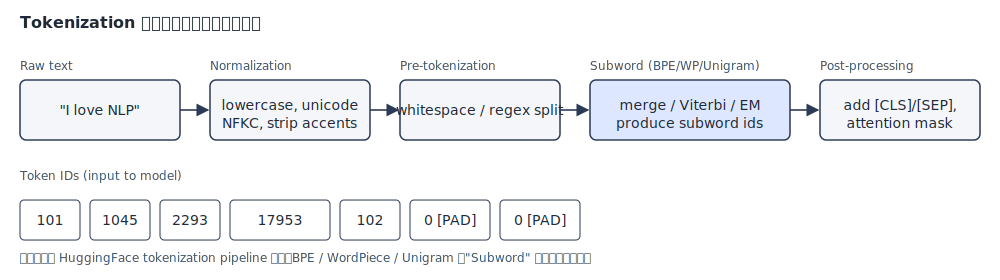
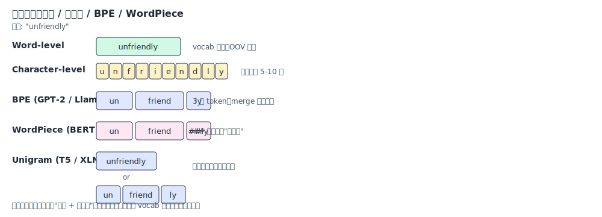
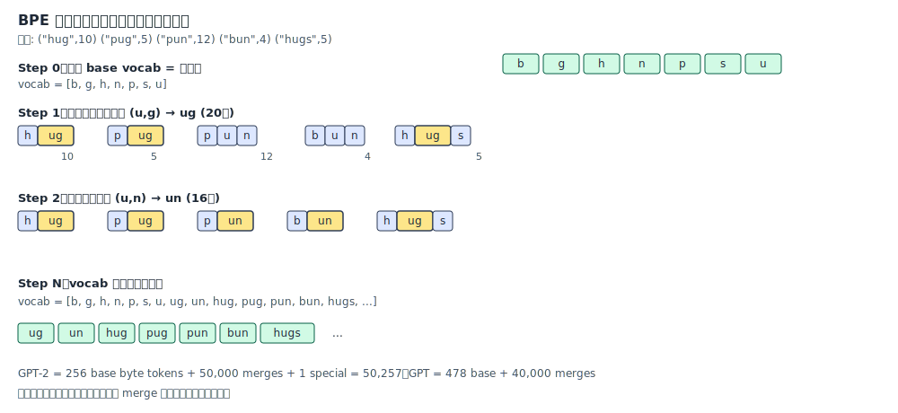
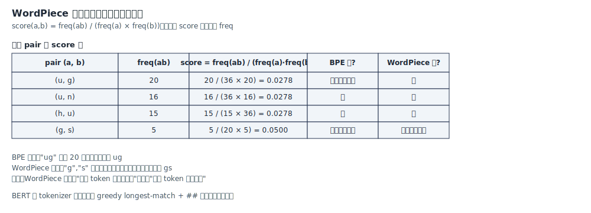
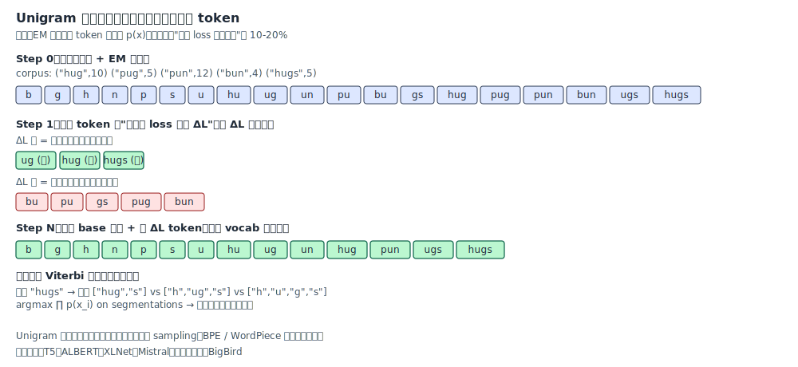
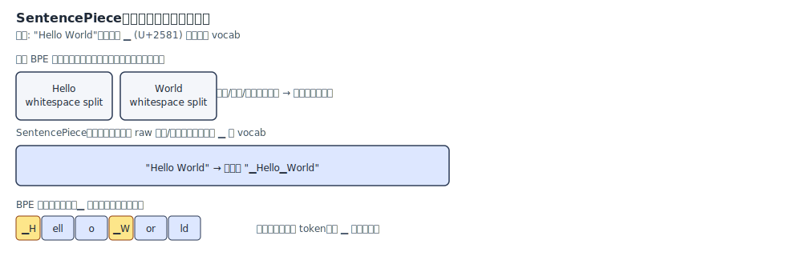
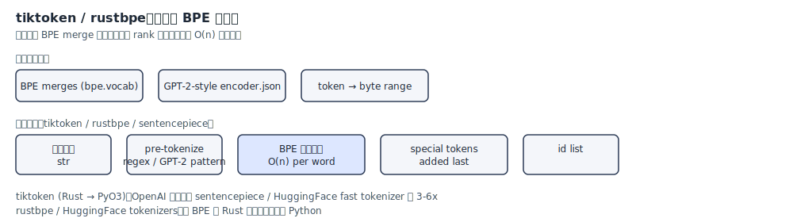
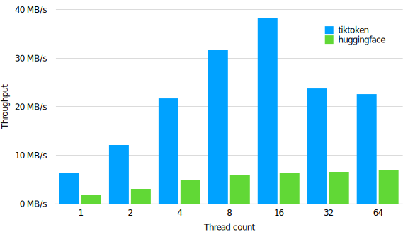
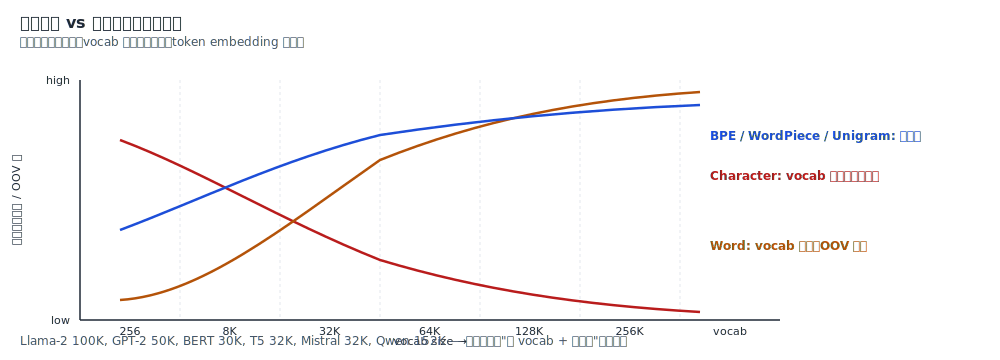

# Tokenization：BPE / WordPiece / Unigram 与子词切分

资料来源：
[HuggingFace Tokenizer Summary](https://huggingface.co/docs/transformers/tokenizer_summary) 
[Neural Machine Translation of Rare Words with Subword Units (BPE, Sennrich 2016)](https://huggingface.co/papers/1508.07909) 
[Subword Regularization (Unigram, Kudo 2018)](https://huggingface.co/papers/1804.10959) 
[SentencePiece (Kudo & Richardson 2018)](https://huggingface.co/papers/1808.06226) 
[Google's Neural Machine Translation System (WordPiece, Schuster & Nakajima 2012)](https://static.googleusercontent.com/media/research.google.com/en//pubs/archive/37842.pdf) 
[openai/tiktoken](https://github.com/openai/tiktoken) 
[google/sentencepiece](https://github.com/google/sentencepiece)

## 阅读目标

关注三个问题：

1. 什么是 tokenization，为什么 LLM 必须把字符串切成一组离散 id。
2. 词级、字符级、子词级三种粒度的权衡点是什么；BPE / WordPiece / Unigram 三种子词算法在训练目标上有什么本质差异。
3. SentencePiece、tiktoken、HuggingFace tokenizers 这些工业实现分别解决了什么工程问题；新模型在选 tokenizer 时应该看哪些维度。

核心结论是：Tokenization 是 LLM 把"任意字符串"映射到"vocab id 序列"的离散化过程。当代 LLM 几乎全部采用子词粒度，把"vocab 大小、序列长度、OOV 率"之间的三角矛盾压缩到一个可控区间。BPE 用"最高频相邻对合并"自底向上构造词表，WordPiece 把合并准则换成"似然比"以挑选"最不该独立出现的对"，Unigram 倒过来从大词表自顶向下按"删除代价"剪枝；三条路线输出质量接近，但训练机制、推理时的切分确定性、可解释性完全不同。SentencePiece 是把"按空格预切词"这步省掉的统一接口，tiktoken / rustbpe 是工业上把 BPE 编码加速到 O(n) 的 Rust 实现。

## 名词解释

| 名词 | 解释 | 简单例子 |
|---|---|---|
| Token | 字符串切分后的最小单位，对应 vocab 中一个 id。 | "unfriendly" 切成 ["un", "friend", "##ly"]。 |
| Vocabulary (vocab) | 训练得到的"合法 token 集合"，每个 token 对应一个整数 id。 | GPT-2 vocab=50,257；BERT vocab=30,522。 |
| Subword (子词) | 介于字符和词之间的 token 单元，兼顾 vocab 大小与语义。 | "annoyingly" → ["annoy", "ing", "ly"]。 |
| OOV (Out-Of-Vocabulary) | 切分后仍然无法表示的字符，会被映射到 <unk>。 | 字符级 / 词级 tokenization 都可能产生 OOV。 |
| BPE (Byte Pair Encoding) | 自底向上、迭代合并最高频相邻对的子词算法。 | GPT-2 / Llama / Qwen / Mistral 都在用。 |
| WordPiece | 与 BPE 同结构，但用"似然比"代替"频次"挑选合并对。 | BERT / DistilBERT / Electra 在用。 |
| Unigram | 从大词表自顶向下，按"删除后 loss 增量"剪枝的概率模型。 | T5 / ALBERT / XLNet / BigBird 在用。 |
| Byte-level BPE | 把 base vocab 固定为 256 个字节，避免 OOV。 | GPT-2 / RoBERTa / Llama 系列采用。 |
| SentencePiece | 把"按空格预切词"省掉、把空格编为 ▁ 的统一 tokenization 库。 | Llama / T5 / XLM-R 等多语模型标配。 |
| Pre-tokenization | 子词切分前的"粗切"步骤，把文本按空格 / 标点 / 正则分成 word 单元。 | GPT-2 用 `'s\|'t\|'re\|'ve\|'m\|'d\|'ll` 这样的 regex。 |
| Special token | 不来自语料的人工 token，承担控制信号、padding、segment 等角色。 | [CLS] [SEP] [PAD] [BOS] [EOS] <|im_start|>。 |
| Merge rule | BPE 训练时学到的"两个 token → 一个 token"的有序规则。 | ("u", "g") → "ug"，rank 越低越先合并。 |
| Viterbi decoding | Unigram 在推理时用于挑概率最大切分的动态规划算法。 | "hugs" 多切分中选 ∏p(x_i) 最大的那条。 |

## 1. 背景：为什么需要 tokenization

LLM 的输入是字符串，模型内部只处理 embedding 向量。从字符串到向量之间必须有一道"离散化"工序，把任意长度的字符流映射成一组固定 vocab 内的 id 序列。这道工序就是 tokenization。



整条流水线是：raw text → normalization（lowercase、unicode NFKC、去重音等）→ pre-tokenization（按空格 / 正则粗切）→ 子词切分（BPE / WordPiece / Unigram）→ post-processing（加 [CLS]/[SEP]、生成 attention mask）→ token id 序列。从模型视角看，下游所有的 attention 计算都建立在 id 序列之上，tokenization 错了整个推理就错了。

历史上这个步骤曾经被当成"工程实现细节"，但近年的工作（Llama 3 tokenizer 重训、Qwen 多语扩展、SentencePiece 在 100+ 语种上的不均衡问题）证明：tokenizer 设计直接决定模型在哪些语言 / 领域 / 编码上表现。

## 2. 粒度选择：词级、字符级、子词级

切分粒度有三种典型选择：



| 粒度 | vocab 大小 | 序列长度 | OOV | 语义信息密度 | 代表 |
|---|---|---|---|---|---|
| Word-level | 极大（>500K） | 短 | 高 | 高 | 早期 NLP 工具 |
| Char-level | 极小（256~2K） | 极长 | 无 | 低 | 字符 RNN |
| Subword | 中（30K~250K） | 中 | 几乎无 | 中 | 当代所有 LLM |

工程上三条权衡线决定粒度：

- vocab 越大，embedding 矩阵（vocab × d_model）越大，softmax 越贵，内存越高。
- vocab 越小，OOV 越多，必须引入 <unk>，模型对生词的鲁棒性下降。
- 序列越长，self-attention 的 O(n²) 成本越高，KV cache 显存越大。

子词粒度的核心思想是：把"出现频率高的整词"和"出现频率低的子片段"放在同一个 vocab 里，词表大小可控，序列长度可控，OOV 几乎消失。这是当代 LLM 共同的选择。

## 3. BPE：自底向上的相邻对合并

Byte Pair Encoding 由 Sennrich 等人在 2016 年引入 NLP（最初是 1994 年的压缩算法），是当前 LLM 主流的子词算法。GPT-2、Llama、Qwen、Mistral、Gemma 全家都使用 BPE 变体。

### 3.1 训练过程



训练时把语料中所有 unique word 拿出来：

1. **建立 base vocab**：把词拆成字符（或 byte），字符集就是 base vocab。
2. **统计相邻对频次**：对每个 word 内的相邻 token 对，统计它们跨 word 出现的总频次。
3. **合并最高频对**：把出现最多的相邻对合并成新 token，加入 vocab；这个合并规则记作 `(a, b) → ab`。
4. **重复 2-3**：每轮 vocab +1，merge 规则按被合并的先后顺序得到一个 rank 列表。
5. **停止**：直到 vocab size 达到目标值。

GPT-2 训练到 50,257（256 byte tokens + 50,000 merges + 1 special）；原始 GPT 是 40,478（478 base + 40,000 merges）；Llama 2 是 32,000。

### 3.2 推理过程

推理时用训练得到的 merge rank 表做贪心：

```text
输入 word:  "hugs"
字符序列:   h u g s
rank(u,g) 较 rank(g,s) 更小（更早合并），所以优先合并 u+g
得到:      h ug s
再没有可合并对，输出:  ["h", "ug", "s"]
```

关键性质：

- 切分是 **确定性的**：给定 vocab 和 merge rank，每个 word 只有唯一切分。
- 编码复杂度是 O(n) per word（用 rank 数组做 hash + 优先合并）。
- 训练和推理逻辑完全解耦：训练是统计性的，推理是纯查表。

### 3.3 Byte-level BPE

如果 base vocab 用 Unicode 字符，多语种、emoji、罕见符号会让 base vocab 膨胀到几万。Byte-level BPE 直接把 base vocab 固定为 256 个字节，理论上任意 UTF-8 文本都能切分，不会 OOV。GPT-2、RoBERTa、Llama 系列都采用这种变体。

代价是同一段文本切出的 token 数比字符级 BPE 多（因为一个中文常用字要 3 个 byte），但换来的是"训练和推理完全无需处理 <unk>"，工程上更省心。

## 4. WordPiece：把合并准则换成"似然比"

WordPiece 由 Google 在 2012 年提出，结构与 BPE 完全相同（自底向上迭代合并），但挑哪个相邻对合并的准则不同。

### 4.1 合并准则

BPE 选 **频次最高** 的对，WordPiece 选 **似然比最大** 的对：

```
score(a, b) = freq(ab) / ( freq(a) × freq(b) )
```



直觉上：

- 频次高的对，未必"两个 token 真的强相关"，可能只是两个常见字符天然碰面多。
- 似然比高，说明 `(a, b)` 一起出现的概率远超 `(a)` 单独和 `(b)` 单独的乘积，两个 token 真的"互相依赖"。

WordPiece 优先合并这种"互相依赖强"的对，词表利用率更高。但工程上 WordPiece 的原始训练代码不开源，BERT 的 WordPiece 实际训练流程由 Google 内部实现，对外只暴露 vocabulary + 切分逻辑。

### 4.2 BERT 的 greedy longest-match

BERT 在 inference 时不重新跑 WordPiece 训练，而是用 **greedy longest-match-first**：

1. 从左到右扫描 word。
2. 在 vocab 中查"以当前位置字符开头的最长 token"。
3. 切出来后，剩下的部分加 `##` 前缀继续查表。

例如 "unfriendly" 在 BERT vocab 中有 `un` 和 `##friend` 和 `##ly`，于是切成 `["un", "##friend", "##ly"]`。`##` 标记表示"这不是词首"，这样模型可以学到"这个词是另一个词的延续"。

## 5. Unigram：自顶向下的概率剪枝

Unigram 由 Kudo 2018 年提出，训练机制和 BPE / WordPiece 相反——不是从小到大构造 vocab，而是从大 vocab 一刀一刀往下砍。

### 5.1 训练过程



1. **构造大候选词表**：对每个 word 取所有可能的子串（n-gram 集合），合并成超大候选集。
2. **EM 估概率**：用 Unigram 语言模型假设（每种切分独立），对每个候选 token 估 `p(x) = count / total`。
3. **算删除代价 ΔL**：对每个 token x，假设从 vocab 中删除 x，Viterbi 切分后 corpus 的对数似然会下降多少。ΔL 越大说明 x 越不可缺。
4. **剪枝**：删掉 ΔL 最小的那 10-20% token。
5. **重新估概率**：在剪枝后的 vocab 上重跑 EM。
6. **重复 3-5**：直到 vocab size 达到目标。

base 字符永远保留，保证任何 word 都能切分。

### 5.2 推理过程

Unigram 的 inference 找概率最大的切分：

```text
输入:  "hugs"
候选切分:
  A: ["hug", "s"]           p = p(hug) × p(s)
  B: ["h", "ug", "s"]       p = p(h) × p(ug) × p(s)
  C: ["h", "u", "g", "s"]   p = p(h) × p(u) × p(g) × p(s)
Viterbi 选 argmax p → 选 A
```

关键性质：

- 切分是 **概率性的**：给定 vocab 和 p 表，同一 word 理论上有多种合理切分；训练时可以加 sampling 引入切分噪声（Subword Regularization）。
- 训练成本远高于 BPE：每轮要算所有 token 的 ΔL。
- 输出的 vocab 通常比 BPE 略大但更"语义化"：T5 vocab 32,000、ALBERT vocab 30,000。

## 6. 三种算法的工程对比

| 维度 | BPE | WordPiece | Unigram |
|---|---|---|---|
| 训练方向 | 自底向上（小→大） | 自底向上（小→大） | 自顶向下（大→小） |
| 合并/剪枝准则 | 出现频次最高 | 似然比最大 | 删除后 loss 增量最小 |
| 训练目标 | 频率统计 | 频率统计（带归一化） | Unigram LM + EM |
| 训练成本 | 低（O(n × vocab)） | 中（同 BPE 加归一化） | 高（多轮 EM） |
| Inference 切分 | 确定性、O(n) per word | 确定性、greedy longest-match | Viterbi、O(n × vocab) |
| 多切分路径 | 否 | 否 | 是（可 sampling） |
| 处理生词 | 切到 base 字符 | 切到 base 字符 + `##` 标记 | 切到 base 字符 |
| 经典实现 | SentencePiece / tiktoken / HF tokenizers | BERT tokenizer（Google 闭源） | SentencePiece unigram mode |
| 代表模型 | GPT-2、Llama、Qwen、Mistral、Gemma | BERT、DistilBERT、Electra | T5、ALBERT、XLNet、BigBird |
| vocab 大小典型值 | 32K-200K | 30K | 32K-250K |
| 多语支持 | 弱（需 byte-level） | 中 | 强（天生支持 SentencePiece） |

最关键的两条差异：

1. **训练目标决定词表结构**：BPE 词表偏向"高频组合"（统计强相关）；Unigram 词表偏向"语义完整"（删除代价小）；WordPiece 介于两者之间。同一份语料，三种算法会学到不同的 token 集合。
2. **切分确定性**：BPE / WordPiece 对同一 word 永远输出同一切分；Unigram 可以用不同切分做数据增强，这对低资源语种特别有用。

## 7. SentencePiece：去掉"按空格预切词"的统一接口

标准 BPE / WordPiece / Unigram 都隐含一个假设：先按空格把文本切成 word，再对每个 word 做子词切分。这对英语、法语等拉丁语系没问题，对中文、日文、泰文这些没有显式空格的语言就失效了。



SentencePiece 由 Kudo & Richardson 2018 年提出，把预切词这步也省掉：

1. **把整段文本当作 raw 字符流**（可以先用 byte 编码）。
2. **空格用特殊字符 `▁` (U+2581) 表示**，编入 vocab。
3. 在这个流上跑 BPE 或 Unigram。

解码时把所有 token 拼起来，把 `▁` 替换成空格就行。这样同一套代码可以处理任意语言，Llama、T5、XLM-R、mBART 等多语模型都靠它做多语分词。

SentencePiece 同时也提供 BPE 和 Unigram 两种算法实现，外加 char-level 和 word-level 模式。

## 8. tiktoken 与 rustbpe：工业级 BPE 编码器

训练完拿到 vocab + merge rank 后，推理侧需要把字符串高效切分到 id。Python 的 naive 实现（每词重新统计 pair）很慢，工业上用 C++/Rust 重写。



OpenAI 官方给出的 tiktoken 性能数据：



这张图是 OpenAI 在 tiktoken 仓库 README 中给出的 benchmark。横轴是文本字节数，纵轴是编码耗时（越低越好）。在所有测试集上 tiktoken（红线）都比 SentencePiece / HuggingFace tokenizers 的 Python 实现快数倍。

- **tiktoken**（OpenAI）：用 Rust 实现 BPE encoder，通过 PyO3 暴露给 Python。GPT-4、GPT-4o 等 OpenAI 模型的官方 tokenizer 就是它。
- **HuggingFace tokenizers**：Rust 核心 + Python 绑定。支持 BPE / WordPiece / Unigram，预训练库 tokenizers 提供几十种模型的 fast tokenizer。训练流水线也用它。
- **SentencePiece**（C++）：Google 的实现，支持 BPE / Unigram / char / word。Llama 1/2 训练时用 SentencePiece，推理时部分项目切换到 tiktoken。

关键工程点：

- merge rank 数组预排序为 `rank[(a, b)]` 的查表，编码过程是 O(n) per word。
- pre-tokenize 用正则把文本切成 word，特殊 token（[CLS]、[SEP]、<|im_start|>）单独处理。
- 多线程并行：pre-tokenize 阶段独立，可分片并行；BPE 编码阶段 word 内部不并行（依赖前一次合并结果），word 之间可并行。

## 9. 特殊 token：控制信号、padding、segment

Vocab 里除了子词，还有一组"非语料" token 叫 special token：

| 特殊 token | 角色 | 常见值 |
|---|---|---|
| [CLS] / <s> | 句首分类位 | BERT [CLS]、LLaMA <s> |
| [SEP] / </s> | 句尾 / 句间分隔 | BERT [SEP]、LLaMA </s> |
| [PAD] | 长度对齐 | 通常 id=0 |
| [MASK] | 预训练遮蔽 | BERT [MASK]、T5 <extra_id_0> |
| [UNK] | 未知字符兜底 | byte-level BPE 几乎不用 |
| <|im_start|> / <|im_end|> | ChatML 对话起止 | Qwen、ChatGLM |
| <|tool_call|> | 工具调用边界 | 部分 Agent 框架 |
| <|endoftext|> | 文档结束 | GPT-2 |

特殊 token 必须人工加入 vocab 并指定 id；训 tokenizer 时通常把它们 reserve 出位置，训练数据中遇到时直接换成对应 id。

## 10. 词表大小与模型表现的权衡



vocab 越大：

- embedding 矩阵越大（vocab × d_model），显存和 IO 增加。
- 序列越短，attention O(n²) 成本下降。
- 每个 token 训练的次数减少（信息密度高但样本数下降）。

实践上的常见选择：

- GPT-2 50K、Llama 32K、Qwen 152K（中文需要大 vocab）。
- 多语模型 vocab 通常 100K-250K（XLM-R 250K、mBERT 120K）。
- 字符级 vocab 极少用（除非 <unk> 实在无法接受，比如密码学场景）。

## 11. 工程要点与实现检查

| 检查项 | 期望状态 |
|---|---|
| base vocab 选择 | 多语模型用 byte-level（256 base），避免 OOV；英语专用可用字符集（256~500 base）。 |
| pre-tokenize regex | GPT-2 用 `'s\|'t\|'re\|'ve\|'m\|'d\|'ll\|' ?\p{L}+\|...`，对缩写和标点敏感。 |
| merge rank 顺序 | BPE 推理时必须按 rank 升序贪心，rank 错会导致切分不一致。 |
| 特殊 token 数量 | 影响实际可用 vocab 大小；训 tokenizer 时 reserve 出来。 |
| 数字切分 | GPT-2 把每个数字单独切；Llama 切 1-3 位一组。数字敏感任务需评估。 |
| 大小写 | 区分 case 通常得到两套 vocab；不区分则 <unk> 风险上升。 |
| 标点 | 通常独立成 token；BPE 训练中应保留足够标点样本。 |
| SentencePiece 训练 | 用 `spm_train` 时指定 `--input`、`--model_prefix`、`--vocab_size`、`--model_type`（bpe / unigram）。 |
| tiktoken 加载 | `tiktoken.get_encoding("cl100k_base")` 或自定义 `Encoding` 对象传入 `mergeable_ranks` 和 `pat_str`。 |
| tokenizer 一致性 | 训练、推理、第三方 API 必须用同一个 vocab + merge rank，否则 id 对不上、模型效果立即崩。 |
| 多语均衡 | 训练 tokenizer 时应保证各语种语料占比合理；否则低资源语言会被切成 byte，序列拉长、效果变差。 |
| 重训时机 | vocab 增删、base 改变、新增语种、新增特殊 token 都需要重训 tokenizer 并从零预训练模型。 |

## 12. 关键结论

1. Tokenization 是 LLM 的离散化层，决定了模型能"看到"什么粒度的文本。BPE / WordPiece / Unigram 是三种主流子词算法，分别用"频次"、"似然比"、"删除代价"构造词表。
2. 词级粒度导致 OOV 和超大 embedding 矩阵；字符级粒度导致序列过长、语义信息密度低。子词粒度在两者之间取得折中，是当代 LLM 的事实标准。
3. BPE 用得最广（Llama / Qwen / Mistral / GPT-2），实现最简单、推理最快；WordPiece 是 BERT 系的选择，准则更"语义"；Unigram 训练成本最高，但支持多切分采样，对低资源语言更友好。
4. SentencePiece 是去"按空格预切词"的统一接口，让同一套代码可以处理任意语言，是多语 LLM 的标配。
5. 工业上 BPE 编码用 Rust 重写（tiktoken / rustbpe / tokenizers），比 naive Python 实现快 3-6×，是推理性能的关键环节。
6. 特殊 token 是"非语料 token"，承担控制信号、padding、对话起止、工具调用等角色，必须人工指定。
7. 训练 tokenizer 和训练模型一样重要：vocab 选错、pre-tokenize 写错、数字 / 标点 / 大小写策略不一致，都会直接体现在最终模型效果上。

## 13. 面试速答卡

Q1：什么是 tokenization，为什么 LLM 需要它？
A：Tokenization 是把字符串切分成 vocab 中 id 序列的离散化步骤。LLM 的 attention、embedding、softmax 都建立在离散的 id 序列之上，tokenization 决定模型能"看到"什么粒度的文本。错误的切分会让模型对生词、多语、特殊符号、emoji 全部失灵。

Q2：BPE、WordPiece、Unigram 的核心区别是什么？
A：三者都是子词算法，结构上 BPE 和 WordPiece 都是自底向上迭代合并相邻对，Unigram 是自顶向下从大词表按"删除代价"剪枝。关键差异在合并/剪枝准则：BPE 选最高频对，WordPiece 选似然比最大的对（更"语义"），Unigram 选删除后 loss 增量最小的 token（保留信息量最高的）。BPE / WordPiece 切分确定，Unigram 可以多切分采样。

Q3：什么是 byte-level BPE，为什么重要？
A：把 base vocab 固定为 256 个字节而不是 Unicode 字符，任意 UTF-8 文本都能切分到 byte，理论不会 OOV。代价是同一段中文文本 token 数比字符级 BPE 多，但工程上免去了 <unk> 处理。GPT-2、Llama、Qwen 等都采用。

Q4：为什么 SentencePiece 不需要按空格预切词？
A：SentencePiece 把整段文本当作 raw 字符流处理，空格用特殊字符 ▁ 编入 vocab。预切词这步被彻底去掉，同一套代码可以处理中文、日文、泰文等无空格语言。Llama、T5、XLM-R 等多语模型都靠它。

Q5：tiktoken 为什么比 HuggingFace tokenizers 快？
A：tiktoken 把 BPE merge rank 数组预排序为 hash 表 + 用 Rust 实现核心编码逻辑，避免 Python 解释器开销；pre-tokenize 和 BPE 编码分别在不同线程并行；特殊 token 用位图快速跳过。综合下来比纯 Python 实现快 3-6×。GPT-4、GPT-4o 等 OpenAI 模型的官方 tokenizer 就是它。

PATH: docs/tokenization/01-bpe-wordpiece-unigram.md
FIGURES: 9
