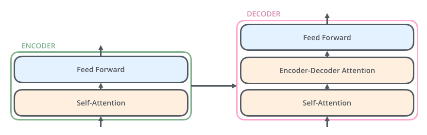
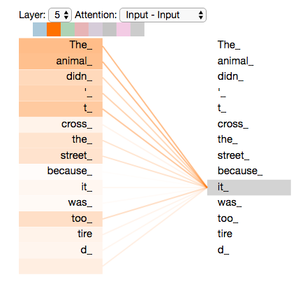
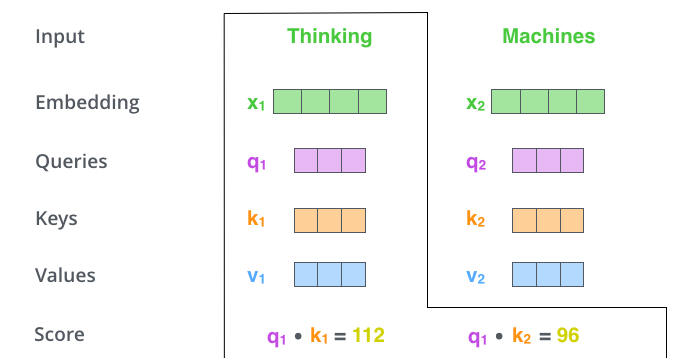
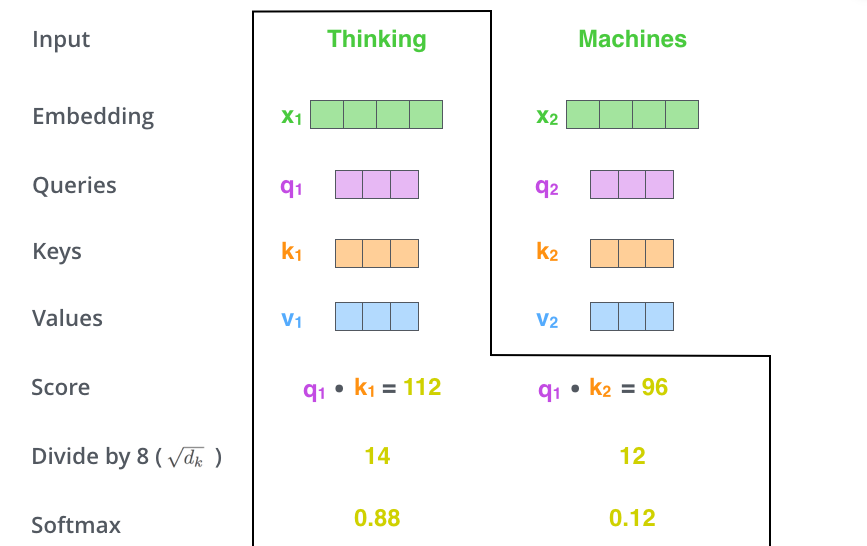
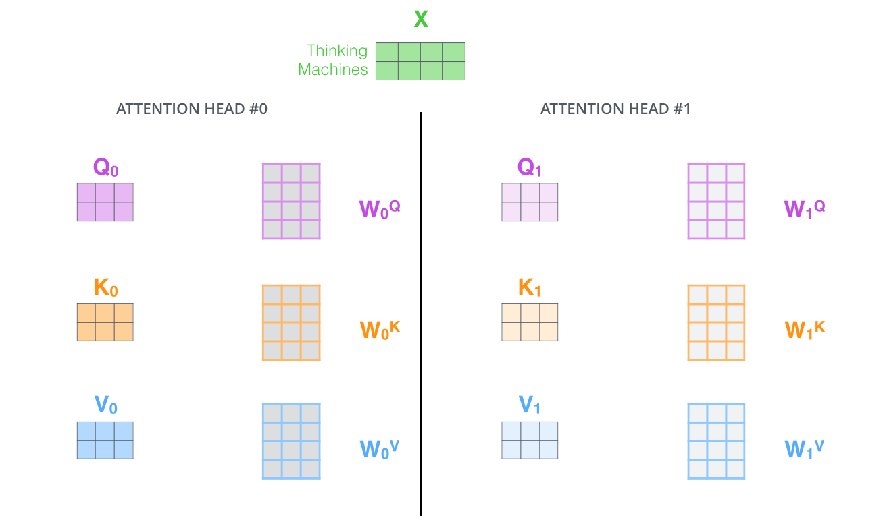
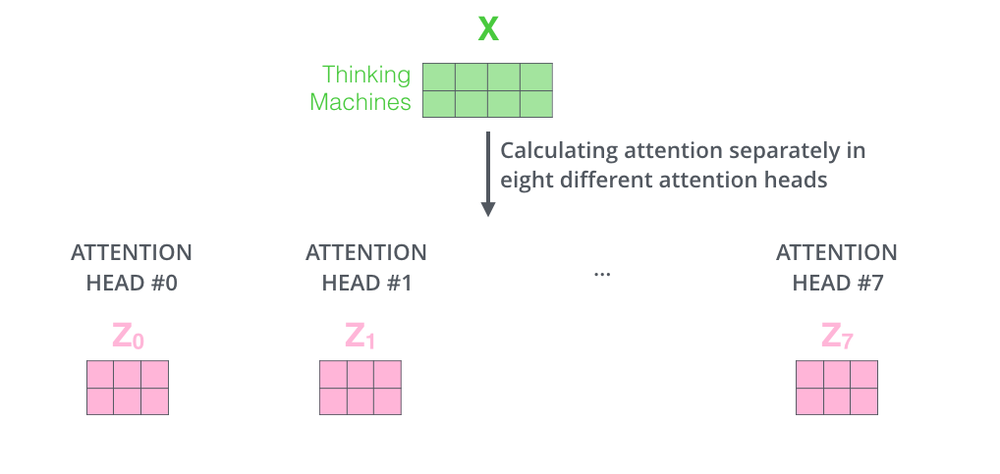
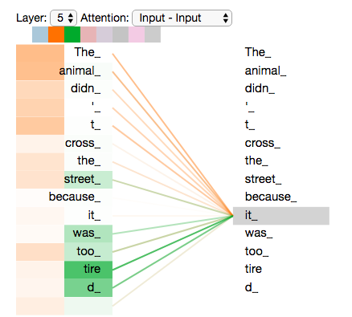
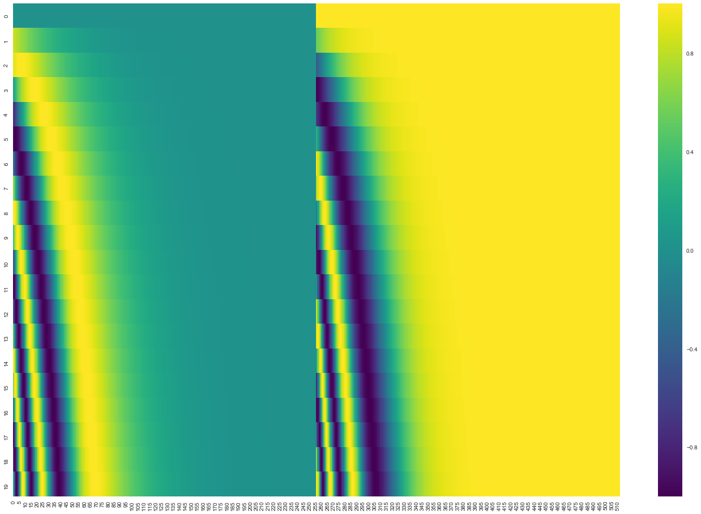

# Transformer Self-Attention：Q/K/V 与注意力怎么算

资料来源：
[The Illustrated Transformer — Jay Alammar](https://jalammar.github.io/illustrated-transformer/) 
[Attention Is All You Need](https://arxiv.org/abs/1706.03762)

## 阅读目标

关注三个问题：

1. Self-Attention 到底在算什么，Q / K / V 分别扮演什么角色。
2. 一个 token 的新表示如何通过对其他 token 加权聚合得到，权重从哪里来。
3. Multi-Head、Masked、位置编码这些机制分别解决了 Self-Attention 的哪一类工程问题。

核心结论是：Self-Attention 的本质是用一个可学习的检索过程，让序列中每个位置都能从其他所有位置动态地、按相关性取回信息。Q 表示“我要找什么”，K 表示“我能提供什么”，V 表示“我实际携带的内容”；把 Q 与所有 K 做相似度，再用得到的权重去加权求和 V，就得到当前位置融合了全局上下文的新表示。

## 名词解释

| 名词 | 解释 | 简单例子 |
|---|---|---|
| Self-Attention | 同一序列内部，token 之间互相计算相关性并交换信息。每个位置都会看序列中所有位置，按权重聚合它们的信息来更新自己。 | “The animal didn't cross the street because it was too tired.” 中 “it” 通过 self-attention 关联到 “animal”。 |
| Q (Query) | 当前 token 用来“查询”的向量，表示这个位置想从其他位置获取什么信息。 | “it” 想知道“什么东西 tired”，于是 Q 表示这种查询意图。 |
| K (Key) | 其他 token 用来“被查”的向量，表示这个位置能提供什么信息。 | “animal” 的 K 表示它是一个可以“被指代”的名词。 |
| V (Value) | 真正要被聚合到当前位置的“内容”。Q 和 K 只决定权重，V 才是被搬运的信息。 | “animal” 携带的语义内容通过 V 注入到 “it” 的新表示中。 |
| Attention score | Q 和 K 之间算出的相似度，再经 softmax 归一化成权重。 | “it” 对 “animal” 的分数明显高于对 “street” 的分数。 |
| Scaled Dot-Product | Transformer 用的具体算子：`softmax(QK^T / sqrt(d_k)) V`。除以 `sqrt(d_k)` 是为了稳定训练时的梯度。 | d_k 越大，点积方差越大，softmax 越接近 one-hot，除以根号 d_k 可以压回平滑区间。 |
| Multi-Head Attention | 把 d_model 维拆成 h 个“头”，每头独立做一次 attention，最后 concat。允许模型在不同子空间里关注不同类型的关系。 | 一头关注“主谓一致”，另一头关注“远距离指代”，再一头关注“局部搭配”。 |
| Masked Self-Attention | 在计算 attention 时遮住“不该看”的位置。Decoder 中用上三角 mask 让位置 t 看不到 t 之后的内容。 | 预测第 5 个 token 时，不允许它看到第 6、7、8 个 token。 |
| Position Encoding | 把位置信息显式注入 token embedding，因为 self-attention 本身对顺序不敏感。 | 同一句话打乱顺序后，token 之间的 attention 分布完全一样，必须用位置编码补偿。 |
| Context vector | Self-Attention 的输出：对所有位置的 V 按注意力权重加权求和。 | “it” 输出的新向量 = 0.7·V_animal + 0.2·V_street + … |
| 复杂度 O(n²·d) | Self-Attention 在序列长度 n 上的时间和空间复杂度都是平方级。这是它和 RNN/CNN 的核心权衡点。 | 长度 2048 的序列，attention map 有 4M 个元素；长度 8192 时变成 64M。 |

## 1. 背景：Transformer 整体结构

Transformer 是 Google 2017 年在 [Attention Is All You Need](https://arxiv.org/abs/1706.03762) 中提出的 Encoder-Decoder 架构，最初用于机器翻译。原文用 6 层 Encoder + 6 层 Decoder 堆叠，每层内部都使用 Self-Attention。


这张图是 Jay Alammar 改进后的版本。原文把 Transformer 当作一个黑箱：从一个法语句子出发，经过 Encoders、Decoders 之后，输出一个英语句子。这种黑箱视角解释了输入输出，但没解释它内部怎么工作。

更详细的结构是 6 个 Encoder 堆在一起、6 个 Decoder 堆在一起：


Encoder 与 Decoder 在结构上很相似——都是 N 层堆叠、每层内部都有 Self-Attention 和 FFN 子层。两者的关键差别在 Decoder 还有一个 Encoder-Decoder Attention 子层，让 Decoder 的当前位置可以去检索 Encoder 的输出。

### 1.1 Encoder 内部结构

每个 Encoder 内部有两个子层：

- **Self-Attention 子层**：让输入序列的 token 之间互相交换信息。
- **Feed-Forward 子层**：对每个位置独立做一个相同的两层全连接。


### 1.2 Decoder 内部结构

Decoder 内部有 3 个子层，多出来的那个是 **Encoder-Decoder Attention**：



它的 Q 来自 Decoder（已生成部分），K 和 V 来自 Encoder 的最终输出。这相当于“用翻译到一半的结果，去原文里检索还需要的信息”。

## 2. Self-Attention 到底在做什么

### 2.1 直观问题：指代消解

原文用这句话举例：

> “The animal didn't cross the street because **it** was too tired.”

对 “it” 来说，模型需要知道“it 指的是 animal，不是 street”。这是 Self-Attention 最擅长的一类问题：在序列中检索与当前位置相关的其他位置。



这张可视化的含义是：当模型编码 “it” 时，Self-Attention 把它“分配”给了 “The Animal”，于是在 “it” 的新表示中，主要携带了 animal 的语义而不是 street 的。

### 2.2 每个 Encoder 位置的输入输出

每个 token 的输入是 embedding 向量（512 维），输出是“融合了上下文”的新向量（也是 512 维）。在 Encoder 内部，每个位置都独立做一次 Self-Attention。


注意：Encoder 内部每个位置可以同时看到整个输入序列（包括它自己之后的位置），所以这是双向、非因果的 Self-Attention。Decoder 才需要加 mask。

## 3. Self-Attention 的核心计算

### 3.1 一次 attention 调用的输入

设输入序列长度为 n，每个 token 的 embedding 维度是 d_model。在某一次 attention 中：

- 输入矩阵 `X ∈ R^{n × d_model}`，每一行是一个 token 的表示。
- 用三组可学习参数矩阵 `W_Q, W_K, W_V ∈ R^{d_model × d_k}`（对 V 用 d_v，下文统一用 d_k）做线性投影：
  - `Q = X · W_Q`
  - `K = X · W_K`
  - `V = X · W_V`

Q、K、V 都来自同一个 X，因此叫 self-attention：序列在“自己内部”互相查询。

第一步是分别用三组权重矩阵把输入向量投影到 Q/K/V：


这张图是单个 token 的视角：512 维 embedding 经过 `W_Q` 后变成 64 维的 `q1`，经过 `W_K` 后变成 `k1`，经过 `W_V` 后变成 `v1`。所有 token 都共享同一组 W 矩阵。

### 3.2 单头 attention 公式

```
Attention(Q, K, V) = softmax( (Q · K^T) / sqrt(d_k) ) · V
```

步骤拆开看：

1. `Q · K^T` 得到 n × n 的相似度矩阵，元素 `(i, j)` 表示“位置 i 的 Q 关注位置 j 的 K 多少”。
2. 除以 `sqrt(d_k)`。原因是：当 d_k 很大时，点积的方差会随 d_k 线性增长，导致 softmax 进入饱和区，梯度极小。除以根号 d_k 把方差拉回 1 左右。
3. 可选地加 mask，把不允许关注的位置置成 `-inf`，这样 softmax 后权重为 0。
4. 对每一行做 softmax，得到归一化的注意力权重矩阵 `A ∈ R^{n × n}`，每行加和为 1。
5. `A · V` 把 V 按权重聚合，输出 n × d_v 的新表示。

直觉上可以这样理解：

- Q 是“问题”。
- K 是“索引标签”。
- V 是“答案本体”。
- Q·K^T 是查表，softmax 是归一化，A·V 是按相关性把答案加权抄过来。

### 3.3 用图分解每一步

**第一步：算 score**。把 query 向量 `q1` 与每个 key 向量 `k1, k2, k3, k4` 做点积，得到一个分数向量。



分数越高，说明 `q1` 越关注对应的位置。在 “The animal didn't cross the street because it was too tired.” 例子中：

- `q1 · k_The` 可能 = 116
- `q1 · k_animal` 可能 = 66
- `q1 · k_it` 比较大

**第二步：scale + softmax**。把分数除以 `sqrt(d_k)`（论文里 d_k=64，所以除以 8），再做 softmax 得到归一化权重。



这一步的两个作用：

- **scale**：压低分数绝对值，避免 softmax 饱和。
- **softmax**：把分数变成概率分布，所有 key 的权重加和为 1。

**第三步：加权求和 V**。把 softmax 后的权重乘以对应的 value 向量 `v1, v2, v3, v4`，再加起来，得到 self-attention 在这个位置的输出。


### 3.4 矩阵形式

实际计算不会逐 token 做，而是把所有 token 的 q/k/v 拼成矩阵一起算：


公式与单 token 完全一致，只是用矩阵代替了向量：

- `Q = X · W_Q` 把所有 token 一起投影到 query 空间。
- `S = Q · K^T` 是 n×n 的分数矩阵。
- `A = softmax(S)` 是 n×n 的注意力权重。
- `Z = A · V` 是 self-attention 的输出。

矩阵形式的工程意义：

- 可以一次调用 cuBLAS / cuDNN 的大矩阵乘。
- 注意力矩阵 A 在 n×n 上，是显存和 FLOPs 的主要开销。
- 实现上常用 `(B, H, N, D)` 的维度顺序，方便多 batch 和多头并行。

## 4. Q / K / V 的工程含义

很多人把 Q/K/V 当成三个独立的语义角色，但它们其实是同一组输入 X 的三套不同投影。理解这一点比记住公式更重要：

| 投影 | 在网络里学到了什么 | 工程上的判断点 |
|---|---|---|
| W_Q | 当前位置“想检索什么特征”。 | 在对话系统里，代词的 Q 会偏向指向主语。 |
| W_K | 当前位置“能提供什么特征供检索”。 | 名词的 K 通常会与代词的 Q 对得齐。 |
| W_V | 当前位置真正“贡献给其他位置”的内容。 | V 不参与权重计算，只参与结果聚合。 |

几个常见的工程判断：

- Q 和 K 的维度通常相同（d_k），V 可以和 d_k 不一样，但实际实现里常取一致。
- 在 Decoder 的 cross-attention 中，Q 来自 Decoder，K 和 V 来自 Encoder，这就是“用一个序列去检索另一个序列”。
- 在 KV Cache 推理优化里，缓存的是 K 和 V 矩阵，Q 是当前 step 才生成的，所以 cache 只在 K/V 那一侧命中。

## 5. Multi-Head Attention

单头 attention 把所有关系都压在一个 d_k 维的子空间里，表达能力有限。Multi-Head 的做法是：

1. 把 d_model 拆成 h 个头，每头分配 d_k = d_model / h。
2. 每头独立做一次完整的 scaled dot-product attention。
3. 把 h 个头的输出沿特征维 concat 起来。
4. 再用一个线性投影 `W_O` 融合回 d_model。

```
MultiHead(Q, K, V) = Concat(head_1, ..., head_h) · W_O
head_i = Attention(Q · W_Q^i, K · W_K^i, V · W_V^i)
```

### 5.1 拆出多组 Q/K/V



原文里 d_model=512、h=8，所以每头得到 8 组独立的 `W_Q, W_K, W_V`，每组都是 512×64，输出 8 套 64 维的 Q/K/V。

### 5.2 每头独立做 attention，得到 8 个 Z



每头独立做 scaled dot-product attention，得到 8 个 `Z_i`。这一步没有参数共享。

### 5.3 拼接后乘以 W_O


把 8 个 Z 沿特征维 concat 成 8×64=512 维，再乘一个 `W_O ∈ R^{512×512}` 融合回 d_model。

### 5.4 多头自注意力的总览


把上面 3 步合起来就是 Multi-Head Self-Attention。

### 5.5 多头到底学到了什么



把 8 个头的注意力分布分别可视化，可以看到一个明显的现象：不同头学到了不同的关系。比如“编码 it 时”，一个头主要关注 “The Animal”，另一个头同时关注 “tired”。


把所有头的注意力叠加起来，可以看到 “it” 同时吸收了 animal 和 tired 的语义。

工程含义：

- 不同的头可以学不同的子关系。经验上一头看局部搭配、一头看句法、一头看指代是常见模式。
- h 不是越大越好。d_k = d_model / h，单头维度太小反而表达力不足。常见选择是 h=8、12、16，d_model 取 512 或 1024。
- 训练时多头并行写在一个大矩阵乘法里，几乎没有额外串行成本。

## 6. Masked Self-Attention 与因果性

Decoder 在做自回归生成时，要求位置 t 只能看到 ≤ t 的内容。这通过上三角 mask 实现：

```
scores = Q · K^T / sqrt(d_k)
scores = scores + mask        # mask 上三角为 -inf
A = softmax(scores)
```

softmax 之后被 mask 的位置权重严格为 0，不会影响输出。

工程上要注意两点：

- 训练时 Teacher Forcing 一次性喂入整段，下三角 mask 配合并行计算可以一次前向算出所有位置的 loss。
- 推理时通常逐 token 生成，cache 的是历史 K/V，新位置只需要算一行的 Q 与整个 K 矩阵的点积，时间复杂度从 O(n²) 降到 O(n)。

## 7. 位置编码：Self-Attention 的补丁

Self-Attention 本身是 permutation-invariant 的：把输入 token 顺序打乱，每个位置看到的“集合”不变，输出会跟着被打乱，但对模型来说这种打乱完全无法察觉。

为了让模型区分位置，必须显式注入位置信息。

### 7.1 把位置向量加到 embedding 上


原文用一组固定频率的正弦/余弦函数生成位置向量（与 token embedding 维度一致），然后逐元素相加。

### 7.2 小例子：d_model=4


这张图把 d_model 简化到 4 维：第 1 维是 sin(pos)、第 2 维是 cos(pos)、第 3 维是 sin(pos/100)、第 4 维是 cos(pos/100)。低维捕捉粗粒度位置，高维捕捉细粒度位置。

### 7.3 完整例子：20 词 × 512 维



每一行是一个位置的 512 维编码，列方向是不同位置。可以观察到“波纹”模式——低频在右，高频在左。

### 7.4 常见方案对比

| 方案 | 核心思想 | 优点 | 局限 |
|---|---|---|---|
| Sinusoidal 位置编码 | 用不同频率的正弦/余弦拼出位置向量，加到 embedding 上。 | 不需要学习，可外推到训练时未见过的长度。 | 实证上对极长外推并不稳定。 |
| Learned Position Embedding | 把位置当作可学习向量。 | 简单，在训练长度内效果好。 | 不能外推，超出 max_len 没编码。 |
| RoPE | 用旋转矩阵把位置信息编进 Q/K，注意力分数天然带相对位置。 | 相对位置友好，ALiBi/Llama 系列常用，能较好外推。 | 实现需要复数或旋转矩阵的等价写法。 |
| ALiBi | 不加位置编码，直接给 attention score 加一个与距离成反比的偏置。 | 极简，外推能力强。 | 对短距离任务不一定优于 RoPE。 |

工程上：现在主流 LLM（Llama、Qwen、Mistral 系列）几乎都用 RoPE 或 ALiBi，而不再用绝对位置 embedding。

## 8. 残差连接与层归一化

Encoder 内部每个子层都用了残差连接（Residual Connection）和层归一化（Layer Normalization）：


具体做法是：

```
sublayer_output = LayerNorm( x + Sublayer(x) )
```

也就是“子层输出 + 残差”，再过一层 LayerNorm。残差让梯度可以无障碍地穿过深层网络，LayerNorm 让训练稳定。

整个 Encoder-Decoder 堆叠起来：


可以看到每个子层都有 “Add & Norm” 包裹。原文用了 6 层，所以训练时反向传播要穿过 6 个残差块，残差是这种深度网络能训起来的关键。

## 9. 复杂度与工程权衡

| 维度 | Self-Attention | RNN | CNN |
|---|---|---|---|
| 单层计算复杂度（per sequence） | O(n² · d) | O(n · d²) | O(k · n · d²)，k 为卷积核 |
| 顺序计算量 | O(1)（高度并行） | O(n)（必须串行） | O(1)（卷积窗口内并行） |
| 最长信息路径 | O(1) | O(n) | O(log_k n) |
| 长距离依赖能力 | 强（一步可达） | 弱（梯度问题） | 中（需多层堆叠） |
| 长序列显存压力 | 大（n² attention map） | 小 | 中 |
| 工程优化重点 | 稀疏 attention、flash attention、KV cache、PagedAttention | 梯度裁剪、truncated BPTT | 深度可分离卷积、大卷积核 |

对面试来说，关键判断是：

- Self-Attention 优势在“全局连通 + 并行”，代价在“平方级复杂度 + 大显存”。
- 工业界对超长上下文的主要优化方向是降低 attention 的实际成本：FlashAttention 用 kernel fusion 减少 HBM 读写，PagedAttention 用分页管理 KV cache，长上下文模型用 sparse / sliding window 限制每层的注意力范围。

## 10. 工程实现检查

把 Self-Attention 落到代码时，几个易错点值得明确：

| 检查项 | 期望状态 |
|---|---|
| Q/K/V 是同一个输入的不同投影 | 不要在 cross-attention 之外的场景让 Q 和 K/V 来自不同序列。 |
| attention 维度顺序 | 主流实现使用 `(B, H, N, D)`，避免在 N 维上做不正确的广播。 |
| mask 写法 | mask 形状应能 broadcast 到 `(B, H, N, N)`，并使用加法 mask（合法位置 0，禁止位置 -inf）。 |
| 数值稳定性 | 训练时 fp16/bf16 一定要先在 fp32 下做 softmax，再 cast 回去。 |
| KV cache 形状 | 缓存 (K, V) 应是 `(B, H, N_max, D)`，新 token 只需拼接 N 那一维。 |
| 注意力 dropout | attention 权重本身可以加 dropout，对应论文中的 `attn_dropout`。 |
| 头数与维度整除 | d_model 必须能被 num_heads 整除，否则 concat 之后维度对不上。 |

## 11. 关键结论

1. Self-Attention 的本质是“用一个可学习的检索机制，让序列内部任意两个位置一步完成信息交换”。Q/K 决定看哪里，V 决定看什么。
2. 公式就是三件事：相似度 → 归一化 → 加权求和。Scaled Dot-Product Attention 的所有变形都是围绕这三步做工程改造。
3. Multi-Head 是把“一个检索”拆成“多个并行检索”，再融合；Mask 是为了引入因果性；位置编码是补 Self-Attention 本身不感知顺序的短板。
4. Self-Attention 最大的工程代价是 O(n²) 的时间和空间复杂度。围绕这个代价，FlashAttention、PagedAttention、KV Cache、Sliding Window、Sparse Attention 才成为必须理解的工程话题。
5. 面试中如果只能记住一个公式，就记 `Attention(Q, K, V) = softmax(QK^T / sqrt(d_k)) V`，并能解释 Q/K/V 各代表什么、为什么要 scale。

## 12. 面试速答卡

Q1：Self-Attention 怎么算？
A：用三组可学习参数 `W_Q, W_K, W_V` 把输入 X 投影成 Q、K、V；算 `softmax(QK^T / sqrt(d_k))` 得到注意力权重 A；再用 `A · V` 得到每个位置融合了全局上下文的新表示。

Q2：Q / K / V 分别是什么？
A：Q 是当前 token 的“查询向量”，表示这个位置想从其他位置获取什么信息；K 是其他 token 的“索引向量”，表示这个位置能提供什么信息；V 是其他 token 的“内容向量”，真正被加权聚合到当前位置。Q 和 K 只决定权重，V 才是被搬运的信息。

Q3：为什么要除以 `sqrt(d_k)`？
A：当 d_k 较大时，Q·K^T 的方差会随 d_k 线性增长，softmax 进入饱和区、梯度几乎为 0。除以 `sqrt(d_k)` 把方差拉回 1 附近，让训练稳定。这是 Scaled Dot-Product Attention 中 “Scaled” 的来源。

Q4：Self-Attention 和 RNN、CNN 比有什么优势？
A：任意两个位置之间只有 O(1) 的信息路径长度，且整层都可以完全并行。RNN 串行、远距离梯度差，CNN 受限于卷积核的局部感受野。代价是 O(n²) 的复杂度。

Q5：Multi-Head Attention 为什么有效？
A：把 d_model 拆成多组子空间，每组独立做一次 attention，可以并行学到不同类型的关系（局部搭配、句法、指代等），最后 concat 融合。头数不是越多越好，要和 d_model 配合。
